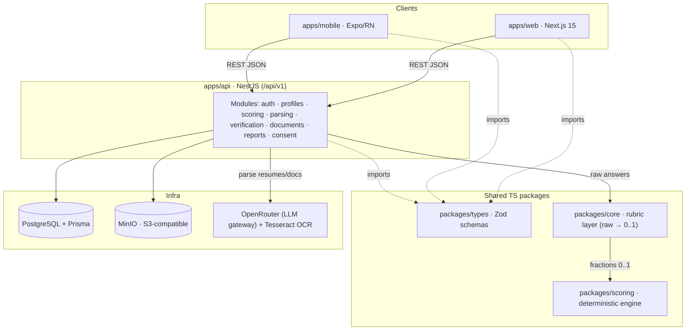
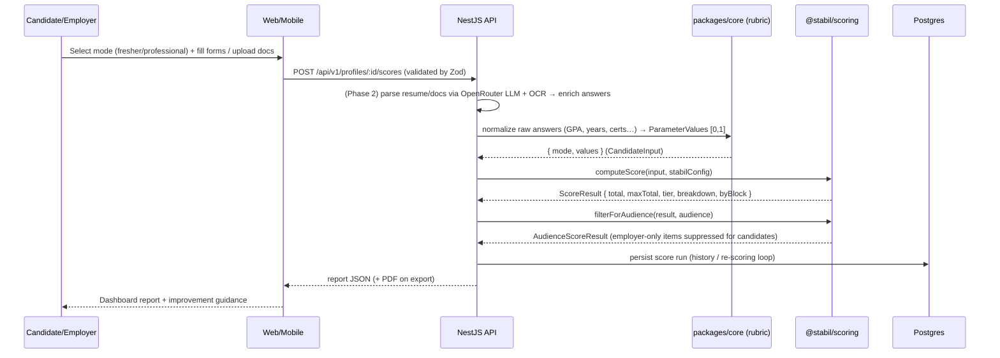
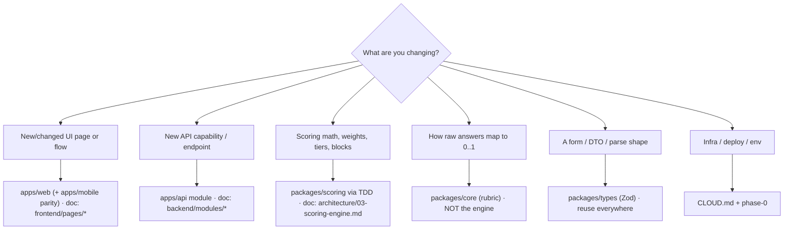

# Stabil — Architecture & Contributor / AI Guide

> **Status:** Draft v0.1 · **Phase:** cross-cutting · **Owner area:** all (frontend / backend / infra / data)
> **Related:** [SCOPE.md](SCOPE.md) · [README.md](README.md) · [architecture/01-overview.md](architecture/01-overview.md) · [architecture/03-scoring-engine.md](architecture/03-scoring-engine.md) · [phases/README.md](phases/README.md) · [CLOUD.md](CLOUD.md)

The one-page onboarding map for anyone — human or AI agent — joining Stabil. It tells you **what the product is**, **where every kind of code lives**, **how a score is produced end-to-end**, **how to run and test the repo**, the **conventions you must not break**, and **which doc to read or update** for any change. When this file disagrees with [SCOPE.md](SCOPE.md), SCOPE.md wins — open a PR to fix the drift.

---

## 1. What is Stabil?

Stabil scores how **stable** a person is — how settled, reliable, and likely-to-stay they are — as a single **role-agnostic** number on a **0–1500** scale plus a human-readable **tier** (e.g. *Settled*, *Stable*). A person's resume + structured forms + optional supporting documents are scored across **fixed, expert-defined weighted parameters** (deterministic — no ML in the POC), optionally boosted by a **verification bonus** for validated documents, then mapped to a tier and rendered as an explainable **report**. Three audiences consume that report: **employers**, **recruiters**, and **candidates themselves** — so explainability and a "how to improve your score" view are first-class. Stabil is a standalone product and is **not affiliated with TeacherOp**.

---

## 2. Repo map

A TypeScript-first monorepo on **Turborepo + pnpm workspaces** (`pnpm-workspace.yaml` globs `apps/*` and `packages/*`). The deliberate design goal: the deterministic scoring logic lives in **one isolated, unit-tested package** reused by every client and the API.

| Path | Status | One-liner |
|------|--------|-----------|
| `apps/web/` | **planned** | **Next.js 15** (App Router, React 19, TS) + Tailwind + shadcn/ui. Candidate/employer/recruiter dashboards, multi-step forms, PDF export. See [frontend/README.md](frontend/README.md). |
| `apps/mobile/` | **planned** | **Expo / React Native** + NativeWind. Parity client sharing types & logic with web. See [frontend/mobile.md](frontend/mobile.md). |
| `apps/api/` | **planned** | **NestJS** (TS). Modular boundaries (auth · profiles · scoring · parsing · verification · documents · reports · consent) serving both clients. See [backend/README.md](backend/README.md). |
| `packages/scoring/` | **built** ✅ | `@stabil/scoring` — pure, deterministic, fixed-weight engine. Consumes normalized fractions `[0,1]`, emits per-parameter breakdown + block subtotals + total + tier. Heavily unit-tested (Vitest). |
| `packages/core/` | **planned** | The **rubric layer**: maps raw answers (GPA, years of experience, cert lists) → normalized fractions `[0,1]` the engine consumes. Deliberately **separate** from the engine. |
| `packages/types/` | **planned** | Shared **Zod** schemas + inferred TS types for forms, API DTOs, and parse shapes — one source of truth across web, mobile, and API. |
| `docs/` | **active** | Scope, architecture, phases, frontend/backend specs. Start at [README.md](README.md). |

> **Today's reality:** only `packages/scoring` has source. `apps/*` and the other `packages/*` are empty/planned — they are stood up in [phases/phase-0-foundations.md](phases/phase-0-foundations.md) onward. A root [AGENTS.md](../AGENTS.md) points humans/agents here.

---

## 3. Architecture at a glance

Clients never embed scoring or PII logic — they call the **NestJS API**, which owns Postgres, MinIO, and the local LLM, and delegates the actual math to `@stabil/scoring`.



### How a score is produced — end to end



The math itself is tiny and pure (`packages/scoring/src/score.ts`): each parameter's award is `Math.round(clamp01(value) * max)`; awards sum into block subtotals and a total; the total maps to a tier. Suppressed (employer-only) factors **still count toward the total** — only the breakdown is filtered per audience, never the score. Deep dive: [architecture/03-scoring-engine.md](architecture/03-scoring-engine.md).

---

## 4. Core domain vocabulary

The engine's TS types (`packages/scoring/src/domain.ts`, `tier.ts`) are the canonical encoding of these terms.

- **Mode** (`Mode = "fresher" | "professional"`) — the person-type, **user-selected** at the start of the flow. Each mode has its own mode-specific parameters; the score scale is shared so results compare across modes.
- **Block** (`Block = "mode" | "common" | "verification"`) — the three additive sub-scores. `TOTAL = mode-specific block + common block + verification bonus`. The `common` block is the POC's "Generic" score.
- **Parameter** (`ParameterDefinition`) — a data-driven scoring factor: `{ key, label, appliesTo: Mode | "both", block, max, visibility }`. Weights (`max`) are **placeholders pending calibration** (SCOPE §13). The current config (`packages/scoring/src/config.ts`) sums shared blocks to 400 and each mode-specific block to 1100 → 1500.
- **Parameter values** (`ParameterValues = Record<string, number>`) — normalized performance, each in `[0,1]`; missing keys score 0. Produced by the **rubric layer** (`packages/core`), *not* the engine.
- **Visibility** (`Visibility = "all" | "employer-only"`) — whether a line-item shows in the candidate report. `age` and `maritalStatus` are `employer-only` (SCOPE §6.3 / §9).
- **Tier** (`Tier = "unstable" | "developing" | "somewhat-stable" | "settled" | "stable"`) — the named bucket the total maps to. Bands (`mapTier`) are placeholders calibrated later (SCOPE §7).
- **Audience** (`Audience = "candidate" | "employer" | "recruiter"`) — who's viewing; drives report filtering and consent. All three view reports.
- **Submission paths** — **both** are supported (SCOPE §6.1):
  - *Candidate-driven*: candidate self-onboards, gets scored, and **explicitly consents per-share** before any employer/recruiter sees the report.
  - *Employer-driven*: an employer/recruiter submits a candidate's info, which **creates a claimable profile** the candidate can later claim, verify, and improve.
- **Consent** — **explicit, per-share** approval is required before any employer/recruiter view; sensitive-data use is disclosed up front (SCOPE §6.2). See [backend/modules/consent-sharing.md](backend/modules/consent-sharing.md).
- **Verification bonus / Verified User** — points and a trust flag earned when documents (Aadhaar/PAN or international IDs) are validated. Phased: OCR + manual review now → KYC/government APIs later (SCOPE §5).

---

## 5. How to run things

Prereqs: **Node ≥ 20**, **pnpm 9.15.4** (pinned via `packageManager`). Turborepo orchestrates per-package tasks and respects build dependencies (`^build`).

```bash
pnpm install          # install all workspace deps
pnpm build            # turbo run build   (topological, honors ^build)
pnpm test             # turbo run test    (Vitest unit; supertest/Playwright later)
pnpm typecheck        # turbo run typecheck (tsc --noEmit, strict)
pnpm lint             # turbo run lint
```

Target a single package with Turbo's filter (or run the package script directly):

```bash
pnpm --filter @stabil/scoring test            # only the scoring engine
pnpm --filter @stabil/scoring test:watch      # Vitest watch mode (TDD)
pnpm --filter @stabil/scoring typecheck
pnpm --filter @stabil/web dev                 # (once apps/web exists)
turbo run build --filter=@stabil/api          # build one app + its deps
```

The scoring package's own scripts (`packages/scoring/package.json`): `build` (`tsc`), `test` (`vitest run`), `test:watch`, `typecheck`. Infra (Postgres, MinIO) is brought up via the dev setup in [CLOUD.md](CLOUD.md) and [phases/phase-0-foundations.md](phases/phase-0-foundations.md). OpenRouter is an external service accessed via API key — no local container needed.

---

## 6. Coding conventions

These are enforced by `tsconfig.base.json` and the authoring/conventions cheat-sheet in [README.md](README.md). Do not weaken them.

- **TypeScript strict.** `strict`, `noUncheckedIndexedAccess`, `noImplicitOverride`, `isolatedModules`, `forceConsistentCasingInFileNames` are all on. Target ES2022, ESM (`"type": "module"`), `moduleResolution: Bundler`.
- **Zod is the single source of truth** for form / API / parse shapes — define the schema, infer the TS type (`z.infer`), reuse across web, mobile, and API (`packages/types`).
- **IDs:** UUID **v7** primary keys (time-ordered).
- **Points are integers.** All awards are whole numbers via `Math.round` (never fractional points in output).
- **Engine boundary is sacred.** `@stabil/scoring` consumes **normalized fractions `[0,1]` per parameter** and nothing else. Mapping raw answers → fractions is the **rubric layer** (`packages/core`), NOT the engine. Keep that line crisp in every PR.
- **API:** base `/api/v1`, JSON; errors use **RFC 9457** (`application/problem+json`). See [architecture/04-api-contracts.md](architecture/04-api-contracts.md).
- **TDD for the engine.** Any change to `packages/scoring` starts with a **failing test** (`*.test.ts` alongside source — see `score.test.ts`, `tier.test.ts`, `config.test.ts`, `audience.test.ts`). The "maxes sum to 1500 per mode" invariant must keep passing.
- **Commits:** branch off the default branch; commit/push only when asked. **Never** add a `Co-Authored-By: Claude` trailer or any Claude attribution to commits, PRs, or docs.

---

## 7. Where does new code go? (decision guide)



| If you're adding… | Code goes in | Update / read this doc |
|---|---|---|
| A new page or wizard step | `apps/web` (+ `apps/mobile` for parity) | the matching [frontend/pages/](frontend/pages/README.md) doc; [frontend/state-and-forms.md](frontend/state-and-forms.md) |
| A new API endpoint / capability | the relevant `apps/api` NestJS module | the matching [backend/modules/](backend/modules/README.md) doc; [architecture/04-api-contracts.md](architecture/04-api-contracts.md) |
| A scoring change (weight, tier band, block, formula) | `packages/scoring` **via TDD** | [architecture/03-scoring-engine.md](architecture/03-scoring-engine.md) |
| A raw-answer → fraction mapping (GPA bands, tenure curve, cert→points) | `packages/core` (rubric layer) | [architecture/03-scoring-engine.md](architecture/03-scoring-engine.md) §rubrics |
| A new/changed form, DTO, or parse shape | `packages/types` (Zod schema) | [architecture/04-api-contracts.md](architecture/04-api-contracts.md) |
| A new entity / column | Prisma schema in `apps/api` | [architecture/02-data-model.md](architecture/02-data-model.md); [backend/database-and-prisma.md](backend/database-and-prisma.md) |
| A chart / metric visual | `apps/web` (Chart.js / react-chartjs-2) | [frontend/charts.md](frontend/charts.md) |
| Infra, deploy, env vars | n/a (config) | [CLOUD.md](CLOUD.md) |

**Golden rule:** if your change touches scoring *behavior*, it's `packages/scoring` + a test. If it touches *how an input becomes a fraction*, it's `packages/core`. They never merge.

---

## 8. Doc navigation & which doc to update

Read order for a newcomer: [SCOPE.md](SCOPE.md) → **this file** → [architecture/01-overview.md](architecture/01-overview.md) → the relevant [phases/](phases/README.md) doc → the frontend/backend specs.

| Area | Doc | Update when you… |
|------|-----|------------------|
| Product truth | [SCOPE.md](SCOPE.md) | change a product decision (open a PR; everything else follows) |
| Doc index + canonical facts + authoring contract | [README.md](README.md) | add a doc, change the stack, or change a convention |
| System architecture / data flow | [architecture/01-overview.md](architecture/01-overview.md) | change how components talk |
| Data model / ERD / migrations | [architecture/02-data-model.md](architecture/02-data-model.md) | add entities/columns |
| **Scoring engine** (blocks, params, rubrics, formulas, calibration) | [architecture/03-scoring-engine.md](architecture/03-scoring-engine.md) | touch `packages/scoring` or weights/tiers |
| API contracts (endpoints, DTOs, error model) | [architecture/04-api-contracts.md](architecture/04-api-contracts.md) | add/change an endpoint |
| Security & privacy (PII, consent, DPDP, retention) | [architecture/05-security-privacy.md](architecture/05-security-privacy.md) | touch sensitive data, consent, or retention |
| Roadmap & dependencies | [phases/README.md](phases/README.md) → `phases/phase-0…4` | re-sequence work or close a milestone |
| Frontend (structure, design system, charts, forms, mobile) | [frontend/README.md](frontend/README.md) + siblings | build/change UI |
| Frontend pages (one doc per page/flow) | [frontend/pages/README.md](frontend/pages/README.md) | add/change a page |
| Backend (NestJS map, Prisma, conventions, testing) | [backend/README.md](backend/README.md) + siblings | build/change an API module |
| Backend modules (one doc per module) | [backend/modules/README.md](backend/modules/README.md) | add/change a module |
| Cloud / infra / deploy / observability | [CLOUD.md](CLOUD.md) | change env, deploy, or infra |

**Drift rule:** the canonical-facts table in [README.md](README.md) and [SCOPE.md](SCOPE.md) are authoritative. If your change makes any doc contradict them, fix the doc in the same PR — never let docs drift from scope.
