# System Architecture — Overview

> **Status:** Draft v0.1 · **Phase:** cross-cutting · **Owner area:** backend/architecture
> **Related:** [02-data-model.md](02-data-model.md), [03-scoring-engine.md](03-scoring-engine.md), [04-api-contracts.md](04-api-contracts.md), [05-security-privacy.md](05-security-privacy.md), [../SCOPE.md](../SCOPE.md), [../README.md](../README.md)

This is the canonical, system-wide picture of **Stabil** — what the pieces are, how they fit, and how data moves through them. It is the document every other architecture doc links back to. Read it after [`../SCOPE.md`](../SCOPE.md) and the canonical-facts table in [`../README.md`](../README.md). Where this doc and `SCOPE.md` ever disagree, **`SCOPE.md` wins** (open a PR to fix the drift).

Stabil scores how *stable* a person is, on a shared **`0–1500`** scale (SCOPE §1, §4) mapped to a 5-tier ladder, and renders an explainable, **audience-filtered** report. The whole system is a **TypeScript monorepo** so the deterministic scoring logic lives in one isolated, unit-tested package reused by web, mobile, and the API.

---

## 1. The big idea, in one breath

A person picks a **mode** (Fresher / Working Professional, SCOPE §3), fills in forms (and later uploads a resume + documents). Raw answers are mapped to **normalized `[0,1]` fractions per parameter** by the **rubric layer**, the pure **scoring engine** turns those fractions into points and a tier, the result is persisted as an immutable **ScoreRun**, and a **report** is rendered — *filtered by audience* so candidates never see sensitive line-items (age, marital status; SCOPE §6.3). Everything is deterministic, explainable, consent-gated, and runs on free/self-hosted infrastructure (Ollama, MinIO).

The single most important architectural rule (from [`../README.md`](../README.md) "Engine boundary"):

> **`@stabil/scoring` consumes normalized fractions `[0,1]` per parameter.** Mapping raw answers (GPA, years of experience, etc.) → fractions is the **rubric layer** (`packages/core`), **not** the engine. Keep that boundary crisp everywhere.

This boundary is load-bearing for the rest of this document — see [§3](#3-monorepo-layout--package-boundaries) and [03-scoring-engine.md](03-scoring-engine.md).

---

## 2. C4-style views

### 2.1 System context (Level 1)

Who and what touches Stabil. Four human roles (SCOPE §6, README "Audiences") and three external dependencies (Ollama, MinIO, SMTP).

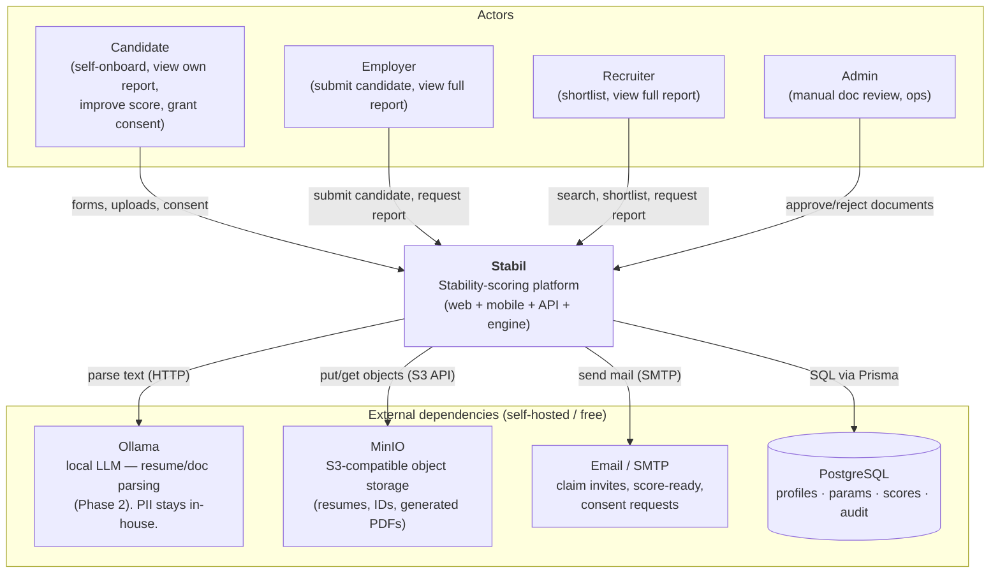

| Actor / role | Goal | Sees sensitive line-items? | Phase introduced |
|---|---|---|---|
| **Candidate** | Self-assess, improve score, control sharing | **No** — age/marital suppressed (SCOPE §6.3) | 1 |
| **Employer** | Screening / decision aid | **Yes** (after consent) | 1 |
| **Recruiter** | Ranking / shortlisting | **Yes** (after consent) | 1 → compare dashboard Phase 4 |
| **Admin** | Manual document review, ops | n/a (internal) | 3 (review) |

| External dep | Protocol | Used for | Phase | Swappable to |
|---|---|---|---|---|
| **Ollama** | HTTP (local) | Resume/document text extraction & field parsing | 2 | Managed LLM via one adapter (SCOPE §10) |
| **Tesseract** | in-process / lib | OCR for scanned IDs | 2/3 | — |
| **MinIO** | S3 API | Uploads + generated PDFs | 1 (PDFs) / 2 (uploads) | Cloudflare R2 / AWS S3 (config only) |
| **SMTP / email** | SMTP | Notifications (claim, score-ready, consent ask) | 1 | Any SMTP provider |
| **PostgreSQL** | SQL (Prisma) | System of record | 0 | — |

### 2.2 Container view (Level 2)

The deployable/buildable units and how they talk.

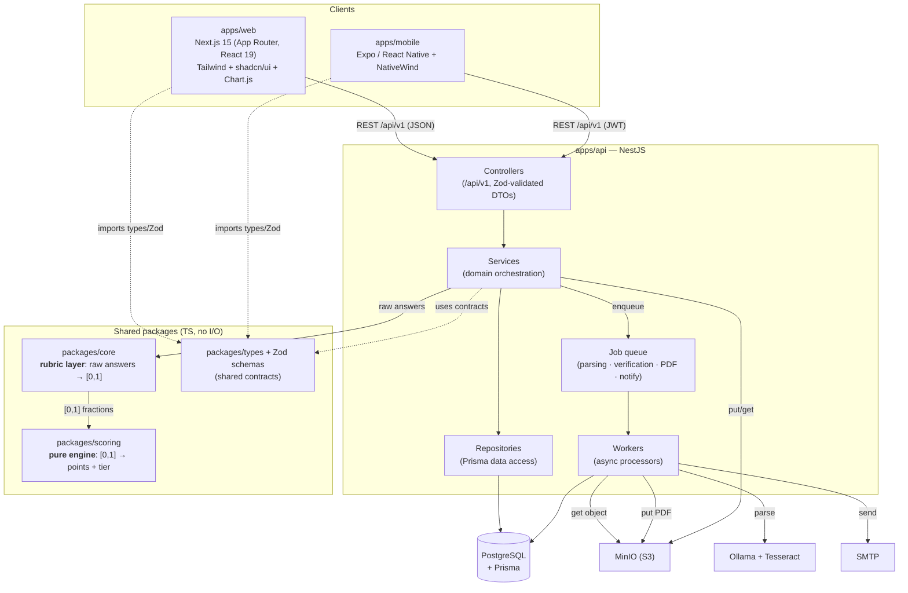

Key takeaways from the container view:

- **Clients are thin.** They never re-implement scoring; they import shared **types + Zod schemas** for compile-time and runtime contract safety, and call `/api/v1`.
- **The API is the only thing that talks to the database, storage, LLM, and mail.** Clients never reach those directly.
- **The engine and rubric are pure libraries** (no I/O, no DB). They are imported *into* the API's services. This is what makes scoring deterministic and trivially unit-testable (Vitest, SCOPE §10).
- **Heavy/slow work is async** via a job queue (parsing, verification, PDF, notifications) — see [§6](#6-asyncbackground-work).

---

## 3. Monorepo layout & package boundaries

Turborepo + pnpm workspaces (SCOPE §10, README tech-stack). One language (TypeScript) across every client, the API, and the shared packages.

```
stabil/
├── apps/
│   ├── web/                 # Next.js 15 (App Router, React 19) — SSR dashboard + PDF trigger
│   ├── mobile/              # Expo / React Native + NativeWind — feature parity with web
│   └── api/                 # NestJS — controllers · services · repositories · workers
│
├── packages/
│   ├── scoring/             # @stabil/scoring — PURE ENGINE (already built)
│   │   └── src/
│   │       ├── domain.ts    #   types: Mode, Block, Visibility, Audience, ParameterDefinition…
│   │       ├── config.ts    #   stabilConfig (parameter set + maxes; weights = placeholders)
│   │       ├── score.ts     #   computeScore(input, config) → ScoreResult
│   │       ├── tier.ts      #   mapTier(total) → Tier (5-tier ladder)
│   │       ├── audience.ts  #   filterForAudience(result, audience) → AudienceScoreResult
│   │       └── index.ts     #   public surface (re-exports)
│   │
│   ├── core/                # @stabil/core — RUBRIC LAYER: raw answers → [0,1] fractions
│   └── types/               # @stabil/types — shared TS types + Zod schemas (form/API/parse)
│
├── pnpm-workspace.yaml
├── turbo.json
└── tsconfig.base.json
```

> **Status note:** `packages/scoring` exists today (see file list above). `packages/core`, `packages/types`, and the three `apps/*` are planned per SCOPE §10 / README file-tree and are introduced across Phases 0–1 ([§8](#8-how-phases-04-layer-onto-this-architecture)).

### 3.1 The engine ↔ rubric boundary (the crisp line)

This is the architectural seam that everything else respects.

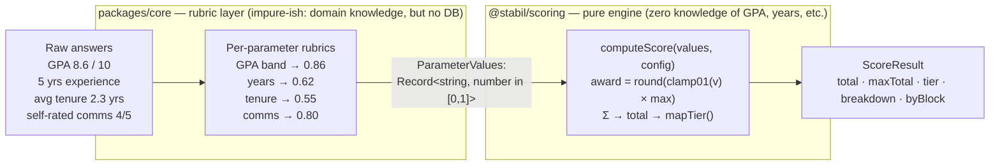

| Concern | Lives in | Why |
|---|---|---|
| "What does GPA 8.6/10 mean?" "Is 2.3yr tenure good?" | **`packages/core` (rubric)** | Domain-specific, calibration-sensitive (SCOPE §13). Changes when rubrics are tuned. |
| "Award points, sum blocks, map a tier, filter for an audience" | **`packages/scoring` (engine)** | Pure math over `[0,1]`. Deterministic. Never changes when a rubric is recalibrated. |
| "Read forms, persist, send mail, store files" | **`apps/api`** | I/O and orchestration. |

The engine's contract is already enforced in code. From `packages/scoring/src/domain.ts`:

```ts
/** Normalized per-parameter performance, each in [0, 1]. Missing keys score 0. */
export type ParameterValues = Readonly<Record<string, number>>;

export interface CandidateInput {
  readonly mode: Mode;            // "fresher" | "professional"
  readonly values: ParameterValues;
}
```

And from `packages/scoring/src/score.ts`, the engine *clamps and rounds* — it trusts nothing outside `[0,1]`, and points are whole numbers (README conventions: "points are integers, `Math.round`"):

```ts
awarded: Math.round(clamp01(input.values[def.key] ?? 0) * def.max),
```

> **Rule of thumb:** if a change is about *grades, years, certifications, or thresholds*, it belongs in `packages/core` (or the data-driven config). If it's about *summing, mapping tiers, or audience filtering*, it belongs in `packages/scoring`. The API never does either kind of math inline. Deep dive: [03-scoring-engine.md](03-scoring-engine.md).

### 3.2 Shared types & Zod

`packages/types` is the single source of truth for shapes that cross process boundaries: form payloads, API DTOs, and Phase-2 parse outputs (SCOPE §10 "Validation: Zod (shared schemas)"). Web, mobile, and the API import the *same* Zod schemas, so a form validated in the browser is validated identically on the server. Engine domain types (`Mode`, `Tier`, `Audience`, `ScoreResult`) are re-exported from `@stabil/scoring/index.ts` and consumed everywhere a score is displayed.

---

## 4. End-to-end data flow (primary use cases)

### 4.1 Primary flow — candidate completes form → score → audience-filtered report

This is the canonical path the whole product is built around (SCOPE §4, §6.3, §8).

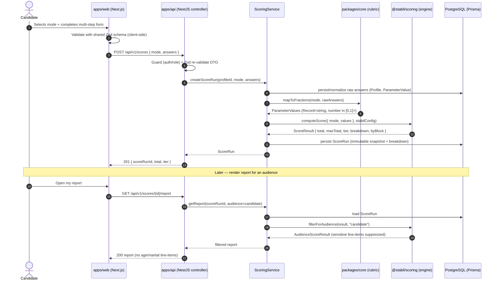

The audience filter is *display-only*: hidden parameters still count toward the total. This is guaranteed by the engine (`packages/scoring/src/audience.ts`):

```ts
// Candidates never see employer-only line-items, but the suppressed factors
// still count toward the total — only the breakdown is filtered, not the score.
const visible = result.breakdown.filter((p) => p.visibility === "all");
```

So an employer requesting `GET …/report?audience=employer` gets the *same total* with the `age` / `maritalStatus` line-items included; a candidate gets the same total with those rows removed and a `hiddenParameterCount`. See [05-security-privacy.md](05-security-privacy.md) and SCOPE §6.3, §9 (legal note).

### 4.2 Employer submits a candidate → claimable profile

(SCOPE §6.1, fact "Submission: employer submits → claimable profile".)

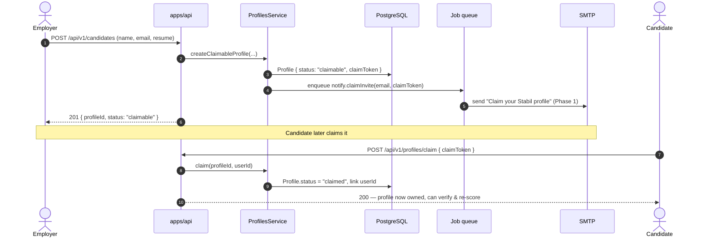

A claimable profile can be **scored on the data the employer provided** before it is ever claimed; once claimed, the candidate can add data, verify documents, and re-run the score (the improvement loop, §4.4).

### 4.3 Candidate shares a report (per-share consent)

Consent is **explicit and per-share** (SCOPE §6.2, README fact). No employer/recruiter can view a report until the candidate approves *that specific share*.

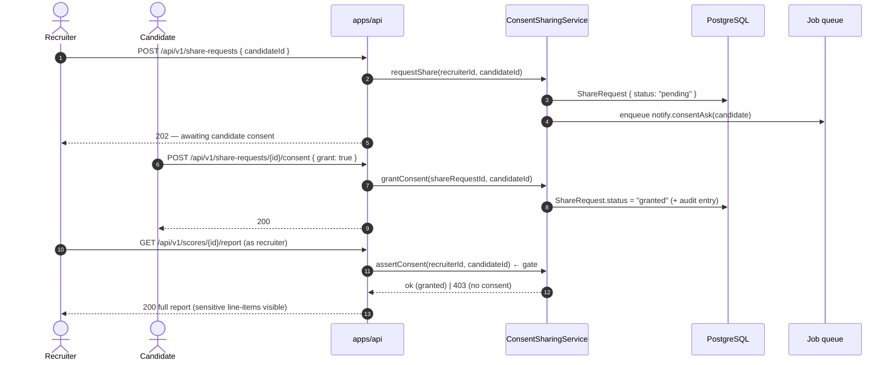

If consent is absent or revoked, the report endpoint returns `403` (problem+json). Every grant/revoke is **audit-logged** ([§7](#7-cross-cutting-concerns)).

### 4.4 Re-scoring loop (improvement over time)

Accounts persist; candidates add data/documents and re-run the score (SCOPE §11, fact "re-scoring over time"). Each run is a **new immutable `ScoreRun`** — history is never overwritten, which makes "your score went up by X" and audit trails possible.

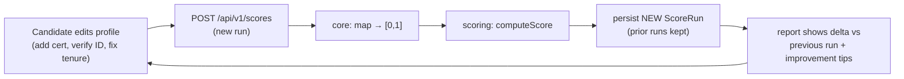

### 4.5 Document verification (OCR + manual review now; KYC later)

(SCOPE §5, phased per §9. Phase 3.)

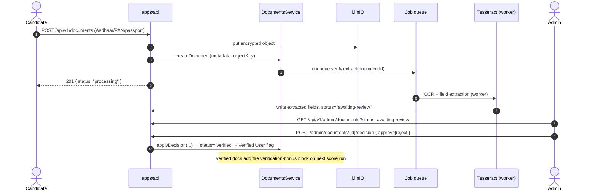

When a document is approved, its parameter (e.g. `verifiedDocuments` in `config.ts`, block `verification`) gains a non-zero fraction on the next score run → bonus points (SCOPE §4.1, §5). Future automated KYC (DigiLocker / passport APIs) slots in as an alternative to manual review without changing the flow. Module: [`../backend/modules/verification.md`](../backend/modules/verification.md).

### 4.6 Resume parsing (Ollama + OCR)

(SCOPE §4.2, §9 Phase 2.)

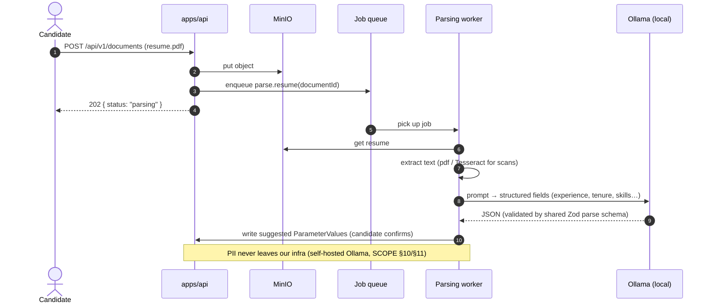

Parsing *suggests* values; the candidate reviews/confirms before they feed the rubric → engine. Module: [`../backend/modules/parsing.md`](../backend/modules/parsing.md).

---

## 5. NestJS request lifecycle

Every synchronous request follows the same layered path: **controller → service → repository (Prisma)**. Cross-cutting machinery (guards, pipes, interceptors, filters) wraps the controller.

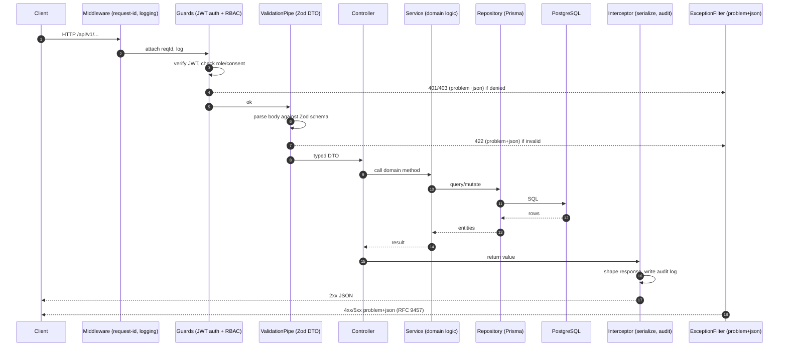

| Layer | Responsibility | Must NOT |
|---|---|---|
| **Controller** | HTTP shape, route, status codes | contain business logic or touch Prisma |
| **Service** | Domain orchestration; calls `core` then `scoring`; enqueues jobs | format HTTP or build SQL by hand |
| **Repository** | All Prisma access; the only place that knows the DB | make scoring/business decisions |
| **Guards/Pipes/Filters/Interceptors** | Auth, RBAC, consent, Zod validation, error model, audit | leak entities or PII to the wrong audience |

NestJS modules mirror the phased build (SCOPE §10): `auth-accounts`, `profiles`, `scoring`, `parsing`, `verification`, `documents-storage`, `reports-pdf`, `consent-sharing`, `employer-search`, `notifications`. See [`../backend/README.md`](../backend/README.md) and [04-api-contracts.md](04-api-contracts.md).

---

## 6. Async / background work

Slow or external-dependent work never blocks an HTTP request. The API **enqueues a job and returns `202`**; a worker processes it and writes results back. The job queue runs on the API container (in-process worker for the POC; a separate worker process when scaled).

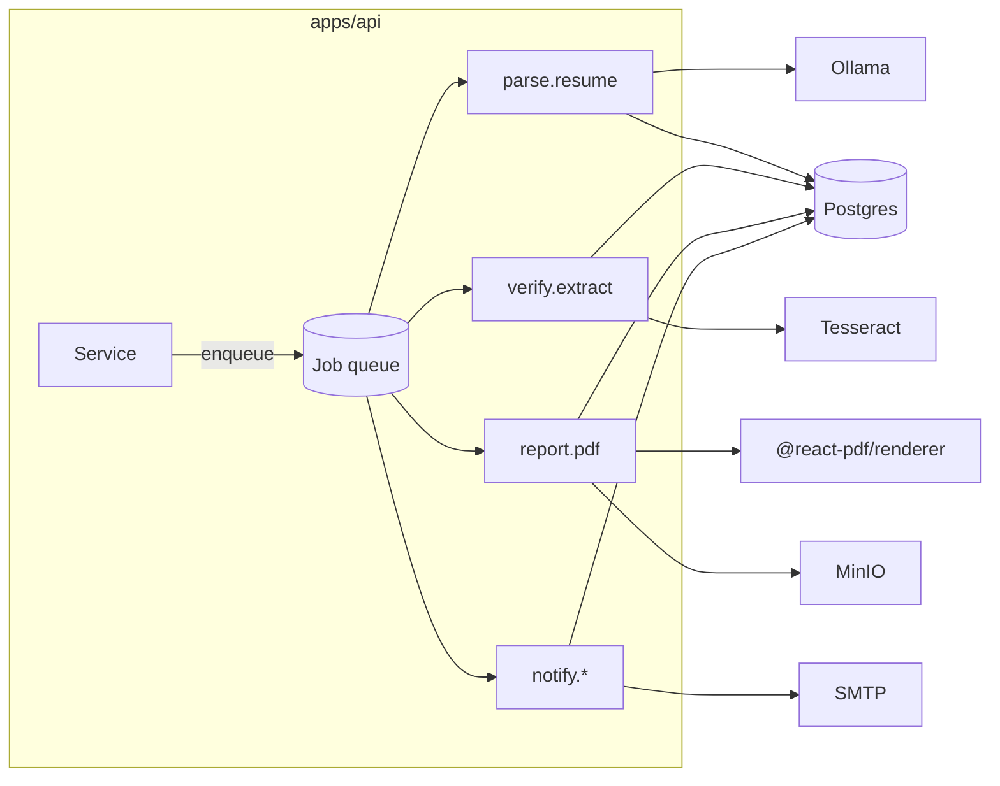

| Job | Triggered by | Does | External dep | Phase |
|---|---|---|---|---|
| `parse.resume` | resume upload | extract → structured fields | Ollama (+ Tesseract) | 2 |
| `verify.extract` | ID upload | OCR + field extraction → awaiting-review | Tesseract | 3 |
| `report.pdf` | "Export PDF" | render report → store object | `@react-pdf/renderer`, MinIO | 1 |
| `notify.claimInvite` / `notify.scoreReady` / `notify.consentAsk` | various | send email/push | SMTP | 1 |

Jobs are **idempotent and retryable**; failures surface as a status on the owning entity (e.g. `Document.status = "failed"`) rather than a lost request. Scoring itself is **synchronous** — `computeScore` is pure, fast, and deterministic, so it runs inline in the request (no job needed). Module: [`../backend/modules/notifications.md`](../backend/modules/notifications.md).

---

## 7. Cross-cutting concerns

| Concern | Where it lives | How it works | Reference |
|---|---|---|---|
| **AuthN** | NestJS guard | JWT sessions for mobile; session for web. Role on every principal. | SCOPE §10, [04-api-contracts.md](04-api-contracts.md) |
| **AuthZ (RBAC)** | NestJS guard | `Role = candidate \| employer \| recruiter \| admin` gates routes. | README enums |
| **Validation** | Zod pipe + shared schemas | Same `@stabil/types` schema validates on client *and* server; failures → `422 problem+json`. | SCOPE §10 |
| **Consent enforcement** | guard / `ConsentSharingService` | Report reads for employer/recruiter assert an active `granted` ShareRequest, else `403`. | SCOPE §6.2, §4.3 above |
| **Audience visibility filtering** | `@stabil/scoring` `filterForAudience` | Candidate view drops `employer-only` line-items *without* changing the total. | SCOPE §6.3, `audience.ts` |
| **Audit logging** | interceptor + repository | Consent grants/revokes, doc decisions, score runs, deletions are appended immutably. | SCOPE §11, [02-data-model.md](02-data-model.md) |
| **Error model** | exception filter | RFC 9457 `application/problem+json` for all errors. | README API conventions |
| **PII / retention** | services + storage policy | IDs encrypted at rest in MinIO; retain while account active; delete on request. | SCOPE §11, [05-security-privacy.md](05-security-privacy.md) |
| **IDs / numbers** | DB + engine | UUID v7 PKs; points are integers (`Math.round`). | README conventions |

The two concerns most specific to Stabil's risk profile — **consent enforcement** and **audience visibility filtering** — are deliberately implemented in *different* layers: consent is an **access** decision (guard, can you see *any* report?), while visibility filtering is a **rendering** decision (engine, *which line-items* of a permitted report). Keeping them separate means a bug in one cannot silently leak the other. Full treatment: [05-security-privacy.md](05-security-privacy.md).

---

## 8. How phases 0–4 layer onto this architecture

The architecture is fixed up front; phases light up slices of it (SCOPE §9, README phase table). Each later phase depends on the earlier ones.

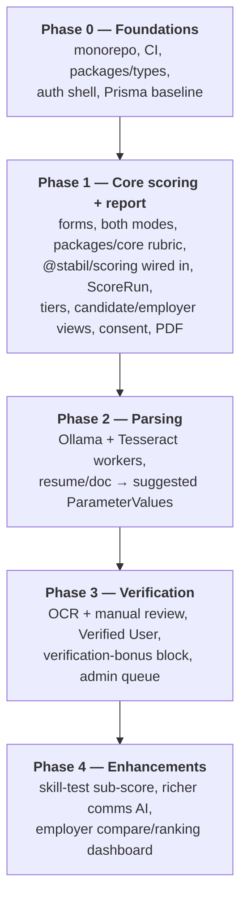

| Phase | New architectural pieces | Already-present hooks it uses |
|---|---|---|
| **0** | `packages/types`, auth guards, Prisma schema baseline, CI | — |
| **1** | `packages/core` (rubric), wires `@stabil/scoring`, `ScoreRun` persistence, report rendering, consent gate, `report.pdf` job | engine's `computeScore` / `filterForAudience` / `mapTier` (already built) |
| **2** | parsing workers + Ollama adapter; `parse.resume` job | job queue, MinIO, shared parse Zod schemas |
| **3** | verification workers, admin review, `verify.extract` job | `verification` block + `verifiedDocuments` param already in `config.ts`; re-scoring loop |
| **4** | skill-test sub-score, comms AI, compare dashboard | engine "designed to accept a test sub-score" (SCOPE §4.4, fact "Skill tests"); audience filtering already supports multi-candidate |

Crucially, **the engine never changes per phase** — the `verification` block and `age`/`maritalStatus` parameters already exist in `packages/scoring/src/config.ts` with placeholder maxes; Phases 3–4 only supply *real fractions* through the rubric layer and tune calibration (SCOPE §13). That is the payoff of the engine ↔ rubric boundary in [§3.1](#31-the-engine--rubric-boundary-the-crisp-line).

---

## 9. Where to go next

- **Entities, Prisma schema, ERD, `ScoreRun` persistence** → [02-data-model.md](02-data-model.md)
- **Blocks, parameters, rubrics, formulas, calibration** → [03-scoring-engine.md](03-scoring-engine.md)
- **REST endpoints, DTOs, auth, problem+json error model, versioning** → [04-api-contracts.md](04-api-contracts.md)
- **PII, consent, DPDP, sensitive-attribute handling, retention** → [05-security-privacy.md](05-security-privacy.md)
- **Authoritative scope & canonical facts** → [../SCOPE.md](../SCOPE.md), [../README.md](../README.md)
