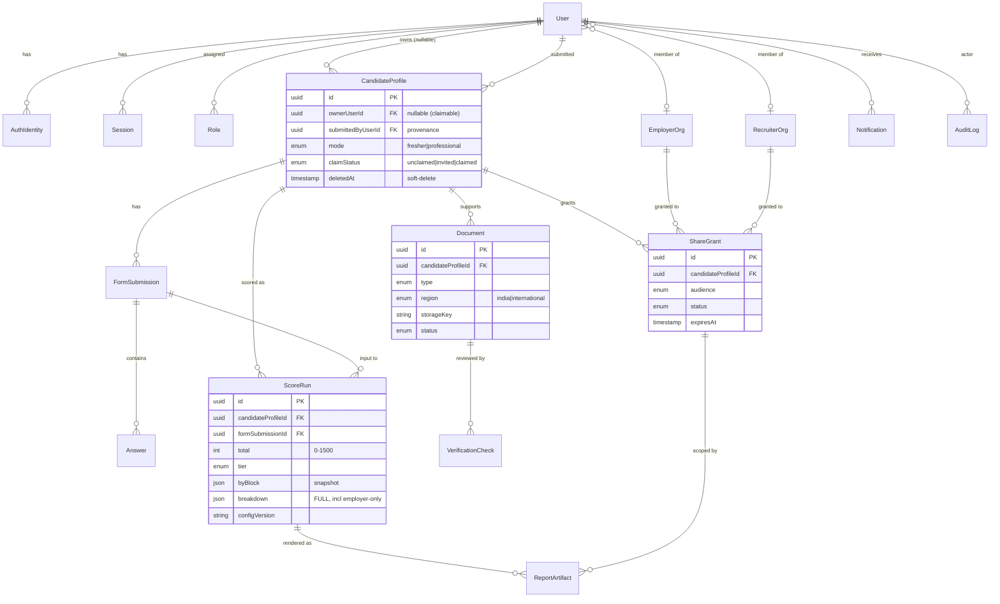
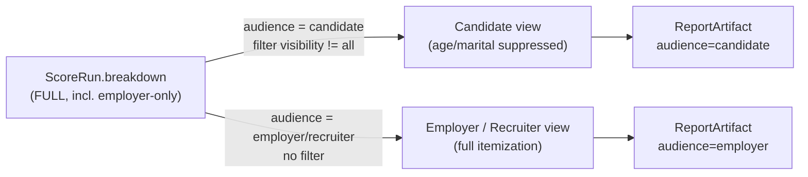
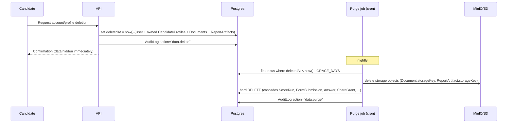

# Data Model

> **Status:** Draft v0.1 · **Phase:** cross-cutting · **Owner area:** data
> **Related:** [backend/database-and-prisma.md](../backend/database-and-prisma.md), [architecture/03-scoring-engine.md](./03-scoring-engine.md), [architecture/05-security-privacy.md](./05-security-privacy.md), [architecture/01-overview.md](./01-overview.md)

This document is the authoritative description of Stabil's persistence layer: the entity catalog, the relational ERD, the concrete Prisma schema, and the cross-cutting persistence concerns (scoring snapshots, audience-filtered visibility, retention/soft-delete, and indexing). It mirrors the canonical facts in [../README.md](../README.md) and the enums in [`packages/scoring/src/domain.ts`](../../packages/scoring/src/domain.ts) / [`packages/scoring/src/tier.ts`](../../packages/scoring/src/tier.ts) exactly. The scoring engine is **pure** and stores nothing itself — the API persists its inputs and outputs via the models below.

---

## 1. Design principles

These principles drive every modelling decision and are referenced throughout:

1. **One score per person, many score runs.** A `CandidateProfile` is the durable identity; each re-score (the improvement loop, SCOPE §11) produces a new immutable `ScoreRun`. We never mutate a past run — history is a first-class feature for explainability.
2. **Audience-independent snapshots, audience-filtered reads.** A `ScoreRun` stores the **full** breakdown including `employer-only` line-items (age, marital status). Filtering to a "candidate-safe" view happens **on read** by audience — we never persist a redacted-only variant (see §6). This is a SCOPE §6.3 + §12 legal/privacy requirement.
3. **Claimable profiles.** Profiles can exist before their owner has an account (employer-driven submission, SCOPE §6.1). `ownerUserId` is nullable; a `claimStatus` and `submittedByUserId` track provenance and the claim handshake.
4. **Reproducibility via `configVersion` + JSONB.** A run records the scoring `configVersion` and the literal `breakdown`/`byBlock` JSON so any old report can be re-rendered byte-for-byte even after weights change (SCOPE §13 calibration).
5. **Keep-while-active, delete-on-request.** Every PII-bearing entity has `deletedAt` for soft-delete; a purge job hard-deletes after a grace window (SCOPE §11, §6f below).
6. **UUID v7 PKs, integer points.** All primary keys are UUID v7 (time-sortable). All point values are integers (`Math.round`), per the README conventions cheat-sheet.

---

## 2. Entity catalog

| Entity | One-line responsibility |
|--------|-------------------------|
| **User** | An authenticated account (candidate / employer / recruiter / admin); the login identity. |
| **AuthIdentity** | A credential or external provider link (email+password hash, OAuth) belonging to a `User`. |
| **Session** | A live JWT/refresh-token session for a `User` (mobile + web), revocable. |
| **Role** | A named role assignment for a `User` (`candidate` \| `employer` \| `recruiter` \| `admin`), driving guards and view differentiation. |
| **EmployerOrg** | A hiring company; groups employer `User`s and the candidates shared with them. |
| **RecruiterOrg** | A staffing/recruiting agency; groups recruiter `User`s and their candidate pipeline. |
| **CandidateProfile** | The durable, role-agnostic person record being scored. **Claimable**: `ownerUserId` nullable, `submittedByUserId` provenance, `claimStatus`, and self-selected `mode`. |
| **FormSubmission** | One completed intake of the mode-specific + common questionnaire for a profile (versioned input). |
| **Answer** | A single normalized parameter answer within a `FormSubmission` (parameter key → raw value + normalized fraction). |
| **ScoreRun** | An **immutable** scoring snapshot: `total`, `tier`, `byBlock` JSON, `breakdown` JSON, `configVersion`. Audience-independent (full breakdown). |
| **Document** | An uploaded supporting file (`type`, `region` India/intl, `storageKey`, `status`) used for verification + bonus. |
| **VerificationCheck** | A review record for a `Document` (OCR fields + manual/KYC decision, `status`, reviewer, awarded bonus). |
| **ShareGrant** | A consent record: candidate → employer/recruiter grant with `scope`, `expiresAt`, `status`, full audit (SCOPE §6.2). |
| **ReportArtifact** | A generated, downloadable report (PDF `storageKey`) bound to a `ScoreRun` and rendered for a specific `audience`. |
| **Notification** | An outbound message (claim invite, score ready, consent ask) to a `User`, with delivery channel + status. |
| **AuditLog** | An append-only record of security/privacy-relevant events (consent, deletion, verification decisions, profile claims). |

> **Consent vs. ShareGrant naming.** SCOPE calls this "explicit per-share consent". We model it as a single entity, `ShareGrant`, which **is** the persisted consent record (one row per share decision, including revocations as status transitions). Wherever the docs say "Consent", read `ShareGrant`.

---

## 3. Entity-Relationship Diagram (ERD)



---

## 4. Prisma schema

> Datasource is PostgreSQL; see [backend/database-and-prisma.md](../backend/database-and-prisma.md) for migration/seeding/connection-pool details. Enums mirror [`domain.ts`](../../packages/scoring/src/domain.ts) (`Mode`, `Tier`, `Visibility`, `Block`, `Audience`) plus the persistence-only enums (`DocStatus`, `VerificationStatus`, `ShareStatus`, `ProfileClaimStatus`, `RoleName`). Prisma enum **values** use the canonical kebab/lowercase spellings from the README cheat-sheet, mapped to safe identifiers via `@map`.

### 4.1 Datasource, generator, conventions

```prisma
// packages/db/prisma/schema.prisma

datasource db {
  provider = "postgresql"
  url      = env("DATABASE_URL")
}

generator client {
  provider        = "prisma-client-js"
  previewFeatures = ["postgresqlExtensions"]
}

// UUID v7 primary keys are generated in application code (uuidv7()).
// We do NOT use gen_random_uuid() (that is v4, not time-sortable).
// Points are always Int (whole numbers, Math.round at the engine boundary).
```

### 4.2 Enums

```prisma
// ---- Engine-mirrored enums (must match packages/scoring/src/domain.ts) ----

enum Mode {
  fresher
  professional
}

enum Block {
  mode
  common
  verification
}

enum Visibility {
  all
  employer_only @map("employer-only")
}

enum Audience {
  candidate
  employer
  recruiter
}

enum Tier {
  unstable
  developing
  somewhat_stable @map("somewhat-stable")
  settled
  stable
}

// ---- Persistence-only enums ----

enum RoleName {
  candidate
  employer
  recruiter
  admin
}

/** Claimable-profile lifecycle (SCOPE §6.1). */
enum ProfileClaimStatus {
  unclaimed // employer-submitted, no owner yet
  invited   // claim invite sent to the candidate
  claimed   // candidate has taken ownership
}

/** Document lifecycle (SCOPE §5; phased OCR+manual -> KYC). */
enum DocStatus {
  uploaded   // stored, awaiting processing
  processing // OCR / extraction running
  pending    // awaiting manual / KYC review
  verified   // accepted -> may award bonus
  rejected   // failed review
  expired    // doc validity lapsed
}

/** Outcome of a verification review on a document. */
enum VerificationStatus {
  pending
  approved
  rejected
  needs_more_info @map("needs-more-info")
}

/** Region of a document type (SCOPE §5: India + international from the start). */
enum DocRegion {
  india
  international
}

/** Specific supported document types (extensible per region). */
enum DocType {
  aadhaar       // India
  pan           // India
  passport      // international
  national_id   @map("national-id") // international
  degree_certificate @map("degree-certificate")
  experience_letter  @map("experience-letter")
  certification // courses / comms certs
  other
}

/** Per-share consent lifecycle (SCOPE §6.2). */
enum ShareStatus {
  pending   // candidate asked to consent
  active    // consent granted, share live
  revoked   // candidate revoked
  expired   // expiresAt passed
  declined  // candidate refused
}

enum NotificationChannel {
  email
  push
  in_app @map("in-app")
}

enum NotificationStatus {
  queued
  sent
  delivered
  read
  failed
}
```

### 4.3 Identity & accounts

```prisma
model User {
  id        String   @id @db.Uuid // UUID v7 (app-generated)
  email     String   @unique
  fullName  String?
  // Org membership (employer / recruiter staff). Candidates have neither.
  employerOrgId  String?  @db.Uuid
  recruiterOrgId String?  @db.Uuid
  employerOrg    EmployerOrg?  @relation(fields: [employerOrgId], references: [id])
  recruiterOrg   RecruiterOrg? @relation(fields: [recruiterOrgId], references: [id])

  roles          Role[]
  authIdentities AuthIdentity[]
  sessions       Session[]

  // Profiles this user owns (claimed) and profiles this user submitted (provenance).
  ownedProfiles     CandidateProfile[] @relation("ProfileOwner")
  submittedProfiles CandidateProfile[] @relation("ProfileSubmitter")

  notifications Notification[]
  auditLogs     AuditLog[] @relation("AuditActor")

  createdAt DateTime  @default(now())
  updatedAt DateTime  @updatedAt
  deletedAt DateTime? // soft-delete (delete-on-request, SCOPE §11)

  @@index([employerOrgId])
  @@index([recruiterOrgId])
  @@index([deletedAt])
}

model Role {
  id     String   @id @db.Uuid
  userId String   @db.Uuid
  user   User     @relation(fields: [userId], references: [id], onDelete: Cascade)
  name   RoleName

  createdAt DateTime @default(now())

  // A user holds each role at most once.
  @@unique([userId, name])
  @@index([name])
}

model AuthIdentity {
  id           String  @id @db.Uuid
  userId       String  @db.Uuid
  user         User    @relation(fields: [userId], references: [id], onDelete: Cascade)
  provider     String  // "password" | "google" | ...
  providerUid  String  // email for password; subject id for OAuth
  passwordHash String? // argon2id; null for OAuth identities

  createdAt DateTime @default(now())
  updatedAt DateTime @updatedAt

  @@unique([provider, providerUid])
  @@index([userId])
}

model Session {
  id           String   @id @db.Uuid
  userId       String   @db.Uuid
  user         User     @relation(fields: [userId], references: [id], onDelete: Cascade)
  refreshHash  String   // hash of the refresh token (never the raw token)
  userAgent    String?
  ip           String?
  expiresAt    DateTime
  revokedAt    DateTime?

  createdAt DateTime @default(now())

  @@index([userId])
  @@index([expiresAt])
}

model EmployerOrg {
  id       String  @id @db.Uuid
  name     String
  members  User[]
  shares   ShareGrant[] @relation("ShareEmployer")

  createdAt DateTime @default(now())
  updatedAt DateTime @updatedAt
  deletedAt DateTime?

  @@index([deletedAt])
}

model RecruiterOrg {
  id       String  @id @db.Uuid
  name     String
  members  User[]
  shares   ShareGrant[] @relation("ShareRecruiter")

  createdAt DateTime @default(now())
  updatedAt DateTime @updatedAt
  deletedAt DateTime?

  @@index([deletedAt])
}
```

### 4.4 Candidate profile (claimable) & form input

```prisma
model CandidateProfile {
  id   String @id @db.Uuid
  mode Mode   // user self-selected (SCOPE §3); drives mode-specific block

  // ----- Claimable profile (SCOPE §6.1) -----
  ownerUserId       String?            @db.Uuid // null until claimed
  owner             User?              @relation("ProfileOwner", fields: [ownerUserId], references: [id])
  submittedByUserId String?            @db.Uuid // who created it (self or employer/recruiter)
  submittedBy       User?              @relation("ProfileSubmitter", fields: [submittedByUserId], references: [id])
  claimStatus       ProfileClaimStatus @default(unclaimed)
  claimToken        String?            @unique // single-use token embedded in claim invite

  // Denormalized contact used for claim invites before an account exists.
  inviteEmail String?

  // Lightweight display fields (full PII lives in answers/documents).
  displayName String?
  location    String?

  formSubmissions FormSubmission[]
  scoreRuns       ScoreRun[]
  documents       Document[]
  shareGrants     ShareGrant[]

  createdAt DateTime  @default(now())
  updatedAt DateTime  @updatedAt
  deletedAt DateTime? // soft-delete

  @@index([ownerUserId])
  @@index([submittedByUserId])
  @@index([claimStatus])
  @@index([deletedAt])
}

model FormSubmission {
  id                 String           @id @db.Uuid
  candidateProfileId String           @db.Uuid
  candidateProfile   CandidateProfile @relation(fields: [candidateProfileId], references: [id], onDelete: Cascade)

  mode          Mode    // snapshot of the mode at submission time
  source        String  @default("form") // "form" | "parsed" | "merged"
  configVersion String  // parameter set/version used to build this form

  answers   Answer[]
  scoreRuns ScoreRun[]

  createdAt DateTime @default(now())

  @@index([candidateProfileId, createdAt])
}

model Answer {
  id               String         @id @db.Uuid
  formSubmissionId String         @db.Uuid
  formSubmission   FormSubmission @relation(fields: [formSubmissionId], references: [id], onDelete: Cascade)

  // parameterKey matches ParameterDefinition.key in @stabil/scoring.
  parameterKey String
  // Raw answer as captured (form value, parsed value), kept for audit/explainability.
  rawValue     Json
  // Normalized fraction in [0,1] produced by the rubric layer (packages/core),
  // which is exactly what the engine consumes (CandidateInput.values).
  normalized   Float

  createdAt DateTime @default(now())

  @@unique([formSubmissionId, parameterKey])
  @@index([parameterKey])
}
```

### 4.5 Score runs (immutable snapshots)

```prisma
model ScoreRun {
  id                 String           @id @db.Uuid
  candidateProfileId String           @db.Uuid
  candidateProfile   CandidateProfile @relation(fields: [candidateProfileId], references: [id], onDelete: Cascade)
  formSubmissionId   String           @db.Uuid
  formSubmission     FormSubmission   @relation(fields: [formSubmissionId], references: [id])

  mode     Mode
  total    Int  // 0..1500 (integer points)
  maxTotal Int  // scaleMax at run time (1500)
  tier     Tier

  // ----- Reproducibility / explainability snapshot -----
  // Mirror of ScoreResult.byBlock: Record<Block, {awarded, max}>.
  byBlock  Json
  // Mirror of ScoreResult.breakdown: ParameterScore[] — the FULL list,
  // INCLUDING visibility="employer-only" items (age, marital status). Never
  // pre-filtered. Audience filtering happens on read (see §6).
  breakdown Json
  // The scoring config version that produced this run (weights/params/tier bands).
  configVersion String

  // Verification bonus folded into total at run time (denormalized for queries).
  verificationBonus Int @default(0)

  reportArtifacts ReportArtifact[]

  createdAt DateTime @default(now())
  // Runs are immutable: no updatedAt, no deletedAt. They are purged only when the
  // owning profile is hard-purged (cascade).

  // Latest-score-per-profile query pattern (see §7).
  @@index([candidateProfileId, createdAt])
  @@index([tier])
}
```

### 4.6 Documents & verification

```prisma
model Document {
  id                 String           @id @db.Uuid
  candidateProfileId String           @db.Uuid
  candidateProfile   CandidateProfile @relation(fields: [candidateProfileId], references: [id], onDelete: Cascade)

  type      DocType
  region    DocRegion // india | international (SCOPE §5)
  storageKey String   @unique // MinIO/S3 object key (bucket-relative)
  mimeType  String
  sizeBytes Int
  status    DocStatus @default(uploaded)

  // OCR-extracted fields (Phase 2) kept for review + audit; PII-bearing.
  extracted Json?

  verificationChecks VerificationCheck[]

  createdAt DateTime  @default(now())
  updatedAt DateTime  @updatedAt
  deletedAt DateTime? // soft-delete; storage object purged by lifecycle job

  @@index([candidateProfileId, status])
  @@index([status])
  @@index([deletedAt])
}

model VerificationCheck {
  id         String   @id @db.Uuid
  documentId String   @db.Uuid
  document   Document @relation(fields: [documentId], references: [id], onDelete: Cascade)

  method        String             // "manual" | "ocr" | "kyc:digilocker" | ...
  status        VerificationStatus @default(pending)
  reviewerId    String?            @db.Uuid // admin user for manual review (Phase 3)
  decisionNote  String?
  // Bonus points this check authorizes (folded into a later ScoreRun).
  bonusAwarded  Int                @default(0)

  decidedAt DateTime?
  createdAt DateTime  @default(now())
  updatedAt DateTime  @updatedAt

  @@index([documentId])
  @@index([status])
  @@index([reviewerId])
}
```

### 4.7 Consent / sharing, reports, notifications, audit

```prisma
model ShareGrant {
  id                 String           @id @db.Uuid
  candidateProfileId String           @db.Uuid
  candidateProfile   CandidateProfile @relation(fields: [candidateProfileId], references: [id], onDelete: Cascade)

  // The grant targets exactly one org, of one audience kind.
  audience       Audience // employer | recruiter (candidate never "grants" to itself)
  employerOrgId  String?      @db.Uuid
  recruiterOrgId String?      @db.Uuid
  employerOrg    EmployerOrg?  @relation("ShareEmployer", fields: [employerOrgId], references: [id])
  recruiterOrg   RecruiterOrg? @relation("ShareRecruiter", fields: [recruiterOrgId], references: [id])

  // Scope of what is shared (e.g. ["report","breakdown"]); employer-only line-items
  // are still gated by audience at render time regardless of scope.
  scope     String[]
  status    ShareStatus @default(pending)
  expiresAt DateTime?   // null = no expiry; purge/expire job flips to "expired"

  // ----- Audit trail of the consent decision (SCOPE §6.2, §11) -----
  consentedAt DateTime?
  revokedAt   DateTime?
  consentIp   String?
  consentText String?   // exact disclosure shown when consent was given

  reportArtifacts ReportArtifact[]

  createdAt DateTime @default(now())
  updatedAt DateTime @updatedAt

  @@index([candidateProfileId, status])
  @@index([employerOrgId, status])
  @@index([recruiterOrgId, status])
  @@index([expiresAt])
}

model ReportArtifact {
  id          String     @id @db.Uuid
  scoreRunId  String     @db.Uuid
  scoreRun    ScoreRun   @relation(fields: [scoreRunId], references: [id], onDelete: Cascade)

  // The audience this PDF was rendered for — determines which line-items appear.
  audience    Audience
  // Optional link to the share that authorized an employer/recruiter copy.
  shareGrantId String?    @db.Uuid
  shareGrant   ShareGrant? @relation(fields: [shareGrantId], references: [id])

  storageKey String  @unique // MinIO/S3 key of the generated PDF
  format     String  @default("pdf")

  createdAt DateTime  @default(now())
  deletedAt DateTime?

  @@index([scoreRunId, audience])
  @@index([shareGrantId])
  @@index([deletedAt])
}

model Notification {
  id      String @id @db.Uuid
  userId  String @db.Uuid
  user    User   @relation(fields: [userId], references: [id], onDelete: Cascade)

  kind    String             // "claim-invite" | "score-ready" | "consent-ask" | ...
  channel NotificationChannel
  status  NotificationStatus  @default(queued)
  payload Json                // template vars (no raw PII beyond what the channel needs)

  sentAt    DateTime?
  readAt    DateTime?
  createdAt DateTime @default(now())

  @@index([userId, status])
  @@index([status])
}

model AuditLog {
  id        String   @id @db.Uuid
  actorId   String?  @db.Uuid // null = system/cron actor
  actor     User?    @relation("AuditActor", fields: [actorId], references: [id])

  action     String  // "consent.grant" | "consent.revoke" | "profile.claim" | "data.delete" | "verification.decide"
  entityType String  // "CandidateProfile" | "ShareGrant" | "Document" | ...
  entityId   String  @db.Uuid
  metadata   Json?
  ip         String?

  createdAt DateTime @default(now()) // append-only; no update/delete

  @@index([entityType, entityId])
  @@index([actorId])
  @@index([action, createdAt])
}
```

---

## 5. Scoring breakdown storage — snapshot, why, and re-scoring history

The scoring engine ([architecture/03-scoring-engine.md](./03-scoring-engine.md)) is pure: given a `CandidateInput`, it returns a `ScoreResult` (`total`, `tier`, `breakdown: ParameterScore[]`, `byBlock: Record<Block,{awarded,max}>`). The API persists that result **verbatim** into a `ScoreRun`.

**What is stored as JSONB and why:**

| Field | Source (`ScoreResult`) | Why JSONB, not relational columns |
|-------|------------------------|-----------------------------------|
| `breakdown` | `ScoreResult.breakdown` | The set/labels/weights of parameters change across `configVersion`s during calibration (SCOPE §13). Storing the literal per-parameter line-items frozen at run time means an old report renders identically forever — no join against a mutated parameter table. |
| `byBlock` | `ScoreResult.byBlock` | Block totals (`mode`/`common`/`verification`) are a fixed-shape summary; storing the snapshot avoids recomputing from a moving config. |
| `total`, `maxTotal`, `tier` | `ScoreResult.total` / `.maxTotal` / `.tier` | Promoted to typed columns (not JSON) because they drive queries (latest score, tier filters, ranking). They duplicate what JSON implies, but indexed columns are required for the access patterns in §7. |
| `configVersion` | run-time config | The version of weights + tier bands + parameter set used. Together with `breakdown`, it makes a run **reproducible**: re-running the same engine version against the same `FormSubmission` yields the same numbers. |

**Re-scoring history = many `ScoreRun`s per profile.** Each time a candidate updates answers or verifies a new document and re-scores (the SCOPE §11 improvement loop), the API writes a **new** `ScoreRun` and never edits prior ones. This yields:

- A timeline ("your score went 920 → 1040 → 1180") the candidate report can chart.
- A defensible audit of exactly which numbers an employer saw at the moment they decided (SCOPE §12 fairness/legal).
- Safe calibration: bumping `configVersion` does not retro-change historical reports.

`ScoreRun` is therefore **immutable** — no `updatedAt`, no `deletedAt`. Runs disappear only via cascade when the owning `CandidateProfile` is hard-purged (§6).

---

## 6. Visibility enforcement — store full, filter on read

This is a load-bearing privacy rule (SCOPE §6.3, §9 sensitive-attrs, §12; see [architecture/05-security-privacy.md](./05-security-privacy.md)).

**Rule:** A `ScoreRun.breakdown` always contains the **complete** list of `ParameterScore` entries, **including** those with `visibility = "employer-only"` (e.g. age, marital status). We **never** persist only a candidate-safe variant.

**Why store the full breakdown:**

- Employers/recruiters are entitled to the full itemization (SCOPE §6.3). One snapshot serves all audiences.
- Hidden factors still affect the **total** the candidate sees; we must keep them to explain the total internally and to regenerate the employer PDF.
- A single source of truth avoids drift between "the score" and "the candidate-visible score".

**How filtering works (on read, by audience):** The engine already exposes `AudienceScoreResult` (with `hiddenParameterCount`). The read path derives the audience view from the stored full snapshot:

```ts
// Pseudocode — runs in the reports/consent module, NOT in persistence.
function forAudience(run: ScoreRun, audience: Audience): AudienceScoreResult {
  const full = run.breakdown as ParameterScore[];        // stored FULL
  const visible =
    audience === "candidate"
      ? full.filter((p) => p.visibility === "all")        // suppress employer-only
      : full;                                             // employer/recruiter: everything
  return {
    ...run,
    audience,
    breakdown: visible,
    hiddenParameterCount: full.length - visible.length,   // 0 for employer/recruiter
  };
}
```

`ReportArtifact.audience` records which filter produced a given PDF, so a candidate PDF and an employer PDF are distinct artifacts derived from the **same** `ScoreRun`. The candidate total is unchanged — only line-items are suppressed.



---

## 7. Indexing & query patterns

Key access patterns and the indexes that serve them. (Detailed migration/index ops live in [backend/database-and-prisma.md](../backend/database-and-prisma.md).)

| Query pattern | Index | Notes |
|---------------|-------|-------|
| **Latest score per profile** | `ScoreRun @@index([candidateProfileId, createdAt])` | `ORDER BY createdAt DESC LIMIT 1` per profile. Compound (profile, time) avoids a sort. |
| **Score timeline for candidate report** | same compound index | Full history ascending for the trend chart. |
| **Profiles a user owns / submitted** | `CandidateProfile @@index([ownerUserId])`, `@@index([submittedByUserId])` | Dashboard ("my profiles") and provenance ("profiles I submitted"). |
| **Unclaimed / invited profiles** | `CandidateProfile @@index([claimStatus])` | Claim-invite reminders; admin housekeeping. |
| **Claim by token** | `CandidateProfile claimToken @unique` | Single-use lookup from the claim link. |
| **Active shares for an org** | `ShareGrant @@index([employerOrgId, status])`, `@@index([recruiterOrgId, status])` | "Which candidates can this employer view." |
| **Shares awaiting candidate consent** | `ShareGrant @@index([candidateProfileId, status])` | Candidate's pending-consent inbox. |
| **Expiring/expired shares** | `ShareGrant @@index([expiresAt])` | Drives the expire job (§8). |
| **Documents needing review** | `Document @@index([status])`, `@@index([candidateProfileId, status])` | Verification queue (Phase 3). |
| **Soft-deleted rows due for purge** | `@@index([deletedAt])` on every PII entity | Purge job scans `deletedAt < now() - grace`. |
| **Employer candidate search (later)** | `ScoreRun @@index([tier])`, plus `@@index([candidateProfileId, createdAt])` | Phase-4 comparison/ranking (SCOPE §9). Search filters by **latest** run's `tier`/`total`. A future materialized "latest run per profile" view (or a `latestScoreRunId` pointer on `CandidateProfile`) avoids per-row `LIMIT 1` subqueries at scale — deferred until Phase 4 needs it. |

**Latest-run example (current approach):**

```sql
SELECT DISTINCT ON (s."candidateProfileId") s.*
FROM "ScoreRun" s
ORDER BY s."candidateProfileId", s."createdAt" DESC;
```

The compound index `(candidateProfileId, createdAt)` makes the `DISTINCT ON` efficient. When Phase 4 employer search arrives, denormalize `CandidateProfile.latestScoreRunId` (updated transactionally on each new run) so search joins one row per profile and filters on indexed `tier`/`total`.

---

## 8. Retention & soft-delete (keep-while-active, delete-on-request)

SCOPE §11 + §6.2: keep candidate data and documents **while the account is active**; candidates can **request deletion**. We implement this with soft-delete plus a scheduled purge.

**Soft-delete fields** (`deletedAt DateTime?`) exist on: `User`, `CandidateProfile`, `Document`, `ReportArtifact`, `EmployerOrg`, `RecruiterOrg`. Immutable `ScoreRun` and append-only `AuditLog` have **no** `deletedAt` — they live and die with their parent (cascade) so the audit trail stays intact until a full purge.

**Read filtering:** every default query excludes `deletedAt IS NOT NULL` (Prisma middleware / a `notDeleted` helper). Soft-deleted rows remain only for the grace window and for audit reconstruction.

**Delete-on-request flow:**



- **Cascades** (`onDelete: Cascade`) ensure a profile hard-delete removes its `FormSubmission`/`Answer`/`ScoreRun`/`Document`/`VerificationCheck`/`ShareGrant`/`ReportArtifact`.
- **Storage:** the purge job deletes the corresponding MinIO/S3 objects by `storageKey` before deleting the rows, so no orphaned PII files remain (see [backend/database-and-prisma.md](../backend/database-and-prisma.md) and the documents-storage module).
- **Share expiry** is a sibling cron concern: flip `ShareStatus` to `expired` where `expiresAt < now()` so an employer's view ends without deleting the candidate's data.
- `GRACE_DAYS` is a calibration/policy value (SCOPE §13-adjacent); a short grace allows accidental-deletion recovery while honoring "delete on request".

---

## 9. Consistency checklist (vs. canonical facts)

- Score scale **0–1500** integer → `ScoreRun.total/maxTotal: Int`, `maxTotal` snapshotted at run time. ✔
- Score composition `mode + common + verification` → `Block` enum + `byBlock` JSON snapshot. ✔
- Tiers `unstable → developing → somewhat-stable → settled → stable` → `Tier` enum mirrors [`tier.ts`](../../packages/scoring/src/tier.ts). ✔
- Modes `fresher | professional`, user-selected → `Mode` on profile + submission + run. ✔
- Sensitive attrs scored but hidden from candidate → full breakdown stored, filtered on read by `Audience`/`Visibility`. ✔
- Claimable profile → `ownerUserId` nullable, `submittedByUserId`, `claimStatus`, `claimToken`. ✔
- Explicit per-share consent → `ShareGrant` with `scope`, `expiresAt`, `status`, full audit fields. ✔
- Keep-while-active / delete-on-request → `deletedAt` + purge job. ✔
- India + international docs → `DocRegion` + `DocType`. ✔
- UUID v7 PKs, integer points → `@db.Uuid` app-generated, `Int` points. ✔
