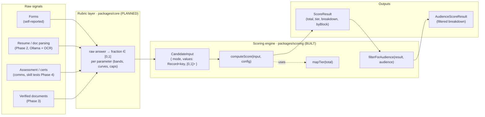
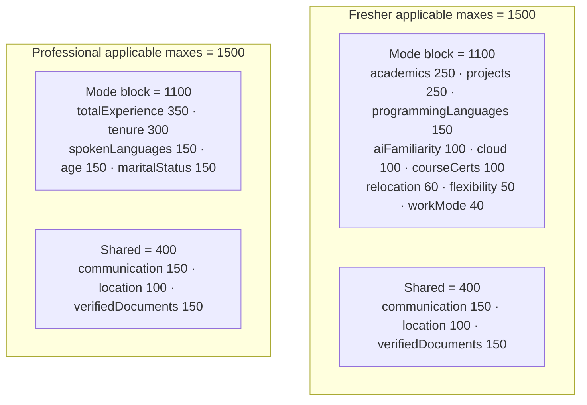
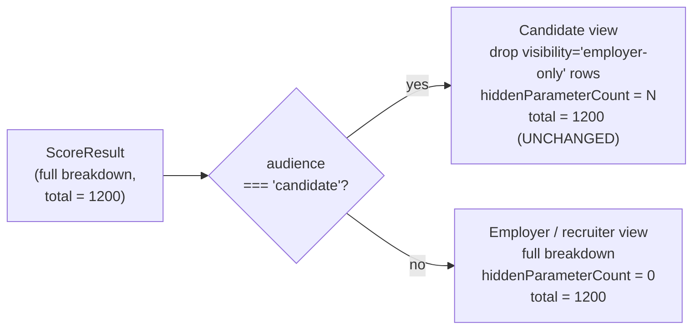
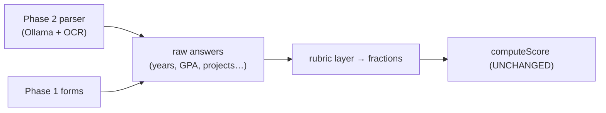
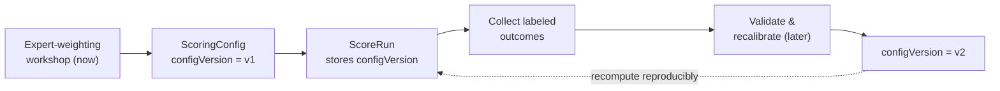

# Scoring Engine — Deep Design

> **Status:** Draft v0.1 · **Phase:** 1 (engine designed cross-cutting) · **Owner area:** backend / data
> **Related:** [architecture/02-data-model.md](./02-data-model.md), [phases/phase-1-core-scoring.md](../phases/phase-1-core-scoring.md), [backend/modules/scoring.md](../backend/modules/scoring.md)

This is the authoritative design for `@stabil/scoring` (`packages/scoring`) — the **pure, deterministic, fixed-weight** module that turns a candidate's normalized parameter performance into a `0–1500` total, a five-tier category, a per-parameter breakdown, and an audience-filtered view. It documents the **real implemented API exactly as it exists in code**, the math and invariants, the planned **rubric layer** (`packages/core`) that maps raw answers to `[0,1]` fractions, the calibration plan, explainability/improvement derivation, audience filtering, extensibility for later phases, and the testing strategy.

> **Calibration notice.** Every numeric **weight** (`max`) and every **tier band** in this document is a **PLACEHOLDER** pending the calibration workshop (SCOPE §13). The structure, math, invariants, and types are stable; the numbers are not.

---

## 1. Where the engine sits

The single most important boundary in the whole product:

> `@stabil/scoring` consumes **normalized fractions `[0,1]` per parameter**. Mapping raw answers (GPA, years, project counts, …) → fractions is the **rubric layer** (`packages/core`), **NOT** the engine. — README "Engine boundary"



Why the boundary is sacred:

- The engine stays **pure and deterministic** — same `(input, config)` always yields the same `ScoreResult`. No I/O, no clocks, no randomness. This is what makes it trivially unit-testable and reusable across web, mobile, and API (SCOPE §10).
- All the **messy, evolving, domain-specific** judgement (what a 3.2 GPA is worth, whether 18-month average tenure is "stable") lives in the rubric layer where it can change without ever touching the core arithmetic.
- Later phases (parsing in Phase 2, skill tests in Phase 4) plug into the **rubric layer** and feed the engine the same `[0,1]` shape — the engine's math never changes (see §8).

---

## 2. The implemented API (exactly as in code)

`packages/scoring/src/index.ts` re-exports five modules: `domain`, `tier`, `score`, `audience`, `config`. The public surface is small and total.

### 2.1 Domain types — `src/domain.ts` and `src/tier.ts`

```ts
// src/domain.ts
import type { Tier } from "./tier";

export type Mode = "fresher" | "professional";

/** Score is composed from three blocks (SCOPE.md §4.1). */
export type Block = "mode" | "common" | "verification";

/** Whether a parameter's line-item is shown to candidates (SCOPE.md §6.3). */
export type Visibility = "all" | "employer-only";

export type Audience = "candidate" | "employer" | "recruiter";

export interface ParameterDefinition {
  readonly key: string;
  readonly label: string;
  /** Which mode this parameter applies to; "both" = common to every mode. */
  readonly appliesTo: Mode | "both";
  readonly block: Block;
  /** Maximum points this parameter can contribute. */
  readonly max: number;
  readonly visibility: Visibility;
}

export interface ScoringConfig {
  /** The full-scale maximum (1500 for Stabil). */
  readonly scaleMax: number;
  readonly parameters: readonly ParameterDefinition[];
}

/** Normalized per-parameter performance, each in [0, 1]. Missing keys score 0. */
export type ParameterValues = Readonly<Record<string, number>>;

export interface CandidateInput {
  readonly mode: Mode;
  readonly values: ParameterValues;
}

export interface ParameterScore {
  readonly key: string;
  readonly label: string;
  readonly block: Block;
  readonly visibility: Visibility;
  readonly awarded: number;
  readonly max: number;
}

export type BlockTotals = Record<Block, { awarded: number; max: number }>;

export interface ScoreResult {
  readonly mode: Mode;
  readonly total: number;
  readonly maxTotal: number;
  readonly tier: Tier;
  readonly breakdown: readonly ParameterScore[];
  readonly byBlock: BlockTotals;
}

/** A score result rendered for a specific audience (SCOPE.md §6.3). */
export interface AudienceScoreResult extends ScoreResult {
  readonly audience: Audience;
  /** How many line-items were suppressed for this audience (candidate view). */
  readonly hiddenParameterCount: number;
}
```

```ts
// src/tier.ts
export type Tier =
  | "unstable"
  | "developing"
  | "somewhat-stable"
  | "settled"
  | "stable";
```

#### Type reference

| Type | Kind | Meaning |
|------|------|---------|
| `Mode` | union | Person-type, user-selected: `"fresher"` \| `"professional"` (SCOPE §3). |
| `Block` | union | Which composition block a parameter belongs to: `"mode"` \| `"common"` \| `"verification"` (SCOPE §4.1). |
| `Visibility` | union | `"all"` (candidate-visible) \| `"employer-only"` (suppressed from candidate report; SCOPE §6.3). |
| `Audience` | union | Report viewer: `"candidate"` \| `"employer"` \| `"recruiter"`. |
| `Tier` | union | The 5-tier ladder: `"unstable"` → `"developing"` → `"somewhat-stable"` → `"settled"` → `"stable"`. |
| `ParameterDefinition` | interface | One scored parameter: `key`, `label`, `appliesTo` (`Mode \| "both"`), `block`, `max` (points, integer), `visibility`. All `readonly`. |
| `ScoringConfig` | interface | `scaleMax` + a `readonly` array of `ParameterDefinition`. |
| `ParameterValues` | type | `Readonly<Record<string, number>>` — the rubric layer's output. Each value **should** be in `[0,1]`; the engine clamps regardless. **Missing keys score 0.** |
| `CandidateInput` | interface | `{ mode, values }` — the only per-candidate input the engine needs. |
| `ParameterScore` | interface | One row of the breakdown: identity + `awarded` (integer points) + `max`. |
| `BlockTotals` | type | `Record<Block, { awarded; max }>` — subtotals per block. |
| `ScoreResult` | interface | Full result: `mode`, `total`, `maxTotal`, `tier`, `breakdown[]`, `byBlock`. |
| `AudienceScoreResult` | interface | `ScoreResult` + `audience` + `hiddenParameterCount`. |

> **Enum consistency.** These string unions are the canonical enums referenced in the README cheat-sheet and in [architecture/02-data-model.md](./02-data-model.md). The persistence layer stores them as-is (e.g. a `Mode` column, a `Tier` column on each `ScoreRun`).

### 2.2 `mapTier(total)` — `src/tier.ts`

```ts
interface TierBand {
  readonly tier: Tier;
  /** Inclusive lower bound of the band. */
  readonly min: number;
}

/** Highest band first, so the first satisfied bound wins. */
const TIER_BANDS: readonly TierBand[] = [
  { tier: "stable", min: 1350 },
  { tier: "settled", min: 1100 },
  { tier: "somewhat-stable", min: 800 },
  { tier: "developing", min: 500 },
  { tier: "unstable", min: 0 },
];

/** Map a total score to its stability tier. Out-of-range totals clamp to the nearest tier. */
export function mapTier(total: number): Tier {
  return TIER_BANDS.find((band) => total >= band.min)?.tier ?? "unstable";
}
```

- Bands are ordered **highest-first**; `find` returns the first band whose inclusive `min` the total clears.
- **Clamping behaviour:** totals below 0 fall through to `unstable` (and the `?? "unstable"` guards `NaN` / unexpected inputs); totals above 1500 still satisfy `min: 1350` → `stable`. Out-of-range never throws.
- Each `min` is the **inclusive lower bound** of its band; the **upper bound** is implicit (one less than the next band's `min`).

### 2.3 `computeScore(input, config)` — `src/score.ts`

```ts
const clamp01 = (n: number): number => Math.min(1, Math.max(0, n));

function appliesToMode(def: ParameterDefinition, mode: Mode): boolean {
  return def.appliesTo === mode || def.appliesTo === "both";
}

function emptyBlockTotals(): BlockTotals {
  return {
    mode: { awarded: 0, max: 0 },
    common: { awarded: 0, max: 0 },
    verification: { awarded: 0, max: 0 },
  };
}

/** Score a candidate against a config: per-parameter awards, block subtotals, total, and tier. */
export function computeScore(input: CandidateInput, config: ScoringConfig): ScoreResult {
  const breakdown: ParameterScore[] = config.parameters
    .filter((def) => appliesToMode(def, input.mode))
    .map((def) => ({
      key: def.key,
      label: def.label,
      block: def.block,
      visibility: def.visibility,
      awarded: Math.round(clamp01(input.values[def.key] ?? 0) * def.max),
      max: def.max,
    }));

  const byBlock = emptyBlockTotals();
  let total = 0;
  let maxTotal = 0;
  for (const param of breakdown) {
    byBlock[param.block].awarded += param.awarded;
    byBlock[param.block].max += param.max;
    total += param.awarded;
    maxTotal += param.max;
  }

  return { mode: input.mode, total, maxTotal, tier: mapTier(total), breakdown, byBlock };
}
```

What it does, step by step:

1. **Filter by mode.** Keep only parameters where `appliesTo === input.mode` **or** `appliesTo === "both"`. A `fresher` input never sees professional parameters and vice-versa; `"both"` (common + verification) always applies.
2. **Award per parameter.** `awarded = Math.round(clamp01(values[key] ?? 0) * max)`. Missing key → `0`; value outside `[0,1]` is clamped first; result is rounded to a **whole-number** point count (README: "points are integers, `Math.round`").
3. **Aggregate.** Sum `awarded` and `max` into `byBlock` per block, and into `total` / `maxTotal`.
4. **Map tier.** `tier = mapTier(total)`.
5. Return the complete `ScoreResult`.

> The engine is **total** — it never throws. Unknown keys in `values` that don't match any parameter are silently ignored; absent expected keys score 0. This is intentional: a half-finished form still produces a valid (lower) score, matching SCOPE §5 "graceful without docs".

### 2.4 `filterForAudience(result, audience)` — `src/audience.ts`

```ts
/**
 * Candidates never see employer-only line-items, but the suppressed factors
 * still count toward the total — only the breakdown is filtered, not the score.
 */
export function filterForAudience(result: ScoreResult, audience: Audience): AudienceScoreResult {
  if (audience !== "candidate") {
    return { ...result, audience, hiddenParameterCount: 0 };
  }

  const visible = result.breakdown.filter((param) => param.visibility === "all");
  return {
    ...result,
    audience,
    breakdown: visible,
    hiddenParameterCount: result.breakdown.length - visible.length,
  };
}
```

- For `employer` / `recruiter`: returns the result unchanged plus `hiddenParameterCount: 0` — **full breakdown including sensitive line-items** (SCOPE §6.3).
- For `candidate`: drops every `visibility === "employer-only"` row from `breakdown`, reports how many were hidden. **`total`, `tier`, `byBlock`, and `maxTotal` are untouched** — the suppressed factors still count, they're just not itemized. See §6.

### 2.5 `stabilConfig` — `src/config.ts`

The default production config. Three internal groups (`COMMON`, `FRESHER`, `PROFESSIONAL`) flattened into one parameter list:

```ts
export const stabilConfig: ScoringConfig = {
  scaleMax: 1500,
  parameters: [...FRESHER, ...PROFESSIONAL, ...COMMON],
};
```

> All `max` values below are **PLACEHOLDERS** (SCOPE §13). The only property the test suite enforces is the **1500-per-mode invariant** (§4.2), not any individual weight.

---

## 3. The weights tables (reproduced from `config.ts`)

The full default parameter set, exactly as defined in `packages/scoring/src/config.ts`. **All `max` values are PLACEHOLDER pending calibration.**

### 3.1 Common block (`appliesTo: "both"`) — applies to every candidate

| key | label | block | max (PLACEHOLDER) | visibility |
|-----|-------|-------|-------------------|------------|
| `communication` | Communication | `common` | 150 | `all` |
| `location` | Location | `common` | 100 | `all` |
| `verifiedDocuments` | Verified documents | `verification` | 150 | `all` |

Shared total (`common` + `verification`) = **400** for both modes.

### 3.2 Fresher mode-specific block (`appliesTo: "fresher"`, `block: "mode"`)

| key | label | block | max (PLACEHOLDER) | visibility |
|-----|-------|-------|-------------------|------------|
| `academics` | Academics | `mode` | 250 | `all` |
| `projects` | Projects | `mode` | 250 | `all` |
| `programmingLanguages` | Programming languages | `mode` | 150 | `all` |
| `aiFamiliarity` | AI familiarity | `mode` | 100 | `all` |
| `cloud` | Cloud exposure | `mode` | 100 | `all` |
| `courseCerts` | Courses & certifications | `mode` | 100 | `all` |
| `relocation` | Relocation willingness | `mode` | 60 | `all` |
| `flexibility` | Flexibility | `mode` | 50 | `all` |
| `workMode` | Work-mode preference | `mode` | 40 | `all` |

Fresher mode block total = **1100**. → Fresher applicable total = 1100 + 400 = **1500**. ✓

### 3.3 Professional mode-specific block (`appliesTo: "professional"`, `block: "mode"`)

| key | label | block | max (PLACEHOLDER) | visibility |
|-----|-------|-------|-------------------|------------|
| `totalExperience` | Total experience | `mode` | 350 | `all` |
| `tenure` | Tenure | `mode` | 300 | `all` |
| `spokenLanguages` | Spoken languages | `mode` | 150 | `all` |
| `age` | Age | `mode` | 150 | **`employer-only`** |
| `maritalStatus` | Marital status | `mode` | 150 | **`employer-only`** |

Professional mode block total = **1100**. → Professional applicable total = 1100 + 400 = **1500**. ✓

> **Languages mode-split** (SCOPE §2 #8): freshers are scored on **programming** languages (`programmingLanguages`); professionals on **spoken** languages (`spokenLanguages`). These are distinct parameters keyed by mode, not one shared parameter.
>
> **Sensitive attributes** (SCOPE §6.3, §9, §12): `age` and `maritalStatus` are `employer-only`. They **contribute to the total in both audiences** but are itemized **only** for employers/recruiters; `filterForAudience` strips them from the candidate breakdown (§6).

---

## 4. The math

### 4.1 Total formula

For a candidate in mode `m` scored against config `C`, let `applies(p, m) ⟺ p.appliesTo = m ∨ p.appliesTo = "both"`. For each applicable parameter `p` with normalized fraction `fₚ = C.values[p.key] ?? 0`:

```
awardedₚ = round( clamp01(fₚ) · p.max )        where clamp01(x) = min(1, max(0, x))

TOTAL = Σ awardedₚ  for all p with applies(p, m)
      = Σ awardedₚ (mode block) + Σ awardedₚ (common block) + Σ awardedₚ (verification block)

maxTotal = Σ p.max  for all p with applies(p, m)
```

This is exactly SCOPE §4.1's composition:

```
TOTAL (0–1500) = Mode-specific block + Common block + Verification bonus → Tier
```

| Symbol | Meaning |
|--------|---------|
| `fₚ` | Rubric-produced fraction for parameter `p`, expected in `[0,1]` (the engine clamps). |
| `clamp01(x)` | `min(1, max(0, x))` — defends against rubric bugs / out-of-range raw inputs. |
| `awardedₚ` | Integer points granted for `p` (`Math.round`). |
| `p.max` | Parameter's maximum point contribution (the calibrated weight). |
| `TOTAL` | Sum of awarded points across all applicable parameters; in `[0, 1500]`. |

### 4.2 The 1500-per-mode invariant

For **either** mode, the applicable maxes sum to **1500**:

```
Σ p.max over applicable p  =  (mode block = 1100)  +  (shared common + verification = 400)  =  1500
```



This invariant is **enforced by the test suite**, not by the type system (`config.test.ts`):

```ts
it.each(modes)("applicable parameter maxes sum to the full scale for '%s'", (mode) => {
  const sum = stabilConfig.parameters
    .filter((p) => p.appliesTo === mode || p.appliesTo === "both")
    .reduce((acc, p) => acc + p.max, 0);
  expect(sum).toBe(stabilConfig.scaleMax); // 1500
});
```

**Consequence: cross-mode comparability.** Because both modes cap at 1500 and share the same 400-point common+verification block, a fresher's 1100 and a professional's 1100 sit on the **same scale** and map to the **same tier** — the role-agnostic "one score per person" requirement (SCOPE §1, §2 #3–#4).

> When calibration changes weights, the only hard constraint is that this sum stays exactly `scaleMax`. The workshop redistributes points **within** each 1100 mode block and **within** the 400 shared block; it must not break the total.

### 4.3 Worked example

Using the illustrative config from `score.test.ts` (not `stabilConfig`), a professional with `{ experience: 1, age: 0.5, communication: 0.5, verifiedId: 1 }`:

| key | fraction | clamp01 | × max | round | block |
|-----|----------|---------|-------|-------|-------|
| `experience` | 1.0 | 1.0 | 1.0 × 700 = 700 | **700** | mode |
| `age` | 0.5 | 0.5 | 0.5 × 300 = 150 | **150** | mode |
| `communication` | 0.5 | 0.5 | 0.5 × 300 = 150 | **150** | common |
| `verifiedId` | 1.0 | 1.0 | 1.0 × 200 = 200 | **200** | verification |

`total = 700 + 150 + 150 + 200 = 1200` → `maxTotal = 1500` → `mapTier(1200) = "settled"`.
`byBlock = { mode: {850, 1000}, common: {150, 300}, verification: {200, 200} }`.

Edge cases (also tested): `academics: 2 → clamped to 1.0 → 600`; `projects: -1 → clamped to 0.0 → 0`; a parameter absent from `values` → `0`.

---

## 5. The rubric layer (`packages/core`, PLANNED)

> **Status: planned package**, not yet built. The engine is built; the rubric layer is the Phase-1 companion that turns raw form answers into the `[0,1]` fractions the engine consumes. This section specifies its shape and concrete example mappings. **All band thresholds and curve constants below are PLACEHOLDER pending calibration (SCOPE §13.3).**

### 5.1 The contract

A rubric function maps one parameter's **raw answer** to a fraction in `[0,1]`:

```ts
// packages/core (PLANNED) — shape only
export type Fraction = number; // expected in [0, 1]; engine clamps defensively

export interface RubricFn<Raw> {
  (raw: Raw): Fraction;
}

/** A registry maps parameter keys to their rubric. */
export type RubricRegistry = Readonly<Record<string, RubricFn<unknown>>>;
```

The rubric layer's output is assembled into `ParameterValues` and handed to `computeScore`:

```ts
// orchestration (backend scoring module) — see backend/modules/scoring.md
const values: ParameterValues = {
  academics: academicsRubric(form.academics),
  projects: projectsRubric(form.projects),
  totalExperience: experienceRubric(form.years),
  tenure: tenureRubric(form.jobs),
  // …one entry per applicable parameter key
};
const result = computeScore({ mode, values }, stabilConfig);
```

> **Boundary restated.** Rubrics know about GPAs, years, and certs; the engine knows only fractions and weights. A rubric **never** references `max` or points — that would couple it to calibration. The engine **never** references a GPA — that would couple it to the domain. Keep both ends ignorant of the other.

### 5.2 Example rubric functions (PLACEHOLDER thresholds)

#### Academics — GPA / percentage bands → fraction

```ts
/** Normalize academics to [0,1]. Accepts GPA (out of provided scale) or percentage. */
export function academicsRubric(a: {
  gpa?: number; gpaScale?: number; percentage?: number;
}): Fraction {
  // Prefer percentage if given; else convert GPA to a 0–100 percentage.
  const pct = a.percentage ??
    (a.gpa != null && a.gpaScale ? (a.gpa / a.gpaScale) * 100 : undefined);
  if (pct == null) return 0; // no academic data → 0 (graceful)

  // PLACEHOLDER bands (SCOPE §13.3):
  if (pct >= 85) return 1.0;   // distinction
  if (pct >= 75) return 0.85;  // first class
  if (pct >= 60) return 0.65;  // second class
  if (pct >= 50) return 0.45;  // pass
  return 0.2;                   // below pass but present
}
```

#### Total experience — years → saturating curve

```ts
/** Diminishing returns: each extra year matters less; saturates near a cap. */
export function experienceRubric(years: number): Fraction {
  const SATURATION_YEARS = 12; // PLACEHOLDER: ~12y ≈ "fully credited"
  if (years <= 0) return 0;
  // 1 - e^(-k·years) gives a smooth saturating curve in [0,1).
  const k = 3 / SATURATION_YEARS; // ~95% credited at the saturation point
  return 1 - Math.exp(-k * years);
}
```

#### Tenure — average months per job → fraction (penalize hopping)

```ts
/** Stability signal: long average tenure good; frequent short hops penalized. */
export function tenureRubric(jobs: { months: number }[]): Fraction {
  if (jobs.length === 0) return 0;
  const avgMonths = jobs.reduce((s, j) => s + j.months, 0) / jobs.length;

  // PLACEHOLDER bands (SCOPE §4.4 — short hops ⇒ less stable):
  let base: Fraction;
  if (avgMonths >= 36) base = 1.0;       // 3y+ average
  else if (avgMonths >= 24) base = 0.8;  // 2–3y
  else if (avgMonths >= 18) base = 0.6;  // 1.5–2y
  else if (avgMonths >= 12) base = 0.4;  // 1–1.5y
  else base = 0.2;                        // sub-year hopping

  // Extra penalty for many very short stints (job-hopping signal).
  const shortStints = jobs.filter((j) => j.months < 12).length;
  const hopPenalty = Math.min(0.3, shortStints * 0.1); // PLACEHOLDER cap 0.3
  return Math.max(0, base - hopPenalty);
}
```

#### Projects — count × quality

```ts
/** Combine how many projects with their assessed quality. */
export function projectsRubric(projects: { quality: number }[]): Fraction {
  if (projects.length === 0) return 0;
  // quality is 0..1 each (e.g. relevance/complexity rating from form or parse).
  const COUNT_CAP = 4; // PLACEHOLDER: 4 strong projects ≈ full credit
  const countFactor = Math.min(1, projects.length / COUNT_CAP);
  const avgQuality =
    projects.reduce((s, p) => s + clamp01(p.quality), 0) / projects.length;
  return clamp01(countFactor * avgQuality);
}
```

#### Communication — self-rating + cert bonus (capped)

```ts
/** Self-rating now; verifiable certs add a bonus; total capped at 1 (SCOPE §2 #10). */
export function communicationRubric(c: {
  selfRating: number; selfRatingMax: number; verifiedCerts: number;
}): Fraction {
  const self = clamp01(c.selfRating / c.selfRatingMax);
  const certBonus = Math.min(0.2, c.verifiedCerts * 0.1); // PLACEHOLDER cap 0.2
  return clamp01(self * 0.8 + certBonus); // self-rating weighted, cert tops up
}
```

#### Languages — count → fraction

```ts
/** Programming (fresher) or spoken (professional) language count → fraction. */
export function languagesRubric(count: number): Fraction {
  const CAP = 4; // PLACEHOLDER: 4 languages ≈ full credit
  return clamp01(count / CAP);
}
```

#### Age & marital — settledness mapping (employer-only)

```ts
/** Settledness proxy. Output still passes through the engine for all audiences,
 *  but filterForAudience hides the line-item from candidates (SCOPE §6.3, §12). */
export function ageRubric(age: number): Fraction {
  // PLACEHOLDER "settledness" curve — peaks in a mid band, not monotonic.
  if (age >= 30 && age <= 45) return 1.0;
  if (age >= 25 && age < 30) return 0.7;
  if (age > 45 && age <= 55) return 0.8;
  if (age >= 22 && age < 25) return 0.4;
  return 0.2;
}

export function maritalRubric(status: "married" | "single" | "other"): Fraction {
  // PLACEHOLDER settledness mapping.
  return status === "married" ? 1.0 : 0.5;
}
```

> **Legal/fairness caution.** `age` and `maritalStatus` carry real legal risk (SCOPE §12). Their rubrics are placeholders gated behind employer-only visibility; a regional compliance review precedes any production use. The engine remains agnostic — it scores whatever fraction it's given.

#### Verification — set of verified documents → fraction

```ts
/** Maps the set of validated documents to the verification fraction (SCOPE §5). */
export function verificationRubric(verified: {
  govId?: boolean; education?: boolean; employment?: boolean;
}): Fraction {
  // PLACEHOLDER weights within the verification fraction:
  let f = 0;
  if (verified.govId) f += 0.5;       // ID is the anchor
  if (verified.education) f += 0.25;
  if (verified.employment) f += 0.25;
  return clamp01(f);
}
```

This fraction multiplies the `verifiedDocuments` parameter's `max` (PLACEHOLDER 150) inside the engine — that's the "verification bonus" of SCOPE §4.1, expressed within the unified `[0,1] × max` model rather than as a special additive case.

---

## 6. Audience visibility filtering

`filterForAudience` is the engine's enforcement of SCOPE §6.3's differentiated views.



Key guarantees (all asserted in `audience.test.ts`):

- **Candidate** view: `age` (and any `employer-only` row) is **absent** from `breakdown`; `hiddenParameterCount` counts the suppressions; `total`, `tier`, `byBlock`, `maxTotal` are **identical** to the unfiltered result.
- **Employer** / **recruiter** view: full breakdown including `age`/`maritalStatus`; `hiddenParameterCount === 0`.
- The function is **pure** and operates on an already-computed `ScoreResult` — visibility is a **presentation** concern layered over the fixed math. The total a candidate sees is exactly the total an employer sees; only the itemization differs. This is the SCOPE §6.3 "hidden factors still affect the total; they just aren't shown."

---

## 7. Explainability & improvement guidance

The `breakdown` (per-parameter `awarded` / `max`) and `byBlock` subtotals **are** the explainability layer required by SCOPE §1, §8. No extra computation is needed to answer "which factors contributed how much" — every line item carries its own `awarded` and `max`.

### 7.1 Improvement guidance derivation (presentation-layer, on candidate view)

For a candidate, the **headroom** of each visible parameter is `max − awarded`. The guidance list is derived deterministically from the same `ScoreResult`:

```ts
// Presentation helper (reports module) — derives "how to improve" from the result.
interface Suggestion { key: string; label: string; potentialGain: number; }

function improvementSuggestions(view: AudienceScoreResult): Suggestion[] {
  return view.breakdown
    .map((p) => ({ key: p.key, label: p.label, potentialGain: p.max - p.awarded }))
    .filter((s) => s.potentialGain > 0)
    .sort((a, b) => b.potentialGain - a.potentialGain); // biggest wins first
}
```

This yields SCOPE §8's concrete prompts, e.g.:

- `verifiedDocuments`: `awarded 0 / max 150` → **"Verify your ID for +150 points."**
- `projects`: `awarded 100 / max 250` → **"Add a strong project for up to +150 points."**

> **Sensitive items are never suggested to candidates** — they're already filtered out of the candidate `breakdown` by `filterForAudience`, so they never appear in `improvementSuggestions`. A candidate is never told to "get married for +X" or "be older for +Y"; those rows simply don't exist in their view.
>
> Suggested gains use **current weights**, which are PLACEHOLDER. The phrasing ("+X points") must read the live `max` from the breakdown, never a hard-coded number.

---

## 8. Extensibility — later phases plug in WITHOUT changing core math

The `[0,1] × max` model is deliberately uniform so new signal sources slot in as either (a) a new rubric feeding an existing parameter or (b) a new `ParameterDefinition`. **`computeScore` never changes.**

### 8.1 Phase 2 — resume & document parsing supplies fractions

Parsing (Ollama + Tesseract OCR) **auto-fills the same form fields** the rubric layer already consumes. The parser's job ends at producing raw answers (years, project list, GPA); those flow through the **same rubric functions** to the **same** `ParameterValues`. The engine sees no difference between a form-entered "5 years" and a parsed "5 years".



### 8.2 Phase 4 — skill tests add a parameter

A Python skill test contributes a `0–1` score, which becomes one new parameter — no math change, only a config edit honoring the invariant:

```ts
// Add to the FRESHER (and/or PROFESSIONAL) block and rebalance to keep mode block = 1100.
{ key: "skillTest", label: "Skill test", appliesTo: "fresher", block: "mode", max: 100, visibility: "all" }
```

The rubric is trivial (`testScore / testMax` → `[0,1]`); `computeScore` consumes it like any other parameter. SCOPE §2 #11 ("design the score to accept a test sub-score") is satisfied **by construction** — the engine already accepts arbitrary parameters.

> **The one rule for any new parameter:** after adding/removing weights, the per-mode applicable maxes must still sum to `scaleMax` (1500). The invariant test (§4.2, §9) fails loudly otherwise.

---

## 9. Calibration plan

Weights and tier bands are **expert-defined now, outcome-validated later** (SCOPE §2 #5, §13).

| Stage | Activity | Output |
|-------|----------|--------|
| **Now (Phase 1)** | **Expert-weighting workshop.** Domain experts allocate the 1100 mode block and 400 shared block across parameters; set rubric bands/curves; set the 5 tier `min` thresholds. | A `ScoringConfig` + rubric constants, both with the 1500-per-mode invariant intact. |
| **Later** | **Validate against labeled outcomes.** Once real candidates + outcomes (retention, hire success) exist, check that tiers/weights predict the labels; adjust. Still fixed weights — no ML in POC (SCOPE §2 #5). | Revised config; documented rationale per change. |
| **Always** | **Reproducibility.** Persist a `configVersion` with every `ScoreRun` so any historical score can be recomputed and explained against the exact config that produced it. | Versioned configs; auditable re-scoring (SCOPE §11 improvement loop). |



**`configVersion` & data model.** Each persisted `ScoreRun` records the `Mode`, the resulting `Tier` and `total`, the input fractions, and the `configVersion` it was scored under (see [architecture/02-data-model.md](./02-data-model.md) and [backend/modules/scoring.md](../backend/modules/scoring.md)). Re-scoring under a new version creates a **new** run, never mutating history — supporting the SCOPE §11 improvement loop with a defensible audit trail (SCOPE §12).

> Until the workshop completes, **treat every weight and band in this doc as PLACEHOLDER.** The shipped `stabilConfig` is a structurally-valid placeholder, not a calibrated model.

---

## 10. Testing strategy

The engine is the product's trust anchor (SCOPE §10), tested with **Vitest**. Existing tests live alongside source: `tier.test.ts`, `score.test.ts`, `audience.test.ts`, `config.test.ts`.

### 10.1 Invariants currently covered

| Invariant | Where | Assertion |
|-----------|-------|-----------|
| Scale is 1500 | `config.test.ts` | `stabilConfig.scaleMax === 1500`. |
| Unique parameter keys | `config.test.ts` | `new Set(keys).size === keys.length`. |
| **Per-mode maxes sum to scale** | `config.test.ts` | applicable maxes sum to `1500` for `fresher` **and** `professional`. |
| Perfect candidate = max & `stable` | `config.test.ts` | all-`1` values → `total === 1500`, `tier === "stable"` (both modes). |
| Sensitive attrs employer-only | `config.test.ts` | `age`, `maritalStatus` both `visibility === "employer-only"`. |
| Award = fraction × max, summed | `score.test.ts` | the worked example → `total === 1200`, `tier === "settled"`. |
| Mode filtering | `score.test.ts` | professional input yields exactly its applicable keys. |
| Block grouping | `score.test.ts` | `byBlock` subtotals match. |
| Missing → 0, clamp `[0,1]` | `score.test.ts` | `academics: 2 → max`, `projects: -1 → 0`, missing → 0. |
| Tier bands & out-of-range clamp | `tier.test.ts` | each band boundary; `-50 → unstable`, `99999 → stable`. |
| Candidate hides employer-only, total unchanged | `audience.test.ts` | `age` absent, `total` and `tier` unchanged, `hiddenParameterCount === 1`. |
| Employer/recruiter see full breakdown | `audience.test.ts` | `age` present, `hiddenParameterCount === 0`. |

### 10.2 Property-based testing (recommended additions)

Add `fast-check` properties to assert the math universally, not just at examples:

```ts
import * as fc from "fast-check";

// total is always within [0, maxTotal], for any mode and any (even out-of-range) fractions.
it("total stays within [0, maxTotal]", () => {
  fc.assert(fc.property(
    fc.constantFrom("fresher", "professional"),
    fc.dictionary(fc.string(), fc.double({ min: -5, max: 5, noNaN: true })),
    (mode, values) => {
      const r = computeScore({ mode, values }, stabilConfig);
      return r.total >= 0 && r.total <= r.maxTotal;
    },
  ));
});

// audience filtering never changes the total or tier.
it("filterForAudience preserves total and tier", () => {
  fc.assert(fc.property(
    fc.constantFrom("candidate", "employer", "recruiter"),
    fc.dictionary(fc.string(), fc.double({ min: 0, max: 1, noNaN: true })),
    (audience, values) => {
      const r = computeScore({ mode: "professional", values }, stabilConfig);
      const v = filterForAudience(r, audience);
      return v.total === r.total && v.tier === r.tier;
    },
  ));
});
```

Suggested properties:

- **Monotonicity:** raising any single fraction never lowers `total` (each `awarded` is monotonic in its fraction).
- **Total = Σ blocks:** `total === byBlock.mode.awarded + byBlock.common.awarded + byBlock.verification.awarded`.
- **Clamp idempotence:** fractions already in `[0,1]` are unchanged by `clamp01`.
- **Determinism:** scoring the same input twice yields a deep-equal result.
- **Config invariant as a property:** for any config whose per-mode maxes sum to `scaleMax`, a perfect candidate scores exactly `scaleMax`.

---

## 11. Quick reference

| Function | Signature | Returns |
|----------|-----------|---------|
| `mapTier` | `(total: number) => Tier` | Tier for a total; clamps out-of-range. |
| `computeScore` | `(input: CandidateInput, config: ScoringConfig) => ScoreResult` | Per-parameter awards, block subtotals, total, tier. |
| `filterForAudience` | `(result: ScoreResult, audience: Audience) => AudienceScoreResult` | Audience-filtered breakdown; total/tier unchanged. |
| `stabilConfig` | `ScoringConfig` | Default 1500-scale config (PLACEHOLDER weights). |

**Tier bands (PLACEHOLDER, SCOPE §7):**

| Tier | Range (of 1500) |
|------|-----------------|
| `unstable` | 0–499 |
| `developing` | 500–799 |
| `somewhat-stable` | 800–1099 |
| `settled` | 1100–1349 |
| `stable` | 1350–1500 |

**See also:** [architecture/02-data-model.md](./02-data-model.md) (how `ScoreRun` / parameters / `configVersion` persist) · [phases/phase-1-core-scoring.md](../phases/phase-1-core-scoring.md) (the phase that ships the engine + forms + rubric layer) · [backend/modules/scoring.md](../backend/modules/scoring.md) (the NestJS module wrapping `@stabil/scoring`).
