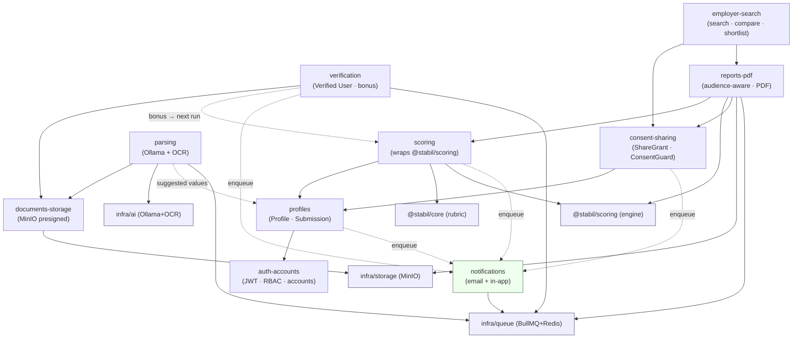
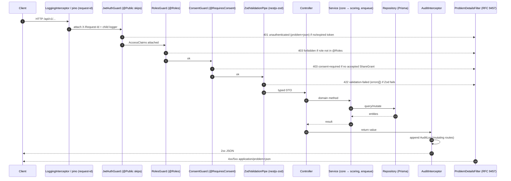
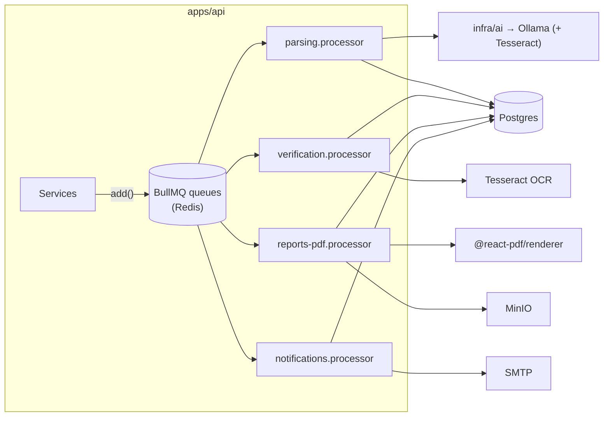

# Backend Architecture & Conventions

> **Status:** Draft v0.1 · **Phase:** cross-cutting · **Owner area:** backend
> **Related:** [database-and-prisma.md](./database-and-prisma.md), [api-conventions.md](./api-conventions.md), [testing.md](./testing.md), [best-practices.md](./best-practices.md), [modules/README.md](./modules/README.md), [../architecture/01-overview.md](../architecture/01-overview.md), [../architecture/02-data-model.md](../architecture/02-data-model.md), [../architecture/03-scoring-engine.md](../architecture/03-scoring-engine.md), [../architecture/04-api-contracts.md](../architecture/04-api-contracts.md), [../architecture/05-security-privacy.md](../architecture/05-security-privacy.md), [../SCOPE.md](../SCOPE.md), [../README.md](../README.md)

This is the engineering map for **`apps/api`** — the **NestJS** service that is the only process in Stabil allowed to touch the database, object storage, the local LLM, and mail (see [container view](../architecture/01-overview.md#22-container-view-level-2)). It defines the folder layout, the module map, the request lifecycle, the cross-cutting machinery (auth, validation, the RFC 9457 error model, the audit interceptor, the consent guard, and the **audience-filtering boundary**), the async job system (**BullMQ + Redis**), and the persistence / storage / AI / config / logging / health conventions. It stays 100% consistent with [SCOPE.md](../SCOPE.md) and the [canonical facts](../README.md#canonical-facts-single-source-of-truth--never-contradict). Where this doc and `SCOPE.md` ever disagree, **`SCOPE.md` wins** — open a PR to fix the drift.

> **Status note:** `apps/api` is planned per SCOPE §10 and the [README file-tree](../README.md#documentation-map-file-tree); it is built across Phases 0–1 ([phases/README.md](../phases/README.md)). The pure **`@stabil/scoring`** engine it wraps **already exists** ([packages/scoring/src](../../packages/scoring/src)). This doc describes the target structure and conventions every module follows.

---

## 1. Stack & the one rule that shapes everything

| Layer | Choice | Notes |
|-------|--------|-------|
| Framework | **NestJS** (TS) | Modular boundaries match the phased build (SCOPE §10). |
| HTTP adapter | **Fastify** | Faster + first-class `application/problem+json`; Express is the fallback. |
| ORM | **Prisma** + **PostgreSQL** | The only data-access layer; see [database-and-prisma.md](./database-and-prisma.md). |
| Validation | **Zod** via **`nestjs-zod`** | One schema source (`packages/types`) shared by web, mobile, API (SCOPE §10). |
| Jobs | **BullMQ** + **Redis** (`@nestjs/bullmq`) | Parsing · verification · PDF · notifications. |
| Storage | **MinIO** (S3-compatible) via `@aws-sdk/client-s3` | Presigned URLs; swap to R2/S3 is config-only (SCOPE §10). |
| AI | **Ollama** behind a provider-agnostic adapter (+ **Tesseract** OCR) | PII stays in-house (SCOPE §10, §11). |
| Config | **`@nestjs/config`** + Zod env schema | Fail-fast on boot if env is invalid. |
| Logging | **pino** (`nestjs-pino`) | Structured JSON, request-scoped, PII-redacted. |
| Health | **`@nestjs/terminus`** | `/api/v1/health` liveness/readiness probes. |
| Auth | **JWT access + refresh**, `RolesGuard` + `@Roles` | RBAC: `candidate \| employer \| recruiter \| admin`. |
| Testing | **Vitest** (unit) + **supertest** (e2e) | See [testing.md](./testing.md). |

**The single rule the whole backend respects** (from the [engine boundary](../README.md#conventions-cheat-sheet) and [01-overview §3.1](../architecture/01-overview.md#31-the-engine--rubric-boundary-the-crisp-line)):

> **`@stabil/scoring` consumes normalized fractions `[0,1]` per parameter.** Mapping raw answers (GPA, years, certifications) → fractions is the **rubric layer** (`packages/core`), **not** the engine and **not** the API. The API orchestrates: it reads forms, calls `core` → `scoring`, persists, and renders. It never does scoring math inline.

A second rule, specific to Stabil's risk profile, is enforced structurally (see [§5.6](#56-the-audience-filtering-boundary)): **employer-only fields (age, marital status) are scored but filtered out of the candidate view on read** via `filterForAudience`; they are **never** persisted in a candidate-only shape.

---

## 2. `apps/api` folder layout

Feature-first: each NestJS module is a self-contained folder mirroring the modules in SCOPE §10. Cross-cutting machinery lives under `src/common`. The pure libraries (`@stabil/scoring`, `@stabil/core`, `@stabil/types`) are imported, never re-implemented.

```
apps/api/
├── src/
│   ├── main.ts                      # bootstrap: Fastify, global pipe/filter/interceptor, /api/v1, pino, Swagger (non-prod)
│   ├── app.module.ts                # root module: imports all feature + infra modules
│   │
│   ├── config/
│   │   ├── env.schema.ts            # Zod schema for process.env (fail-fast validation)
│   │   ├── config.module.ts         # @nestjs/config wiring (validate: zodValidate)
│   │   └── configuration.ts         # typed config factory (db, redis, jwt, minio, ollama, smtp)
│   │
│   ├── common/                      # CROSS-CUTTING — no feature logic here
│   │   ├── guards/
│   │   │   ├── jwt-auth.guard.ts     # global; honors @Public()
│   │   │   ├── roles.guard.ts        # reads @Roles(); RBAC
│   │   │   └── consent.guard.ts      # @RequiresConsent(); asserts accepted ShareGrant
│   │   ├── decorators/
│   │   │   ├── public.decorator.ts          # @Public()
│   │   │   ├── roles.decorator.ts           # @Roles('employer','recruiter')
│   │   │   ├── current-user.decorator.ts    # @CurrentUser() → AccessClaims
│   │   │   ├── audience.decorator.ts        # @CallerAudience() → Audience
│   │   │   └── requires-consent.decorator.ts# @RequiresConsent('profileId')
│   │   ├── pipes/
│   │   │   └── zod-validation.pipe.ts # nestjs-zod; throws ZodValidationException → 422
│   │   ├── filters/
│   │   │   └── problem-details.filter.ts # RFC 9457 application/problem+json
│   │   ├── interceptors/
│   │   │   ├── audit.interceptor.ts        # appends immutable AuditLog rows
│   │   │   ├── logging.interceptor.ts      # per-request pino child + timing
│   │   │   └── idempotency.interceptor.ts  # @Idempotent(); replay/conflict (POST /scoring/runs)
│   │   ├── errors/
│   │   │   └── problems.ts            # ProblemException subclasses (NotFound, Conflict, ConsentRequired…)
│   │   └── prisma/
│   │       ├── prisma.module.ts       # @Global() — single PrismaService
│   │       └── prisma.service.ts      # extends PrismaClient; onModuleInit connect
│   │
│   ├── infra/                        # shared infrastructure adapters (injectable)
│   │   ├── storage/                  # MinIO/S3 client (presigned URLs)
│   │   ├── ai/                       # provider-agnostic LLM adapter (Ollama default) + OCR
│   │   ├── queue/                    # BullMQ registration + base processor helpers
│   │   ├── mail/                     # SMTP transport (used by notifications)
│   │   └── health/                   # @nestjs/terminus indicators (db, redis, minio, ollama)
│   │
│   └── modules/                      # FEATURE modules (one per SCOPE §10 boundary)
│       ├── auth-accounts/
│       │   ├── auth-accounts.module.ts
│       │   ├── auth.controller.ts            # /auth/* (@Public except logout)
│       │   ├── account.controller.ts         # /account/*
│       │   ├── auth.service.ts               # register/login/refresh rotation
│       │   ├── token.service.ts              # sign/verify access+refresh, jti families
│       │   ├── account.service.ts            # profile fields, data-deletion ticket
│       │   ├── users.repository.ts           # Prisma access for User + RefreshToken
│       │   └── dto/                          # *.dto.ts → createZodDto(schema)
│       ├── profiles/                  # Profile + Submission (incl. claimable/claim)
│       ├── scoring/                   # wraps @stabil/scoring; ScoreRun + history (idempotent)
│       ├── parsing/                   # Phase 2: resume/doc → suggested ParameterValues
│       ├── verification/              # Phase 3: doc verification, Verified User, bonus
│       ├── documents-storage/         # presigned uploads, MinIO lifecycle, scan
│       ├── reports-pdf/               # audience-aware report assembly + @react-pdf/renderer
│       ├── consent-sharing/           # ShareGrant lifecycle; powers ConsentGuard
│       ├── employer-search/           # Phase 4: search / compare / shortlists
│       └── notifications/             # in-app + email (claim invite, score ready, consent ask)
│
├── prisma/
│   ├── schema.prisma                 # see ../architecture/02-data-model.md
│   ├── migrations/
│   └── seed.ts
├── test/                             # e2e (supertest) — see ./testing.md
├── nest-cli.json
├── tsconfig.json
└── package.json
```

### 2.1 Anatomy of one module

Every feature module is the same shape, so a new contributor can navigate any of them. Example — `scoring`:

```ts
// modules/scoring/scoring.module.ts
import { Module } from "@nestjs/common";
import { BullModule } from "@nestjs/bullmq";
import { ScoringController } from "./scoring.controller";
import { ScoringService } from "./scoring.service";
import { ScoreRunRepository } from "./score-run.repository";
import { ProfilesModule } from "../profiles/profiles.module";

@Module({
  imports: [ProfilesModule, BullModule.registerQueue({ name: "notifications" })],
  controllers: [ScoringController],
  providers: [ScoringService, ScoreRunRepository],
  exports: [ScoringService], // reports-pdf re-renders a ScoreRun per audience
})
export class ScoringModule {}
```

```ts
// modules/scoring/scoring.controller.ts
import { Body, Controller, Post } from "@nestjs/common";
import { Roles } from "../../common/decorators/roles.decorator";
import { Idempotent } from "../../common/interceptors/idempotency.interceptor";
import { CurrentUser } from "../../common/decorators/current-user.decorator";
import { CreateScoreRunDto } from "./dto/create-score-run.dto";
import { ScoringService } from "./scoring.service";
import type { AccessClaims } from "../auth-accounts/auth.types";

@Controller("scoring/runs") // → /api/v1/scoring/runs
export class ScoringController {
  constructor(private readonly scoring: ScoringService) {}

  @Post()
  @Roles("candidate", "employer", "recruiter", "admin")
  @Idempotent({ required: true }) // SCOPE §11 improvement loop — safe to retry
  create(@CurrentUser() user: AccessClaims, @Body() dto: CreateScoreRunDto) {
    return this.scoring.run(user, dto);
  }
}
```

```ts
// modules/scoring/scoring.service.ts — orchestration only; NO scoring math inline
import { Injectable } from "@nestjs/common";
import { computeScore, stabilConfig } from "@stabil/scoring";
import { mapAnswersToFractions } from "@stabil/core"; // the rubric layer
import { ScoreRunRepository } from "./score-run.repository";
import { ProfilesService } from "../profiles/profiles.service";
import { NotFoundProblem } from "../../common/errors/problems";

@Injectable()
export class ScoringService {
  constructor(
    private readonly runs: ScoreRunRepository,
    private readonly profiles: ProfilesService,
  ) {}

  async run(user: AccessClaims, dto: CreateScoreRunDto) {
    const submission = await this.profiles.currentSubmission(dto.profileId, user);
    if (!submission) throw new NotFoundProblem("No submission to score");

    const values = mapAnswersToFractions(submission.mode, submission.answers); // raw → [0,1]
    const result = computeScore({ mode: submission.mode, values }, stabilConfig); // [0,1] → points + tier

    // Persisted UNFILTERED (full breakdown incl. employer-only). Audience filtering is a READ concern.
    return this.runs.create({ profileId: dto.profileId, submissionId: submission.id, ...result });
  }
}
```

| Layer | Suffix / file | Does | Must NOT |
|-------|---------------|------|----------|
| **Controller** | `*.controller.ts` | HTTP shape, route, status, decorators | hold business logic or touch Prisma |
| **Service** | `*.service.ts` | Domain orchestration; calls `core`→`scoring`; enqueues jobs | format HTTP or build SQL by hand |
| **Repository** | `*.repository.ts` | All Prisma access for the module's entities | make scoring/business decisions |
| **DTO** | `dto/*.dto.ts` | `createZodDto(zodSchema)` from `packages/types` | redefine shapes (import the shared Zod) |

> DTOs use **`nestjs-zod`**: `export class CreateScoreRunDto extends createZodDto(CreateScoreRunSchema) {}`, where `CreateScoreRunSchema` lives in `packages/types`. The same schema validates the form in the browser and the body on the server — see [api-conventions.md](./api-conventions.md) and [04-api-contracts.md §1.2](../architecture/04-api-contracts.md#12-dtos-validation--openapi-generation).

---

## 3. Module map

Every module owns a clear slice of SCOPE, a set of Prisma entities, and a group of `/api/v1` endpoints (full contracts in [04-api-contracts.md](../architecture/04-api-contracts.md); per-module deep dives under [modules/](./modules/README.md)).

| Module | Responsibility (one purpose) | Entities owned | Key endpoints | Phase | Doc |
|--------|------------------------------|----------------|---------------|-------|-----|
| **auth-accounts** | Identity, RBAC, JWT access+refresh, account fields, data-deletion | `User`, `RefreshToken`, `DeletionTicket` | `POST /auth/{register,login,refresh,logout}` · `PATCH /account` · `POST /account/request-data-deletion` | 0 | [auth-accounts.md](./modules/auth-accounts.md) |
| **profiles** | The scored entity + its answers; claimable/claim; re-scoring source | `Profile`, `Submission` | `POST /profiles` · `GET /profiles/{:id,mine}` · `POST /profiles/employer-submit` · `POST /profiles/:id/claim` · `PUT /profiles/:id/submissions/:mode` | 1 | [profiles.md](./modules/profiles.md) |
| **scoring** | Wrap `@stabil/scoring`; compute + persist immutable runs + history | `ScoreRun` | `POST /scoring/runs` (idempotent) · `GET /scoring/runs/:id` · `GET /scoring/runs?profileId=` | 1 | [scoring.md](./modules/scoring.md) |
| **parsing** | Orchestrate resume/doc → suggested `ParameterValues` (Ollama+OCR) | `ParseJob`, `ParsedField` | (internal jobs; surfaces suggestions on `Submission` draft) | 2 | [parsing.md](./modules/parsing.md) |
| **verification** | Doc verification (OCR + manual review now), Verified User, bonus | `VerificationRequest` | `POST /verification` · `GET /verification?profileId=` · `POST /verification/:id/{approve,reject}` | 3 | [verification.md](./modules/verification.md) |
| **documents-storage** | Presigned uploads to MinIO, lifecycle, scan, delete | `Document` | `POST /documents/upload-url` · `POST /documents/:id/confirm` · `GET /documents?profileId=` · `DELETE /documents/:id` | 1/2 | [documents-storage.md](./modules/documents-storage.md) |
| **reports-pdf** | Audience-aware report assembly + PDF export | `PdfJob` | `GET /profiles/:id/report` · `POST /profiles/:id/report/pdf` · `GET …/pdf/:jobId/download` | 1 | [reports-pdf.md](./modules/reports-pdf.md) |
| **consent-sharing** | Explicit per-share consent; share grants; powers `ConsentGuard` | `ShareGrant` | `POST /consent/shares` · `GET /consent/shares` · `DELETE /consent/shares/:id` · `POST /consent/shares/:id/accept` | 1 | [consent-sharing.md](./modules/consent-sharing.md) |
| **employer-search** | Search / compare / shortlist over **shared** candidates | `Shortlist` | `GET /employer/search` · `POST /employer/compare` · `…/shortlists` CRUD | 4 | [employer-search.md](./modules/employer-search.md) |
| **notifications** | In-app + email (claim invite, score ready, consent ask) | `Notification` | `GET /notifications` · `POST /notifications/:id/read` · `POST /notifications/read-all` | 1 | [notifications.md](./modules/notifications.md) |

> Entity definitions, relations, and the ERD are in [02-data-model.md](../architecture/02-data-model.md). `AuditLog` is written by the [audit interceptor](#54-audit-interceptor) across modules and is not "owned" by any single feature.

### 3.1 Module-dependency graph

Solid arrows = import/use at request time. Dashed arrows = async via the BullMQ queue (the enqueuer does not depend on the worker module's internals). `auth-accounts` is depended on by everything (auth context) and is omitted from inbound arrows for readability.



Key reads of the graph:

- **`scoring` and `reports-pdf` both import `@stabil/scoring`** — but for different reasons: `scoring` computes and persists the **unfiltered** `ScoreRun`; `reports-pdf` re-renders that run **per audience** via `filterForAudience` ([§5.6](#56-the-audience-filtering-boundary)).
- **`reports-pdf` depends on `consent-sharing`** so an employer/recruiter cannot read a report without an accepted `ShareGrant` — the `ConsentGuard` ([§5.5](#55-consentguard--per-share-consent)).
- **`verification` feeds `scoring` indirectly**: an approved verification adds bonus points on the **next** run (the engine never changes; only the fractions do — SCOPE §5, §4.1).
- **`notifications` is reached only asynchronously** (dashed): producers enqueue jobs; the notifications worker consumes them.

---

## 4. Request lifecycle

Every synchronous request flows **middleware → guards → pipe → controller → service → repository (Prisma)**, with interceptors wrapping the controller and the exception filter catching everything (mirrors [01-overview §5](../architecture/01-overview.md#5-nestjs-request-lifecycle)).



`main.ts` wires the global machinery once:

```ts
// src/main.ts (essentials)
const app = await NestFactory.create<NestFastifyApplication>(AppModule, new FastifyAdapter(), { bufferLogs: true });
app.useLogger(app.get(Logger));                       // nestjs-pino
app.setGlobalPrefix("api/v1");                         // SCOPE/README: /api/v1
app.useGlobalPipes(new ZodValidationPipe());          // nestjs-zod → 422
app.useGlobalFilters(new ProblemDetailsFilter());     // RFC 9457
app.useGlobalInterceptors(
  new LoggingInterceptor(),
  new AuditInterceptor(app.get(AuditLogRepository)),
);
// JwtAuthGuard + RolesGuard + ConsentGuard registered as APP_GUARD providers (order matters: authn → rbac → consent)
```

---

## 5. Cross-cutting concerns

### 5.1 Auth — JWT access + refresh + RBAC

Role-based (`candidate | employer | recruiter | admin`) with short-lived **access** tokens and rotating **refresh** tokens (SCOPE §10 "Auth"; full token/threat model in [04-api-contracts.md §1.3](../architecture/04-api-contracts.md#13-auth-jwt-access--refresh) and [05-security-privacy.md](../architecture/05-security-privacy.md)).

```ts
export interface AccessClaims {
  sub: string;   // user id (UUID v7)
  role: "candidate" | "employer" | "recruiter" | "admin";
  email: string;
  jti: string;   // token id
  iat: number;
  exp: number;
}
```

- **`JwtAuthGuard`** is **global** (registered as `APP_GUARD`); it verifies the `Authorization: Bearer` access token and attaches `AccessClaims`. Endpoints opt out with **`@Public()`** (the `/auth/*` group). Missing/expired → `401 unauthenticated`.
- **`RolesGuard`** reads the **`@Roles(...)`** decorator via `Reflector` and checks membership. Insufficient role → `403 forbidden`. **Ownership** ("this profile is mine") is *not* a role check — it is enforced in the service against `AccessClaims.sub`.
- **Refresh rotation:** every `/auth/refresh` consumes the presented refresh token and issues a new pair; replaying a consumed token revokes the whole **family** → `401 token-reuse-detected`. See [auth-accounts.md](./modules/auth-accounts.md).

```ts
// common/guards/roles.guard.ts (essence)
@Injectable()
export class RolesGuard implements CanActivate {
  constructor(private readonly reflector: Reflector) {}
  canActivate(ctx: ExecutionContext): boolean {
    const roles = this.reflector.getAllAndOverride<Role[]>(ROLES_KEY, [ctx.getHandler(), ctx.getClass()]);
    if (!roles?.length) return true;
    const { user } = ctx.switchToHttp().getRequest<{ user?: AccessClaims }>();
    if (!user || !roles.includes(user.role)) throw new ForbiddenProblem();
    return true;
  }
}
```

### 5.2 Validation — Zod via `nestjs-zod`

The global **`ZodValidationPipe`** validates body, query, and params against the DTO's Zod schema (imported from `packages/types`, the single source of truth — SCOPE §10 "Validation"). On failure it throws a `ZodValidationException`, which the [problem filter](#53-exception-filter--rfc-9457) maps to `422 validation-failed` with a populated `errors[]`. The OpenAPI spec at `GET /api/v1/openapi.json` is **generated from these Zod schemas** (`@anatine/zod-openapi`), never hand-written. See [api-conventions.md](./api-conventions.md) and [04-api-contracts.md §1.2](../architecture/04-api-contracts.md#12-dtos-validation--openapi-generation).

### 5.3 Exception filter — RFC 9457

A single global **`ProblemDetailsFilter`** renders **all** errors as `application/problem+json` (RFC 9457). It maps `ProblemException` subclasses (from `common/errors/problems.ts`) and Zod/Nest exceptions to the canonical shape; it never leaks stack traces or entities.

```ts
export interface ProblemDetails {
  type: string;          // "https://stabil.app/problems/<slug>"
  title: string;
  status: number;
  detail?: string;
  instance?: string;     // request path
  requestId?: string;    // X-Request-Id (correlation)
  errors?: { path: string; message: string; code: string }[]; // 422 only
}
```

Slug → status mapping (e.g. `validation-failed`→422, `unauthenticated`→401, `forbidden`→403, `consent-required`→403, `not-found`→404, `conflict`→409, `idempotency-key-conflict`→409, `share-expired`→410, `rate-limited`→429, `upstream-unavailable`→503) is the canonical list in [04-api-contracts.md §1.5](../architecture/04-api-contracts.md#15-error-model-rfc-9457).

### 5.4 Audit interceptor

An **`AuditInterceptor`** appends an **immutable** `AuditLog` row for every mutating, security-relevant action — **consent grant/revoke/accept, verification decisions, score runs, document deletions, data-deletion requests** (SCOPE §11; audit model in [02-data-model.md](../architecture/02-data-model.md) and [05-security-privacy.md](../architecture/05-security-privacy.md)). The log records `actorUserId`, `action`, `targetType`/`targetId`, `requestId`, and a redacted diff — never raw PII. Audit writes happen **after** the handler succeeds (in the interceptor's `tap`), so a failed request is not logged as a completed action.

### 5.5 ConsentGuard — per-share consent

Consent is **explicit and per-share** (SCOPE §6.2 / §18): no employer/recruiter may read a report until the candidate has created a `ShareGrant` **and** the recipient has **accepted** it. The **`ConsentGuard`** (triggered by `@RequiresConsent('profileId')` on report/compare routes) asks `ConsentSharingService` whether an **accepted, non-expired** grant exists for `(callerUserId, profileId)`; otherwise it throws `403 consent-required` (or `410 share-expired`). Candidates reading their **own** profile and admins bypass the gate.

```ts
@Get("profiles/:profileId/report")
@Roles("candidate", "employer", "recruiter", "admin")
@RequiresConsent("profileId")        // employers/recruiters need an accepted ShareGrant
getReport(@Param("profileId") profileId: string, @CurrentUser() user: AccessClaims) { ... }
```

> **Why a separate guard:** consent is an **access** decision ("can you see *any* report?"); audience filtering ([§5.6](#56-the-audience-filtering-boundary)) is a **rendering** decision ("*which line-items* of a permitted report?"). They are intentionally in different layers so a bug in one cannot silently leak the other (see [01-overview §7](../architecture/01-overview.md#7-cross-cutting-concerns)).

### 5.6 The audience-filtering boundary

This is the most Stabil-specific invariant. **Age and marital status are scored** (they affect the total) but are **employer-only** and must be **hidden from the candidate view** (SCOPE §6.3, §9). Two non-negotiable rules:

1. **A `ScoreRun` is persisted UNFILTERED** — the full `breakdown` including `employer-only` items. Filtering is **never** baked into stored data, and there is **no candidate-only persisted shape**.
2. **Filtering happens on READ**, in `reports-pdf`, by calling the engine's `filterForAudience` (from [packages/scoring/src/audience.ts](../../packages/scoring/src/audience.ts)). The **total and tier are identical** across audiences; only the itemized `breakdown` differs.

```ts
// from packages/scoring/src/audience.ts — the canonical filter
export function filterForAudience(result: ScoreResult, audience: Audience): AudienceScoreResult {
  if (audience !== "candidate") return { ...result, audience, hiddenParameterCount: 0 };
  const visible = result.breakdown.filter((p) => p.visibility === "all"); // drop employer-only
  return { ...result, audience, breakdown: visible, hiddenParameterCount: result.breakdown.length - visible.length };
}
```

The caller's `audience` is derived **server-side** (a `@CallerAudience()` decorator resolves it from `AccessClaims` + ownership + accepted `ShareGrant`) — the client can **never** pass a query param to bypass it. A candidate gets `hiddenParameterCount > 0` and the `age`/`maritalStatus` rows removed; an employer/recruiter with an accepted `report-full` share gets the same total with those rows present. Acceptance criteria and side-by-side payloads: [04-api-contracts.md §13](../architecture/04-api-contracts.md#13-reports) and [reports-pdf.md](./modules/reports-pdf.md). Privacy/legal rationale: [05-security-privacy.md](../architecture/05-security-privacy.md) and SCOPE §12.

---

## 6. Async jobs — BullMQ + Redis

Slow or external-dependent work never blocks an HTTP request: the API **enqueues a job and returns `202`**; a BullMQ worker processes it and writes results back (mirrors [01-overview §6](../architecture/01-overview.md#6-asyncbackground-work)). Queues are backed by **Redis**; the worker runs in-process for the POC and as a separate process when scaled. **Scoring itself is synchronous** — `computeScore` is pure, fast, and deterministic, so it runs inline (no job).



| Queue | Producer | Job → does | External dep | Phase |
|-------|----------|------------|--------------|-------|
| `parsing` | documents-storage (resume upload) | `parse.resume` → text extract → Ollama → suggested `ParameterValues` | Ollama (+ Tesseract) | 2 |
| `verification` | verification (ID upload) | `verify.extract` → OCR + fields → `in-review` | Tesseract | 3 |
| `reports-pdf` | reports-pdf (`POST …/report/pdf`) | `render.pdf` → render in **caller's audience** → store object | `@react-pdf/renderer`, MinIO | 1 |
| `notifications` | profiles · scoring · consent · verification | `notify.*` → email/in-app | SMTP | 1 |

Jobs are **idempotent and retryable** (BullMQ `attempts` + exponential `backoff`); a failure surfaces as a status on the owning entity (e.g. `Document.status = "rejected"`, `PdfJob.status = "failed"`) rather than a lost request. A processor:

```ts
@Processor("reports-pdf")
export class ReportsPdfProcessor extends WorkerHost {
  constructor(private readonly reports: ReportsPdfService) { super(); }
  async process(job: Job<{ pdfJobId: string; audience: Audience }>) {
    return this.reports.render(job.data.pdfJobId, job.data.audience); // audience honored in the worker too
  }
}
```

> The PDF is rendered in the **caller's audience**, so a candidate's exported PDF also omits sensitive line-items — the [audience boundary](#56-the-audience-filtering-boundary) holds in async paths as well.

---

## 7. Persistence, storage, AI, config, logging, health

### 7.1 Persistence — Prisma + PostgreSQL

A single **`@Global()` `PrismaService`** (extends `PrismaClient`) is the only DB access path; repositories inject it. UUID **v7** primary keys; **points/scores are integers** (`Math.round`, already done in the engine). Migrations, seeding, and indexing conventions live in [database-and-prisma.md](./database-and-prisma.md); the schema and ERD in [02-data-model.md](../architecture/02-data-model.md). **`ScoreRun` is immutable** — re-scoring inserts a new row, never updates (history powers "your score went up by X" and audit; SCOPE §11).

### 7.2 Storage — MinIO / S3 client

`infra/storage` wraps **`@aws-sdk/client-s3`** pointed at **MinIO** (S3-compatible). Binary uploads go **directly to MinIO via presigned URLs** — the API never proxies file bytes (SCOPE §10 "Storage"). Because everything speaks the S3 API, swapping to Cloudflare R2 / AWS S3 later is **config only**. ID documents (Aadhaar/PAN/passport) are encrypted at rest per [05-security-privacy.md](../architecture/05-security-privacy.md). Module: [documents-storage.md](./modules/documents-storage.md).

### 7.3 AI adapter — Ollama (provider-agnostic)

`infra/ai` exposes a thin, **provider-agnostic** `LlmAdapter` interface; the default implementation targets **self-hosted Ollama** (open model), with **Tesseract** for OCR (SCOPE §10, §20). PII never leaves our infrastructure. Swapping to a managed LLM later is a single adapter implementation, not a rewrite.

```ts
export interface LlmAdapter {
  extractFields(input: { text: string; schema: ZodSchema }): Promise<unknown>; // Zod-validated output
}
// default: OllamaAdapter (HTTP, local). Selected via config (AI_PROVIDER).
```

Used by the `parsing` (and Phase-4 comms) workers; LLM output is **validated against a shared Zod parse schema** before it touches the rubric layer. Module: [parsing.md](./modules/parsing.md).

### 7.4 Config — `@nestjs/config` + env schema

`config/env.schema.ts` is a **Zod schema** validated at boot (`validate` in `ConfigModule`); the app **fails fast** if any env var is missing/malformed.

```ts
export const EnvSchema = z.object({
  NODE_ENV: z.enum(["development", "test", "production"]).default("development"),
  PORT: z.coerce.number().default(3000),
  DATABASE_URL: z.string().url(),
  REDIS_URL: z.string().url(),
  JWT_ACCESS_SECRET: z.string().min(32),
  JWT_REFRESH_SECRET: z.string().min(32),
  MINIO_ENDPOINT: z.string().url(),
  MINIO_ACCESS_KEY: z.string(),
  MINIO_SECRET_KEY: z.string(),
  AI_PROVIDER: z.enum(["ollama", "managed"]).default("ollama"),
  OLLAMA_BASE_URL: z.string().url().default("http://localhost:11434"),
  SMTP_URL: z.string().url(),
});
export type Env = z.infer<typeof EnvSchema>;
```

Secrets are never logged; config is injected via a typed factory (`configuration.ts`). See [best-practices.md](./best-practices.md) and [../CLOUD.md](../CLOUD.md).

### 7.5 Logging — pino

`nestjs-pino` provides structured JSON logs with a **request-scoped child logger** carrying `requestId` (the `X-Request-Id`, generated if absent). A redaction list strips PII (`password`, `refreshToken`, `email`, ID numbers, `authorization`) from every log line (SCOPE §11). The `LoggingInterceptor` records method, route, status, and latency. Logging/observability conventions: [best-practices.md](./best-practices.md), [../CLOUD.md](../CLOUD.md).

### 7.6 Health — `@nestjs/terminus`

`infra/health` exposes liveness/readiness at `GET /api/v1/health` via `@nestjs/terminus`, with indicators for **Postgres**, **Redis**, **MinIO**, and (when enabled) **Ollama**. Readiness gates deploys/rollouts; liveness drives container restarts (see [../CLOUD.md](../CLOUD.md)).

---

## 8. API versioning & conventions

- **All endpoints are prefixed `/api/v1`** (set once via `setGlobalPrefix`). Breaking changes ship under `/api/v2`; additive fields are non-breaking.
- JSON bodies; **RFC 9457** errors; **UUID v7** ids; ISO-8601 UTC timestamps; **cursor** pagination; `Idempotency-Key` required on `POST /scoring/runs`. The full convention set (headers, idempotency semantics, rate-limit buckets, pagination envelope) is in [api-conventions.md](./api-conventions.md) and authoritatively in [04-api-contracts.md §1](../architecture/04-api-contracts.md#1-conventions).

---

## 9. Acceptance criteria (backend-wide)

- [ ] Every controller validates input via a shared **Zod** DTO (`nestjs-zod`) and returns `422` `problem+json` with `errors[]` on failure.
- [ ] `JwtAuthGuard` is global; only `@Public()` routes (the `/auth/*` group) are reachable without a valid access token; `@Roles(...)` is enforced by `RolesGuard`.
- [ ] No employer/recruiter can read a report/compare/shortlist without an **accepted** `ShareGrant` — `ConsentGuard` returns `403 consent-required` otherwise.
- [ ] A `ScoreRun` is persisted **unfiltered**; the candidate report omits `employer-only` line-items via `filterForAudience` while keeping an **identical `total` and `tier`**; no candidate-only shape is ever persisted.
- [ ] All errors conform to RFC 9457 (`type`, `title`, `status`, `requestId`); no stack traces or PII leak.
- [ ] Mutating security-relevant actions (consent, verification decisions, score runs, deletions) append an immutable `AuditLog` row.
- [ ] Parsing / verification / PDF / notification work runs via **BullMQ** jobs (idempotent + retryable); the API returns `202` and never blocks on Ollama/OCR/PDF/SMTP.
- [ ] The app **fails to boot** on invalid env (`env.schema.ts`); `GET /api/v1/health` reports DB/Redis/MinIO/Ollama readiness.

---

## 10. Where to go next

- **Module deep dives** → [modules/README.md](./modules/README.md) and the per-module docs linked in [§3](#3-module-map).
- **Schema, migrations, seeding, indexing** → [database-and-prisma.md](./database-and-prisma.md) and [../architecture/02-data-model.md](../architecture/02-data-model.md).
- **REST conventions, versioning, errors, pagination, guards** → [api-conventions.md](./api-conventions.md) and [../architecture/04-api-contracts.md](../architecture/04-api-contracts.md).
- **Scoring engine internals (blocks, parameters, rubrics, calibration)** → [../architecture/03-scoring-engine.md](../architecture/03-scoring-engine.md).
- **Security, consent, PII, sensitive-attribute handling, retention** → [../architecture/05-security-privacy.md](../architecture/05-security-privacy.md).
- **Testing strategy** → [testing.md](./testing.md). **Security/logging/config/perf best practices** → [best-practices.md](./best-practices.md).
- **System-wide architecture** → [../architecture/01-overview.md](../architecture/01-overview.md). **Phases & sequencing** → [../phases/README.md](../phases/README.md).
