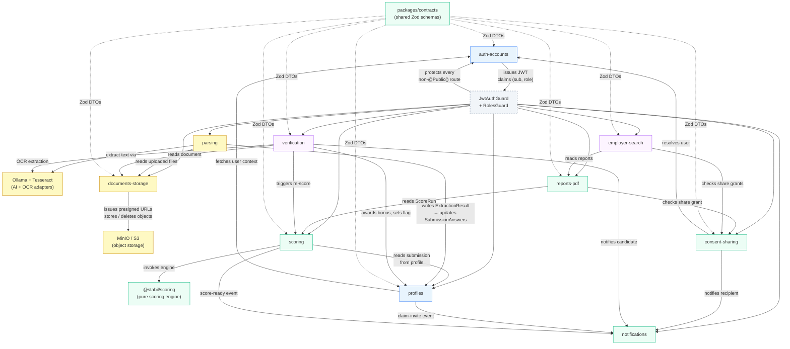

# Stabil — Backend Module Overview & Phase Mapping

> **Status:** Draft v0.1 · **Phase:** cross-cutting · **Owner area:** backend
> **Related:** [backend/README.md](../README.md) · [backend/api-conventions.md](../api-conventions.md) · [architecture/01-overview.md](../../architecture/01-overview.md) · [architecture/04-api-contracts.md](../../architecture/04-api-contracts.md) · [phases/README.md](../../phases/README.md) · [SCOPE.md](../../SCOPE.md)

This document is the **entry point for the NestJS module layer**. It names every module,
states its single responsibility, lists the Prisma entities it owns, maps its key endpoints
to the API contracts doc, shows which delivery phase brings it online, and draws the
inter-module dependency graph. Read this before opening any individual module doc.

---

## 1. Module table

Each row links to the module's own deep-dive doc. Key endpoints are cross-referenced to
[`architecture/04-api-contracts.md`](../../architecture/04-api-contracts.md) by section number.

| Module | Single responsibility | Entities owned | Key endpoints (→ API §) | Phase |
|---|---|---|---|---|
| [**auth-accounts**](./auth-accounts.md) | Register/authenticate users; issue and rotate JWT access + refresh tokens; manage account settings and data-deletion requests | `User`, `RefreshToken`, `DeletionRequest` | `POST /auth/register` · `POST /auth/login` · `POST /auth/refresh` · `POST /auth/logout` · `PATCH /account` · `POST /account/request-data-deletion` (→ API §3, §15) | **0** |
| [**profiles**](./profiles.md) | Own the lifecycle of a candidate profile — create, read, update, and re-score; handle employer-submitted **claimable profiles** and the claim flow | `Profile`, `Submission` | `POST /profiles` · `GET /profiles/:id` · `GET /profiles/mine` · `POST /profiles/employer-submit` · `POST /profiles/:id/claim` · `PUT /profiles/:profileId/submissions/:mode` · `GET /profiles/:profileId/submissions/current` (→ API §4, §5) | **1** |
| [**scoring**](./scoring.md) | Orchestrate score runs by calling `@stabil/scoring`; persist each `ScoreRun`; maintain re-scoring history; enforce idempotency on run creation | `ScoreRun` | `POST /scoring/runs` · `GET /scoring/runs/:id` · `GET /scoring/runs?profileId=` (→ API §6) | **1** |
| [**reports-pdf**](./reports-pdf.md) | Assemble the audience-filtered report view from a `ScoreRun`; suppress `employer-only` parameters for candidate audience; generate and store PDF exports via `@react-pdf/renderer` | `ReportPdfJob` | `GET /profiles/:profileId/report` · `POST /profiles/:profileId/report/pdf` · `GET /profiles/:profileId/report/pdf/:jobId/download` (→ API §13) | **1** |
| [**consent-sharing**](./consent-sharing.md) | Create, track, accept, and revoke per-share consent grants that control employer/recruiter access to a report; enforce the consent gate on every report request | `ShareGrant`, `ConsentAuditLog` | `POST /consent/shares` · `GET /consent/shares` · `DELETE /consent/shares/:id` · `POST /consent/shares/:id/accept` (→ API §11) | **1** |
| [**notifications**](./notifications.md) | Store and deliver in-app (and later email/push) notifications for claim invites, score-ready events, consent requests, and verification outcomes | `Notification` | `GET /notifications` · `POST /notifications/:id/read` · `POST /notifications/read-all` (→ API §16) | **1** (stub) |
| [**documents-storage**](./documents-storage.md) | Issue presigned MinIO upload URLs; record document metadata after upload confirmation; manage document lifecycle (virus scan queue, deletion, retention) | `DocumentMeta` | `POST /documents/upload-url` · `POST /documents/:id/confirm` · `GET /documents?profileId=` · `DELETE /documents/:id` (→ API §9) | **2** |
| [**parsing**](./parsing.md) | Orchestrate resume and document parsing via a provider-agnostic adapter (default: self-hosted Ollama + Tesseract OCR); map extracted fields to `SubmissionAnswers`; fall back gracefully on failure | `ParsedDocument`, `ExtractionResult` | Internal only — triggered after `POST /documents/:id/confirm`; results surfaced via `GET /profiles/:profileId/submissions/current` | **2** |
| [**verification**](./verification.md) | Accept document verification submissions; run OCR field extraction; manage the manual-review admin queue; award bonus points and toggle the Verified User flag on approval | `VerificationRequest` | `POST /verification` · `GET /verification?profileId=` · `POST /verification/:id/approve` · `POST /verification/:id/reject` (→ API §10) | **3** |
| [**employer-search**](./employer-search.md) | Enable multi-candidate search, filter, compare, and shortlist for employer/recruiter users; always scoped to profiles with an accepted share grant | `Shortlist` | `GET /employer/search` · `POST /employer/compare` · Shortlist CRUD (→ API §14) | **4** |

> **Calibration note:** exact scoring weights, bonus point values, and tier band thresholds
> are TBD (SCOPE §13). They are finalized in
> [`architecture/03-scoring-engine.md`](../../architecture/03-scoring-engine.md) before
> Phase 1 exits — not before.

---

## 2. Module dependency graph

The graph shows **runtime call relationships**: an arrow `A → B` means module A calls
into module B's service (not just that it imports a DTO). Guards and the shared
`packages/scoring` / `packages/contracts` packages appear as external nodes.



### Reading the graph

- **Blue (Phase 0–1):** `auth-accounts` and `profiles` — the foundational layer.
  Everything else ultimately depends on an authenticated user context and a profile.
- **Green (Phase 1):** `scoring`, `reports-pdf`, `consent-sharing`, `notifications` —
  the core scoring + report pipeline built in Phase 1.
- **Amber (Phase 2):** `documents-storage` and `parsing` — the upload and LLM
  extraction layer added in Phase 2. `parsing` feeds enriched `SubmissionAnswers` back
  into `profiles`.
- **Purple (Phase 3–4):** `verification` (Phase 3) and `employer-search` (Phase 4) —
  the later-phase modules that layer on top of the stable Phase 1–2 foundation.
- **Dashed arrows (→ `packages/contracts`):** every module consumes the shared Zod
  schemas from `packages/contracts`; the dashes indicate a compile-time import, not a
  runtime service call.

---

## 3. Phase mapping

### Phase 0 — Foundations

**Modules active:** `auth-accounts`

`auth-accounts` is the only module that ships in Phase 0. It establishes:
- User registration and login (email + password, bcrypt hash).
- Role assignment (`candidate | employer | recruiter | admin`).
- JWT access token (15 min) and rotating refresh token (30 days) issuance.
- The global `JwtAuthGuard` and `RolesGuard` that every later module relies on.

No other module is instantiated in Phase 0; they exist only as scaffolded stubs
(empty controllers registered so the DI graph compiles).

### Phase 1 — Core Scoring

**Modules promoted to production:** `profiles`, `scoring`, `reports-pdf`,
`consent-sharing`, `notifications` (stub — in-app only, no email yet)

This is the largest single phase in terms of module surface. The full end-to-end flow
— candidate submits answers → score is computed → report is assembled → employer can
view with consent — is live by Phase 1 exit.

Key sequencing within Phase 1 (see [phases/phase-1-core-scoring.md](../../phases/phase-1-core-scoring.md)):
1. `profiles` — submission save/replace (`PUT /profiles/:id/submissions/:mode`).
2. `scoring` — score run with idempotent `POST /scoring/runs`.
3. `reports-pdf` — audience-filtered `GET /profiles/:id/report`; PDF follows.
4. `consent-sharing` — share grant creation, acceptance, and revocation.
5. `notifications` — in-app claim-invite and score-ready stubs; email deferred.

**Calibration dependency:** the scoring engine's parameter weights and tier band thresholds
(SCOPE §13) must be committed to
[`architecture/03-scoring-engine.md`](../../architecture/03-scoring-engine.md) before the
Phase 1 `scoring` module ships to production.

### Phase 2 — Parsing

**Modules promoted to production:** `documents-storage`, `parsing`

`documents-storage` manages the binary lifecycle — presigned MinIO upload URLs, upload
confirmation, optional virus-scan queue, deletion. It is a prerequisite for `parsing`.

`parsing` is a background orchestrator: it wires the Ollama LLM adapter and Tesseract
OCR adapter into a single pipeline that fires after a document is confirmed (`POST
/documents/:id/confirm` → event → `parsing` picks it up). Extracted fields are mapped
back to `SubmissionAnswers` via `profiles`. Parsing failures are surfaced as a
user-facing message; they never block scoring (SCOPE §2 decision 20).

No new public REST endpoints are added specifically for `parsing`; the module surfaces
its output through the existing `GET /profiles/:profileId/submissions/current` endpoint.

### Phase 3 — Verification

**Modules promoted to production:** `verification`

`verification` is the **Verified User** and **bonus points** module (SCOPE §5). It:
- Accepts a document for verification (`POST /verification`).
- Runs OCR field extraction (via the same Ollama/Tesseract adapter from `parsing`).
- Routes the extracted fields to a **manual admin review queue** (OCR + manual now;
  KYC/government API adapter defined but not wired — SCOPE §13 item 4).
- On approval, awards `bonusPoints` and sets `Profile.isVerifiedUser = true`.
- Triggers a score re-run via `scoring` so the bonus appears in the next
  `GET /profiles/:profileId/report` response.
- Fires a `verification-decided` notification via `notifications`.

`documents-storage` is extended in Phase 3 to enforce a private bucket policy for
government ID documents (short-lived presigned URLs only — see
[05-security-privacy.md](../../architecture/05-security-privacy.md)).

### Phase 4 — Enhancements

**Modules promoted to production:** `employer-search`

`employer-search` is the **multi-candidate comparison and ranking dashboard** (SCOPE §2
decision 23 — "Employer multi-candidate = phased"). It exposes:
- `GET /employer/search` — filter/rank candidates the employer has an accepted share for.
- `POST /employer/compare` — side-by-side employer-audience reports for up to 10 candidates.
- Shortlist CRUD — named candidate lists scoped to the employer/recruiter.

Every result from `employer-search` is gated through `consent-sharing`: a profile only
appears in search/compare results if there is an **accepted** `ShareGrant` between the
candidate and the caller. Sensitive parameter line-items remain governed by the same
audience rules as the single-report endpoint (SCOPE §6.3).

Phase 4 also **extends** (not replaces) two Phase 1–2 modules:
- `scoring` — adds a `testSubScore` slot to the engine input contract for future
  skill-test results (designed-for now, built here — SCOPE §9).
- `parsing` — extends the Ollama adapter pipeline with AI communication analysis on an
  opt-in flag.

---

## 4. Shared conventions reminder

Every NestJS module in this layer follows the same internal structure. Individual module
docs elaborate; this section is the shared baseline.

### 4.1 Module anatomy

```
src/
└── <module-name>/
    ├── <module-name>.module.ts        # NestJS @Module — wires controller, service, repository
    ├── <module-name>.controller.ts    # Route handlers; delegates to service; no business logic
    ├── <module-name>.service.ts       # Orchestration, business rules, domain invariants
    ├── <module-name>.repository.ts    # Prisma queries; data-access only (no business logic)
    ├── dto/
    │   ├── <verb>-<noun>.request.ts   # Input DTO (Zod schema → inferred type)
    │   └── <verb>-<noun>.response.ts  # Output DTO (mirrors packages/contracts shape)
    └── events/
        └── <noun>.<verb>.event.ts     # Internal NestJS EventEmitter2 events (fire-and-forget)
```

The `controller → service → repository` layering is strict: controllers call only the
service, the service calls only the repository (and peer services it explicitly depends on),
and the repository calls only Prisma. Cross-module calls always go through the peer's
**service**, never directly to its repository.

### 4.2 Guards

```ts
// Applied globally at the app level in main.ts / app.module.ts
@UseGuards(JwtAuthGuard)   // verifies access token; populates request.user
@UseGuards(RolesGuard)     // checks @Roles(...) decorator; 403 if mismatch

// Routes that do not need authentication are decorated:
@Public()  // tells JwtAuthGuard to skip; e.g. POST /auth/register, POST /auth/login
```

Ownership checks (e.g. "this profile belongs to me") are performed inside the service
layer, not the guard. A failed ownership check returns `403 forbidden` (not `404`)
unless the resource is genuinely unknown, in which case `404 not-found` is correct.

See [`backend/api-conventions.md`](../api-conventions.md) for the full guard + role
matrix and [`architecture/05-security-privacy.md`](../../architecture/05-security-privacy.md)
for the sensitive-attribute access rules.

### 4.3 DTOs and validation

- All request/response shapes live in `packages/contracts` as **Zod schemas**.
  Module-local `dto/` files `import { z } from "zod"` and re-export `z.infer<typeof Schema>`
  for use in controller method signatures.
- A global `ZodValidationPipe` transforms and validates incoming bodies/params/queries.
  Failure → `422 validation-failed` with `errors[]` (RFC 9457 problem+json — see API §1.5).
- Response DTOs are `class-transformer`-free; services return plain objects matching the
  Zod-inferred type; the controller passes them straight to NestJS response.

### 4.4 Internal events

Modules communicate asynchronously (without tight coupling) via **NestJS EventEmitter2**
events. Events are fire-and-forget; the emitting module does not wait for the handler.

| Event | Emitted by | Consumed by | Purpose |
|-------|------------|-------------|---------|
| `profile.claim-invite` | `profiles` | `notifications` | Notify a candidate that a claimable profile was created for them |
| `score.run-completed` | `scoring` | `notifications` | Notify candidate that their score is ready |
| `document.confirmed` | `documents-storage` | `parsing` | Trigger async extraction pipeline after upload confirmation |
| `verification.decided` | `verification` | `notifications`, `scoring` | Notify candidate of review outcome; trigger re-score on approval |
| `consent.share-created` | `consent-sharing` | `notifications` | Notify employer/recruiter of a new share grant |

Events are typed: each `<noun>.<verb>.event.ts` exports an interface; the emitter and
handler both import from it (no stringly-typed `emit("some-string", ...)`).

### 4.5 Error handling

All unhandled exceptions flow through a global `HttpExceptionFilter` that converts them
to RFC 9457 `application/problem+json`. Services throw `HttpException` subclasses
(`NotFoundException`, `ForbiddenException`, etc.) with a slug and detail message.
Never throw raw `Error` from a controller or service — always use the NestJS exception
classes or the shared `StabilException` wrapper.

### 4.6 IDs and timestamps

- All primary keys are **UUID v7** (`uuidv7()` from `packages/core`). UUID v7 is
  time-sortable; use it everywhere; never use auto-increment integers for externally
  exposed IDs.
- Timestamps are stored as PostgreSQL `TIMESTAMPTZ` and serialized to **ISO-8601 UTC**
  (`2026-06-06T12:34:56.000Z`). The Prisma client config sets `DATE → string` via a
  custom `$extends` transformer; there are no `Date` objects in DTOs.
- Score totals and bonus points are **integers** (`Math.round`). No floats cross the
  API boundary for points/scores (SCOPE §4.1).

---

## 5. Module doc index

| Doc | Module | Phase |
|-----|--------|-------|
| [auth-accounts.md](./auth-accounts.md) | `AuthAccountsModule` | 0 |
| [profiles.md](./profiles.md) | `ProfilesModule` | 1 |
| [scoring.md](./scoring.md) | `ScoringModule` | 1 |
| [reports-pdf.md](./reports-pdf.md) | `ReportsPdfModule` | 1 |
| [consent-sharing.md](./consent-sharing.md) | `ConsentSharingModule` | 1 |
| [notifications.md](./notifications.md) | `NotificationsModule` | 1 (stub → extended in 3) |
| [documents-storage.md](./documents-storage.md) | `DocumentsStorageModule` | 2 |
| [parsing.md](./parsing.md) | `ParsingModule` | 2 |
| [verification.md](./verification.md) | `VerificationModule` | 3 |
| [employer-search.md](./employer-search.md) | `EmployerSearchModule` | 4 |

See [`phases/README.md`](../../phases/README.md) for the full roadmap and the
cross-cutting dependency graph between phases. See
[`architecture/04-api-contracts.md`](../../architecture/04-api-contracts.md) for the
complete HTTP contract including request/response DTO shapes, status codes, and example
payloads for every endpoint listed above.
