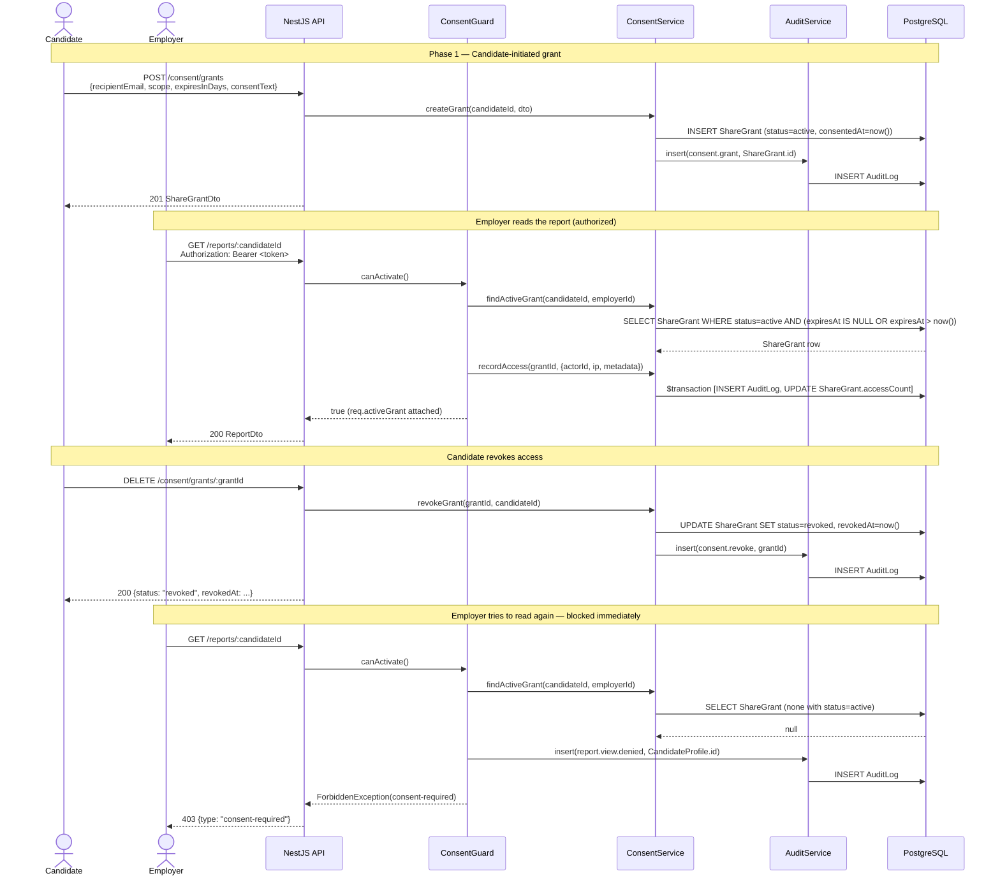
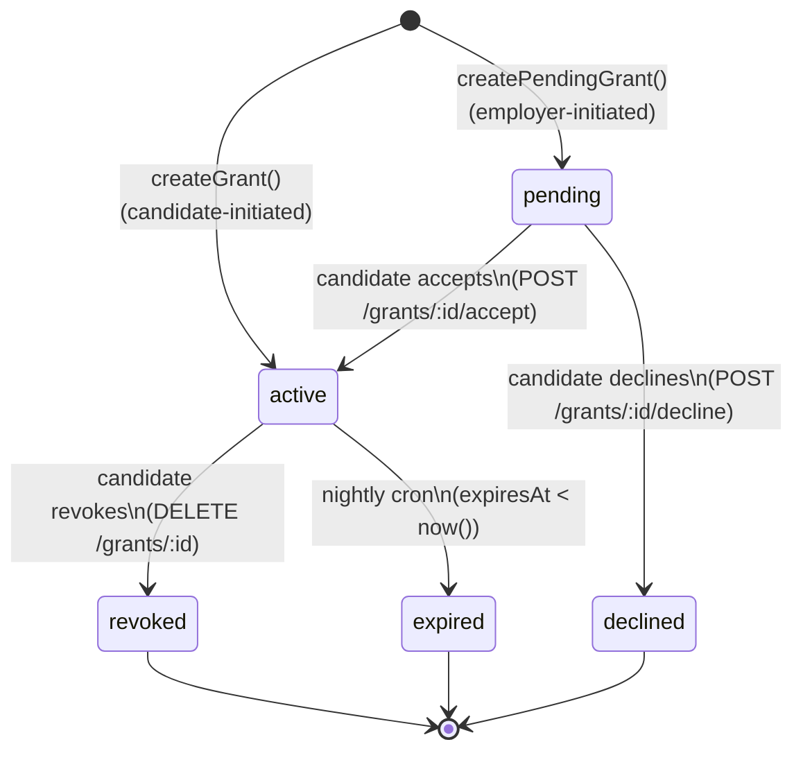

# Consent & Sharing Module

> **Status:** Draft v0.1 · **Phase:** 1 · **Owner area:** backend
> **Related:**
> [architecture/05-security-privacy.md](../../architecture/05-security-privacy.md) ·
> [backend/modules/reports-pdf.md](./reports-pdf.md) ·
> [backend/modules/employer-search.md](./employer-search.md) ·
> [frontend/pages/account-consent-settings.md](../../frontend/pages/account-consent-settings.md) ·
> [architecture/02-data-model.md](../../architecture/02-data-model.md) ·
> [architecture/04-api-contracts.md](../../architecture/04-api-contracts.md) ·
> [SCOPE.md](../../SCOPE.md)

This module owns all logic for **explicit per-share consent** (SCOPE §6.2, §18): creating a `ShareGrant`, listing and revoking grants, accepting pending invitations, and enforcing access via the `ConsentGuard`. It is the **single enforcement point** that prevents any employer or recruiter from reading a candidate's report without a valid, unexpired, unrevoked grant. It also maintains the immutable `AuditLog` of every report view so candidates always know who has seen their data (SCOPE §11). See [architecture/05-security-privacy.md §3](../../architecture/05-security-privacy.md) for the security framing; this document covers implementation.

---

## 1. Responsibility

> Manage the full lifecycle of explicit per-share consent and unconditionally block all employer and recruiter report reads that do not have a valid, live `ShareGrant`.

This module does **not** assemble report content — that is [reports-pdf.md](./reports-pdf.md). It does **not** handle employer candidate search — that is [employer-search.md](./employer-search.md). Its contract with those modules is: they call `ConsentGuard`-protected routes; they receive a resolved `ShareGrant` on `req.activeGrant` if they proceed at all.

---

## 2. Public API

All routes are under `/api/v1`. Auth is bearer JWT (see [architecture/04-api-contracts.md §1.3](../../architecture/04-api-contracts.md)). Errors use RFC 9457 `application/problem+json`. IDs are UUID v7.

### 2.1 Create a ShareGrant (candidate grants access)

```
POST /api/v1/consent/grants
```

**Roles:** `candidate` only.

**Request body** (`CreateShareGrantDto`):

```typescript
// packages/contracts/src/consent.ts
import { z } from 'zod';

export const ConsentScope = z.enum([
  'full-report',        // all candidate-visible params + employer-only in employer view
  'summary-only',       // tier label + overall score only
  'verification-status', // Verified User badge only
]);
export type ConsentScope = z.infer<typeof ConsentScope>;

export const CreateShareGrantSchema = z.object({
  /**
   * Email of the employer/recruiter user being granted access.
   * Must already have a Stabil account with role employer or recruiter.
   */
  recipientEmail:  z.string().email(),
  recipientRole:   z.enum(['employer', 'recruiter']),
  /** Optional display name of the org (stored for candidate's consent list). */
  orgName:         z.string().max(200).optional(),
  scope:           ConsentScope,
  /**
   * Days until the grant expires. null = indefinite (until candidate revokes).
   * Maximum 365. The backend computes expiresAt = now() + expiresInDays days.
   */
  expiresInDays:   z.number().int().min(1).max(365).nullable(),
  /**
   * The exact disclosure text shown to the candidate in the UI at the moment
   * they clicked "Confirm & Share". Stored verbatim in ShareGrant.consentText
   * for legal evidence (SCOPE §11; see architecture/05-security-privacy.md §3.2).
   */
  consentText:     z.string().min(1).max(2000),
});
export type CreateShareGrantDto = z.infer<typeof CreateShareGrantSchema>;
```

**Response `201 Created`** (`ShareGrantDto`):

```typescript
export const ShareGrantDto = z.object({
  id:              z.string().uuid(),
  candidateProfileId: z.string().uuid(),
  recipientEmail:  z.string().email(),
  recipientRole:   z.enum(['employer', 'recruiter']),
  orgName:         z.string().nullable(),
  scope:           ConsentScope,
  status:          z.enum(['active', 'pending', 'revoked', 'expired', 'declined']),
  grantedAt:       z.string().datetime(),
  expiresAt:       z.string().datetime().nullable(),
  revokedAt:       z.string().datetime().nullable(),
  lastAccessedAt:  z.string().datetime().nullable(),
  accessCount:     z.number().int(),
});
export type ShareGrantDto = z.infer<typeof ShareGrantDto>;
```

**Errors:**

| Status | `type` | When |
|--------|--------|------|
| `404` | `recipient-not-found` | No Stabil account for `recipientEmail` |
| `409` | `grant-already-active` | An active grant already exists for this candidate + recipient |
| `409` | `account-pending-deletion` | The candidate's account is `pending-deletion` |
| `422` | `validation-error` | Body fails schema validation |

---

### 2.2 List ShareGrants (candidate views their consents)

```
GET /api/v1/consent/grants
```

**Roles:** `candidate` (own grants only).

**Query params:**

| Param | Type | Default | Description |
|-------|------|---------|-------------|
| `status` | `active \| revoked \| expired \| pending \| all` | `all` | Filter by grant status |
| `limit` | `integer 1–100` | `25` | Page size |
| `cursor` | `string` | — | Opaque cursor for keyset pagination (on `grantedAt DESC, id DESC`) |

**Response `200 OK`:**

```typescript
export const ShareGrantListDto = z.object({
  items:      z.array(ShareGrantDto),
  nextCursor: z.string().nullable(), // null = no more pages
  total:      z.number().int(),      // total matching (for the filtered status set)
});
```

---

### 2.3 Revoke a ShareGrant (candidate withdraws access)

```
DELETE /api/v1/consent/grants/:grantId
```

**Roles:** `candidate` (must own the grant's `candidateProfileId`).

**Path param:** `grantId` — UUID v7 of the `ShareGrant`.

**Response `200 OK`:**

```typescript
export const RevokeGrantResultDto = z.object({
  id:        z.string().uuid(),
  status:    z.literal('revoked'),
  revokedAt: z.string().datetime(),
});
```

Revocation takes effect **immediately**: the next call from the employer/recruiter to any protected route will receive `403 Forbidden`. No polling, no grace window. See §4 (ConsentGuard) for how this is enforced.

**Errors:**

| Status | `type` | When |
|--------|--------|------|
| `403` | `not-grant-owner` | Authenticated candidate does not own this grant |
| `404` | `grant-not-found` | No grant with that ID |
| `409` | `grant-already-inactive` | Grant is already `revoked` or `expired` |

---

### 2.4 Accept a Pending ShareGrant (candidate accepts an employer-initiated request)

```
POST /api/v1/consent/grants/:grantId/accept
```

**Roles:** `candidate`.

Some flows allow employers to initiate a share request (e.g. after submitting a candidate profile). The grant is created in `pending` status; the candidate must explicitly accept it before access is granted. This implements the "pending → active" transition.

**Request body:**

```typescript
export const AcceptGrantSchema = z.object({
  consentText: z.string().min(1).max(2000), // disclosure text shown at acceptance
});
```

**Response `200 OK`:** full `ShareGrantDto` with `status: "active"`.

**Errors:**

| Status | `type` | When |
|--------|--------|------|
| `403` | `not-grant-owner` | Grant does not belong to this candidate |
| `404` | `grant-not-found` | — |
| `409` | `grant-not-pending` | Grant is not in `pending` status (already active, revoked, etc.) |

---

### 2.5 View Access Log (candidate reads who viewed their report)

```
GET /api/v1/consent/grants/:grantId/access-log
```

**Roles:** `candidate` (own grant only).

Returns the audit events attached to a specific grant — every time the employer accessed the report under this grant. This is a filtered projection of `AuditLog` rows where `entityType = ShareGrant` and `entityId = grantId` and `action = report.viewed`.

**Query params:** `limit` (default 25, max 100), `cursor`.

**Response `200 OK`:**

```typescript
export const GrantAccessLogEntryDto = z.object({
  id:          z.string().uuid(),
  action:      z.literal('report.viewed'),
  actorEmail:  z.string().nullable(),
  actorOrgName: z.string().nullable(),
  scope:       ConsentScope,
  occurredAt:  z.string().datetime(),
  ipAddress:   z.string().nullable(),
});

export const GrantAccessLogDto = z.object({
  items:      z.array(GrantAccessLogEntryDto),
  nextCursor: z.string().nullable(),
});
```

A second, broader endpoint powers the candidate's Access Log tab which spans all grants:

```
GET /api/v1/account/audit-log
```

See [frontend/pages/account-consent-settings.md §5.3](../../frontend/pages/account-consent-settings.md) for the full list of event types surfaced in that view.

---

## 3. Data Models Touched

### 3.1 ShareGrant (primary model)

Full Prisma definition from [architecture/02-data-model.md §4.7](../../architecture/02-data-model.md):

```prisma
/** Per-share consent lifecycle (SCOPE §6.2). */
enum ShareStatus {
  pending   // employer initiated; awaiting candidate acceptance
  active    // consent granted, share live
  revoked   // candidate revoked — blocks access immediately
  expired   // expiresAt passed (set by nightly cron job)
  declined  // candidate refused an employer-initiated request
}

model ShareGrant {
  id                 String           @id @db.Uuid  // UUID v7 (app-generated)
  candidateProfileId String           @db.Uuid
  candidateProfile   CandidateProfile @relation(fields: [candidateProfileId], references: [id], onDelete: Cascade)

  // The grant targets exactly one org, of one audience kind.
  audience       Audience      // employer | recruiter
  employerOrgId  String?       @db.Uuid
  recruiterOrgId String?       @db.Uuid
  employerOrg    EmployerOrg?  @relation("ShareEmployer", fields: [employerOrgId], references: [id])
  recruiterOrg   RecruiterOrg? @relation("ShareRecruiter", fields: [recruiterOrgId], references: [id])

  // Who within the org was directly addressed (the individual user).
  recipientUserId String?   @db.Uuid
  recipientEmail  String    // resolved at grant time; stored for display and audit

  // Scope of data included in the share.
  scope     String[]    // ConsentScope values: "full-report" | "summary-only" | "verification-status"
  status    ShareStatus @default(pending)
  expiresAt DateTime?   // null = no expiry until revoked

  // Consent evidence (SCOPE §11; legal record).
  consentedAt DateTime?
  revokedAt   DateTime?
  consentIp   String?
  consentText String?   // exact disclosure text shown when candidate clicked Confirm

  // Denormalized read-access counters (updated by ConsentGuard on each successful read).
  accessCount    Int       @default(0)
  lastAccessedAt DateTime?

  reportArtifacts ReportArtifact[]

  createdAt DateTime @default(now())
  updatedAt DateTime @updatedAt

  @@index([candidateProfileId, status])
  @@index([employerOrgId, status])
  @@index([recruiterOrgId, status])
  @@index([expiresAt])           // expire cron job
  @@index([recipientUserId])     // "which grants involve me" (employer lookup)
}
```

**Field notes:**

- `audience`: one of `employer | recruiter`. The `candidate` audience value from the `Audience` enum is never used in `ShareGrant` — a candidate never grants to themselves.
- `scope`: stored as a `String[]` so future scope values can be added without a migration. The `ConsentScope` enum in `packages/contracts` is the canonical allowlist; the service validates that every element of `scope` is a valid `ConsentScope` value.
- `consentText`: the verbatim disclosure string shown in the UI (see [frontend/pages/account-consent-settings.md §5.2.3](../../frontend/pages/account-consent-settings.md)). Stored for legal evidence — if a consent is ever challenged, we can prove exactly what the candidate saw.
- `accessCount` / `lastAccessedAt`: denormalized counters incremented inside the same database transaction as the `AuditLog` insert on every successful report read (no separate update query needed at read time).

### 3.2 AuditLog (append-only access record)

Full Prisma definition from [architecture/02-data-model.md §4.7](../../architecture/02-data-model.md):

```prisma
model AuditLog {
  id        String  @id @db.Uuid
  actorId   String? @db.Uuid  // null = system/cron
  actor     User?   @relation("AuditActor", fields: [actorId], references: [id])

  action     String  // see §5 for the full event-type registry
  entityType String  // "ShareGrant" | "CandidateProfile" | "Document" | ...
  entityId   String  @db.Uuid
  metadata   Json?   // {scope, audience, orgName, parameterKeys?, ...}
  ip         String?

  createdAt DateTime @default(now())  // append-only; no updatedAt

  @@index([entityType, entityId])
  @@index([actorId])
  @@index([action, createdAt])
}
```

**Consent-specific `action` values used by this module:**

| `action` | `entityType` | `entityId` | Triggered by |
|----------|-------------|------------|--------------|
| `consent.grant` | `ShareGrant` | grant id | `POST /consent/grants` success |
| `consent.accept` | `ShareGrant` | grant id | `POST /consent/grants/:id/accept` success |
| `consent.revoke` | `ShareGrant` | grant id | `DELETE /consent/grants/:id` success |
| `consent.decline` | `ShareGrant` | grant id | Candidate declines a pending request |
| `consent.expire` | `ShareGrant` | grant id | Nightly cron job |
| `report.viewed` | `ShareGrant` | grant id | `ConsentGuard` on every successful report read |

`AuditLog` rows are **append-only**. The `AuditService` exposes only an `insert` method; no `update` or `delete` operations are wired to this table. Row-level security (or application-level enforcement) prevents modification. Retained minimum 2 years; anonymised on account deletion per [architecture/05-security-privacy.md §4.4](../../architecture/05-security-privacy.md).

---

## 4. The ConsentGuard — Single Enforcement Point

**Architecture rule:** The `ConsentGuard` is the **only** place in the codebase that verifies a live `ShareGrant` before allowing an employer or recruiter to read candidate report data. No module may short-circuit or bypass it.

### 4.1 Guard implementation

```typescript
// backend/src/common/guards/consent.guard.ts
import {
  Injectable,
  CanActivate,
  ExecutionContext,
  ForbiddenException,
  NotFoundException,
} from '@nestjs/common';
import { ConsentService } from '../../modules/consent/consent.service';
import { AuditService } from '../../modules/audit/audit.service';
import { Request } from 'express';

@Injectable()
export class ConsentGuard implements CanActivate {
  constructor(
    private readonly consentService: ConsentService,
    private readonly auditService: AuditService,
  ) {}

  async canActivate(context: ExecutionContext): Promise<boolean> {
    const req = context.switchToHttp().getRequest<Request>();
    const user = req.user as { id: string; role: string };
    const { candidateId } = req.params;

    // ConsentGuard is only meaningful for employer/recruiter reads.
    // Candidate reading their own report bypasses this guard (handled by
    // the resource-ownership check in the controller — a candidate can
    // only call their own :candidateId routes).
    if (user.role === 'candidate' || user.role === 'admin') {
      return true;
    }

    if (!candidateId) {
      throw new NotFoundException('candidateId param required');
    }

    // Look up the most-recently-granted active share for this pair.
    const grant = await this.consentService.findActiveGrant(
      candidateId,
      user.id,
    );

    if (!grant) {
      // Write a "denied" audit event so the candidate knows an employer tried.
      await this.auditService.insert({
        actorId:    user.id,
        action:     'report.view.denied',
        entityType: 'CandidateProfile',
        entityId:   candidateId,
        metadata:   { reason: 'no-active-grant' },
        ip:         req.ip,
      });
      throw new ForbiddenException({
        type:   'consent-required',
        title:  'No active consent',
        detail: 'The candidate has not granted you access to this report.',
        status: 403,
      });
    }

    // Attach the resolved grant so downstream services (reports, PDF, search)
    // can use it for scope filtering and artifact linkage without re-querying.
    (req as any).activeGrant = grant;

    // Write the "report.viewed" audit log entry and increment the access counter
    // in a single atomic transaction (ShareGrant.accessCount, lastAccessedAt).
    await this.consentService.recordAccess(grant.id, {
      actorId: user.id,
      ip:      req.ip,
      metadata: {
        scope:    grant.scope,
        audience: user.role,
      },
    });

    return true;
  }
}
```

### 4.2 findActiveGrant logic

```typescript
// backend/src/modules/consent/consent.service.ts (excerpt)
async findActiveGrant(
  candidateProfileId: string,
  requestorUserId: string,
): Promise<ShareGrant | null> {
  const now = new Date();
  return this.prisma.shareGrant.findFirst({
    where: {
      candidateProfileId,
      recipientUserId: requestorUserId,
      status: 'active',
      // Guard against expired grants that the cron job hasn't swept yet.
      OR: [
        { expiresAt: null },
        { expiresAt: { gt: now } },
      ],
    },
    orderBy: { createdAt: 'desc' },
  });
}
```

The `OR: [{ expiresAt: null }, { expiresAt: { gt: now } }]` clause is critical: it handles the window between a grant's wall-clock expiry and the next cron sweep. Even if the cron is delayed, the guard will block access immediately once `expiresAt` has passed.

### 4.3 Routes protected by ConsentGuard

`ConsentGuard` is applied **in addition to** `JwtAuthGuard` and `RolesGuard` on every route that delivers candidate report data to an employer or recruiter. Applying both is done at the controller level:

```typescript
// backend/src/modules/reports/reports.controller.ts (example)
@UseGuards(JwtAuthGuard, RolesGuard, ConsentGuard)
@Roles('employer', 'recruiter')
@Get('reports/:candidateId')
async getReport(@Param('candidateId') candidateId: string, @Req() req: Request) {
  // req.activeGrant is guaranteed non-null by ConsentGuard at this point.
  return this.reportsService.buildReport(candidateId, req.activeGrant, req.user);
}
```

| Protected route | Method | Description |
|----------------|--------|-------------|
| `/api/v1/reports/:candidateId` | `GET` | Employer/recruiter full report view |
| `/api/v1/reports/:candidateId/pdf` | `GET` | Employer/recruiter PDF export |
| `/api/v1/candidates/:candidateId/score` | `GET` | Score + tier read for employer/recruiter |
| `/api/v1/candidates/:candidateId/verification` | `GET` | Verified User status for employer/recruiter |
| Any future comparison or ranking route | `GET` | Phase 4 multi-candidate view ([employer-search.md](./employer-search.md)) |

**No employer or recruiter route reads candidate data before `ConsentGuard` returns `true`.** This is enforced by code review gate: the NestJS `@UseGuards(ConsentGuard)` decorator must be present on every controller method in the `employer`/`recruiter` role group that reads a `CandidateProfile`, `ScoreRun`, or `ReportArtifact`.

### 4.4 Guard ordering and defence-in-depth

The guard chain order is:

```
JwtAuthGuard → RolesGuard → ConsentGuard → Controller method
```

- `JwtAuthGuard` verifies the access token is valid and unexpired. Failure → `401`.
- `RolesGuard` confirms the caller has an allowed role for the route. Failure → `403`.
- `ConsentGuard` confirms a live `ShareGrant` exists. Failure → `403 consent-required`.

This order is load-bearing: `ConsentGuard` can safely assume `req.user` is populated (done by `JwtAuthGuard`).

A separate serialization interceptor (see [architecture/05-security-privacy.md §1.3](../../architecture/05-security-privacy.md) Layer 2) strips `employer-only` fields from the response if the role is `candidate`. That layer is defence-in-depth only — it must **never** be the sole barrier.

---

## 5. Audit Log of Report Views

Every successful report access by an employer or recruiter produces an `AuditLog` row. The `recordAccess` call in `ConsentGuard` (§4.1) writes this row and updates the denormalized counters in the same Prisma `$transaction`:

```typescript
// backend/src/modules/consent/consent.service.ts
async recordAccess(
  grantId: string,
  ctx: { actorId: string; ip: string | undefined; metadata: Record<string, unknown> },
): Promise<void> {
  await this.prisma.$transaction([
    // Append audit log entry.
    this.prisma.auditLog.create({
      data: {
        id:         uuidv7(),
        actorId:    ctx.actorId,
        action:     'report.viewed',
        entityType: 'ShareGrant',
        entityId:   grantId,
        metadata:   ctx.metadata,
        ip:         ctx.ip ?? null,
      },
    }),
    // Increment denormalized counters on the grant.
    this.prisma.shareGrant.update({
      where: { id: grantId },
      data: {
        accessCount:    { increment: 1 },
        lastAccessedAt: new Date(),
      },
    }),
  ]);
}
```

**What the audit log captures:**

| Field | Value |
|-------|-------|
| `action` | `"report.viewed"` |
| `entityType` | `"ShareGrant"` |
| `entityId` | UUID of the `ShareGrant` used to authorize this read |
| `actorId` | UUID of the employer/recruiter `User` |
| `metadata.scope` | e.g. `["full-report"]` |
| `metadata.audience` | `"employer"` or `"recruiter"` |
| `ip` | request IP (IPv4 or IPv6) |
| `createdAt` | UTC timestamp of the access |

Candidates can query a filtered view of these events at `GET /api/v1/account/audit-log` and per-grant at `GET /api/v1/consent/grants/:grantId/access-log`. See [frontend/pages/account-consent-settings.md §5.3](../../frontend/pages/account-consent-settings.md) for the UI.

---

## 6. Share Links and Invitations

### 6.1 Candidate-initiated share (primary flow)

A candidate opens the Consent tab, clicks "Share my report", enters the recipient's email and role, selects scope and expiry, and clicks "Confirm & Share". The frontend calls `POST /api/v1/consent/grants`. No share link or invite token is generated — the grant is looked up by `recipientUserId` in the guard.

### 6.2 Employer-initiated share request (invite flow)

An employer or recruiter submits a candidate profile (SCOPE §6.1 employer-driven submission). As part of that flow the `ProfilesService` calls `ConsentService.createPendingGrant(...)`, creating a `ShareGrant` with `status: pending`. A `Notification` row is created for the candidate with `kind: "consent-ask"`.

The candidate sees this in the Consent tab as an incoming request. They click "Accept" → `POST /api/v1/consent/grants/:id/accept` → the grant transitions to `status: active` and the candidate's `consentedAt` timestamp and `consentText` are recorded. The employer's next API call now passes the `ConsentGuard`.

If the candidate clicks "Decline" → `POST /api/v1/consent/grants/:id/decline` → status becomes `declined` and an audit event is written.

### 6.3 Direct share links (Phase 1 deferral)

Generating a tokenised URL that an employer can click to request access is a usability enhancement. Phase 1 ships the manual email-lookup grant and the pending-request flow described above. Share links with embedded JWT tokens are a Phase 1 polish or Phase 2 item and will be documented once the implementation is finalized.

---

## 7. Dependencies

| Dependency | Direction | Reason |
|-----------|-----------|--------|
| `PrismaService` | uses | `ShareGrant` and `AuditLog` persistence |
| `UsersService` | uses | Resolves `recipientEmail` → `User.id` + validates recipient role at grant creation |
| `AuditService` | uses | Writes `AuditLog` entries; called by `ConsentGuard.recordAccess` and by service methods |
| `NotificationsModule` | uses | Sends `consent-ask` notification to candidate when an employer-initiated grant is created; sends `report.viewed` email notification if candidate has opted in |
| `ProfilesModule` | used by | Calls `ConsentService.createPendingGrant` during employer-driven profile submission |
| `ReportsModule` | used by | All report endpoints apply `ConsentGuard`; `req.activeGrant` flows into report assembly for scope filtering and `ReportArtifact.shareGrantId` |
| `EmployerSearchModule` | used by | Phase 4 search routes will also apply `ConsentGuard` ([employer-search.md](./employer-search.md)) |

---

## 8. Key Flows

### 8.1 Sequence: Candidate grants → Employer views → Candidate revokes → Access blocked



### 8.2 Grant lifecycle state machine



---

## 9. Validation & Errors

### 9.1 Input validation (Zod pipe)

All incoming DTOs are validated by a NestJS Zod validation pipe registered globally. Failures produce `422 Unprocessable Entity` with RFC 9457 body:

```json
{
  "type": "validation-error",
  "title": "Request body validation failed",
  "status": 422,
  "detail": "recipientEmail: Invalid email; expiresInDays: Expected number, received null",
  "errors": [
    { "path": ["recipientEmail"], "message": "Invalid email" },
    { "path": ["expiresInDays"], "message": "Expected number, received null" }
  ]
}
```

### 9.2 Business-rule errors

| Scenario | HTTP | `type` | `detail` |
|----------|------|--------|---------|
| Recipient email not registered in Stabil | 404 | `recipient-not-found` | No account found for this email; ask the recipient to sign up first. |
| Recipient's registered role does not match `recipientRole` | 409 | `recipient-role-mismatch` | The account at this email is registered as `candidate`, not `employer`. |
| An active or pending grant already exists for this pair | 409 | `grant-already-active` | An active share already exists for this recipient. Revoke it before creating a new one. |
| Grant not found | 404 | `grant-not-found` | No grant with this ID. |
| Requester is not the grant owner | 403 | `not-grant-owner` | You can only manage grants you created. |
| Grant is not in a state that permits the operation | 409 | `grant-not-pending` / `grant-already-inactive` | The grant is already `{status}` and cannot be `{operation}`. |
| Candidate account is pending deletion | 409 | `account-pending-deletion` | Your account is scheduled for deletion; sharing is disabled. |
| Employer access blocked by guard | 403 | `consent-required` | The candidate has not granted you access to this report. |

### 9.3 Expiry guard edge case

If `expiresAt` is in the past when a request arrives (i.e. the grant has expired at the wall-clock level but the nightly cron has not yet updated `status` to `expired`), `findActiveGrant` filters on `expiresAt > now()` and returns `null`. The guard treats this identically to a revoked grant — `403 consent-required`. The cron sweep then updates the `status` column on its next run (idempotent).

---

## 10. Security

This module is the **core privacy control** for Stabil. Every design decision below derives from SCOPE §6.2 ("Explicit per-share consent") and is elaborated in [architecture/05-security-privacy.md §3](../../architecture/05-security-privacy.md).

### 10.1 Consent is not implied

- A candidate creating a profile does **not** grant any employer access.
- An employer submitting a candidate's profile does **not** create an active grant — only a `pending` one that the candidate must accept.
- Accepting Stabil's Terms of Service does **not** count as consent. SCOPE §6.2 requires an **explicit per-share affirmative action** for each individual employer/recruiter.

### 10.2 Revocation is immediate

When a candidate revokes a grant, `ShareGrant.status` is set to `revoked` and `revokedAt` is recorded. Because `findActiveGrant` queries `status = active` (not a cached value), the very next API call from that employer will receive `403`. There is no TTL cache on consent state. This is intentional and non-negotiable.

### 10.3 Scope enforcement

`scope` restricts what report data is returned:

- `summary-only`: the reports module returns only `{ total, tier, displayName }` — no `breakdown` array is included in the response.
- `verification-status`: only the `verifiedUser` boolean is returned.
- `full-report`: full audience-filtered report (still subject to the `employer-only` visibility layer in [architecture/05-security-privacy.md §1.3](../../architecture/05-security-privacy.md)).

Scope is enforced in `ReportsService.buildReport(candidateId, activeGrant, user)` using `activeGrant.scope` from `req.activeGrant`. The `ConsentGuard` attaches the grant; the reports module reads it — the two modules never need to re-query the same row.

### 10.4 Insecure direct object reference prevention

Route params always include `candidateId`. The `ConsentGuard` uses both `candidateId` (from params) and `req.user.id` (from JWT) to find the grant. An employer cannot read a report for a candidate they were never granted access to, even if they guess a valid `candidateId` UUID. Guessing is further mitigated because UUIDs are v7 (time-sortable but not guessable from a known prefix without the microsecond timestamp entropy).

### 10.5 Audit trail is append-only

The `AuditService` has no `update` or `delete` methods wired to `AuditLog`. Rows written by this module (consent events, report views, denied accesses) survive account deletion in anonymised form (candidate name replaced with hash) for a minimum of 2 years, per [architecture/05-security-privacy.md §9.3](../../architecture/05-security-privacy.md).

### 10.6 Consent text as legal evidence

`ShareGrant.consentText` stores the exact disclosure string rendered in the frontend at the moment the candidate clicked "Confirm & Share". This is a legal evidence requirement: if consent is challenged, the platform can prove what the candidate was told. The frontend always sends `consentText` in the request body; the backend validates it is non-empty and stores it verbatim. See [frontend/pages/account-consent-settings.md §5.2.3](../../frontend/pages/account-consent-settings.md) and [architecture/05-security-privacy.md §3.5](../../architecture/05-security-privacy.md) for the UI contract.

### 10.7 Sensitive attribute disclosure in the share flow

When the grant scope is `full-report` and the recipient role is `employer` or `recruiter`, the consent flow **must disclose** that the employer view includes attributes not shown to the candidate (age, marital status), per SCOPE §6.3. This requirement is enforced at the frontend level — the disclosure banner is non-dismissible and the `consentText` stored in the grant must include this disclosure. The `ConsentService` does not validate the content of `consentText` (it is opaque to the backend), but the frontend template must include it.

---

## 11. Permissions

From [architecture/05-security-privacy.md §8](../../architecture/05-security-privacy.md) (RBAC matrix), the relevant rows:

| Action | Candidate | Employer | Recruiter | Admin |
|--------|:---------:|:--------:|:---------:|:-----:|
| Create a ShareGrant (candidate-initiated) | own only | — | — | admin panel |
| Accept a pending ShareGrant | own only | — | — | — |
| Decline a pending ShareGrant | own only | — | — | — |
| Revoke an active ShareGrant | own only | — | — | admin panel |
| List own ShareGrants | own only | — | — | — |
| View per-grant access log | own only | — | — | — |
| View full AuditLog | — | — | — | admin only |
| Access report (reads `ConsentGuard`) | — | consented | consented | bypass |

"consented" = an active, unexpired, unrevoked `ShareGrant` must exist. "admin panel" = admin can create/revoke grants on behalf of candidates for support purposes, with an audit trail.

---

## 12. Phased Implementation

### Phase 1 — Full consent lifecycle (ships with core scoring, SCOPE §9)

All features in this document are **Phase 1**. Per SCOPE §9, Phase 1 ships the core scoring engine and report alongside the explicit per-share consent mechanism — these are inseparable. No employer or recruiter can view any report without this module in place.

**Phase 1 sub-tasks:**

- [ ] `ShareGrant` Prisma model, migration, and seed data for tests.
- [ ] `ConsentService`: `createGrant`, `findActiveGrant`, `revokeGrant`, `recordAccess`, `createPendingGrant`, `acceptGrant`, `declineGrant`.
- [ ] `ConsentGuard` wired to all employer/recruiter report routes.
- [ ] `AuditService` insert path (no read/update/delete).
- [ ] `POST /consent/grants`, `GET /consent/grants`, `DELETE /consent/grants/:id`, `POST /consent/grants/:id/accept`.
- [ ] `GET /consent/grants/:grantId/access-log` (per-grant audit view for candidate).
- [ ] `GET /account/audit-log` (full candidate-visible audit view — candidate-filtered projection).
- [ ] Nightly cron job: sweep `ShareGrant` rows where `expiresAt < now()` and `status = active` → set `status = expired`, write `consent.expire` audit event.
- [ ] Integration tests (see §13).

### Phase 2 and beyond

- **Share links with tokens** (a tokenised URL that an employer can click to request candidate access) — usability enhancement, not a security change.
- **Org-level grants** (grant access to an entire `EmployerOrg`, not just one individual) — Phase 4, tied to multi-candidate comparison dashboard ([employer-search.md](./employer-search.md)).
- **Consent expiry notifications** (email the candidate 7 days before a grant expires) — [notifications.md](./notifications.md); candidate may already opt into this via notification preferences.

---

## 13. Testing

### 13.1 Unit tests (`Vitest`)

| Test | File | What to assert |
|------|------|---------------|
| `ConsentService.createGrant` — happy path | `consent.service.spec.ts` | `ShareGrant` created with `status=active`, `consentedAt` set, `AuditLog` row inserted |
| `ConsentService.createGrant` — recipient not found | same | throws `NotFoundException(recipient-not-found)` |
| `ConsentService.createGrant` — duplicate active grant | same | throws `ConflictException(grant-already-active)` |
| `ConsentService.findActiveGrant` — expired wall-clock, cron not yet run | same | returns `null` when `expiresAt < now()` even if `status` is still `active` |
| `ConsentService.revokeGrant` — happy path | same | `status=revoked`, `revokedAt` set, audit row inserted |
| `ConsentService.revokeGrant` — not owner | same | throws `ForbiddenException(not-grant-owner)` |
| `ConsentGuard.canActivate` — active grant | `consent.guard.spec.ts` | returns `true`, attaches `req.activeGrant`, calls `recordAccess` |
| `ConsentGuard.canActivate` — no grant | same | throws `ForbiddenException(consent-required)`, writes `report.view.denied` audit entry |
| `ConsentGuard.canActivate` — admin role | same | returns `true` without querying `ShareGrant` |
| Expiry cron job | `consent-expire.job.spec.ts` | Updates `status=expired` only for rows with `expiresAt < now()` and `status=active`; writes audit events; leaves `status=revoked` rows untouched |

### 13.2 Integration / API tests (`supertest`)

These are the **acceptance tests** for the consent enforcement contract. Every item below maps to an acceptance criterion.

| Test ID | Scenario | Assertion |
|---------|----------|-----------|
| `CONS-INT-01` | **No access without a grant** | `GET /api/v1/reports/:candidateId` by an employer with no `ShareGrant` → `403 consent-required`. |
| `CONS-INT-02` | **Active grant permits access** | Create active grant, employer calls report endpoint → `200 ReportDto`. |
| `CONS-INT-03` | **Revoke blocks immediately** | Create grant, employer reads (200), candidate revokes, employer reads again → `403`. No delay. |
| `CONS-INT-04` | **Expired grant (wall-clock) blocks before cron** | Create grant with `expiresAt` 1 second in the future, wait 2 seconds, employer reads → `403`. |
| `CONS-INT-05` | **Scope enforcement — summary-only** | Grant with `scope: ["summary-only"]`, employer reads report → response contains `total` and `tier` but NOT `breakdown` array. |
| `CONS-INT-06` | **Scope enforcement — verification-status** | Grant with `scope: ["verification-status"]`, employer reads → response contains only `verifiedUser` field. |
| `CONS-INT-07` | **Audit log written on access** | After `CONS-INT-02`, query admin audit log → `AuditLog` row with `action=report.viewed`, correct `entityId` and `actorId`. |
| `CONS-INT-08` | **Denied access logged** | After `CONS-INT-01`, admin queries audit log → `report.view.denied` event present. |
| `CONS-INT-09` | **Grant list visible to candidate only** | Employer calling `GET /consent/grants` → `403`. |
| `CONS-INT-10` | **Candidate cannot read another candidate's grants** | Candidate A calling `GET /consent/grants` with Candidate B's grant ID in the path → `403`. |
| `CONS-INT-11` | **Pending grant does not grant access** | Employer-initiated grant (`status=pending`), employer reads report → `403`. After candidate accepts → `200`. |
| `CONS-INT-12` | **Declined grant never grants access** | Employer creates pending grant, candidate declines, employer reads report → `403`. |
| `CONS-INT-13` | **Access count increments** | Employer reads report 3 times under same grant → `GET /consent/grants` shows `accessCount: 3` and `lastAccessedAt` updated. |
| `CONS-INT-14` | **PDF endpoint also guarded** | `GET /reports/:candidateId/pdf` by employer with no grant → `403 consent-required`. |
| `CONS-INT-15` | **Admin bypasses ConsentGuard** | Admin reads `GET /reports/:candidateId` without any `ShareGrant` → `200`. |

### 13.3 End-to-end (Playwright — see `testing.md`)

The E2E suite covers the full candidate consent flow in the browser: navigate to Consent tab → grant share → verify grant card appears → revoke → verify card moves to Past section. These tests run against a local NestJS + PostgreSQL stack seeded with test data.

---

## 14. Best Practices & Gotchas

1. **Never cache `ShareGrant` status in memory.** The revocation contract (§10.2) requires that every `ConsentGuard` invocation queries the database. A Redis or in-memory cache of grant status would create a window where a revoked grant still appears active. Do not introduce a cache on consent state without explicit per-request invalidation.

2. **Use `$transaction` for any multi-step consent state change.** `createGrant` inserts `ShareGrant` and `AuditLog` in one transaction. `revokeGrant` updates `ShareGrant` and inserts `AuditLog` in one transaction. `recordAccess` updates counters and inserts `AuditLog` in one transaction. A partial write (grant created but audit log missing) is an unacceptable state.

3. **`consentText` is a legal artefact — do not truncate or transform it.** The backend stores it verbatim. If the frontend sends a truncated string, the legal record is incomplete. Validate `consentText.length >= 1` but otherwise pass it through without modification.

4. **Guard ordering must be `JwtAuthGuard → RolesGuard → ConsentGuard`.** Reversing this order allows unauthenticated or wrong-role requests to reach the consent query. The NestJS `@UseGuards(A, B, C)` decorator applies guards left-to-right; always list them in the canonical order.

5. **Employ the `status` column, but do not trust it alone.** The nightly cron may be delayed. Always use the `OR: [{ expiresAt: null }, { expiresAt: { gt: now } }]` clause in `findActiveGrant` as an additional wall-clock check, even if `status` is `active`.

6. **Do not expose raw `AuditLog` rows to the candidate.** The candidate-facing `GET /account/audit-log` endpoint must filter to only `candidate-visible` event types (see [frontend/pages/account-consent-settings.md §5.3.3](../../frontend/pages/account-consent-settings.md)). Admin-only events (`employer-only-param.accessed`, `refresh-token.reuse-detected`) must never appear in that response.

7. **Employer-only attribute disclosure in `full-report` scope.** When generating the employer report under a `full-report` grant, the `ReportsService` must pass `audience: employer` to `assembleReport` — not `audience: candidate`. The scope value `full-report` means the employer is entitled to the full employer-audience report, including `employer-only` line-items (age, marital status). Do not conflate "full report" with "candidate report". See [architecture/05-security-privacy.md §1.3](../../architecture/05-security-privacy.md) and [reports-pdf.md](./reports-pdf.md).

8. **Phase 4 multi-candidate search must also apply `ConsentGuard`.** When [employer-search.md](./employer-search.md) is implemented, every search result that reveals `CandidateProfile` data must be filtered to candidates with active grants for the requesting employer. The guard pattern must be extended — do not build an unguarded search index.
