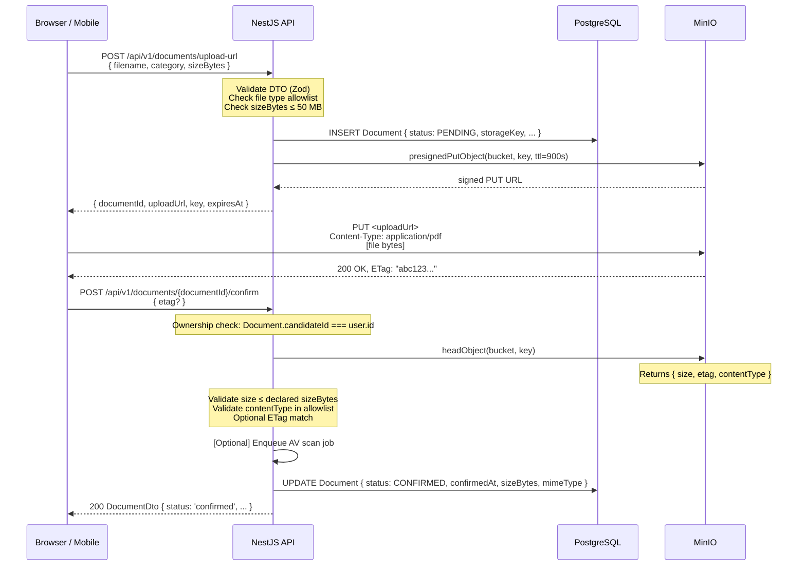
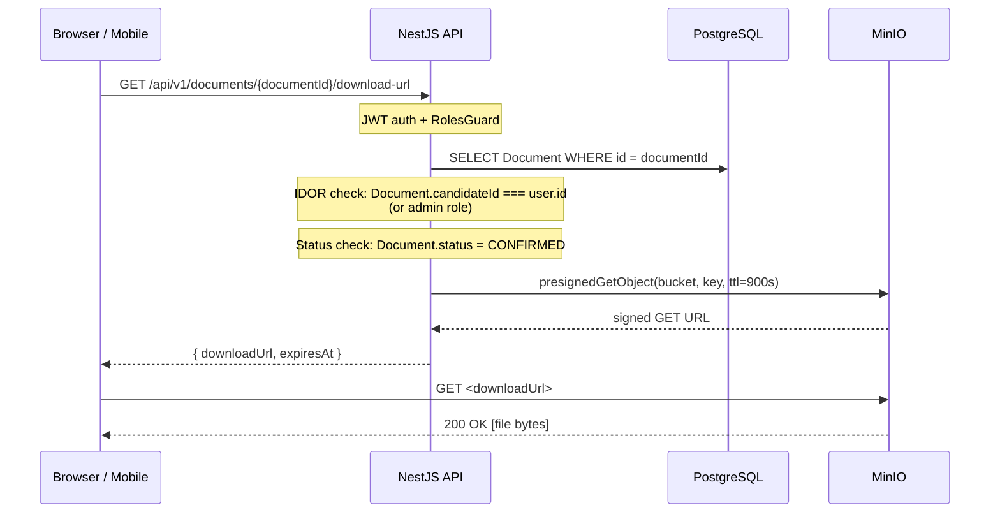

# Documents & Storage Module

> **Status:** Draft v0.1 · **Phase:** 1 (core upload plumbing) → used heavily in Phase 2 & 3 · **Owner area:** backend
> **Related:** [CLOUD.md](../../CLOUD.md) · [architecture/05-security-privacy.md](../../architecture/05-security-privacy.md) · [backend/modules/parsing.md](parsing.md) · [backend/modules/verification.md](verification.md) · [backend/modules/reports-pdf.md](reports-pdf.md)

This module owns every byte that enters or leaves Stabil's object store. It receives files from clients (resumes, government-ID scans, certificate images), stores them durably in MinIO, and serves them back through short-lived pre-signed URLs — ensuring no file path, bucket credential, or raw object key is ever exposed to a browser or mobile client. It is the single mandatory integration point for all other modules that touch files: `parsing`, `verification`, and `reports-pdf` all delegate their storage I/O here.

---

## Table of Contents

1. [Responsibility](#1-responsibility)
2. [S3-Compatible Abstraction](#2-s3-compatible-abstraction)
3. [Storage Key Scheme & Buckets](#3-storage-key-scheme--buckets)
4. [Public API](#4-public-api)
5. [Prisma Models Touched](#5-prisma-models-touched)
6. [Key Flows](#6-key-flows)
7. [Validation & Errors](#7-validation--errors)
8. [Security & Permissions](#8-security--permissions)
9. [Lifecycle & Retention](#9-lifecycle--retention)
10. [Phased Implementation](#10-phased-implementation)
11. [Testing](#11-testing)
12. [Best Practices & Gotchas](#12-best-practices--gotchas)

---

## 1. Responsibility

**One purpose:** store and serve files — candidate resumes, government-ID document scans, supporting certificates, and generated report PDFs — using MinIO (S3-compatible object storage), with no public bucket access and all client file transfers mediated through short-lived pre-signed URLs.

Everything else in the system that needs a file either delegates a PUT (write) or GET (read) through `DocumentsService`. No other NestJS module holds MinIO credentials or constructs object keys independently.

---

## 2. S3-Compatible Abstraction

### 2.1 Adapter interface

The storage layer is hidden behind a `StoragePort` interface so that swapping MinIO for Cloudflare R2 or AWS S3 is a configuration-only change — no service code changes. The interface lives in `packages/core/src/storage/storage.port.ts`.

```typescript
// packages/core/src/storage/storage.port.ts

export interface PresignedPutResult {
  uploadUrl: string;   // signed PUT URL handed to the client
  key: string;         // object key to confirm back after upload
  expiresAt: Date;     // when the upload URL expires
}

export interface PresignedGetResult {
  downloadUrl: string; // signed GET URL for the client
  expiresAt: Date;
}

export interface StoragePort {
  /** Generate a signed PUT URL for direct client upload. */
  presignedPut(bucket: string, key: string, ttlSeconds: number): Promise<PresignedPutResult>;

  /** Generate a signed GET URL for download. */
  presignedGet(bucket: string, key: string, ttlSeconds: number): Promise<PresignedGetResult>;

  /** Upload a buffer/stream directly (used internally by PDF workers). */
  putObject(bucket: string, key: string, body: Buffer | NodeJS.ReadableStream, contentType: string): Promise<void>;

  /** Check that an object exists after a client-direct upload (confirms the PUT succeeded). */
  headObject(bucket: string, key: string): Promise<{ size: number; etag: string; contentType: string }>;

  /** Delete a single object. */
  deleteObject(bucket: string, key: string): Promise<void>;

  /** Delete multiple objects in one batch (up to 1 000 keys). */
  deleteObjects(bucket: string, keys: string[]): Promise<void>;

  /** List all keys under a prefix (used by the purge job). */
  listObjects(bucket: string, prefix: string): AsyncIterable<string>;
}
```

### 2.2 MinIO adapter

`MinioStorageAdapter` in `apps/api/src/storage/minio-storage.adapter.ts` implements `StoragePort` using the `minio` npm package (`minio@^8`). The MinIO SDK uses the S3 wire protocol, so the same adapter works against Cloudflare R2 and AWS S3 by changing environment variables only.

```typescript
// apps/api/src/storage/minio-storage.adapter.ts (excerpt)
import { Client } from 'minio';

@Injectable()
export class MinioStorageAdapter implements StoragePort {
  private readonly client: Client;

  constructor(private readonly config: ConfigService) {
    this.client = new Client({
      endPoint:  config.get<string>('MINIO_ENDPOINT'),
      port:      config.get<number>('MINIO_PORT'),
      useSSL:    config.get<boolean>('MINIO_USE_SSL'),
      accessKey: config.get<string>('MINIO_ACCESS_KEY'),
      secretKey: config.get<string>('MINIO_SECRET_KEY'),
    });
  }

  async presignedPut(bucket: string, key: string, ttlSeconds: number): Promise<PresignedPutResult> {
    const uploadUrl = await this.client.presignedPutObject(bucket, key, ttlSeconds);
    return {
      uploadUrl,
      key,
      expiresAt: new Date(Date.now() + ttlSeconds * 1000),
    };
  }

  async presignedGet(bucket: string, key: string, ttlSeconds: number): Promise<PresignedGetResult> {
    const downloadUrl = await this.client.presignedGetObject(bucket, key, ttlSeconds);
    return {
      downloadUrl,
      expiresAt: new Date(Date.now() + ttlSeconds * 1000),
    };
  }

  // ... putObject, headObject, deleteObject, deleteObjects, listObjects
}
```

### 2.3 Swapping to Cloudflare R2 or AWS S3

No code changes are required. Update three env vars and restart:

```bash
# MinIO (self-hosted) — default
MINIO_ENDPOINT=minio.internal
MINIO_PORT=9000
MINIO_USE_SSL=true

# Cloudflare R2 — config-swap only
MINIO_ENDPOINT=<accountid>.r2.cloudflarestorage.com
MINIO_PORT=443
MINIO_USE_SSL=true

# AWS S3 — config-swap only
MINIO_ENDPOINT=s3.ap-south-1.amazonaws.com
MINIO_PORT=443
MINIO_USE_SSL=true
```

Access keys and bucket names follow the same environment variables in all cases. See [CLOUD.md §10.2](../../CLOUD.md#102-migration-path----config-only-swaps) for the full migration path.

---

## 3. Storage Key Scheme & Buckets

### 3.1 Buckets

Two dedicated buckets are provisioned at startup (see [CLOUD.md §5.1](../../CLOUD.md#51-bucket-layout)):

| Bucket env var | Default name | Contents | Public access |
|---|---|---|---|
| `MINIO_BUCKET_DOCUMENTS` | `stabil-documents` | Resumes, ID scans, certificates | **None** (private) |
| `MINIO_BUCKET_REPORTS` | `stabil-reports` | Generated PDF reports | **None** (private) |

Both buckets are created with `mc anonymous set none` — no policy permits public reads or writes. There is no signed-URL bypass or ACL override.

### 3.2 Object key scheme

All keys are constructed from UUIDs so that no sequential ID or username ever appears in a key. The key is the canonical address of an object in storage; it is stored in the `Document.storageKey` column in the database.

```
stabil-documents/
  {candidateId}/
    resume/
      {documentId}.{ext}          ← Phase 2: uploaded resume (PDF, DOCX)
    identity/
      {documentId}.{ext}          ← Phase 3: Aadhaar/PAN/passport scan (JPG, PNG, PDF, HEIC)
    supporting/
      {documentId}.{ext}          ← Phase 3: degree certificate, course cert, etc.

stabil-reports/
  {candidateId}/
    {scoreRunId}.pdf              ← Phase 1: generated PDF report (@react-pdf/renderer)
```

Key construction is centralised in `DocumentsService.buildKey()`:

```typescript
// apps/api/src/documents/documents.service.ts

type DocumentCategory = 'resume' | 'identity' | 'supporting';

buildKey(candidateId: string, documentId: string, category: DocumentCategory, ext: string): string {
  return `${candidateId}/${category}/${documentId}.${ext}`;
}

buildReportKey(candidateId: string, scoreRunId: string): string {
  return `${candidateId}/${scoreRunId}.pdf`;
}
```

`candidateId` and `documentId` are UUID v7 values — unguessable and non-sequential, eliminating enumeration attacks on object keys.

### 3.3 Encryption at rest

MinIO server-side encryption (SSE-S3) is enabled on both buckets. Every object is AES-256 encrypted at rest using a per-object key managed by MinIO's built-in KMS. The SSE mode is transparent to the SDK — no application-level encryption code is required.

For the `identity/` prefix (government-ID scans), SSE-KMS with an external key (e.g. HashiCorp Vault or AWS KMS) should be configured before Phase 3 production launch to comply with DPDP Act obligations for Aadhaar/PAN data. This is a configuration change to the MinIO server; no application code changes are required. See [architecture/05-security-privacy.md §5.1](../../architecture/05-security-privacy.md#51-minio-configuration) for the full SSE requirements.

---

## 4. Public API

All endpoints live under `/api/v1`. JSON bodies use `Content-Type: application/json`. Errors follow RFC 9457 `application/problem+json`. Auth is required on every endpoint — `Authorization: Bearer <access-token>` (JWT).

### 4.1 Endpoint table

| Method | Path | Role(s) | Phase | Description |
|--------|------|---------|-------|-------------|
| `POST` | `/documents/upload-url` | candidate, admin | 1 | Request a pre-signed PUT URL for direct upload |
| `POST` | `/documents/:documentId/confirm` | candidate, admin | 1 | Confirm the upload completed; create DB record |
| `GET` | `/documents/:documentId/download-url` | candidate, admin | 1 | Get a short-lived pre-signed GET URL |
| `GET` | `/documents` | candidate, admin | 1 | List own documents (paginated) |
| `DELETE` | `/documents/:documentId` | candidate, admin | 1 | Soft-delete a document |
| `GET` | `/reports/:scoreRunId/download-url` | candidate, employer*, recruiter*, admin | 1 | Pre-signed GET URL for a PDF report |

\* employer/recruiter access to a report download URL requires an active `ConsentRecord` — enforced by `ConsentGuard`. See [backend/modules/consent-sharing.md](consent-sharing.md).

### 4.2 Method signatures (NestJS controller layer)

```typescript
// apps/api/src/documents/documents.controller.ts

// ─── Request a pre-signed PUT URL ─────────────────────────────────────────
@Post('upload-url')
@Roles('candidate', 'admin')
async requestUploadUrl(
  @CurrentUser() user: AuthenticatedUser,
  @Body() dto: RequestUploadUrlDto,
): Promise<RequestUploadUrlResponseDto>

// ─── Confirm upload ────────────────────────────────────────────────────────
@Post(':documentId/confirm')
@Roles('candidate', 'admin')
async confirmUpload(
  @CurrentUser() user: AuthenticatedUser,
  @Param('documentId', ParseUUIDPipe) documentId: string,
  @Body() dto: ConfirmUploadDto,
): Promise<DocumentDto>

// ─── Get download URL ──────────────────────────────────────────────────────
@Get(':documentId/download-url')
@Roles('candidate', 'admin')
async getDownloadUrl(
  @CurrentUser() user: AuthenticatedUser,
  @Param('documentId', ParseUUIDPipe) documentId: string,
): Promise<GetDownloadUrlResponseDto>

// ─── List documents ────────────────────────────────────────────────────────
@Get()
@Roles('candidate', 'admin')
async listDocuments(
  @CurrentUser() user: AuthenticatedUser,
  @Query() query: ListDocumentsQueryDto,
): Promise<PaginatedResponseDto<DocumentDto>>

// ─── Soft-delete ───────────────────────────────────────────────────────────
@Delete(':documentId')
@Roles('candidate', 'admin')
async deleteDocument(
  @CurrentUser() user: AuthenticatedUser,
  @Param('documentId', ParseUUIDPipe) documentId: string,
): Promise<void>
```

### 4.3 DTOs

```typescript
// packages/core/src/documents/dto.ts

/** POST /documents/upload-url */
export class RequestUploadUrlDto {
  @IsString() @IsNotEmpty()
  filename: string;           // original filename — for extension extraction only

  @IsEnum(DocumentCategory)
  category: DocumentCategory; // 'resume' | 'identity' | 'supporting'

  @IsInt() @Min(1) @Max(MAX_FILE_SIZE_BYTES)
  sizeBytes: number;          // declared by client; verified after upload via headObject
}

export class RequestUploadUrlResponseDto {
  documentId: string;    // UUID v7 — pre-minted; used in the confirm call
  uploadUrl: string;     // signed PUT URL; client uploads directly to MinIO
  key: string;           // object key — stored on confirm; never used by client to construct URLs
  expiresAt: string;     // ISO 8601; client must complete upload before this
}

/** POST /documents/:documentId/confirm */
export class ConfirmUploadDto {
  etag?: string;         // optional — MinIO returns ETag in PUT response; validated if provided
}

/** GET /documents/:documentId/download-url */
export class GetDownloadUrlResponseDto {
  downloadUrl: string;   // signed GET URL; valid for DOWNLOAD_URL_TTL_SECONDS
  expiresAt: string;     // ISO 8601
}

/** Document entity as returned by list / confirm */
export class DocumentDto {
  id: string;
  candidateId: string;
  category: DocumentCategory;
  originalFilename: string;
  mimeType: string;
  sizeBytes: number;
  status: DocumentStatus;   // 'pending' | 'confirmed' | 'failed' | 'deleted'
  uploadedAt: string;
  confirmedAt: string | null;
}
```

---

## 5. Prisma Models Touched

### 5.1 `Document` model

```prisma
// prisma/schema.prisma

enum DocumentCategory {
  RESUME
  IDENTITY
  SUPPORTING
}

enum DocumentStatus {
  PENDING      // upload URL issued; waiting for client PUT + confirm call
  CONFIRMED    // headObject succeeded; DB record complete
  FAILED       // confirm called but headObject found no object (or size mismatch)
  DELETED      // soft-deleted; pending purge
}

model Document {
  id               String           @id @default(dbgenerated("gen_random_uuid()")) @db.Uuid
  candidateId      String           @db.Uuid
  category         DocumentCategory
  storageKey       String           // object key in MinIO; never exposed to client directly
  bucket           String           // bucket name (from env var at write time)
  originalFilename String           // sanitised at API layer
  mimeType         String
  sizeBytes        Int
  status           DocumentStatus   @default(PENDING)
  avScanStatus     String?          // 'clean' | 'infected' | 'skipped' | null (pending)
  avScanAt         DateTime?
  uploadedAt       DateTime         @default(now())
  confirmedAt      DateTime?
  deletedAt        DateTime?        // soft-delete timestamp; null = active

  candidate        CandidateProfile @relation(fields: [candidateId], references: [id])

  @@index([candidateId, status])
  @@index([deletedAt])              // used by nightly purge job
}
```

### 5.2 Related models

- **`CandidateProfile`** — `Document.candidateId` is a foreign key to `CandidateProfile.id`. The profile is the ownership anchor for all IDOR checks.
- **`VerificationDocument`** — Phase 3 model that extends `Document` with extracted fields (`idType`, `idNumber` encrypted, `verificationStatus`, `reviewedAt`, `reviewedBy`). `VerificationDocument` holds a `documentId` FK. See [backend/modules/verification.md](verification.md).
- **`ScoreRun`** — PDF reports in `stabil-reports` are keyed by `scoreRunId`; no explicit `Document` row is created for reports (the key is derived deterministically from `scoreRunId`).

---

## 6. Key Flows

### 6.1 Pre-signed upload flow (client-direct PUT)

The canonical pattern for candidate-initiated file uploads. The client never sends the file to the NestJS API; it POSTs metadata first, receives a signed URL, uploads directly to MinIO, then calls the confirm endpoint.



**Why client-direct upload (presigned PUT)?**
Routing file bytes through the NestJS API would make the API a bottleneck for large uploads, consume API process memory for multipart buffering, and add unnecessary latency. The presigned-PUT pattern keeps the API thin (only metadata and URL generation) while MinIO absorbs the I/O directly from the client.

### 6.2 Pre-signed download flow



The signed GET URL expires after `DOWNLOAD_URL_TTL_SECONDS` (default: 900 seconds / 15 minutes). The client must request a new URL after expiry. The raw MinIO object key is never returned to the client.

### 6.3 Internal PUT (PDF worker)

The `reports-pdf` module generates report PDFs in a Bull worker and writes them directly to `stabil-reports` using `StoragePort.putObject()`. No client-facing presigned URL is involved in the write path; only the read (download-url) endpoint exposes PDFs to clients.

```typescript
// apps/api/src/reports-pdf/pdf.worker.ts (excerpt)
const pdfBuffer = await this.pdfRenderer.render(scoreRun);
const key = this.documentsService.buildReportKey(candidateId, scoreRunId);

await this.storage.putObject(
  this.config.get('MINIO_BUCKET_REPORTS'),
  key,
  pdfBuffer,
  'application/pdf',
);
```

### 6.4 Purge flow (delete-on-request)

When a candidate requests account deletion, the `account:purge` Bull job (see [CLOUD.md §5.3](../../CLOUD.md#53-delete-on-request-purge-job)) calls `DocumentsService.purgeAllForCandidate()`:

```typescript
async purgeAllForCandidate(candidateId: string): Promise<void> {
  // 1. Collect all object keys from DB (catches soft-deleted documents too)
  const docs = await this.prisma.document.findMany({ where: { candidateId } });
  const documentKeys = docs.map(d => d.storageKey);

  // 2. Batch-delete from stabil-documents (up to 1 000 keys per call)
  for (const chunk of chunkArray(documentKeys, 1000)) {
    await this.storage.deleteObjects(this.config.get('MINIO_BUCKET_DOCUMENTS'), chunk);
  }

  // 3. List and delete report PDFs
  const reportKeys: string[] = [];
  for await (const key of this.storage.listObjects(
    this.config.get('MINIO_BUCKET_REPORTS'),
    `${candidateId}/`,
  )) {
    reportKeys.push(key);
  }
  for (const chunk of chunkArray(reportKeys, 1000)) {
    await this.storage.deleteObjects(this.config.get('MINIO_BUCKET_REPORTS'), chunk);
  }

  // 4. Hard-delete Document rows (cascade from User/CandidateProfile handled by Prisma)
  await this.prisma.document.deleteMany({ where: { candidateId } });
}
```

The job is **idempotent**: object deletion against a non-existent key is a no-op in S3/MinIO, and `deleteMany` with the same filter safely returns zero rows deleted on re-runs.

---

## 7. Validation & Errors

### 7.1 File type allowlist

Accepted MIME types are validated at two points:

| Point | What is checked | How |
|---|---|---|
| `POST /upload-url` | Declared MIME type inferred from the file extension in `filename` | Zod schema `z.enum([...])` on the resolved MIME |
| `POST /confirm` | Actual MIME type returned by `headObject` | Compare against DB-stored declared MIME and allowlist |

```typescript
// packages/core/src/documents/allowed-types.ts

export const ALLOWED_DOCUMENT_TYPES: Record<DocumentCategory, string[]> = {
  resume:     ['application/pdf', 'application/msword',
               'application/vnd.openxmlformats-officedocument.wordprocessingml.document'],
  identity:   ['application/pdf', 'image/jpeg', 'image/png', 'image/heic', 'image/webp'],
  supporting: ['application/pdf', 'image/jpeg', 'image/png'],
};

export const MAX_FILE_SIZE_BYTES = 50 * 1024 * 1024; // 50 MB absolute ceiling
export const UPLOAD_URL_TTL_SECONDS = 900;            // 15 min; client must complete before this
export const DOWNLOAD_URL_TTL_SECONDS = 900;          // 15 min signed GET URL
export const REPORT_DOWNLOAD_URL_TTL_SECONDS = 3600;  // 1 h for PDF export (larger file, more time)
```

### 7.2 Size validation

1. **At `upload-url`:** `sizeBytes` declared by the client must be `≤ MAX_FILE_SIZE_BYTES`. A lying client can still PUT a larger file — that is caught in step 2.
2. **At `confirm`:** `headObject` returns the actual byte count. If `actualSize > MAX_FILE_SIZE_BYTES`, the confirm fails, the document is marked `FAILED`, and the object is enqueued for deletion.

MinIO does not enforce a maximum body size on presigned PUTs by default. If the storage backend supports `Content-Length` constraints on presigned URLs (AWS S3 does via `x-amz-content-sha256` conditions; MinIO supports this since RELEASE.2023-08), add a `conditions` policy to the presigned PUT generation to enforce the declared size server-side.

### 7.3 Error catalogue

All errors use RFC 9457 `application/problem+json`. The `type` URI base is `https://stabil.app/problems/`.

| Scenario | HTTP status | `type` | `detail` |
|---|---|---|---|
| Unsupported MIME type | 422 | `invalid-file-type` | `"File type application/x-exe is not permitted for category 'resume'"` |
| File too large (declared) | 422 | `file-too-large` | `"Declared size 55 MB exceeds the 50 MB limit"` |
| Upload URL expired | 409 | `upload-expired` | `"Upload URL expired; request a new one"` |
| Object not found after confirm (upload didn't reach MinIO) | 409 | `upload-not-received` | `"Object not found in storage; ensure the upload completed before confirming"` |
| Actual size exceeds limit | 422 | `file-too-large` | `"Uploaded file size (52 MB) exceeds the 50 MB limit"` |
| MIME mismatch at confirm | 422 | `mime-type-mismatch` | `"Stored content type image/gif does not match declared type application/pdf"` |
| Document not found | 404 | `document-not-found` | `"Document {id} not found"` |
| Access to another candidate's document (IDOR attempt) | 403 | `forbidden` | `"Access denied"` |
| AV scan found malware | 422 | `file-infected` | `"File was rejected by antivirus scan"` |
| Storage backend unavailable | 503 | `storage-unavailable` | `"Object storage is temporarily unavailable"` |

### 7.4 Zod schemas

All inbound DTOs are validated with Zod schemas in `packages/core/src/documents/schemas.ts` and enforced via a NestJS `ZodValidationPipe` applied globally:

```typescript
import { z } from 'zod';

export const RequestUploadUrlSchema = z.object({
  filename: z.string().min(1).max(255).regex(/^[\w\-. ]+$/, 'Invalid filename'),
  category: z.enum(['resume', 'identity', 'supporting']),
  sizeBytes: z.number().int().positive().max(MAX_FILE_SIZE_BYTES),
});

export const ConfirmUploadSchema = z.object({
  etag: z.string().optional(),
});
```

---

## 8. Security & Permissions

### 8.1 No public buckets

Both `stabil-documents` and `stabil-reports` buckets are created with anonymous access disabled:

```bash
mc anonymous set none local/stabil-documents
mc anonymous set none local/stabil-reports
```

This is enforced at provisioning time (see [CLOUD.md §3.3](../../CLOUD.md#33-docker-composeyml----full-local-stack)) and must be verified in production via `mc anonymous get <bucket>` before each environment launch.

### 8.2 IDOR-safe access scoping

Every endpoint that reads or deletes a `Document` performs an ownership check before calling the storage layer:

```typescript
// apps/api/src/documents/documents.service.ts

private async assertOwnership(documentId: string, userId: string, role: Role): Promise<Document> {
  const doc = await this.prisma.document.findUnique({ where: { id: documentId } });

  if (!doc || doc.deletedAt !== null) {
    throw new NotFoundException(`Document ${documentId} not found`);
  }

  // Admins may access any document; candidates only their own
  if (role !== 'admin' && doc.candidateId !== userId) {
    throw new ForbiddenException('Access denied');
  }

  return doc;
}
```

The check uses the database `candidateId` column, not any client-supplied claim. UUID v7 keys make enumeration impractical even without the check, but the check is the authoritative guard.

### 8.3 Signed-URL TTLs

| URL type | TTL | Rationale |
|---|---|---|
| Presigned PUT (upload) | 900 s (15 min) | Long enough for mobile uploads on slow connections; short enough to limit the blast radius if the URL is intercepted |
| Presigned GET (document preview) | 900 s (15 min) | Limits re-sharing; cached for the browser session |
| Presigned GET (PDF report download) | 3 600 s (1 h) | Larger files; allows download retries within a reasonable session window |

TTLs are configurable via env vars (`UPLOAD_URL_TTL_SECONDS`, `DOWNLOAD_URL_TTL_SECONDS`, `REPORT_DOWNLOAD_URL_TTL_SECONDS`) so they can be tightened without code changes.

### 8.4 Credentials never reach the client

- The MinIO endpoint, access key, and secret key are only present in the API process environment — never in any API response body.
- The `storageKey` (raw object key) is stored in the database but never returned in API responses. Clients reference documents by their UUID (`documentId`) only. The API constructs the key internally on each storage call.
- `RequestUploadUrlResponseDto` returns the `key` field only to allow the client to pass it back in the confirm call for double-checking — but the client cannot use this key to construct a raw MinIO URL (the bucket and credentials are not exposed).

### 8.5 Optional antivirus (AV) scan hook

The confirm flow includes a hook point for antivirus scanning before a document is marked `CONFIRMED`:

```typescript
// apps/api/src/documents/documents.service.ts (confirm excerpt)
const scanResult = await this.avScanner.scan(bucket, key); // no-op in POC

if (scanResult.status === 'infected') {
  await this.storage.deleteObject(bucket, key);
  await this.prisma.document.update({
    where: { id: documentId },
    data: { status: 'FAILED', avScanStatus: 'infected', avScanAt: new Date() },
  });
  throw new UnprocessableEntityException({ type: 'file-infected', ... });
}
```

The `AvScannerPort` interface has two implementations:
- `NoopAvScanner` — always returns `{ status: 'skipped' }` (default; Phase 1–2).
- `ClamAvScanner` — streams the object from MinIO to a ClamAV daemon via TCP (Phase 3 production hardening). Configured with `AV_SCANNER=clamav` and `CLAMAV_HOST`/`CLAMAV_PORT` env vars.

See [architecture/05-security-privacy.md §5.3](../../architecture/05-security-privacy.md#53-optional-antivirus-scan) for the security rationale.

### 8.6 Permissions summary (RBAC)

| Action | candidate | employer | recruiter | admin |
|---|:---:|:---:|:---:|:---:|
| Request upload URL (own documents) | ✓ | — | — | ✓ |
| Confirm upload (own documents) | ✓ | — | — | ✓ |
| Get download URL (own documents) | ✓ | — | — | ✓ |
| List own documents | ✓ | — | — | ✓ |
| Soft-delete own document | ✓ | — | — | ✓ |
| Get report download URL (own report) | ✓ | — | — | ✓ |
| Get report download URL (consented candidate's report) | — | ✓* | ✓* | ✓ |
| Purge all documents (account deletion job) | — | — | — | ✓ (system) |

\* Requires active `ConsentRecord` — enforced by `ConsentGuard`. See [backend/modules/consent-sharing.md](consent-sharing.md).

---

## 9. Lifecycle & Retention

### 9.1 Document lifecycle states

```
PENDING ──confirm (object found)──► CONFIRMED
        ──confirm (object not found / AV fail)──► FAILED
CONFIRMED ──soft-delete request──► DELETED (deletedAt set)
DELETED ──nightly purge job (>30 days)──► [hard-deleted from DB + object deleted from MinIO]
```

### 9.2 MinIO lifecycle rules

A 24-hour expiry rule on the `tmp/` prefix cleans up any orphaned presigned-PUT targets where the client never called confirm:

```bash
# Applied once at environment provisioning (see CLOUD.md §5.4)
mc ilm rule add --prefix "tmp/" --expire-days 1 local/stabil-documents
mc ilm rule add --prefix "tmp/" --expire-days 1 local/stabil-reports
```

Note: the standard upload flow does not use a `tmp/` prefix — keys are minted at `POST /upload-url` time in their final location. The `tmp/` rule is a backstop for any future staging-area upload pattern.

### 9.3 Nightly purge cron job

A `@nestjs/schedule` cron task runs at `02:00 UTC` and hard-deletes documents that have been soft-deleted for more than 30 days:

```typescript
// apps/api/src/documents/documents.purge.task.ts

@Cron('0 2 * * *', { name: 'document-purge' })
async runPurge(): Promise<void> {
  const cutoff = new Date(Date.now() - 30 * 24 * 60 * 60 * 1000);

  const expired = await this.prisma.document.findMany({
    where: { deletedAt: { lte: cutoff } },
    select: { id: true, candidateId: true, storageKey: true, bucket: true },
  });

  for (const doc of expired) {
    await this.storage.deleteObject(doc.bucket, doc.storageKey);
    await this.prisma.document.delete({ where: { id: doc.id } });
    this.logger.log({ msg: 'document-purged', documentId: doc.id, candidateId: doc.candidateId });
  }
}
```

### 9.4 Delete-on-request (SCOPE §11, DPDP Act)

When a candidate submits `DELETE /api/v1/account`, the full purge pipeline runs as a Bull job `account:purge:{userId}`. This pipeline calls `DocumentsService.purgeAllForCandidate()` (see §6.4) and must complete within 24 hours of the request. After the job, a deletion audit event is written to the `DeletionAudit` table (PII-free; retains event metadata only). See [CLOUD.md §5.3](../../CLOUD.md#53-delete-on-request-purge-job) and [architecture/05-security-privacy.md §4.4](../../architecture/05-security-privacy.md#44-retention-and-deletion-pipeline) for the full pipeline.

---

## 10. Phased Implementation

### Phase 1 — Core upload/download plumbing

**Goal:** end-to-end presigned-PUT/GET flow working for report PDF storage so the Phase 1 scoring + report feature can deliver downloadable PDFs.

- Implement `StoragePort` interface and `MinioStorageAdapter`.
- Implement `DocumentsModule` with `DocumentsController` and `DocumentsService`.
- Implement `POST /documents/upload-url`, `POST /documents/:id/confirm`, `GET /documents/:id/download-url`, `GET /documents`, `DELETE /documents/:id`.
- Implement `GET /reports/:scoreRunId/download-url` (reads from `stabil-reports`; used by [reports-pdf.md](reports-pdf.md)).
- Wire `NoopAvScanner` (AV hook present but skipped).
- Provision MinIO buckets and lifecycle rules in local `docker-compose.yml` and staging.
- Unit tests for `DocumentsService` (mock `StoragePort`); integration test for the full upload/confirm/download-url round-trip.

### Phase 2 — Resume upload (parsing integration)

**Goal:** candidates can upload resumes that the parsing module reads from MinIO.

- Add `resume` category to the upload flow (already modelled; enable in Phase 2).
- `ParsingService` calls `StoragePort.presignedGet()` (with a long internal TTL, e.g. 1 hour) to obtain a URL it streams from MinIO for Ollama/Tesseract processing — or calls `headObject` + direct stream via MinIO SDK.
- Ensure `Document.status` transitions (`PENDING` → `CONFIRMED`) gate parse jobs (parse only confirmed documents).
- Cross-reference: [backend/modules/parsing.md](parsing.md).

### Phase 3 — Verification document upload + AV scan

**Goal:** government-ID scans (Aadhaar, PAN, passport) stored securely; optional ClamAV scan wired in.

- Enable `identity` and `supporting` categories.
- Wire `ClamAvScanner` into the confirm pipeline (configurable via `AV_SCANNER` env var).
- Enable SSE-KMS on the `identity/` prefix (MinIO server config, not application code).
- `VerificationDocument` Prisma model introduced; `DocumentsService.confirmUpload()` creates the `VerificationDocument` row for `identity` category documents.
- Admin download URL endpoint for verification review (admin-only; IDOR check uses `role === 'admin'`).
- Access to `identity/` objects written to `AuditLog` on every presigned GET generation.
- Cross-reference: [backend/modules/verification.md](verification.md).

---

## 11. Testing

### 11.1 Unit tests (`apps/api/src/documents/*.spec.ts`)

Test `DocumentsService` in isolation with a mocked `StoragePort` and mocked Prisma client:

| Scenario | Assertion |
|---|---|
| `requestUploadUrl` — valid resume PDF | Returns `documentId`, `uploadUrl`, `key`, `expiresAt`; DB row created with `status: PENDING` |
| `requestUploadUrl` — disallowed MIME (`image/gif` for resume) | Throws `UnprocessableEntityException` with `type: invalid-file-type` |
| `requestUploadUrl` — sizeBytes > 50 MB | Throws `UnprocessableEntityException` with `type: file-too-large` |
| `confirmUpload` — object present, sizes match | DB updated to `CONFIRMED`; `DocumentDto` returned |
| `confirmUpload` — object not in MinIO (`headObject` throws) | DB updated to `FAILED`; throws `ConflictException` `upload-not-received` |
| `confirmUpload` — actual size > declared | DB updated to `FAILED`; throws `UnprocessableEntityException` |
| `getDownloadUrl` — own document, CONFIRMED | Returns signed GET URL |
| `getDownloadUrl` — another candidate's document | Throws `ForbiddenException` |
| `getDownloadUrl` — PENDING document | Throws `NotFoundException` |
| `deleteDocument` — own document | Sets `deletedAt`; `deleteObject` not called (soft-delete only) |
| `purgeAllForCandidate` — 2 docs + 1 report | Calls `deleteObjects` twice (docs, reports); DB rows deleted |

### 11.2 Integration tests (`apps/api/test/documents.e2e-spec.ts`)

Run against a real MinIO instance (local or CI service container) and a test PostgreSQL database:

```typescript
// Arrange: candidate user + auth token via test helpers
const { token, candidateId } = await authHelper.createCandidateAndLogin();

// Act: request upload URL
const uploadRes = await request(app)
  .post('/api/v1/documents/upload-url')
  .set('Authorization', `Bearer ${token}`)
  .send({ filename: 'cv.pdf', category: 'resume', sizeBytes: 12345 });

expect(uploadRes.status).toBe(201);
const { documentId, uploadUrl } = uploadRes.body;

// Act: simulate MinIO PUT (in tests use the MinIO SDK to put a real object)
await minioClient.putObject(testBucket, uploadRes.body.key, Buffer.alloc(12345), 12345);

// Act: confirm
const confirmRes = await request(app)
  .post(`/api/v1/documents/${documentId}/confirm`)
  .set('Authorization', `Bearer ${token}`)
  .send({});

expect(confirmRes.status).toBe(200);
expect(confirmRes.body.status).toBe('confirmed');

// Act: get download URL
const dlRes = await request(app)
  .get(`/api/v1/documents/${documentId}/download-url`)
  .set('Authorization', `Bearer ${token}`);

expect(dlRes.status).toBe(200);
expect(dlRes.body.downloadUrl).toMatch(/^https?:\/\//);
```

Additional integration scenarios:

| Scenario | Expected outcome |
|---|---|
| IDOR: candidate A requests download URL for candidate B's document | 403 `forbidden` |
| Employer without consent requests report download URL | 403 (enforced by `ConsentGuard`) |
| Employer with active consent requests report download URL | 200 + valid URL |
| Purge job: soft-delete then run purge | Object deleted from MinIO; DB row gone |
| Upload URL expired: client PUTs after TTL | MinIO returns 403; confirm returns `upload-not-received` |

### 11.3 CI fixture

The GitHub Actions workflow (`ci.yml`) sets `MINIO_*` env vars pointing to a local MinIO instance (no service container needed in CI — use the `minio/minio` binary via Docker service). See [CLOUD.md §4.2](../../CLOUD.md#42-github-actions-workflow) for the full CI configuration.

---

## 12. Best Practices & Gotchas

### Object key collisions are impossible in practice but guard anyway

UUID v7 `documentId` values are generated by `gen_random_uuid()` in PostgreSQL and are effectively collision-free. However, the `INSERT Document` step uses a DB transaction with a unique constraint on `storageKey`; any hypothetical collision raises a Prisma `P2002` unique-violation error before the presigned URL is issued.

### Never return the raw storage key in API responses

`DocumentDto` deliberately omits `storageKey` and `bucket`. If the raw MinIO path were returned to clients, a leaked response could reveal the bucket name, which combined with any future misconfiguration (accidental public ACL) would expose files directly. Keep the indirection: client → API → presigned URL → MinIO.

### presignedGet is a URL, not auth delegation

The signed GET URL proves the API authorised the download, but it can be forwarded to any HTTP client during its TTL. Keep TTLs short (15 min for sensitive documents) and log every issuance to `AuditLog` for `identity` category documents.

### headObject is the source of truth for size and MIME at confirm time

Never trust the client's declared `sizeBytes` or inferred MIME at confirm time. Always call `headObject` and validate the returned metadata against the allowlist. A client could declare a small PDF, upload a large video, and claim "confirmed" — `headObject` catches this.

### MinIO health check in NestJS readiness probe

The `/health/ready` endpoint pings MinIO via a `headObject` on a sentinel key (or a `listBuckets` call). If MinIO is down, the API becomes not-ready and traffic is not routed to it. See [CLOUD.md §7.4](../../CLOUD.md#74-health-and-readiness-probes).

### Bucket provisioning is idempotent

Use `mc mb --ignore-existing` in all provisioning scripts so re-running provisioning on an environment that already has buckets does not error. See the `minio_init` Docker Compose service in [CLOUD.md §3.3](../../CLOUD.md#33-docker-composeyml----full-local-stack).

### The purge job must be idempotent

`deleteObjects` against non-existent keys returns success in S3/MinIO. `Prisma.deleteMany` with a `where` clause that matches zero rows also returns successfully. The purge job can be re-queued after failure at any step without risk of data corruption.

### Phase 3 UIDAI / Aadhaar note

OCR extraction of an Aadhaar card image involves processing a document whose number is a "highly sensitive" PII field. The extracted `idNumber` must be stored in `VerificationDocument.idNumber` using column-level encryption (AES-256 via the Prisma extension or a before-write hook), not in plaintext. The raw document scan stays in MinIO with SSE-KMS. Review UIDAI's guidelines on Aadhaar storage and masking before Phase 3 production launch. See [architecture/05-security-privacy.md §4.2](../../architecture/05-security-privacy.md#42-lawful-basis).
