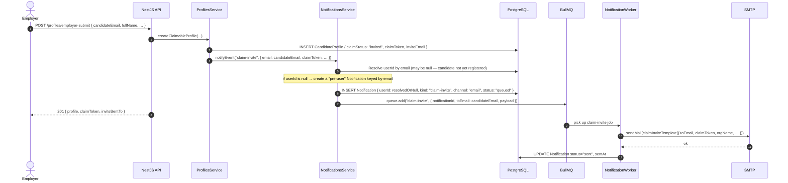

# Notifications Module

> **Status:** Draft v0.1 · **Phase:** 1 (email + in-app feed); push with mobile (Phase 1 mobile / later) · **Owner area:** backend
> **Related:**
> - [auth-accounts.md](./auth-accounts.md) — `User` entity, JWT sessions, role model
> - [consent-sharing.md](./consent-sharing.md) — triggers `consent-requested`, `consent-granted`, `consent-revoked`
> - [verification.md](./verification.md) — triggers `verification-result`
> - [parsing.md](./parsing.md) — triggers `document-parsed`
> - [architecture/01-overview.md](../../architecture/01-overview.md) — async job queue overview (§6)
> - [architecture/02-data-model.md](../../architecture/02-data-model.md) — `Notification`, `NotificationPreference` Prisma models (§4.7)
> - [architecture/04-api-contracts.md](../../architecture/04-api-contracts.md) — §16 (public API contract)
> - [architecture/05-security-privacy.md](../../architecture/05-security-privacy.md) — PII rules that govern notification payloads

This module is responsible for notifying users about significant lifecycle events in Stabil — a claim invitation from an employer, a completed score run, a consent request or decision, a verification outcome, and a completed document parse. Delivery is asynchronous via **BullMQ + Redis**, with retry and idempotency semantics. The module owns three concerns: (1) **event routing** — mapping internal domain events to notification jobs; (2) **channel dispatch** — rendering and sending via email (SMTP, Phase 1) and Expo push (mobile, later); and (3) **the in-app notification feed** — persisted `Notification` rows that the user reads inside the web/mobile app.

---

## 1. Responsibility

One module, one purpose: **given a domain event, durably deliver a notification to the right user(s) over the right channel(s), exactly once, and persist a readable record of it in the in-app feed.**

The module does **not** own business logic for scores, consent decisions, or verification outcomes — it only reacts to events emitted by the modules that do.

---

## 2. Event Catalog

Every notification is keyed by an event kind. The table below is the single source of truth for which events exist, what triggers them, who the recipient is, which channels are active in each phase, and which related module doc to consult for context.

| Kind | `Notification.kind` value | Trigger | Recipient | Channels (Phase 1) | Channels (later) | Related module |
|---|---|---|---|---|---|---|
| **Claim invite** | `claim-invite` | Employer/recruiter calls `POST /profiles/employer-submit` → a claimable `CandidateProfile` is created for a candidate who may not yet have an account | The candidate at `inviteEmail` | email | email + push | [consent-sharing.md](./consent-sharing.md), [auth-accounts.md](./auth-accounts.md) |
| **Score ready** | `score-ready` | A `ScoreRun` is persisted after `POST /scoring/runs` completes synchronously (or after a re-score loop) | Profile owner (candidate) | email + in-app | email + push + in-app | [scoring.md](./scoring.md) |
| **Consent requested** | `consent-requested` | An employer/recruiter calls `POST /consent/shares` and a `ShareGrant` enters `pending` status | The candidate (grantor) | email + in-app | email + push + in-app | [consent-sharing.md](./consent-sharing.md) |
| **Consent granted** | `consent-granted` | Candidate accepts a pending `ShareGrant` (status → `active`) | The employer/recruiter who made the request | email + in-app | email + push + in-app | [consent-sharing.md](./consent-sharing.md) |
| **Consent revoked** | `consent-revoked` | Candidate revokes an active `ShareGrant` (status → `revoked`) | The employer/recruiter who held the grant | email + in-app | email + push + in-app | [consent-sharing.md](./consent-sharing.md) |
| **Verification result** | `verification-result` | Admin approves or rejects a `VerificationCheck` | Profile owner (candidate) | email + in-app | email + push + in-app | [verification.md](./verification.md) |
| **Document parsed** | `document-parsed` | The `parse.resume` worker finishes extracting structured fields from a resume or document | Profile owner (candidate) | in-app | push + in-app | [parsing.md](./parsing.md) |

> **Why `document-parsed` is in-app only in Phase 1:** email for every parse completion adds noise with no actionable urgency; the candidate will see the result next time they open the app. Push is added when the mobile app ships.

### 2.1 Payload shape per event kind

The `Notification.payload` column (JSONB) carries template variables. **No raw PII beyond what the channel requires is included.** Rule: if a value is not rendered in the template body, it is not in the payload (see [architecture/05-security-privacy.md](../../architecture/05-security-privacy.md) §2).

```ts
// packages/contracts/src/notifications.ts

export type ClaimInvitePayload = {
  profileId: string;           // UUID v7 — link target for claiming
  claimToken: string;          // single-use token embedded in the claim URL
  submittedByOrgName: string;  // e.g. "Acme Corp" (employer display name, not PII)
  candidateDisplayName: string; // first-name only or "there" if absent
};

export type ScoreReadyPayload = {
  profileId: string;
  scoreRunId: string;
  total: number;               // 0–1500 (integer, SCOPE §4)
  tier: Tier;                  // "unstable"|"developing"|"somewhat-stable"|"settled"|"stable"
  previousTotal: number | null; // null on first run — drives delta messaging
};

export type ConsentRequestedPayload = {
  shareGrantId: string;
  requestorOrgName: string;    // employer/recruiter org display name
  scope: ShareScope;           // "report-summary" | "report-full"
  expiresInDays: number;
};

export type ConsentGrantedPayload = {
  shareGrantId: string;
  candidateDisplayName: string; // first-name only
  profileId: string;
};

export type ConsentRevokedPayload = {
  shareGrantId: string;
  candidateDisplayName: string;
  profileId: string;
};

export type VerificationResultPayload = {
  verificationId: string;
  documentKind: DocumentKind;  // "gov-id" | "certificate" | "transcript" | etc.
  outcome: "approved" | "rejected";
  bonusPointsAwarded: number | null; // non-null when approved; null when rejected
  decisionNote: string | null;
};

export type DocumentParsedPayload = {
  documentId: string;
  profileId: string;
  extractedFieldCount: number; // how many parameters were populated
};

export type NotificationPayload =
  | ClaimInvitePayload
  | ScoreReadyPayload
  | ConsentRequestedPayload
  | ConsentGrantedPayload
  | ConsentRevokedPayload
  | VerificationResultPayload
  | DocumentParsedPayload;
```

---

## 3. Data Model Touched

### 3.1 `Notification` (already in schema — `architecture/02-data-model.md` §4.7)

```prisma
model Notification {
  id      String @id @db.Uuid  // UUID v7 (app-generated)
  userId  String @db.Uuid
  user    User   @relation(fields: [userId], references: [id], onDelete: Cascade)

  kind    String              // matches the event catalog above (e.g. "claim-invite")
  channel NotificationChannel // email | push | in-app
  status  NotificationStatus  @default(queued)
  payload Json                // typed per NotificationPayload above; no raw PII

  sentAt    DateTime?
  readAt    DateTime?
  createdAt DateTime @default(now())

  @@index([userId, status])
  @@index([status])
}

enum NotificationChannel {
  email
  push
  in_app @map("in-app")
}

enum NotificationStatus {
  queued
  sent
  delivered
  read
  failed
}
```

**One row per channel per delivery attempt.** If a `score-ready` event goes to both `email` and `in-app`, two `Notification` rows are created. This keeps delivery state per channel independent — a failed email does not suppress the in-app row.

### 3.2 `NotificationPreference` (new model — owned by this module)

Controls per-user, per-event-kind, per-channel opt-in/opt-out. All channels default to **opted-in** for mandatory events (`claim-invite`, `consent-requested`) — these cannot be disabled because they are the primary transactional touch-point. All other events can be opted out per channel.

```prisma
model NotificationPreference {
  id      String @id @db.Uuid   // UUID v7
  userId  String @db.Uuid
  user    User   @relation(fields: [userId], references: [id], onDelete: Cascade)

  kind    String  // matches Notification.kind; "*" = global default for all kinds
  channel NotificationChannel

  enabled   Boolean  @default(true)
  updatedAt DateTime @updatedAt

  @@unique([userId, kind, channel])
  @@index([userId])
}
```

**Preference lookup algorithm** (evaluated at enqueue time):

1. Look for a row with `(userId, kind, channel)` — highest specificity.
2. Fall back to `(userId, "*", channel)` — global channel toggle.
3. Default: `enabled = true`.

**Mandatory (non-disableable) events:** `claim-invite` (email), `consent-requested` (email). These bypass the preference check entirely because disabling them would break core product flows.

### 3.3 Indexes

| Index | Purpose |
|-------|---------|
| `Notification @@index([userId, status])` | In-app feed list query (`WHERE userId = ? AND status != 'read'`) |
| `Notification @@index([status])` | Worker health: count `queued`/`failed` across all users for alerting |
| `NotificationPreference @@unique([userId, kind, channel])` | O(1) preference lookup at enqueue |
| `NotificationPreference @@index([userId])` | Load all prefs for a user on the preferences settings page |

---

## 4. Dependencies

| Dependency | How used |
|---|---|
| **BullMQ** (`bullmq` npm package) | Job queue for async delivery; one queue `notifications` with separate named jobs per event kind |
| **Redis** | BullMQ backing store; job state + retry counters |
| **Nodemailer** | SMTP transport for email (provider-agnostic: configure `SMTP_HOST`, `SMTP_PORT`, `SMTP_USER`, `SMTP_PASS`) |
| **Expo Server SDK** (`expo-server-sdk`) | Expo push notification delivery (Phase 1 mobile / later) |
| **Prisma** (`@prisma/client`) | Persist and query `Notification`, `NotificationPreference`, `User` |
| **NestJS `BullModule`** | `@nestjs/bullmq` — registers the queue and processor in the DI container |
| **`packages/contracts`** (`@stabil/types`) | Shared Zod schemas for `NotificationPayload`, validated at enqueue |
| Internal modules | `AuthAccountsModule` (look up user by email for un-registered claim-invite recipients); `ScoringModule`/`ConsentSharingModule`/`VerificationModule`/`ParsingModule` emit events consumed here |

---

## 5. Key Flows

### 5.1 Sequence diagram — event → queue → channel

```mermaid
sequenceDiagram
    autonumber
    participant SRC as Emitting service<br/>(Scoring / Consent / Verification / Parsing)
    participant NS as NotificationsService
    participant PREF as PreferenceRepository
    participant Q as BullMQ queue<br/>(Redis)
    participant WK as NotificationWorker
    participant DB as PostgreSQL (Prisma)
    participant SMTP as SMTP server
    participant EXPO as Expo Push API

    SRC->>NS: notifyEvent(kind, recipientUserId, payload)
    NS->>PREF: getPreferences(userId, kind)
    PREF-->>NS: { email: true, push: false, in_app: true }

    Note over NS: For each enabled channel:
    NS->>DB: INSERT Notification (status=queued) for each channel
    NS->>Q: queue.add(kind, { notificationId, channel, payload }, { jobId: notificationId })

    Note over Q,WK: BullMQ worker picks up job
    WK->>DB: UPDATE Notification.status = 'sent' (optimistic)
    alt channel = email
        WK->>SMTP: sendMail({ to, subject, html })
        SMTP-->>WK: accepted
        WK->>DB: UPDATE Notification.status = 'sent', sentAt = now()
    else channel = in-app
        WK->>DB: UPDATE Notification.status = 'delivered', sentAt = now()
        Note over WK: in-app: delivery = write to DB; no external call
    else channel = push (later)
        WK->>EXPO: sendPushNotificationsAsync([{ to, title, body, data }])
        EXPO-->>WK: { status: 'ok' | 'error' }
        WK->>DB: UPDATE Notification.status = 'delivered' | 'failed'
    end

    Note over WK: On failure (SMTP/Expo error):
    WK-->>Q: throw → BullMQ retries with exponential backoff
    WK->>DB: UPDATE Notification.status = 'failed' (after maxAttempts exhausted)
```

### 5.2 Claim invite flow (most complex — recipient may not yet have an account)



**Key edge case:** the recipient may not have a Stabil account. In that case `userId` is `null` on the `Notification` row (nullable FK, same as `CandidateProfile.ownerUserId`). When the candidate later registers and claims the profile, the `NotificationsService.linkUnclaimedNotifications(email, newUserId)` method is called to retroactively associate prior rows.

### 5.3 Score-ready notification (in-app + email)

A `ScoreRun` is computed synchronously in the request. After the `ScoreRun` row is committed, the scoring service calls `notifyEvent("score-ready", ...)`. The service creates one `Notification` row per enabled channel. The in-app row is immediately `delivered` (no external call); the email job is queued.

---

## 6. Async Delivery — BullMQ + Redis

### 6.1 Queue configuration

```ts
// apps/api/src/notifications/notifications.queue.ts

export const NOTIFICATION_QUEUE = 'notifications';

// BullMQ queue options
export const notificationQueueOptions: QueueOptions = {
  connection: redisConnection, // shared ioredis connection
  defaultJobOptions: {
    attempts: 5,
    backoff: {
      type: 'exponential',
      delay: 2_000,   // 2s, 4s, 8s, 16s, 32s
    },
    removeOnComplete: { count: 500 },   // keep last 500 completed for debugging
    removeOnFail: { count: 200 },       // keep last 200 failed for inspection
  },
};
```

### 6.2 Idempotency

BullMQ's `jobId` is set to the `Notification.id` (UUID v7). BullMQ deduplicates by `jobId` within its dedup window, so a duplicate `queue.add()` call with the same `notificationId` is a no-op — the existing job is returned, not a second job created. This protects against:

- Double-enqueue from a retry of the calling service's transaction.
- At-least-once delivery from BullMQ itself combined with an idempotent `UPDATE` on the `Notification` row.

The worker's `process()` function is also idempotent: it checks `Notification.status` before sending. If `status` is already `sent` or `delivered`, it skips the external call and returns cleanly.

```ts
// apps/api/src/notifications/notifications.processor.ts (pattern)
@Processor(NOTIFICATION_QUEUE)
export class NotificationsProcessor {
  async process(job: Job<NotificationJobData>): Promise<void> {
    const notif = await this.notificationRepo.findById(job.data.notificationId);
    if (!notif) throw new Error(`Notification ${job.data.notificationId} not found`);
    if (notif.status === 'sent' || notif.status === 'delivered') return; // idempotent skip

    switch (notif.channel) {
      case 'email':   return this.dispatchEmail(notif);
      case 'in-app':  return this.dispatchInApp(notif);
      case 'push':    return this.dispatchPush(notif);
    }
  }
}
```

### 6.3 Retry and failure handling

| Attempt | Delay | Action |
|---------|-------|--------|
| 1 | 0 s | First attempt |
| 2 | 2 s | SMTP/Expo transient error |
| 3 | 4 s | |
| 4 | 8 s | |
| 5 | 16 s | Final attempt |
| Exhausted | — | `Notification.status → "failed"`; job moves to BullMQ failed set; alert fires |

SMTP `4xx` (transient) → retried. SMTP `5xx` / invalid address → marked failed immediately (non-retryable error; BullMQ `UnrecoverableError`).

Expo push `DeviceNotRegistered` error → the push token is removed from `User.expoPushToken`; the notification is marked failed (no retry — device no longer subscribed).

---

## 7. Templating

All templates live in `apps/api/src/notifications/templates/` and export a function `(payload, locale?) => { subject, html, text, title?, body? }`. Subject/body are plain strings; HTML uses a minimal inline-styled layout (no external CSS framework dependency — email clients are hostile). The `title` and `body` fields are for push / in-app toast.

```
apps/api/src/notifications/templates/
├── claim-invite.template.ts
├── score-ready.template.ts
├── consent-requested.template.ts
├── consent-granted.template.ts
├── consent-revoked.template.ts
├── verification-result.template.ts
└── document-parsed.template.ts   (in-app only in Phase 1 — no email template yet)
```

### 7.1 Template signatures

```ts
// packages/contracts/src/notifications.ts

export interface EmailTemplate {
  subject: string;
  html: string;    // inline-styled HTML
  text: string;    // plain-text fallback
}

export interface PushTemplate {
  title: string;
  body: string;
  data?: Record<string, string>; // deep-link data (e.g. { screen: "Report", profileId })
}

export interface InAppTemplate {
  title: string;
  body: string;
}

// A template function — one per event kind per channel type
export type EmailTemplateFn<P extends NotificationPayload> =
  (payload: P, locale?: string) => EmailTemplate;

export type PushTemplateFn<P extends NotificationPayload> =
  (payload: P) => PushTemplate;

export type InAppTemplateFn<P extends NotificationPayload> =
  (payload: P) => InAppTemplate;
```

### 7.2 Example — `claim-invite` email template (abbreviated)

```ts
// apps/api/src/notifications/templates/claim-invite.template.ts

export const claimInviteEmail: EmailTemplateFn<ClaimInvitePayload> = (p) => {
  const claimUrl = `${process.env.APP_URL}/claim/${p.profileId}?token=${p.claimToken}`;
  return {
    subject: `${p.submittedByOrgName} has created a Stabil profile for you`,
    html: `
      <p>Hi ${p.candidateDisplayName},</p>
      <p><strong>${p.submittedByOrgName}</strong> has submitted your profile to Stabil and generated a
         preliminary stability score on your behalf.</p>
      <p>Claim your profile to view your score, verify your information, and control who can see your report.</p>
      <a href="${claimUrl}" style="…">Claim my profile</a>
      <p>This link expires in 7 days. If you did not expect this, you can safely ignore this email.</p>
    `,
    text: `Hi ${p.candidateDisplayName},\n\n${p.submittedByOrgName} submitted a Stabil profile for you.\nClaim it: ${claimUrl}\n\nLink expires in 7 days.`,
  };
};
```

### 7.3 Example — `score-ready` in-app + email

```ts
export const scoreReadyInApp: InAppTemplateFn<ScoreReadyPayload> = (p) => ({
  title: 'Your stability score is ready',
  body: p.previousTotal !== null
    ? `Your score is ${p.total}/1500 (${p.tier}) — up ${p.total - p.previousTotal} points from your last run.`
    : `Your score is ${p.total}/1500 (${p.tier}). View your full report and improvement tips.`,
});
```

---

## 8. Public API

All endpoints are under `/api/v1`. Auth required for all. Rate bucket: `default` (300/min/user). See [architecture/04-api-contracts.md](../../architecture/04-api-contracts.md) §16 for the canonical contract; this section provides the implementation-level detail.

### 8.1 Zod schemas

```ts
// packages/contracts/src/notifications.ts

export const NotificationType = z.enum([
  'claim-invite',
  'score-ready',
  'consent-requested',
  'consent-granted',
  'consent-revoked',
  'verification-result',
  'document-parsed',
]);
export type NotificationType = z.infer<typeof NotificationType>;

export const NotificationSchema = z.object({
  id: Uuid,
  type: NotificationType,      // maps from Notification.kind
  title: z.string(),
  body: z.string(),
  data: z.record(z.string()),  // e.g. { profileId, shareGrantId }
  readAt: z.string().datetime().nullable(),
  createdAt: z.string().datetime(),
});
export type Notification = z.infer<typeof NotificationSchema>;

export const ListNotificationsQuerySchema = z.object({
  unreadOnly: z.coerce.boolean().optional().default(false),
  limit: z.coerce.number().int().min(1).max(100).optional().default(20),
  cursor: z.string().optional(),
});

export const UpdatePreferencesBodySchema = z.object({
  preferences: z.array(z.object({
    kind: z.union([NotificationType, z.literal('*')]),
    channel: z.enum(['email', 'push', 'in-app']),
    enabled: z.boolean(),
  })).min(1).max(50),
});
```

### 8.2 Endpoints

#### `GET /notifications`

List the caller's notifications, ordered by `createdAt DESC`.

- **Auth:** required · **Roles:** any authenticated user
- **Query:** `?unreadOnly=<bool>&limit=<1..100>&cursor=<opaque>`
- **Response:** `Paginated<Notification>` (cursor encodes `(createdAt, id)` of last item)
- **Status:** `200`

Response example:

```json
{
  "data": [
    {
      "id": "0191aa...",
      "type": "score-ready",
      "title": "Your stability score is ready",
      "body": "Your score is 1180/1500 (settled) — up 60 points from your last run.",
      "data": { "profileId": "0190b2...", "scoreRunId": "0190c3..." },
      "readAt": null,
      "createdAt": "2026-06-06T11:00:30.000Z"
    }
  ],
  "page": { "nextCursor": "eyJj...", "limit": 20 }
}
```

> Only `in-app` channel rows are returned by this endpoint. Email and push rows are internal delivery records — they are never surfaced to the user in the feed.

#### `POST /notifications/:id/read`

Mark a single notification as read. Sets `readAt = now()` and `status = "read"`.

- **Auth:** required · **Roles:** owner (the notification's `userId` must match `req.user.id`)
- **Body:** `{}` (empty)
- **Response:** `Notification` (with `readAt` set)
- **Status:** `200` · `403` (not owner) · `404` (unknown id) · `409` (already read — idempotent; returns the row as-is)

#### `POST /notifications/read-all`

Mark all of the caller's unread in-app notifications as read in a single `UPDATE … WHERE userId = ? AND readAt IS NULL`.

- **Auth:** required · **Roles:** any authenticated user
- **Body:** `{}` (empty)
- **Response:** `{ updated: number }` (count of rows changed)
- **Status:** `200`

#### `GET /notifications/preferences`

Fetch the caller's notification preferences. Returns the full list of overrides; any kind/channel combination not present uses the default (`enabled: true`).

- **Auth:** required · **Roles:** any authenticated user
- **Response:**

```ts
export type PreferencesResponse = {
  preferences: Array<{
    kind: NotificationType | '*';
    channel: 'email' | 'push' | 'in-app';
    enabled: boolean;
    mandatory: boolean; // true → cannot be disabled (claim-invite/email, consent-requested/email)
  }>;
};
```

- **Status:** `200`

#### `PATCH /notifications/preferences`

Upsert notification preference overrides. Mandatory events (`claim-invite/email`, `consent-requested/email`) are silently kept `enabled: true` even if `false` is submitted.

- **Auth:** required · **Roles:** any authenticated user
- **Body:** `UpdatePreferencesBodySchema`
- **Response:** `PreferencesResponse`
- **Status:** `200` · `422` (validation failure)

Example request:

```json
{
  "preferences": [
    { "kind": "score-ready", "channel": "email", "enabled": false },
    { "kind": "*", "channel": "push", "enabled": false }
  ]
}
```

---

## 9. NestJS Module Structure

```
apps/api/src/notifications/
├── notifications.module.ts          # imports BullModule.registerQueue, wires deps
├── notifications.service.ts         # notifyEvent() — enqueue + persist; public surface
├── notifications.controller.ts      # REST: GET /notifications, POST /:id/read, etc.
├── notifications.processor.ts       # BullMQ @Processor — dispatches email/push/in-app
├── notifications.repository.ts      # Prisma CRUD for Notification + NotificationPreference
├── notifications.types.ts           # internal union types, job data shapes
├── email/
│   └── email.service.ts             # Nodemailer wrapper, sendMail(to, template)
├── push/
│   └── push.service.ts              # Expo SDK wrapper, sendPush(pushToken, template)
└── templates/
    ├── claim-invite.template.ts
    ├── score-ready.template.ts
    ├── consent-requested.template.ts
    ├── consent-granted.template.ts
    ├── consent-revoked.template.ts
    ├── verification-result.template.ts
    └── document-parsed.template.ts
```

### 9.1 `NotificationsService` public interface

```ts
export class NotificationsService {
  /**
   * Enqueue a notification for a known user.
   * Creates one Notification row per enabled channel, then enqueues a BullMQ job per row.
   * Idempotent: caller may call multiple times with the same payload; jobId dedup handles it.
   */
  async notifyEvent<K extends NotificationKind>(
    kind: K,
    recipientUserId: string,           // UUID v7 — null-safe for unclaimed profiles
    payload: NotificationPayloadMap[K],
  ): Promise<void>;

  /**
   * Variant for claim invites where the recipient may not have an account yet.
   * Creates the Notification row with userId = null; links it when the account is created.
   */
  async notifyClaimInviteByEmail(
    toEmail: string,
    payload: ClaimInvitePayload,
  ): Promise<void>;

  /**
   * Called from AuthAccountsService after a new user claims their profile.
   * Retroactively sets userId on orphaned Notification rows keyed by email.
   */
  async linkUnclaimedNotifications(email: string, userId: string): Promise<void>;
}
```

---

## 10. Validation & Errors

| Scenario | HTTP status | Problem type slug |
|---|---|---|
| Body fails Zod validation | `422` | `validation-failed` |
| `GET /notifications/:id/read` — caller is not the notification owner | `403` | `forbidden` |
| `GET /notifications/:id/read` — notification ID does not exist | `404` | `not-found` |
| `POST /notifications/:id/read` — already read (idempotent) | `200` | — (returns existing row) |
| `PATCH /notifications/preferences` — `kind` value not in enum | `422` | `validation-failed` |
| Internal: BullMQ Redis unreachable (enqueue fails) | `503` | `upstream-unavailable` |

All errors follow RFC 9457 `application/problem+json` per [architecture/04-api-contracts.md](../../architecture/04-api-contracts.md) §1.5.

### 10.1 Validation in `notifyEvent`

The payload is validated against the Zod schema for its `kind` before any DB write or enqueue. An invalid payload throws synchronously and is logged as an internal error — it is never silently swallowed. Because `notifyEvent` is called from within other services (not from a controller), errors here propagate to that service's own error boundary.

```ts
// Inside NotificationsService.notifyEvent
const schema = notificationPayloadSchemas[kind];
const parsed = schema.safeParse(payload);
if (!parsed.success) {
  this.logger.error({ kind, errors: parsed.error.flatten() }, 'Invalid notification payload');
  throw new InternalServerErrorException('Notification payload invalid — this is a developer bug');
}
```

---

## 11. Security & Permissions

### 11.1 Access control

| Operation | Roles permitted | Ownership check |
|---|---|---|
| `GET /notifications` | any authenticated | `userId = req.user.id` (enforced in query) |
| `POST /notifications/:id/read` | any authenticated | `Notification.userId = req.user.id` (service-layer check; `403` if mismatch) |
| `POST /notifications/read-all` | any authenticated | `WHERE userId = req.user.id` (bulk update scoped to self) |
| `GET /notifications/preferences` | any authenticated | scoped to `req.user.id` |
| `PATCH /notifications/preferences` | any authenticated | scoped to `req.user.id` |
| Internal `notifyEvent()` | service-to-service only (no HTTP endpoint) | called with a verified `recipientUserId` from the triggering service |

### 11.2 PII in payloads

Notification payloads follow the **minimum necessary** principle:

- Only the candidate's **display name (first name)** is included, never full name, email, phone, or raw ID numbers.
- `org name` of the employer/recruiter is included (not PII — it is the org's public name).
- Claim tokens are single-use and embedded only in the email — they are **not** stored in the `in-app` notification payload.
- The payload column is treated as JSONB, not full-text-searched, and never logged at INFO level (only in DEBUG, which is disabled in production).

### 11.3 Email security

- SMTP credentials are injected via environment variables (`SMTP_HOST`, `SMTP_PORT`, `SMTP_USER`, `SMTP_PASS`, `SMTP_FROM`); never hardcoded.
- TLS enforced for the SMTP connection (`secure: true` for port 465; `STARTTLS` for port 587).
- All outbound email includes `List-Unsubscribe` headers for non-mandatory events (SCOPE compliance with anti-spam requirements).

---

## 12. Phased Implementation

### Phase 1 — Email + in-app feed (web only)

Delivered as part of the Phase 1 core build ([phases/phase-1-core-scoring.md](../../phases/phase-1-core-scoring.md)).

**Events active:** all seven (email channels for mandatory; email + in-app where specified in §2).

**Deliverables:**
- `Notification` Prisma model + migration.
- `NotificationPreference` Prisma model + migration.
- `BullModule.registerQueue(NOTIFICATION_QUEUE)` wired into `NotificationsModule`.
- `NotificationsProcessor` handling `email` and `in-app` channels; `push` arm is a no-op stub.
- All 7 email templates (except `document-parsed` which has no email template in Phase 1).
- `GET /notifications`, `POST /notifications/:id/read`, `POST /notifications/read-all`.
- `GET /notifications/preferences`, `PATCH /notifications/preferences`.
- Integration with `ProfilesService` (claim invite), `ScoringService` (score-ready), `ConsentSharingService` (consent events), `VerificationService` (verification-result).
- `ParsingModule` integration for `document-parsed` (in-app only).

**What is NOT built in Phase 1:**
- Expo push dispatch (the `push.service.ts` stub throws `NotImplementedException`).
- Webhook delivery.
- Digest / batching of notifications.

### Phase 1 (mobile parity) — Expo push

When the Expo/RN mobile app ships (Phase 1 mobile expansion / alongside Phase 2):

- `User.expoPushToken: String?` column added (owned by [auth-accounts.md](./auth-accounts.md) module; written by the mobile app on login via `PATCH /account { expoPushToken }`).
- `push.service.ts` stub replaced with a live `Expo` SDK dispatch.
- `NotificationPreference` push toggles become functional.
- `NotificationsProcessor` `push` arm dispatches and handles `DeviceNotRegistered` → token removal.
- A `push` channel `Notification` row is now created alongside `in-app` rows for all applicable events.

### Phase 3+ — Verification-result push

The `verification-result` event adds push to its active channels once both the mobile app and the push dispatch infrastructure are in place.

---

## 13. Testing

### 13.1 Unit tests (Vitest)

| What | File | What to assert |
|---|---|---|
| Preference lookup algorithm | `notifications.service.spec.ts` | Specific override wins over global default; global default wins over hardcoded default; mandatory events are always enabled |
| Template output | `templates/*.template.spec.ts` | Each template function returns valid `subject/html/text`; interpolates all payload fields; no `undefined` leaks into output |
| Idempotency guard in processor | `notifications.processor.spec.ts` | `status = 'sent'` → processor returns without calling SMTP; `status = 'queued'` → SMTP called exactly once |
| `linkUnclaimedNotifications` | `notifications.service.spec.ts` | Rows with matching email and `userId = null` get `userId` set; rows with different email are untouched |

### 13.2 Integration tests (supertest + test BullMQ + test SMTP)

Use `smtp-server` (npm) for a local SMTP capture server and a Redis test instance (or `ioredis-mock` for in-memory).

| Scenario | Assertions |
|---|---|
| `POST /profiles/employer-submit` → claim invite delivered | One `Notification` row created with `kind="claim-invite"`, `channel="email"`, `status="sent"`; SMTP capture server received exactly one message to `candidateEmail` |
| `POST /scoring/runs` (completes) → score-ready | One `in-app` row and one `email` row created; in-app row `status="delivered"` synchronously; email row enqueued and processed |
| Consent requested → candidate email | One `in-app` + one `email` row; email body contains `shareGrantId` deep-link URL |
| User opts out of `score-ready` email → re-scores | Only `in-app` row created for `score-ready`; no email row; no SMTP call |
| Worker retries on SMTP transient error | After 3 SMTP failures (mocked), `Notification.status` still `queued`; after 5 failures → `failed` |
| Duplicate enqueue (same `notificationId`) | Second `queue.add()` with the same `jobId` is deduplicated; SMTP called exactly once |
| `POST /notifications/read-all` | All in-app rows for the user with `readAt IS NULL` get `readAt` set; response `{ updated: N }` matches count |

### 13.3 E2E smoke test (Playwright — Phase 1)

- Register as employer → submit a candidate → verify the claim-invite email arrives in the SMTP capture server (Playwright intercept or test mailbox).
- Register as candidate with the claim link → claim profile → trigger score run → in-app notification badge appears in the web nav.

---

## 14. Best Practices & Gotchas

**Do not enqueue before the DB transaction commits.** `notifyEvent` must be called after the triggering service's `db.$transaction(...)` resolves, not inside the transaction. Enqueueing inside a transaction creates a window where the job fires before the row is committed, causing a `404` in the processor when it tries to load the `ScoreRun` or `ShareGrant`.

**One job per `Notification` row, not one job per event.** Each channel produces its own row and its own job. This means a `score-ready` event with `email + in-app` channels creates two rows and two jobs. The processor never fans out channels — it handles exactly one channel per execution. This keeps retry granularity at the channel level.

**BullMQ `jobId` = `Notification.id`.** Do not use a custom idempotency key that is separate from the DB row's PK. The row PK is the idempotency key; losing that invariant makes dedup logic ambiguous.

**Mandatory events bypass the preference check.** `claim-invite/email` and `consent-requested/email` call `dispatchEmail` directly, skipping `getPreferences`. Add a test that asserts the preference table is **not consulted** for these events.

**Never log full payload at INFO level.** The `payload` JSONB may contain a `claimToken` (embedded in claim-invite). Log only `notificationId`, `kind`, and `channel` at INFO; log full payload at DEBUG (disabled in production).

**Expo push token rotation.** The Expo SDK may return a new push token after app reinstall. The mobile client must call `PATCH /account { expoPushToken }` on every app launch to keep the token fresh. Stale tokens produce `DeviceNotRegistered` errors which trigger token removal in the processor.

**SMTP `from` address.** Use a consistent `SMTP_FROM` (e.g. `noreply@stabil.app`) with a proper `Reply-To`. Ensure SPF/DKIM/DMARC are configured for the sending domain before sending to real users — non-delivery silently fails in production if these records are absent.

**In-app notifications are for `in_app` channel rows only.** The REST feed never exposes `email` or `push` channel rows. Filter `WHERE channel = 'in-app'` in the repository's `listForUser` query.

**`document-parsed` has no email template in Phase 1.** The template file does not exist; the email branch in the processor for this kind must return early (`NotImplementedException` stub, or a guard `if (kind === 'document-parsed' && channel === 'email') return;`). Add a test asserting no email is sent for this event.
