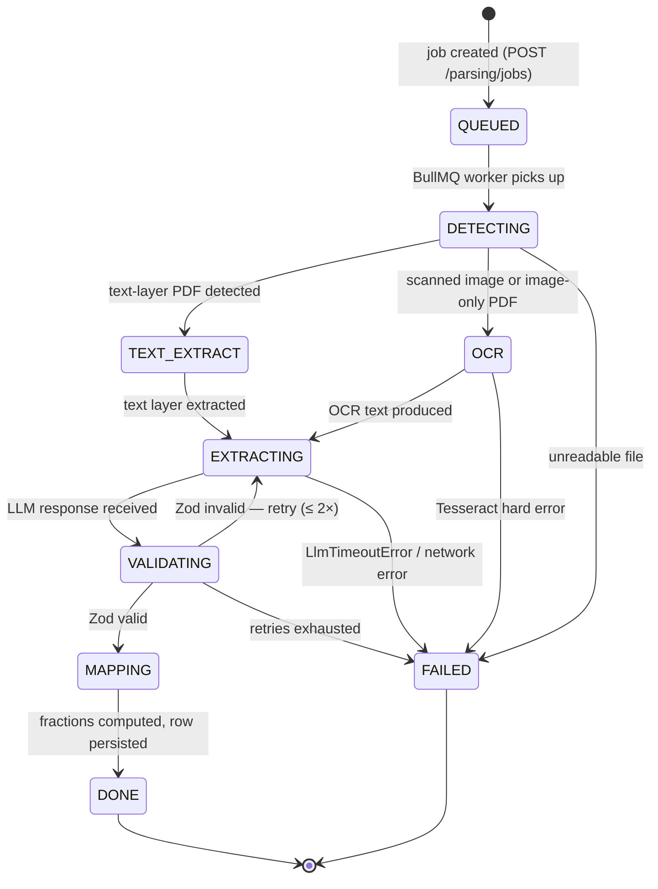

# Parsing Module

> **Status:** Draft v0.1 · **Phase:** 2 · **Owner area:** backend
> **Related:** [phases/phase-2-parsing.md](../../phases/phase-2-parsing.md) · [backend/modules/documents-storage.md](./documents-storage.md) · [backend/modules/scoring.md](./scoring.md) · [architecture/03-scoring-engine.md](../../architecture/03-scoring-engine.md) · [architecture/05-security-privacy.md](../../architecture/05-security-privacy.md) · [SCOPE.md](../../SCOPE.md)

The parsing module is the Phase 2 orchestration layer that turns a raw resume or scanned document into a set of normalized `[0,1]` parameter fractions ready for the scoring engine. It owns the full pipeline: file ingestion → format detection → OCR (when needed) → LLM-structured extraction validated by a Zod schema → per-field confidence scoring → rubric mapping → human-in-the-loop confirmation. All processing is strictly in-house; candidate PII never reaches a third-party service (SCOPE §2 decision 20, §10, §11).

---

## Responsibility

**One purpose:** accept a resume or supporting document upload, run it through a multi-stage async pipeline, and produce a validated, confidence-annotated `ExtractedResume` that pre-fills the scoring wizard and maps to `Partial<ParameterValues>` fractions for the `@stabil/scoring` engine — with a mandatory candidate confirmation step before any score run proceeds.

---

## Public API

### Endpoints

| Method | Path | Auth | Description |
|--------|------|------|-------------|
| `POST` | `/api/v1/parsing/jobs` | `candidate` JWT | Submit a resume for parsing. Idempotent by SHA-256 file hash. Returns `202 Accepted` with `jobId`. |
| `GET` | `/api/v1/parsing/jobs/:jobId` | `candidate` (owner) \| `admin` | Poll job status and, once `DONE`, receive the inline `ExtractedResume`. |
| `GET` | `/api/v1/parsing/jobs/:jobId/extracted` | `candidate` (owner) \| `admin` | Retrieve the full `ExtractedResume` independently of status payload. Only available when `status = DONE`. |
| `POST` | `/api/v1/parsing/jobs/:jobId/confirm` | `candidate` (owner) | Submit candidate-confirmed or corrected field values. Triggers rubric re-mapping and writes confirmed fractions into `CandidateInput` for the profile's next score run. |

All endpoints live under the NestJS `ParsingModule` at `apps/api/src/parsing/`.

### Request — `POST /api/v1/parsing/jobs`

```
Content-Type: multipart/form-data
```

| Field | Type | Required | Notes |
|-------|------|----------|-------|
| `file` | binary | yes | PDF, JPEG, PNG, or WEBP. Max 10 MB. |
| `profileId` | string (UUID v7) | yes | The candidate profile to associate this job with. |
| `mode` | `"fresher"` \| `"professional"` | yes | Scopes extraction hints so the prompt focuses on the right parameter set. |

**Success response — `202 Accepted`:**

```jsonc
{
  "jobId": "01hx7b3kn9e2v8f1a0c4d5e6f7",
  "status": "QUEUED",
  "cached": false   // true when idempotency returns an existing DONE job
}
```

**Error responses** (RFC 9457 problem+json):

| Status | `type` | When |
|--------|--------|------|
| `400` | `stabil:parsing/invalid-file-type` | MIME type not in allowlist |
| `400` | `stabil:parsing/file-too-large` | File exceeds 10 MB |
| `400` | `stabil:parsing/missing-profile` | `profileId` does not exist |
| `401` | `stabil:auth/unauthenticated` | No valid JWT |
| `403` | `stabil:auth/forbidden` | JWT subject does not own `profileId` |

### Response — `GET /api/v1/parsing/jobs/:jobId`

```jsonc
{
  "jobId": "01hx7b3kn9e2v8f1a0c4d5e6f7",
  "status": "DONE",
  // QUEUED | DETECTING | OCR | TEXT_EXTRACT | EXTRACTING | VALIDATING | MAPPING | DONE | FAILED
  "fileHash": "sha256:3a7f…",
  "inputType": "TEXT_PDF",           // TEXT_PDF | SCANNED_IMAGE | null (before detection)
  "createdAt": "2026-06-06T10:00:00Z",
  "updatedAt": "2026-06-06T10:01:02Z",
  "extracted": { /* ExtractedResume — present only when status = DONE */ },
  "clarifications": [                 // low-confidence fields awaiting user input
    { "field": "totalExperienceMonths", "confidence": 0.41, "hint": "Could not determine end date for role at Acme Corp — how many months did you work there?" }
  ],
  "error": null                       // RFC 9457 problem object when status = FAILED
}
```

### Request — `POST /api/v1/parsing/jobs/:jobId/confirm`

```jsonc
{
  "confirmedValues": {
    "totalExperienceMonths": 36,
    "averageTenureMonths": 18,
    "educationEntries": [
      { "institution": "IIT Delhi", "degree": "B.Tech", "gpa": 8.4, "gpaScale": 10.0, "graduationYear": 2022 }
    ],
    "programmingLanguages": ["python", "typescript"]
    // … any subset of ExtractedResume fields the candidate corrected
  }
}
```

On success the module re-runs `mapExtractedResumeToFractions` against the merged (extracted + confirmed) values, writes the result into `CandidateInput` for the profile, and returns `200 OK` with the updated `ParseJob`.

---

## Data Model Touched

### Prisma additions (Phase 2 migration)

```prisma
// apps/api/prisma/schema.prisma — Phase 2 additions

model Document {
  // Existing model from documents-storage module — parsing adds a relation.
  id          String       @id @default(uuid())
  profileId   String
  profile     Profile      @relation(fields: [profileId], references: [id])
  bucket      String       // "resumes-raw"
  objectKey   String       // MinIO object key
  mimeType    String
  sizeBytes   Int
  fileHash    String       // SHA-256 hex — used for idempotency lookup
  parseJob    ParseJob?    // one-to-one (one Document → at most one ParseJob)
  createdAt   DateTime     @default(now())
  updatedAt   DateTime     @updatedAt

  @@index([profileId])
  @@index([fileHash])
}

model ParseJob {
  id              String          @id @default(uuid()) // UUID v7 assigned in application layer
  profileId       String
  profile         Profile         @relation(fields: [profileId], references: [id])
  documentId      String          @unique
  document        Document        @relation(fields: [documentId], references: [id])
  fileHash        String          // SHA-256 hex — denormalised for fast idempotency check
  status          ParseJobStatus  @default(QUEUED)
  inputType       ParseInputType?  // resolved during DETECTING stage

  // JSON columns — typed via ExtractedResume / companion types
  extractedResume Json?           // ExtractedResume when status = DONE
  clarifications  Json?           // Array<{ field: string; confidence: number; hint: string }>
  confirmedValues Json?           // Candidate-supplied field overrides from /confirm

  errorDetail     String?         // Human-readable error + stack trace (truncated) on FAILED

  // Observability
  llmModel        String?         // e.g. "llama3.2:8b"
  llmLatencyMs    Int?
  ocrLatencyMs    Int?
  retryCount      Int             @default(0)

  createdAt  DateTime @default(now())
  updatedAt  DateTime @updatedAt

  @@index([profileId])
  @@index([fileHash, profileId])  // idempotency lookup
  @@index([status])               // queue monitoring
}

enum ParseJobStatus {
  QUEUED
  DETECTING
  OCR
  TEXT_EXTRACT
  EXTRACTING
  VALIDATING
  MAPPING
  DONE
  FAILED
}

enum ParseInputType {
  TEXT_PDF
  SCANNED_IMAGE
}
```

The `extractedResume` and `clarifications` columns are stored as Postgres `jsonb`. The application layer validates against `ExtractedResumeSchema` (Zod) before writing and after reading, so a corrupt column value never silently escapes into the pipeline.

---

## Dependencies

| Dependency | Source | Notes |
|------------|--------|-------|
| `documents-storage` module | sibling NestJS module | Provides `MinioStorageService` — see [documents-storage.md](./documents-storage.md) |
| `packages/types` | monorepo | `LlmAdapter`, `ExtractedResumeSchema`, env schema |
| `packages/core` | monorepo | `mapExtractedResumeToFractions` rubric function |
| `packages/scoring` | monorepo | Downstream consumer of fractions; not imported by `parsing` directly |
| **BullMQ** (`bullmq`) | npm | Async job queue |
| **ioredis** (`ioredis`) | npm | BullMQ Redis transport |
| **Redis** | infrastructure | Sidecar; added in Phase 2 dev docker-compose (`redis:7-alpine`) |
| **Ollama** | infrastructure | Default LLM backend; `http://localhost:11434` or `OLLAMA_BASE_URL` |
| **`pdfjs-dist`** | npm | Text-layer extraction from PDF files |
| **`tesseract.js`** | npm | Node-native OCR; runs in worker threads |
| **Zod** | monorepo shared | Schema validation; guards against LLM hallucination |
| `Profile` Prisma model | Phase 1 | `ParseJob` has a foreign key into `Profile` |

---

## LLM Adapter Interface

The adapter contract is **provider-agnostic by design**. It lives in `packages/types/src/parsing/llm-adapter.ts` and is the only thing `ExtractionService` knows about. Swapping from Ollama to a managed provider means writing a new class that satisfies this interface and registering it via the NestJS DI token `LLM_ADAPTER` — no pipeline code changes (SCOPE §2 decision 20).

```typescript
// packages/types/src/parsing/llm-adapter.ts

export interface LlmExtractionRequest {
  /** Plain text of the resume (post-OCR or post-PDF-extract). */
  text: string;
  /**
   * Prompt template key — maps to a versioned file in
   * `apps/api/src/parsing/prompts/` (e.g. "resume-extraction-v1").
   * Versioning ensures prompt changes are auditable.
   */
  promptKey: string;
  /** Maximum tokens the model may emit. Defaults to 2 048. */
  maxTokens?: number;
}

export interface LlmExtractionResponse {
  /** Raw JSON string returned by the model before Zod validation. */
  rawJson: string;
  /** Canonical model identifier used (e.g. "llama3.2:8b"). For observability. */
  model: string;
  /** Wall-clock request latency in milliseconds. */
  latencyMs: number;
  /** Token usage — optional; populated when the provider exposes it. */
  usage?: { promptTokens: number; completionTokens: number };
}

/**
 * One implementation per LLM provider.
 * Registered in NestJS DI under the token `LLM_ADAPTER`.
 * Factory selects implementation from env var `LLM_ADAPTER` (default: "ollama").
 */
export interface LlmAdapter {
  /** Unique provider name used in logs and observability (e.g. "ollama", "openai"). */
  readonly name: string;
  /**
   * Send `request.text` to the model using `request.promptKey` as the system
   * prompt template. Must return valid JSON in `rawJson` or throw a typed error.
   */
  extract(request: LlmExtractionRequest): Promise<LlmExtractionResponse>;
  /**
   * Optional liveness check — called by `/api/v1/health`.
   * Should resolve `true` within 5 s or reject.
   */
  healthCheck?(): Promise<boolean>;
}
```

### Default implementation — `OllamaAdapter`

**File:** `apps/api/src/parsing/adapters/ollama.adapter.ts`

- Connects to `OLLAMA_BASE_URL` (default `http://localhost:11434`). Startup guard rejects any URL with a public hostname unless `ALLOW_EXTERNAL_LLM=true` is explicitly set (PII safety — SCOPE §11).
- Posts to `/api/generate` with `format: "json"` so Ollama constrains the model's output to a JSON token stream.
- System prompt loaded from `apps/api/src/parsing/prompts/resume-extraction-v1.txt` (version-stamped; changing the prompt increments the version so prompt regressions are auditable).
- Default model: `llama3.2:8b` (overridable via `OLLAMA_MODEL` env var).
- Request timeout: 60 s; throws typed `LlmTimeoutError` on expiry.
- On `LlmTimeoutError` or network error: `ParseJobWorker` transitions the job to `FAILED` immediately (no retry at the HTTP layer; BullMQ retry handles the outer loop).

### Stub implementation — `StubLlmAdapter`

**File:** `apps/api/src/parsing/adapters/stub.adapter.ts`

Returns fixture-keyed pre-recorded JSON responses from `apps/api/src/parsing/eval/fixtures/*.expected.json`. Used in CI (`LLM_ADAPTER=stub`) and unit tests so the full pipeline (schema validation, confidence logic, rubric mapping) runs deterministically without a live Ollama process.

### Provider swap procedure

```
# 1. Implement the interface
class OpenAiAdapter implements LlmAdapter { … }

# 2. Register in NestJS DI factory
# apps/api/src/parsing/parsing.module.ts
{
  provide: 'LLM_ADAPTER',
  useFactory: (config: ConfigService) =>
    config.get('LLM_ADAPTER') === 'openai'
      ? new OpenAiAdapter(config)
      : new OllamaAdapter(config),
  inject: [ConfigService],
}

# 3. Set env var
LLM_ADAPTER=openai
ALLOW_EXTERNAL_LLM=true   # required for any non-loopback provider
```

No code in `ExtractionService`, `ParseJobWorker`, or any other pipeline stage changes.

---

## Extraction Schema (Zod)

Defined in `packages/types/src/parsing/extracted-resume.ts`. This is the **single source of truth** for the shape the LLM must emit, the shape stored in `ParseJob.extractedResume`, and the shape consumed by the rubric layer. The Zod parse is the primary defence against LLM hallucination — any field that cannot be coerced to the schema fails validation and triggers a corrective retry.

```typescript
// packages/types/src/parsing/extracted-resume.ts
import { z } from "zod";

// ── Sub-schemas ────────────────────────────────────────────────────────────────

export const ExperienceEntrySchema = z.object({
  company:       z.string().min(1),
  title:         z.string().min(1),
  /** ISO 8601 partial date — e.g. "2021-03" or "2021". */
  startDate:     z.string().regex(/^\d{4}(-\d{2})?$/),
  /** null when the role is current. */
  endDate:       z.string().regex(/^\d{4}(-\d{2})?$/).nullable(),
  /** Computed tenure in full months; null when dates are absent or unparseable. */
  tenureMonths:  z.number().int().nonnegative().nullable(),
  /** Best-effort domain / industry classification. */
  domain:        z.string().optional(),
  confidence:    z.number().min(0).max(1),
});
export type ExperienceEntry = z.infer<typeof ExperienceEntrySchema>;

export const EducationEntrySchema = z.object({
  institution:    z.string().min(1),
  degree:         z.string().min(1),
  field:          z.string().optional(),
  graduationYear: z.number().int().min(1950).max(2100).nullable(),
  /**
   * Raw GPA on whatever scale the resume uses.
   * The rubric layer normalises: fraction = gpa / gpaScale.
   */
  gpa:            z.number().nonnegative().nullable(),
  /** Denominator of the GPA scale (e.g. 4.0, 10.0). */
  gpaScale:       z.number().positive().nullable(),
  confidence:     z.number().min(0).max(1),
});
export type EducationEntry = z.infer<typeof EducationEntrySchema>;

export const ProjectEntrySchema = z.object({
  name:          z.string().min(1),
  description:   z.string().optional(),
  technologies:  z.array(z.string()),
  url:           z.string().url().optional(),
  confidence:    z.number().min(0).max(1),
});
export type ProjectEntry = z.infer<typeof ProjectEntrySchema>;

export const CertificationEntrySchema = z.object({
  name:       z.string().min(1),
  issuer:     z.string().optional(),
  issuedDate: z.string().regex(/^\d{4}(-\d{2})?$/).optional(),
  confidence: z.number().min(0).max(1),
});
export type CertificationEntry = z.infer<typeof CertificationEntrySchema>;

// ── Root schema ────────────────────────────────────────────────────────────────

export const ExtractedResumeSchema = z.object({
  // Working Professional primary signals (SCOPE §4.4)
  experienceEntries:      z.array(ExperienceEntrySchema),
  /** Total months of professional experience across all entries. */
  totalExperienceMonths:  z.number().int().nonnegative().nullable(),
  /** Average tenure per role in months — key input for the `tenure` parameter. */
  averageTenureMonths:    z.number().nonneg().nullable(),

  // Fresher primary signals (SCOPE §4.3)
  educationEntries:       z.array(EducationEntrySchema),
  projectEntries:         z.array(ProjectEntrySchema),

  // Both modes
  certifications:         z.array(CertificationEntrySchema),
  /** Flat, deduplicated, lowercased skill tokens. */
  skills:                 z.array(z.string()),
  /** Programming languages — subset of `skills`; stored separately for direct parameter mapping. */
  programmingLanguages:   z.array(z.string()),
  /** Natural/spoken languages (e.g. ["english", "hindi"]). Professional mode primary. */
  spokenLanguages:        z.array(z.string()),

  // Common block (SCOPE §4.5)
  /** Location string as written on the resume — rubric resolves to country/region. */
  location:               z.string().nullable(),
  /** Cloud platforms detected (e.g. ["aws", "azure", "gcp"]). Fresher `cloudExposure` input. */
  cloudPlatforms:         z.array(z.string()),
  /** AI tools and frameworks detected. Fresher `aiFamiliarity` input. */
  aiTools:                z.array(z.string()),

  // Extraction metadata
  /** Mean of all per-field confidence values: 0.0–1.0. */
  overallConfidence:      z.number().min(0).max(1),
  /**
   * Fields with confidence < CONFIDENCE_THRESHOLD (default 0.60).
   * Drives the inline clarification prompts shown in the review wizard step.
   */
  lowConfidenceFields:    z.array(z.object({
    field:      z.string(),          // JSON path, e.g. "totalExperienceMonths"
    confidence: z.number().min(0).max(1),
    hint:       z.string(),          // Human-readable clarification question
  })),
});

export type ExtractedResume = z.infer<typeof ExtractedResumeSchema>;
```

### Mapping extracted fields to parameter fractions

Rubric function: `packages/core/src/rubrics/resume.ts` — `mapExtractedResumeToFractions(extracted, mode)`.

The engine never sees raw months, GPA values, or counts — it only sees `[0,1]` fractions (SCOPE §10, `README.md` conventions). Fractions from parsing are **pre-fills, not overrides**: if the candidate edits a field in the confirmation step the confirmed value is re-run through the rubric and replaces the parsed fraction for that parameter only.

| Extracted field | Parameter key | Rubric logic (placeholder — calibrate per SCOPE §13) |
|---|---|---|
| `totalExperienceMonths` | `totalExperience` | Linear bands: 0 → 0.0; 24 mo → 0.4; 60 mo → 0.75; 120+ mo → 1.0 |
| `averageTenureMonths` | `tenure` | Short-hop inverted penalty: < 6 mo avg → 0.1; 12 mo → 0.5; 24+ mo → 1.0 |
| `educationEntries[0].gpa / gpaScale` | `academics` | Normalised GPA fraction × institution-tier multiplier (TBD calibration) |
| `projectEntries.length` + tech breadth | `projects` | Count × tech-diversity coefficient; saturation cap TBD |
| `certifications.length` | `courseCertifications` | Count-based; issuer-prestige weighting TBD |
| `programmingLanguages.length` | `programmingLanguages` | Count-based; 5+ → 1.0 (saturation) |
| `spokenLanguages.length` | `spokenLanguages` | Count-based; 4+ → 1.0 (saturation) |
| `cloudPlatforms.length > 0` | `cloudExposure` | Presence + multi-cloud bonus TBD |
| `aiTools.length > 0` | `aiFamiliarity` | Presence + depth signal TBD |
| `location` | `location` | Country/region lookup for relocation-readiness signal |

All rubric constants are marked `/* TODO: calibrate — SCOPE §13 */` in the source. The eval harness detects regressions if constants are changed without updating fixtures.

---

## Key Flows

### Pipeline overview (Mermaid)

```mermaid
flowchart TD
  A([Candidate uploads resume]) --> B[POST /api/v1/parsing/jobs]
  B --> C{SHA-256 hash\nalready DONE for this profile?}
  C -- cache hit --> D[202 Accepted — return cached jobId]
  C -- miss --> E[Store file in MinIO\nbucket: resumes-raw]
  E --> F[Create ParseJob row\nstatus: QUEUED]
  F --> G[Enqueue in BullMQ\nParseJobQueue]

  G --> H[ParseJobWorker picks up]
  H --> I{Detect input type\nstatus: DETECTING}

  I -- text PDF\n≥20 chars on p1 --> J[PdfTextService\npdfjs-dist getTextContent\nstatus: TEXT_EXTRACT]
  I -- scanned image\nor image-only PDF --> K[OcrService\ntesseract.js worker thread\nstatus: OCR]

  J --> L[Normalize: strip\nheaders, collapse whitespace]
  K --> L

  L --> M[ExtractionService\nLlmAdapter.extract\nstatus: EXTRACTING]
  M --> N{ExtractedResumeSchema\n.safeParse\nstatus: VALIDATING}

  N -- invalid → retry ≤ 2 --> M
  N -- invalid → retries exhausted --> O[status: FAILED\nwrite errorDetail]
  M -- LlmTimeoutError / network --> O

  N -- valid --> P[ConfidenceService\nannotate per-field confidence\npopulate lowConfidenceFields]
  P --> Q{Any field confidence\n< CONFIDENCE_THRESHOLD\n(default 0.60)}
  Q -- yes --> R[Add to ParseJob.clarifications]
  Q -- no  --> S[Proceed]
  R --> S

  S --> T[RubricMappingService\npackages/core\nExtractedResume → Partial‹ParameterValues›\nstatus: MAPPING]
  T --> U[Persist ExtractedResume\n+ clarifications + fractions\nstatus: DONE]

  U --> V[FE polls\nGET /api/v1/parsing/jobs/:id]
  V --> W[Review wizard step\npre-filled + low-conf flags]
  W --> X{Candidate confirms\nor corrects}
  X --> Y[POST /api/v1/parsing/jobs/:id/confirm]
  Y --> Z[Re-run rubric on merged values\nWrite fractions into CandidateInput]
  Z --> AA[Score run\nPOST /api/v1/profiles/:id/scores]
```

### Job state machine



### Sequence — upload to score run

```mermaid
sequenceDiagram
  actor C as Candidate
  participant FE as Web / Mobile
  participant API as NestJS API
  participant MinIO
  participant Redis as Redis / BullMQ
  participant Worker as ParseJobWorker
  participant Ollama
  participant DB as PostgreSQL

  C->>FE: Selects resume file
  FE->>API: POST /api/v1/parsing/jobs (multipart)
  API->>API: Validate MIME type + size
  API->>API: SHA-256(file bytes)
  API->>DB: Lookup ParseJob by (fileHash, profileId)
  alt Cache hit — DONE
    DB-->>API: existing ParseJob
    API-->>FE: 202 Accepted { jobId, cached: true }
  else Cache miss
    API->>MinIO: upload(file, "resumes-raw", key)
    MinIO-->>API: objectKey
    API->>DB: INSERT ParseJob (status: QUEUED)
    API->>Redis: BullMQ.add("parse-job", { jobId })
    API-->>FE: 202 Accepted { jobId, cached: false }
  end

  loop Poll every 3 s
    FE->>API: GET /api/v1/parsing/jobs/:jobId
    API->>DB: SELECT ParseJob
    API-->>FE: { status, … }
  end

  Worker->>Redis: dequeue job
  Worker->>DB: UPDATE status = DETECTING
  Worker->>MinIO: download file bytes
  Worker->>Worker: DetectionService.detect()
  alt TEXT_PDF
    Worker->>Worker: PdfTextService.extract()
    Worker->>DB: UPDATE status = TEXT_EXTRACT
  else SCANNED_IMAGE
    Worker->>Worker: OcrService.ocr() [worker thread]
    Worker->>DB: UPDATE status = OCR
  end
  Worker->>DB: UPDATE status = EXTRACTING
  Worker->>Ollama: POST /api/generate { prompt, text, format: "json" }
  Ollama-->>Worker: rawJson
  Worker->>Worker: ExtractedResumeSchema.safeParse(rawJson)
  alt Zod invalid (retry ≤ 2×)
    Worker->>Ollama: retry with corrective prompt
  end
  Worker->>DB: UPDATE status = VALIDATING → MAPPING
  Worker->>Worker: ConfidenceService.annotate()
  Worker->>Worker: RubricMappingService.map()
  Worker->>DB: UPDATE ParseJob { status: DONE, extractedResume, clarifications }

  FE->>API: GET /api/v1/parsing/jobs/:jobId
  API-->>FE: { status: DONE, extracted: {…}, clarifications: [{…}] }
  FE->>C: Show review wizard step (pre-filled + low-conf flags)

  C->>FE: Corrects fields, clicks Confirm
  FE->>API: POST /api/v1/parsing/jobs/:jobId/confirm { confirmedValues }
  API->>Worker: (sync) merge + re-run rubric
  API->>DB: UPDATE ParseJob.confirmedValues; UPDATE CandidateInput fractions
  API-->>FE: 200 OK
  FE->>API: POST /api/v1/profiles/:profileId/scores
```

---

## Confidence Scoring & Low-Confidence Handling

Each field in `ExtractedResume` carries a `confidence: number` in `[0, 1]`. The global threshold is `CONFIDENCE_THRESHOLD = 0.60` (env-configurable via `CONFIDENCE_THRESHOLD`; default in `apps/api/src/parsing/constants.ts`).

### Decision matrix

| Band | Confidence | UI treatment | Score impact |
|------|-----------|--------------|--------------|
| High | ≥ 0.90 | Auto-filled with green "auto-filled" badge; editable | Fraction used as-is |
| Medium | 0.60–0.89 | Auto-filled with amber caution indicator ("we estimated this") | Fraction used, candidate encouraged to verify |
| Low | < 0.60 | Field left blank or shown struck-through; inline clarification question rendered below the field | `null` fraction (→ 0 points) until candidate responds |
| Absent | Field not present in LLM response | Field left blank; generic empty-state hint | `null` fraction |

`ConfidenceService` computes `overallConfidence = mean(all per-field confidences)`. It populates `lowConfidenceFields` — an ordered list of `{ field, confidence, hint }` tuples — stored in `ParseJob.clarifications`. The review wizard renders each low-confidence entry as an **inline contextual input immediately below the affected field** (not a modal). A dismissed clarification results in `null` for that parameter's fraction; the candidate accepts the score consequence.

### Confidence annotator logic

```typescript
// apps/api/src/parsing/services/confidence.service.ts (excerpt)

const CONFIDENCE_THRESHOLD = parseFloat(process.env.CONFIDENCE_THRESHOLD ?? "0.60");

function annotate(extracted: ExtractedResume): ExtractedResume {
  const allConfidences: number[] = [];

  // Collect leaf confidences from all sub-schemas
  for (const entry of extracted.experienceEntries) allConfidences.push(entry.confidence);
  for (const entry of extracted.educationEntries)  allConfidences.push(entry.confidence);
  for (const entry of extracted.projectEntries)    allConfidences.push(entry.confidence);
  for (const entry of extracted.certifications)    allConfidences.push(entry.confidence);

  const overallConfidence =
    allConfidences.length > 0
      ? allConfidences.reduce((a, b) => a + b, 0) / allConfidences.length
      : 0;

  const lowConfidenceFields = buildLowConfidenceList(extracted, CONFIDENCE_THRESHOLD);

  return { ...extracted, overallConfidence, lowConfidenceFields };
}
```

---

## Idempotency

Before enqueueing a new `ParseJob`, the controller computes `SHA-256(file bytes)` and queries:

```sql
SELECT id, status FROM "ParseJob"
WHERE "fileHash" = $1 AND "profileId" = $2
LIMIT 1;
```

If a row with `status = DONE` exists, the controller returns that `jobId` immediately with `cached: true` in the response body — no new MinIO upload, no new queue entry, no re-parse. This prevents wasted compute when the candidate refreshes the upload page or submits the same resume twice.

If the existing job has `status = FAILED`, the API creates a fresh `ParseJob` (the previous failure is preserved for audit). If the existing job is in an in-progress status (`QUEUED` through `MAPPING`), the API returns that job's `jobId` for polling — no duplicate enqueue.

---

## Validation & Errors

### Schema validation as hallucination guard

`ExtractedResumeSchema.safeParse(rawJson)` is the **first defence** against LLM hallucination. The schema uses strict Zod — no `.passthrough()`, no `.unknown()`. Any field the model invents outside the schema is stripped by Zod's default `strip` mode. Fields that are present but fail type constraints (e.g. a `confidence` of 1.5, a date string in the wrong format) cause a parse failure, which triggers a corrective retry prompt.

**Corrective retry prompt:** on Zod failure the `ExtractionService` sends a second prompt to the model that includes:
1. The original extraction prompt.
2. The raw JSON string the model returned.
3. The Zod error messages serialized as a numbered list.
4. The instruction: "Fix the JSON to satisfy the constraints above. Return only valid JSON."

Up to two retries. On exhaustion → `FAILED` state with `errorDetail` storing the last Zod error.

### Error catalogue

| Error type | Class | When thrown | HTTP mapping |
|------------|-------|-------------|--------------|
| Invalid MIME type | `InvalidFileTypeError` | Controller — upload validation | 400 |
| File too large | `FileTooLargeError` | Controller — size guard | 400 |
| Profile not found | `ProfileNotFoundError` | Controller — profile lookup | 400 |
| LLM timeout | `LlmTimeoutError` | OllamaAdapter | Worker → FAILED |
| LLM Zod retries exhausted | `ExtractionValidationError` | ExtractionService | Worker → FAILED |
| OCR failure | `OcrError` | OcrService | Worker → FAILED |
| Unreadable file | `FileDetectionError` | DetectionService | Worker → FAILED |
| Job not found | `ParseJobNotFoundError` | Controller — GET/confirm | 404 |
| Wrong owner | `ForbiddenError` | Guard | 403 |

All errors that transition the job to `FAILED` write a truncated error message + stack into `ParseJob.errorDetail`. The `GET /api/v1/parsing/jobs/:jobId` response surfaces an RFC 9457 `problem+json` object in the `error` field when `status = FAILED`.

---

## Security & Permissions

### Access control

| Action | Allowed roles |
|--------|--------------|
| `POST /api/v1/parsing/jobs` | `candidate` — must own `profileId` |
| `GET /api/v1/parsing/jobs/:jobId` | `candidate` (owner of associated profile) · `admin` |
| `GET /api/v1/parsing/jobs/:jobId/extracted` | `candidate` (owner) · `admin` |
| `POST /api/v1/parsing/jobs/:jobId/confirm` | `candidate` (owner) only |

Ownership is verified via `ParseJobOwnerGuard`: the guard resolves `ParseJob.profileId` from the DB and compares against the JWT subject. A `403 Forbidden` (RFC 9457) is returned if they don't match. Admins bypass ownership checks via the `admin` role check in the guard.

### PII safety (non-negotiable — SCOPE §2 decision 20, §11)

| Constraint | Implementation |
|------------|----------------|
| Raw files stored only in MinIO (self-hosted) | No file bytes written to external storage or logged |
| Ollama on loopback or private network only | `OllamaAdapter` startup guard: `new URL(OLLAMA_BASE_URL).hostname` must be `localhost`, `127.0.0.1`, or a private CIDR (`10.x`, `172.16-31.x`, `192.168.x`). Throws `StartupError` on violation unless `ALLOW_EXTERNAL_LLM=true` is explicitly set. |
| `extractedResume` column encrypted at rest | Postgres host-level encryption; access via Prisma only within the `parsing` module |
| No raw resume text in logs | `ParseJobWorker` logs job IDs, status transitions, and latencies only. Raw text strings and JSON payloads are never written to the logger. Verified by log-inspection integration test. |
| Adapter swap PII warning | If `LLM_ADAPTER != "ollama"`, API emits a `warn`-level log: `"PII notice: LLM_ADAPTER is not 'ollama' — resume text will be sent to an external provider. Set ALLOW_EXTERNAL_LLM=true to confirm."` |
| Retention aligned to profile lifecycle | `ParseJob` rows and MinIO objects are deleted when the owning profile is deleted (cascade in Prisma + MinIO lifecycle hook). Candidates can request deletion per SCOPE §11. |

---

## Phased Implementation

| Sub-stage | Phase | Description |
|-----------|-------|-------------|
| **P2-1** Infrastructure | 2 | Redis sidecar in dev docker-compose; BullMQ `ParseJobQueue` in `ParsingModule`; env schema additions (`REDIS_URL`, `OLLAMA_BASE_URL`, `OLLAMA_MODEL`, `CONFIDENCE_THRESHOLD`, `LLM_ADAPTER`, `ALLOW_EXTERNAL_LLM`) |
| **P2-2** LLM adapter layer | 2 | `LlmAdapter` interface; `OllamaAdapter`; `StubLlmAdapter`; DI factory |
| **P2-3** Pipeline services | 2 | `DetectionService`, `PdfTextService`, `OcrService`, `ExtractionService`, `ConfidenceService`, `RubricMappingService` |
| **P2-4** `ParseJobWorker` | 2 | BullMQ processor — orchestrates P2-3 services; state-machine transitions; retry logic |
| **P2-5** REST endpoints | 2 | All four endpoints; file-type/size guards; idempotency check; owner guards |
| **P2-6** Rubric additions | 2 | `mapExtractedResumeToFractions` in `packages/core`; unit tests for edge cases |
| **P2-7** Eval harness | 2 | Golden fixtures; `eval.test.ts`; nightly Ollama CI job |
| **Managed LLM swap** | Post-POC | New `LlmAdapter` implementation (e.g. `OpenAiAdapter`); zero pipeline changes |
| **Bulk employer parsing** | Phase 4 | Parallel parse-job submission for employer-submitted candidate batches |

---

## Accuracy / Eval Harness

### Golden-fixture layout

```
apps/api/src/parsing/eval/
├── fixtures/
│   ├── fresher-text.pdf               # text-layer PDF, fresher
│   ├── fresher-scanned.png            # scanned image, fresher (≥ 300 DPI)
│   ├── professional-text.pdf          # text-layer PDF, professional
│   ├── professional-scanned.jpg       # scanned image, professional
│   ├── fresher-text.expected.json     # expected ExtractedResume (tier-1 fields)
│   ├── fresher-scanned.expected.json
│   ├── professional-text.expected.json
│   └── professional-scanned.expected.json
└── eval.test.ts                       # Vitest accuracy suite
```

### Tier-1 fields (CI pass criterion: ≥ 85 % field accuracy)

| Field | Match method |
|-------|-------------|
| `totalExperienceMonths` | Within ± 1 month |
| `averageTenureMonths` | Within ± 1 month |
| `educationEntries[0].gpa` | Within ± 0.05 (raw value) |
| `educationEntries[0].gpaScale` | Exact |
| `skills` | Set overlap ≥ 80 % |
| `programmingLanguages` | Set overlap ≥ 80 % |
| `projectEntries.length` | Exact |

### Running the eval

```bash
# Against live local Ollama (requires Ollama running with llama3.2:8b pulled)
OLLAMA_BASE_URL=http://localhost:11434 pnpm --filter @stabil/api eval:parse

# In CI (deterministic — uses StubLlmAdapter)
LLM_ADAPTER=stub pnpm --filter @stabil/api test

# Nightly job (GitHub Actions — real Ollama in a service container)
# Configured in .github/workflows/eval-nightly.yml
```

The `StubLlmAdapter` reads fixture-keyed pre-recorded responses from the `fixtures/*.expected.json` files — the full pipeline (Zod validation, confidence annotation, rubric mapping) runs deterministically. Accuracy tests against real Ollama run only in the nightly job to keep the standard CI fast.

---

## Testing

| Layer | Tool | What is tested |
|-------|------|----------------|
| Unit — Zod schema | Vitest | `ExtractedResumeSchema.parse()` accepts valid fixtures; rejects missing required fields; rejects `confidence > 1`; rejects malformed date strings |
| Unit — rubric mapping | Vitest | `mapExtractedResumeToFractions` edge cases: `totalExperienceMonths = 0`, `gpa = null`, `programmingLanguages = []`, values at saturation caps |
| Unit — confidence service | Vitest | Mean computation; low-confidence list population; boundary: confidence exactly `0.60` is medium (not low) |
| Unit — detection service | Vitest | Mocked pdfjs response: < 20 chars → `SCANNED_IMAGE`; ≥ 20 chars → `TEXT_PDF` |
| Unit — idempotency | Vitest | Hash lookup: existing `DONE` job → returns cached; existing `FAILED` → creates new; in-progress → returns same jobId |
| Integration — pipeline | Vitest + `StubLlmAdapter` | Full `ParseJobWorker` run from `QUEUED` to `DONE`; all state-machine transitions; corrective retry path; `FAILED` path |
| Integration — endpoints | Supertest | 401 missing JWT; 403 wrong owner; 400 bad MIME type; 400 oversized file; 202 on valid enqueue; correct status body in poll |
| Eval — golden fixtures | Vitest (`eval.test.ts`) | Field accuracy ≥ 85 % on tier-1 fields with `StubLlmAdapter`; nightly with real Ollama |
| E2E — upload to score run | Playwright | Upload a PDF fixture → poll status to `DONE` → advance to review wizard step → accept auto-filled fields → submit confirm → verify score run is triggered |
| Security | Supertest | `ParseJob` row isolation by `profileId`; raw text absent from captured log output during integration run |

---

## Best Practices & Gotchas

- **Tesseract runs in worker threads, not the event loop.** `tesseract.js` can block for 30–90 s on large scanned PDFs. Always wrap it in `Piscina` or `tesseract.js`'s built-in scheduler. The BullMQ job timeout is set to 180 s; OCR jobs approaching this limit surface in job-duration metrics.
- **`pdfjs-dist` text heuristic threshold.** The current heuristic — "< 20 characters extracted from page 1 → treat as scanned" — is a pragmatic default. Resumes with a cover-sheet image followed by a text-layer body can trigger a false `SCANNED_IMAGE`. Monitor misclassification rates on real uploads and tune the threshold or add a multi-page sample.
- **Ollama `format: "json"` does not guarantee schema conformance.** The model is constrained to emit JSON tokens but can still produce a well-formed JSON object that fails Zod. The corrective retry prompt is essential — do not remove it.
- **Prompt versioning is mandatory.** Each prompt file is named with a version suffix (e.g. `resume-extraction-v1.txt`). Changing a prompt without incrementing the version makes it impossible to correlate accuracy regressions to prompt changes. The active version is logged on every extraction call (`llmPromptVersion` field in the observability log line).
- **`extractedResume` column is denormalised JSON.** It is never queried by field — always read as a whole blob and re-validated through Zod in the application layer. Do not add Postgres indexes into the jsonb column for Phase 2; defer to Phase 4 if search-by-field is needed.
- **Fractions are pre-fills, not authoritative.** The confirmed candidate values always win. Never skip the `POST /confirm` step and assume the extracted fractions are final — the candidate must actively confirm (human-in-the-loop is a product requirement per SCOPE §9).
- **`ALLOW_EXTERNAL_LLM` is a deployment safeguard, not a developer convenience.** Never set it in `docker-compose.yml` or commit it to a `.env.example`. It must be set explicitly by an operator who understands the PII implications.
- **Idempotency is profile-scoped, not global.** The same resume file uploaded by two different candidates creates two independent `ParseJob` rows. The hash check is `(fileHash, profileId)` — not `fileHash` alone.
