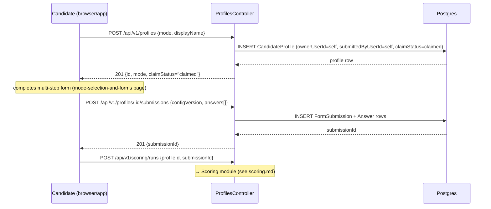
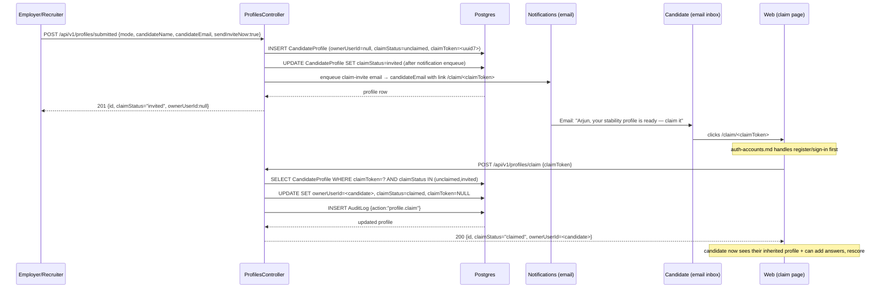
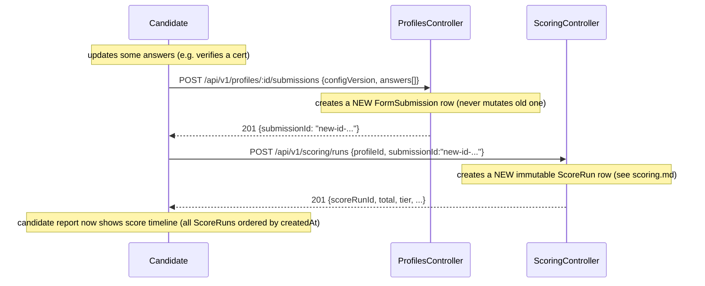

# Profiles Module

> **Status:** Draft v0.1 · **Phase:** 1 · **Owner area:** backend
> **Related:** [auth-accounts.md](./auth-accounts.md) · [scoring.md](./scoring.md) · [consent-sharing.md](./consent-sharing.md) · [architecture/02-data-model.md](../../architecture/02-data-model.md)

The Profiles module is the durable identity spine of every Stabil scoring workflow. It owns the `CandidateProfile`, its intake data (`FormSubmission` + `Answer`), and the claimable-profile lifecycle — the full arc from employer-submitted stub through claim invite to candidate-owned record. Every `ScoreRun` that the Scoring module creates is anchored to a profile here; re-scoring history is therefore inherently a profiles concern.

---

## 1. Responsibility

One purpose: **create, evolve, and gate access to candidate profiles and their intake data**, including profiles created on behalf of a candidate by an employer or recruiter (SCOPE §6.1, decision 16).

Specifically:

- Provide the two profile creation paths: **candidate self-creates** and **employer/recruiter submits-a-candidate**.
- Manage the **claimable profile lifecycle** (`unclaimed → invited → claimed`) and the single-use claim token/invite link.
- Store **FormSubmission + Answer** rows — the raw and normalized intake data per mode per scoring run.
- Surface the **re-scoring history** (the ordered list of `ScoreRun` IDs per profile).
- Enforce **strict ownership and access control** (IDOR prevention, consent gating) so candidates only see their own profiles and employers only see profiles they submitted or that have been explicitly shared with them (sharing is handled by the Consent module).

What this module does **not** do:

- Authenticate users — that is [auth-accounts.md](./auth-accounts.md).
- Execute the scoring algorithm — that is [scoring.md](./scoring.md).
- Persist `ScoreRun` rows — the Scoring module writes them; this module reads their IDs for history.
- Manage per-share consent grants — that is [consent-sharing.md](./consent-sharing.md).
- Store or serve documents — see `documents-storage.md`.

---

## 2. Public API

Base path: `/api/v1/profiles`. All endpoints return `application/json`; errors use RFC 9457 `application/problem+json`.

### 2.1 Candidate self-creates a profile

```
POST /api/v1/profiles
Authorization: Bearer <jwt>        (role: candidate)
```

**Request body**

```jsonc
{
  "mode": "fresher" | "professional",  // required; user-selected (SCOPE §3)
  "displayName": "Riya Mehta",         // optional; shown in employer view
  "location": "Bengaluru, IN"          // optional; populated from form later
}
```

**Response `201 Created`**

```jsonc
{
  "id": "019283ab-...",
  "mode": "fresher",
  "claimStatus": "claimed",             // self-created profiles are immediately claimed
  "ownerUserId": "01927de4-...",
  "submittedByUserId": "01927de4-...", // same as owner on self-creation
  "displayName": "Riya Mehta",
  "location": "Bengaluru, IN",
  "createdAt": "2026-06-06T09:00:00Z"
}
```

**Rules**

- `ownerUserId` is set to the authenticated user's ID immediately (profile is `claimed` from the start).
- `submittedByUserId` is set to the same user.
- A candidate may have only one non-deleted profile (enforced at service level; checked before insert). Attempting a second returns `409 Conflict` with `"code": "PROFILE_ALREADY_EXISTS"`.

---

### 2.2 Employer / recruiter submits a candidate

```
POST /api/v1/profiles/submitted
Authorization: Bearer <jwt>        (role: employer | recruiter)
```

This is the **employer-driven creation path** that produces an unclaimed claimable profile (SCOPE §6.1, decision 16). The employer provides what they know about the candidate; the system creates the profile stub and (optionally) triggers a claim invite.

**Request body**

```jsonc
{
  "mode": "fresher" | "professional",     // required
  "candidateName": "Arjun Sharma",        // required; stored as displayName
  "candidateEmail": "arjun@example.com",  // required; stored as inviteEmail, used to send invite
  "location": "Mumbai, IN",               // optional
  "sendInviteNow": true                   // optional, default true; if true, triggers invite notification immediately
}
```

**Response `201 Created`**

```jsonc
{
  "id": "019284bc-...",
  "mode": "professional",
  "claimStatus": "unclaimed",           // will become "invited" once notification sent
  "ownerUserId": null,                  // null until candidate claims
  "submittedByUserId": "019261af-...", // the employer/recruiter user ID
  "displayName": "Arjun Sharma",
  "inviteEmail": "arjun@example.com",
  "createdAt": "2026-06-06T09:00:00Z"
}
```

**Rules**

- `ownerUserId` is `null`; `claimStatus` is `unclaimed`.
- A single-use `claimToken` (UUID v7, cryptographically random) is generated and stored on the profile row (`CandidateProfile.claimToken @unique`).
- If `sendInviteNow: true`, the Notifications module is called to send a claim-invite email to `inviteEmail` containing the claim link `https://app.stabil.io/claim/<claimToken>`.
- After notification is enqueued, `claimStatus` transitions to `invited`.
- Multiple employers can submit the same candidate email: each creates a **separate** profile row under the submitting employer. Profile de-duplication via email matching is a Phase 4+ concern.

---

### 2.3 Candidate claims a profile

```
POST /api/v1/profiles/claim
Authorization: Bearer <jwt>        (role: candidate; must have no existing claimed profile)
```

The candidate arrives via the claim link, registers or signs in (handled by [auth-accounts.md](./auth-accounts.md)), and then calls this endpoint to take ownership of the unclaimed profile.

**Request body**

```jsonc
{
  "claimToken": "019284bc-..."   // single-use token from the invite link
}
```

**Response `200 OK`**

```jsonc
{
  "id": "019284bc-...",
  "mode": "professional",
  "claimStatus": "claimed",
  "ownerUserId": "01929fe1-...",   // now set to the authenticated candidate
  "submittedByUserId": "019261af-...",
  "displayName": "Arjun Sharma",
  "createdAt": "2026-06-06T09:00:00Z",
  "claimedAt": "2026-06-06T11:30:00Z"  // audit field added on claim
}
```

**Rules**

- Token must exist, be associated with a profile in `invited` or `unclaimed` status, and not be expired (tokens have a configurable TTL, default 30 days; after TTL a re-invite is required).
- After successful claim: `ownerUserId` is set, `claimStatus` becomes `claimed`, `claimToken` is **nullified** (single-use), `inviteEmail` is preserved for reference.
- If the candidate already has a claimed profile, returns `409 Conflict` `"code": "CANDIDATE_ALREADY_HAS_PROFILE"`.
- An `AuditLog` entry (`action: "profile.claim"`) is written transactionally.
- All previously submitted data (`FormSubmission`/`Answer` rows attached to the profile by the employer) is preserved intact — the candidate inherits and can extend it.

---

### 2.4 Save (create or update) a form submission

```
POST /api/v1/profiles/:profileId/submissions
Authorization: Bearer <jwt>        (role: candidate; must be profile owner)
```

Stores one completed intake of the questionnaire. Each call creates a **new** `FormSubmission` row (versioned input; prior submissions are never overwritten). The client drives the multi-step wizard and sends the full completed form here when the candidate finishes.

**Request body**

```jsonc
{
  "configVersion": "v1.0.0",    // required; the parameter-set version the form was built against
  "answers": [
    {
      "parameterKey": "relocation_willingness",
      "rawValue": "yes",
      "normalized": 1.0          // [0,1] fraction — produced by packages/core rubric layer
    },
    {
      "parameterKey": "total_experience_years",
      "rawValue": 6,
      "normalized": 0.72
    }
    // ... one entry per parameter presented in this mode
  ]
}
```

**Response `201 Created`**

```jsonc
{
  "submissionId": "01928c44-...",
  "profileId": "019284bc-...",
  "mode": "professional",
  "configVersion": "v1.0.0",
  "answerCount": 14,
  "createdAt": "2026-06-06T11:35:00Z"
}
```

**Rules**

- `configVersion` must match a known version in the parameter registry; unknown versions return `422 Unprocessable Entity`.
- `normalized` values must be `[0, 1]` inclusive; out-of-range triggers a 422.
- Every `parameterKey` must be recognized for the profile's `mode` (mode-specific or common parameters); unknown keys trigger 422.
- Each `(formSubmissionId, parameterKey)` pair must be unique within the submission; duplicate keys in one payload return 422.
- After a submission is saved, the client should call `POST /api/v1/scoring/runs` (see [scoring.md](./scoring.md)) to trigger scoring against this submission.

---

### 2.5 Get a profile

```
GET /api/v1/profiles/:profileId
Authorization: Bearer <jwt>
```

Returns profile metadata and a summary of scoring history.

**Response `200 OK`**

```jsonc
{
  "id": "019284bc-...",
  "mode": "professional",
  "claimStatus": "claimed",
  "ownerUserId": "01929fe1-...",
  "submittedByUserId": "019261af-...",
  "displayName": "Arjun Sharma",
  "location": "Mumbai, IN",
  "latestScoreRunId": "0192a1b3-...",   // null if no runs yet
  "scoreRunCount": 3,
  "createdAt": "2026-06-06T09:00:00Z",
  "updatedAt": "2026-06-06T11:35:00Z"
}
```

**Permission rules (see §7 for full detail)**

- **Candidate**: must be the `ownerUserId`. IDOR: 404 (not 403) if no match.
- **Employer / Recruiter**: must be the `submittedByUserId`'s org member **or** hold an active `ShareGrant` for this profile (issued by [consent-sharing.md](./consent-sharing.md)). Employer callers without either relation receive 404.
- **Admin**: full access.

---

### 2.6 List my profiles (candidate)

```
GET /api/v1/profiles/mine
Authorization: Bearer <jwt>        (role: candidate)
```

Returns all non-deleted profiles where `ownerUserId` equals the authenticated user.

**Response `200 OK`**

```jsonc
{
  "data": [
    {
      "id": "019284bc-...",
      "mode": "professional",
      "claimStatus": "claimed",
      "latestScoreRunId": "0192a1b3-...",
      "createdAt": "2026-06-06T09:00:00Z"
    }
  ],
  "total": 1
}
```

---

### 2.7 List submitted profiles (employer / recruiter)

```
GET /api/v1/profiles/submitted
Authorization: Bearer <jwt>        (role: employer | recruiter)
```

Returns all non-deleted profiles where `submittedByUserId` is a member of the caller's org, with optional filters.

**Query params**

| Param | Type | Description |
|-------|------|-------------|
| `claimStatus` | `unclaimed\|invited\|claimed` | Filter by claim lifecycle stage |
| `limit` | `integer` | Page size (default 20, max 100) |
| `cursor` | `string` | Pagination cursor (UUID v7 of last seen `id`) |

**Response `200 OK`**

```jsonc
{
  "data": [
    {
      "id": "019284bc-...",
      "mode": "professional",
      "claimStatus": "invited",
      "displayName": "Arjun Sharma",
      "submittedByUserId": "019261af-...",
      "latestScoreRunId": null,
      "createdAt": "2026-06-06T09:00:00Z"
    }
  ],
  "nextCursor": null,
  "total": 1
}
```

---

### 2.8 Get form submissions for a profile

```
GET /api/v1/profiles/:profileId/submissions
Authorization: Bearer <jwt>
```

Returns the list of `FormSubmission` records for a profile, most recent first. Used to show the candidate their submission history and to let the scoring module identify which submission to score.

**Response `200 OK`**

```jsonc
{
  "data": [
    {
      "submissionId": "01928c44-...",
      "mode": "professional",
      "configVersion": "v1.0.0",
      "answerCount": 14,
      "createdAt": "2026-06-06T11:35:00Z"
    }
  ],
  "total": 1
}
```

Permission rules mirror those of `GET /api/v1/profiles/:profileId`.

---

## 3. Data models touched

This module is the primary writer of the following Prisma models (defined authoritatively in [architecture/02-data-model.md](../../architecture/02-data-model.md)):

### 3.1 `CandidateProfile`

The durable person record. Key fields from the perspective of this module:

| Field | Type | Description |
|-------|------|-------------|
| `id` | `String @db.Uuid` | UUID v7, app-generated |
| `mode` | `Mode` | `fresher \| professional`; user-selected; drives mode-specific scoring block |
| `ownerUserId` | `String? @db.Uuid` | `null` for unclaimed profiles; set on claim |
| `submittedByUserId` | `String? @db.Uuid` | Who created the profile (self or employer/recruiter user) |
| `claimStatus` | `ProfileClaimStatus` | `unclaimed → invited → claimed` |
| `claimToken` | `String? @unique` | Single-use opaque token; embedded in invite link; nullified after claim |
| `inviteEmail` | `String?` | Target email for claim invite; persisted for traceability even after claim |
| `displayName` | `String?` | Lightweight display name; full PII lives in `Answer` rows |
| `location` | `String?` | High-level location string; full address in answers |
| `deletedAt` | `DateTime?` | Soft-delete; hard purge by scheduled job |

Indexes used by this module:

```prisma
@@index([ownerUserId])
@@index([submittedByUserId])
@@index([claimStatus])
@@index([deletedAt])
// claimToken has @unique — single-row lookup from claim link
```

### 3.2 `FormSubmission`

One completed intake, versioned by `configVersion`.

| Field | Type | Description |
|-------|------|-------------|
| `id` | `String @db.Uuid` | UUID v7 |
| `candidateProfileId` | `String @db.Uuid` | FK → `CandidateProfile` (cascade delete) |
| `mode` | `Mode` | Snapshot of mode at submission time |
| `source` | `String` | `"form"` (Phase 1); `"parsed"` / `"merged"` in later phases |
| `configVersion` | `String` | Parameter set version (e.g. `"v1.0.0"`) |

```prisma
@@index([candidateProfileId, createdAt])
```

### 3.3 `Answer`

One parameter's answer within a `FormSubmission`.

| Field | Type | Description |
|-------|------|-------------|
| `parameterKey` | `String` | Matches `ParameterDefinition.key` in `@stabil/scoring` |
| `rawValue` | `Json` | Raw answer as submitted (string, number, boolean) — audit/explainability |
| `normalized` | `Float` | `[0, 1]` fraction produced by the rubric layer (`packages/core`); this is what the engine receives |

Unique constraint: `@@unique([formSubmissionId, parameterKey])` — one answer per parameter per submission.

> **Engine boundary reminder:** the `normalized` fraction is produced by the **rubric layer** in `packages/core`, not by the engine in `packages/scoring`. The engine consumes fractions and returns `ScoreResult`; mapping raw answers to fractions is strictly a `packages/core` concern. Never let raw-to-fraction logic bleed into this module.

### 3.4 `ScoreRun` (read-only reference)

The Profiles module **reads** `ScoreRun` to assemble scoring history (`latestScoreRunId`, `scoreRunCount`). It does **not** write `ScoreRun` rows — that is entirely owned by the Scoring module ([scoring.md](./scoring.md)).

Relationship: one `CandidateProfile` → many `ScoreRun`s (the improvement loop history, SCOPE §11 decision 17).

---

## 4. Dependencies

| Dependency | Direction | Why |
|-----------|-----------|-----|
| [auth-accounts.md](./auth-accounts.md) | Profiles ← Auth | JwtAuthGuard + RolesGuard on every endpoint; profile ownership resolved against `User.id` |
| [scoring.md](./scoring.md) | Profiles → Scoring | Profiles module publishes events / exposes `FormSubmission` for the Scoring module to consume; reads back `ScoreRun` IDs |
| [consent-sharing.md](./consent-sharing.md) | Profiles ← Consent | `GET /profiles/:profileId` checks active `ShareGrant` existence (employer access path) via consent module's query helper |
| `notifications.md` | Profiles → Notifications | Claim invite email is enqueued via the Notifications service after profile creation |
| `@stabil/scoring` (`packages/scoring`) | Profiles → Scoring pkg | `ParameterDefinition` registry used to validate `parameterKey` and `configVersion` in `SaveSubmissionDto` |
| `packages/core` (rubric layer) | Caller → Profiles | The client/caller is responsible for producing `normalized` fractions before calling `POST .../submissions`; the Profiles module validates the range but does not compute rubrics itself |

---

## 5. Key flows

### 5.1 Candidate self-creates and submits



### 5.2 Employer submits → claimable profile → candidate claims



### 5.3 Re-scoring (improvement loop)



---

## 6. Validation & errors

All request bodies are validated with **Zod** schemas (shared from `packages/schemas`) before reaching service logic. Failed schema validation returns `422 Unprocessable Entity`.

### 6.1 `CreateProfileDto`

```ts
import { z } from "zod";

export const CreateProfileDto = z.object({
  mode: z.enum(["fresher", "professional"]),
  displayName: z.string().min(1).max(200).optional(),
  location: z.string().max(300).optional(),
});
```

### 6.2 `SubmitCandidateDto` (employer path)

```ts
export const SubmitCandidateDto = z.object({
  mode: z.enum(["fresher", "professional"]),
  candidateName: z.string().min(1).max(200),
  candidateEmail: z.string().email(),
  location: z.string().max(300).optional(),
  sendInviteNow: z.boolean().default(true),
});
```

### 6.3 `ClaimProfileDto`

```ts
export const ClaimProfileDto = z.object({
  claimToken: z.string().uuid(),
});
```

### 6.4 `SaveSubmissionDto`

```ts
export const AnswerDto = z.object({
  parameterKey: z.string().min(1).max(100),
  rawValue: z.unknown(),          // any JSON-serializable value
  normalized: z.number().min(0).max(1),
});

export const SaveSubmissionDto = z.object({
  configVersion: z.string().min(1).max(50),
  answers: z.array(AnswerDto).min(1).max(200),
});
```

### 6.5 Error catalogue

| Situation | HTTP | `code` |
|-----------|------|--------|
| Candidate already has a profile | `409` | `PROFILE_ALREADY_EXISTS` |
| Candidate already claimed a different profile | `409` | `CANDIDATE_ALREADY_HAS_PROFILE` |
| Claim token not found or already used | `404` | `CLAIM_TOKEN_INVALID` |
| Claim token expired (> TTL days) | `410` | `CLAIM_TOKEN_EXPIRED` |
| Profile not found (or IDOR — caller lacks access) | `404` | `PROFILE_NOT_FOUND` |
| Unknown `configVersion` | `422` | `UNKNOWN_CONFIG_VERSION` |
| Unknown `parameterKey` for this mode | `422` | `UNKNOWN_PARAMETER_KEY` |
| `normalized` outside `[0, 1]` | `422` | `NORMALIZED_OUT_OF_RANGE` |
| Duplicate `parameterKey` in one submission | `422` | `DUPLICATE_PARAMETER_KEY` |
| Profile is soft-deleted | `404` | `PROFILE_NOT_FOUND` |
| Caller role not permitted | `403` | `FORBIDDEN` |

All error responses follow RFC 9457:

```jsonc
{
  "type": "https://stabil.io/errors/profile-already-exists",
  "title": "Profile already exists",
  "status": 409,
  "code": "PROFILE_ALREADY_EXISTS",
  "detail": "This candidate account already has a profile. Each candidate may hold one active profile."
}
```

---

## 7. Security & permissions

### 7.1 Authentication

Every endpoint requires a valid JWT issued by [auth-accounts.md](./auth-accounts.md). `JwtAuthGuard` is applied at the controller level; `RolesGuard` restricts individual routes.

### 7.2 IDOR prevention (strict ownership model)

Access to any profile resource always resolves the calling user's relationship to the target profile before returning data. **On mismatch, the response is `404 Not Found` — never `403 Forbidden`** — to avoid leaking the existence of profiles the caller is not entitled to see.

| Caller role | Allowed to access profile | Condition |
|-------------|--------------------------|-----------|
| `candidate` | Own profile only | `profile.ownerUserId === caller.id` |
| `employer` | Profile they submitted | `profile.submittedByUserId` is a member of caller's `employerOrg` |
| `employer` | Shared profile | Active `ShareGrant` issued by candidate for caller's org (verified via consent module) |
| `recruiter` | Profile they submitted | Same org-membership check |
| `recruiter` | Shared profile | Active `ShareGrant` for caller's org |
| `admin` | All profiles | Unrestricted; admin actions are `AuditLog`ged |

Employer/recruiter access to shared profiles is a **read-only** gate — only the profile metadata and latest score summary are returned. The full score breakdown is gated by the `ShareGrant.scope` and filtered by audience visibility rules (see [consent-sharing.md](./consent-sharing.md) and SCOPE §6.3).

### 7.3 Sensitive-attribute suppression

The Profiles module does not serve `ScoreRun` breakdowns directly. When a profile summary includes `latestScoreRunId`, the caller must request the score via the Scoring module ([scoring.md](./scoring.md)), which applies the audience-based `visibility` filter. This module does not short-circuit that boundary.

### 7.4 Claim token security

- `claimToken` is a UUID v7 — 128 bits of entropy, not a sequential or guessable value.
- It is **never** returned in any API response after creation; it lives only in the database and the emailed link.
- The token is **nullified immediately** after a successful claim (`UPDATE SET claimToken = NULL`).
- Tokens have a configurable TTL (default: 30 days). After TTL, the claim endpoint returns `410 Gone`; the employer must re-send an invite which generates a fresh token.
- Brute-force protection: the claim endpoint is rate-limited (10 attempts / IP / minute) by the global throttle guard.

### 7.5 Audit logging

The following profile actions are written to `AuditLog` transactionally:

| Action | `action` key | Trigger |
|--------|-------------|---------|
| Profile created (self) | `"profile.create.self"` | `POST /profiles` |
| Profile submitted (employer) | `"profile.create.submitted"` | `POST /profiles/submitted` |
| Claim invite sent | `"profile.claim.invite"` | After notification enqueue |
| Profile claimed | `"profile.claim"` | `POST /profiles/claim` |
| Profile soft-deleted | `"data.delete"` | Deletion request flow (see [architecture/02-data-model.md](../../architecture/02-data-model.md) §8) |

---

## 8. Phased implementation

### Phase 1 (this document's scope) — form-based intake, both modes, claimable profiles

All endpoints in §2 are in scope. The `FormSubmission.source` is always `"form"`. The rubric layer (`packages/core`) provides `normalized` fractions; the client computes them before calling the API.

**Phase 1 deliverables:**

- `CandidateProfile` CRUD + claim lifecycle.
- `FormSubmission` + `Answer` storage.
- IDOR guards and audit logging.
- Claim token generation, invite notification trigger, TTL enforcement.
- All Zod schemas in `packages/schemas/src/profiles.ts`.
- NestJS module: `apps/api/src/profiles/profiles.module.ts`.

### Phase 2 — Resume & document parsing enrichment

When the Parsing module (see `parsing.md`) extracts structured data from a resume, it creates a `FormSubmission` with `source: "parsed"` or `source: "merged"` (parsed + form answers reconciled). The Profiles module's `POST .../submissions` endpoint accepts these sources from the Parsing module's internal service call (not exposed as a public endpoint). No public API change needed.

### Phase 3 — Verification bonus integration

After a `VerificationCheck` is approved, the Verification module notifies the candidate. The candidate can trigger a re-score (existing `POST /scoring/runs`); the scoring module reads the verified bonus from `VerificationCheck.bonusAwarded` when assembling the `CandidateInput`. No profiles-module change needed.

### Phase 4 — Employer search / comparison dashboard

The `GET /api/v1/profiles/submitted` list will gain richer filters (score tier, location, mode) when Phase 4 brings the multi-candidate comparison dashboard. A `latestScoreRunId` denormalization on `CandidateProfile` (discussed in [architecture/02-data-model.md](../../architecture/02-data-model.md) §7) will be added at that point to avoid per-row `DISTINCT ON` subqueries at scale.

---

## 9. Testing

### 9.1 Unit tests (Vitest)

- **`ProfilesService`**:
  - `createProfile()` — candidate path: sets `ownerUserId`, `claimStatus=claimed`, prevents duplicate profile.
  - `submitCandidate()` — employer path: sets `ownerUserId=null`, `claimStatus=unclaimed`, generates `claimToken`, transitions to `invited` after notification enqueue.
  - `claimProfile()` — happy path: sets owner, nullifies token, writes audit log.
  - `claimProfile()` — token not found → throws `ClaimTokenInvalidException`.
  - `claimProfile()` — token expired → throws `ClaimTokenExpiredException`.
  - `claimProfile()` — already-claimed token → throws `ClaimTokenInvalidException`.
  - `saveSubmission()` — validates `configVersion`, `parameterKey`s, `normalized` range, duplicate keys.
  - `getProfile()` — IDOR: candidate requesting another's profile → returns `null` (404 upstream).
  - `getProfile()` — employer with active `ShareGrant` → returns profile.
  - `getProfile()` — employer without relation → returns `null` (404 upstream).

### 9.2 Integration tests (supertest + test DB)

- Full create → submit → score cycle (Profiles + Scoring modules in tandem).
- Employer submits → invite sent → candidate claims → data preserved (answers from employer-prefill survive claim).
- Re-submission creates new `FormSubmission` row without mutating the prior one.
- Soft-delete: deleted profile returns 404 on all sub-routes.

### 9.3 Key test fixtures

```ts
// packages/test-fixtures/src/profiles.ts

export const fresherProfileFactory = (): CandidateProfile => ({
  id: uuidv7(),
  mode: "fresher",
  claimStatus: "claimed",
  ownerUserId: uuidv7(),
  submittedByUserId: /* same as owner */ "...",
  claimToken: null,
  inviteEmail: null,
  displayName: "Test Candidate",
  location: "Chennai, IN",
  deletedAt: null,
  createdAt: new Date(),
  updatedAt: new Date(),
});

export const unclaimedProfileFactory = (submittedByUserId: string): CandidateProfile => ({
  id: uuidv7(),
  mode: "professional",
  claimStatus: "invited",
  ownerUserId: null,
  submittedByUserId,
  claimToken: uuidv7(),           // not yet nullified
  inviteEmail: "candidate@example.com",
  displayName: "Unowned Candidate",
  location: null,
  deletedAt: null,
  createdAt: new Date(),
  updatedAt: new Date(),
});
```

### 9.4 Acceptance criteria (Phase 1 DoD)

- [ ] Candidate can create exactly one profile; second attempt returns `409`.
- [ ] Employer-submitted profile starts with `ownerUserId = null`, `claimStatus = "invited"`.
- [ ] Claim link with valid token sets `ownerUserId`, nullifies token, writes AuditLog.
- [ ] Expired token (> TTL) returns `410`.
- [ ] Reused token (already nullified) returns `404`.
- [ ] Submission with unknown `configVersion` returns `422`.
- [ ] Submission with `normalized = 1.01` returns `422`.
- [ ] Candidate requesting another candidate's profile receives `404`.
- [ ] Employer without submission/share relation receives `404` on any profile.
- [ ] `FormSubmission` rows accumulate on re-submission; prior rows are not mutated.
- [ ] All actions that should produce `AuditLog` rows do so (verified by integration test querying `AuditLog` table).

---

## 10. Best practices & gotchas

- **IDOR = 404, not 403.** This is a deliberate product decision. Every `findOneForCaller` helper in the service must resolve the permission check and return `null` (not throw Forbidden) when the caller is not entitled. The controller converts `null` to `404`. This prevents enumeration attacks on profile IDs.

- **Never mutate a `FormSubmission`.** The improvement loop works by creating new rows. If you need to "update" an answer, you create a new `FormSubmission` and re-run scoring against it. This preserves the full history and the defensible audit trail.

- **`claimToken` is never in a response body.** It is written to the DB and sent via email only. Any accidental inclusion in a response body is a security bug.

- **Soft-delete before hard-purge.** Setting `deletedAt` makes a profile invisible immediately. The purge job hard-deletes after `GRACE_DAYS`. Do not write a hard `DELETE` in the service layer directly.

- **`configVersion` validation is strict.** The parameter registry must be loaded from `@stabil/scoring`'s known versions at service startup. An unrecognized version is a client error (`422`), not a server error.

- **Token TTL is a config value, not a constant.** Source from `ConfigService` (`CLAIM_TOKEN_TTL_DAYS`, default `30`) so it can be tuned without a code change.

- **One profile per candidate, enforced in service — not DB.** There is no unique constraint on `ownerUserId` in the schema (because `ownerUserId` is nullable for unclaimed profiles and a partial unique index on nullable columns has edge cases). The service checks `count(ownerUserId = callerId AND deletedAt IS NULL)` before insert and throws if > 0. This is a fast index-backed read.

- **`inviteEmail` is PII.** It must be excluded from any non-admin API response after claim (once the candidate owns the profile, their account email is the canonical contact). Serialize carefully in the response DTO; omit `inviteEmail` from all non-admin views.

- **Employer access is org-scoped, not user-scoped.** An employer user who leaves their org loses access to profiles submitted by that org. Membership checks must join through `EmployerOrg` / `RecruiterOrg`, not compare `submittedByUserId === caller.id`.
