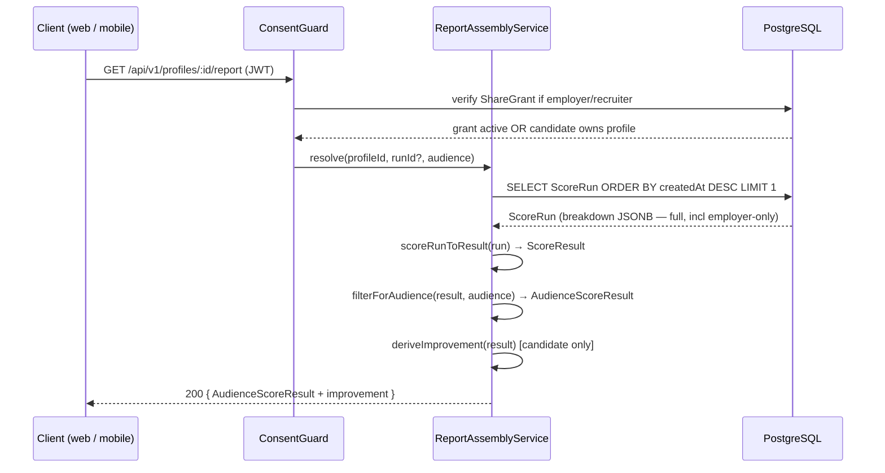
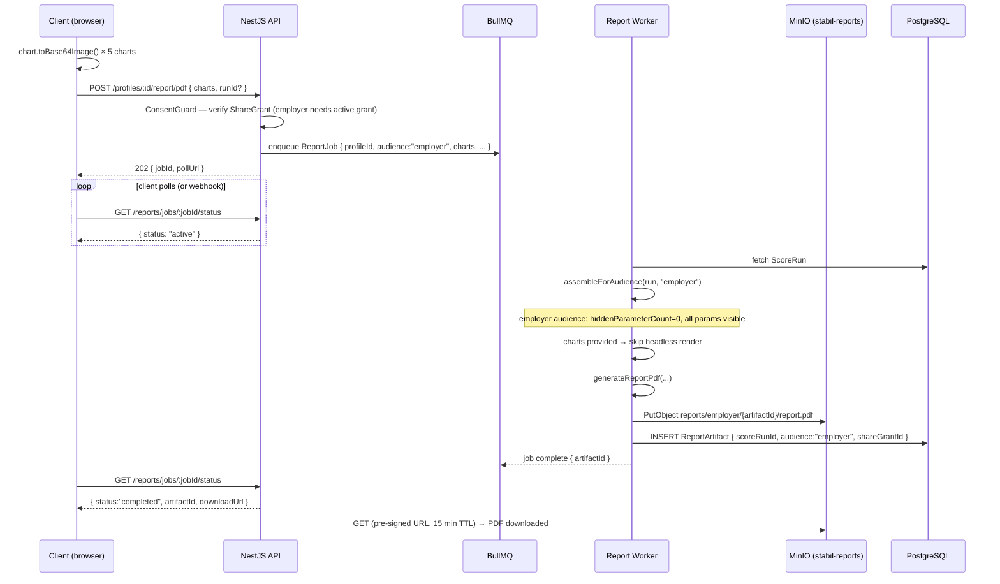
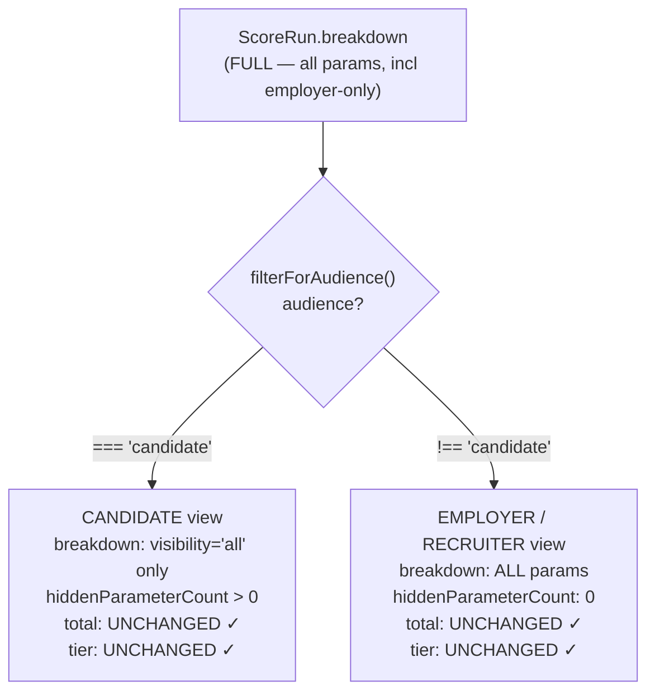

# Reports & PDF Export

> **Status:** Draft v0.1 · **Phase:** 1 · **Owner area:** backend
> **Related:** [scoring.md](./scoring.md), [consent-sharing.md](./consent-sharing.md), [documents-storage.md](./documents-storage.md), [../../frontend/charts.md](../../frontend/charts.md), [../../architecture/03-scoring-engine.md](../../architecture/03-scoring-engine.md), [../../architecture/02-data-model.md](../../architecture/02-data-model.md), [../../architecture/05-security-privacy.md](../../architecture/05-security-privacy.md)

This module assembles the **audience-aware stability report** from a `ScoreRun` and exports it as a downloadable PDF. It is the final step in the reporting pipeline: the scoring engine produces a `ScoreResult`, this module filters it for the requesting audience, renders a PDF with `@react-pdf/renderer`, stores the artifact in MinIO, and serves a short-lived signed download URL. Large or queued exports are dispatched to a BullMQ worker so the HTTP request returns immediately.

---

## 1. Responsibility

**Single purpose:** given a `ScoreRun` (latest or pinned), a requesting audience, and optionally a `ShareGrant` id, produce and persist an audience-filtered `ReportArtifact` (a PDF in the `reports/` MinIO bucket) and hand back a pre-signed download URL.

The module does **not**:
- Decide whether an employer or recruiter is allowed to view a report — that enforcement is delegated to `ConsentGuard` (see [consent-sharing.md](./consent-sharing.md)).
- Score the candidate — that is the `ScoringModule` (see [scoring.md](./scoring.md)).
- Store the raw uploaded documents — that is the `DocumentsStorageModule` (see [documents-storage.md](./documents-storage.md)).

---

## 2. Public API

All endpoints are under `/api/v1`. JSON bodies; errors use RFC 9457 `application/problem+json`. Auth is JWT; role-based guards enforce audience identity (see [../api-conventions.md](../api-conventions.md)).

### 2.1 Endpoint summary

| Method | Path | Auth / guards | Description |
|--------|------|---------------|-------------|
| `GET` | `/profiles/:profileId/report` | JWT + role guard + `ConsentGuard` (if employer/recruiter) | Return an audience-filtered `AudienceScoreResult` JSON (no PDF, fast path for in-app dashboard). |
| `POST` | `/profiles/:profileId/report/pdf` | JWT + role guard + `ConsentGuard` | Enqueue or synchronously generate a PDF `ReportArtifact` for the resolved audience. Returns `202 Accepted` with a job id for async, or `201 Created` with the artifact id for sync. |
| `GET` | `/reports/:artifactId/download` | JWT + role guard + `ConsentGuard` | Return a short-lived (15 min) pre-signed MinIO download URL for an existing `ReportArtifact`. |
| `GET` | `/reports/jobs/:jobId/status` | JWT | Poll the status of an async PDF generation job. |

### 2.2 `GET /profiles/:profileId/report` — audience-filtered score JSON

Returns the latest `ScoreRun` for the profile, filtered through `filterForAudience()`, as `AudienceScoreResult` JSON. This is the fast path the in-app dashboard (web + mobile) hits — no PDF generation is involved.

**Query parameters:**

| Parameter | Type | Default | Description |
|-----------|------|---------|-------------|
| `runId` | `string` (UUID) | latest | Pin to a specific `ScoreRun`. |
| `audience` | `"candidate" \| "employer" \| "recruiter"` | derived from caller's role | Override audience; must be consistent with caller's role (employer/recruiter may not request `candidate` view, candidate may not request `employer` view). |

**Response `200 OK`:**

```json
{
  "scoreRunId": "019286ab-...",
  "profileId":  "01928521-...",
  "audience":   "candidate",
  "mode":       "professional",
  "total":      1180,
  "maxTotal":   1500,
  "tier":       "settled",
  "byBlock": {
    "mode":         { "awarded": 620, "max": 800 },
    "common":       { "awarded": 480, "max": 550 },
    "verification": { "awarded": 80,  "max": 150 }
  },
  "breakdown": [
    {
      "key":        "totalExperience",
      "label":      "Total experience",
      "block":      "mode",
      "visibility": "all",
      "awarded":    280,
      "max":        300
    }
  ],
  "hiddenParameterCount": 2,
  "scoredAt": "2026-06-06T09:14:00Z",
  "improvement": [
    {
      "parameterKey": "communication",
      "label":        "Communication",
      "gap":          60,
      "hint":         "Attach a verifiable language certification to claim the full 120 points."
    }
  ]
}
```

> The `breakdown` above has employer-only items (age, maritalStatus) suppressed for the candidate audience. `hiddenParameterCount: 2` tells the client how many parameters were withheld.

> `improvement` is a derived list of parameters where `awarded < max`, sorted descending by gap, **included only in the candidate audience response** (SCOPE §8). Each hint is a static template interpolated from the parameter definition in Phase 1; no LLM call is made.

### 2.3 `POST /profiles/:profileId/report/pdf` — request PDF generation

**Request body (Zod-validated):**

```ts
// apps/api/src/reports/dto/create-report.dto.ts
import { z } from "zod";

export const CreateReportDto = z.object({
  /** Pin to a specific ScoreRun; omit for latest. */
  runId: z.string().uuid().optional(),

  /**
   * Pre-rasterized chart images produced client-side via
   * chart.toBase64Image(). Keyed by chart id (see §5.1).
   * Optional — if absent the server falls back to headless rendering.
   */
  charts: z
    .record(
      z.enum(["gauge", "blockContribution", "parameterBreakdown", "scoreHistory", "strengths"]),
      z.string().regex(/^data:image\/png;base64,/)
    )
    .optional(),

  /** If true, skip BullMQ and generate synchronously (small reports / testing). */
  sync: z.boolean().default(false),
});

export type CreateReportDto = z.infer<typeof CreateReportDto>;
```

**Response `202 Accepted`** (async, default):

```json
{
  "jobId":     "bullmq:report:01928abc-...",
  "profileId": "01928521-...",
  "audience":  "employer",
  "status":    "queued",
  "pollUrl":   "/api/v1/reports/jobs/01928abc-.../status"
}
```

**Response `201 Created`** (sync mode):

```json
{
  "artifactId":  "01928def-...",
  "audience":    "employer",
  "downloadUrl": "https://minio.internal/stabil-reports/reports/employer/01928def-.../report.pdf?X-Amz-Expires=900&..."
}
```

### 2.4 `GET /reports/:artifactId/download` — pre-signed download URL

Returns a fresh pre-signed URL (15-minute TTL) for an existing `ReportArtifact`. The URL points directly at MinIO (or a CDN in front of it) — the API does not proxy the bytes.

**Response `200 OK`:**

```json
{
  "artifactId":  "01928def-...",
  "audience":    "employer",
  "expiresAt":   "2026-06-06T09:30:00Z",
  "downloadUrl": "https://minio.internal/stabil-reports/..."
}
```

### 2.5 `GET /reports/jobs/:jobId/status` — poll async job

```json
{
  "jobId":      "bullmq:report:01928abc-...",
  "status":     "completed",
  "artifactId": "01928def-...",
  "downloadUrl": "https://..."
}
```

`status` values: `queued | active | completed | failed`.

---

## 3. Data Models Touched

The module reads `ScoreRun` and `CandidateProfile`, writes `ReportArtifact`, and reads `ShareGrant` for consent checking. Full Prisma schemas live in [architecture/02-data-model.md](../../architecture/02-data-model.md#47-consent--sharing-reports-notifications-audit).

### 3.1 `ScoreRun` (read-only from this module)

```prisma
model ScoreRun {
  id                 String   @id @db.Uuid   // UUID v7
  candidateProfileId String   @db.Uuid
  formSubmissionId   String   @db.Uuid
  mode               Mode
  total              Int                       // 0–1500 (integer points)
  maxTotal           Int                       // 1500 at run time
  tier               Tier
  byBlock            Json                      // Record<Block, {awarded, max}>
  breakdown          Json                      // ParameterScore[] — FULL, incl employer-only
  configVersion      String
  verificationBonus  Int      @default(0)
  reportArtifacts    ReportArtifact[]
  createdAt          DateTime @default(now())
  // Immutable: no updatedAt, no deletedAt. Purged only on owning profile hard-purge.
  @@index([candidateProfileId, createdAt])
}
```

The `breakdown` JSONB always stores the **unfiltered** list — every parameter including `visibility: "employer-only"` items (age, marital status). The module applies `filterForAudience()` **on read**, never persisting a pre-redacted copy (SCOPE §6.3, §12).

### 3.2 `ReportArtifact` (written by this module)

```prisma
model ReportArtifact {
  id           String      @id @db.Uuid
  scoreRunId   String      @db.Uuid
  scoreRun     ScoreRun    @relation(fields: [scoreRunId], references: [id], onDelete: Cascade)

  /** Which audience this PDF was rendered for. Determines which line-items appear. */
  audience     Audience

  /** ShareGrant that authorized an employer/recruiter copy. Null for candidate self-export. */
  shareGrantId  String?    @db.Uuid
  shareGrant    ShareGrant? @relation(fields: [shareGrantId], references: [id])

  /** MinIO object key: "reports/{audience}/{artifactId}/report.pdf" */
  storageKey   String      @unique
  format       String      @default("pdf")

  createdAt    DateTime    @default(now())
  deletedAt    DateTime?

  @@index([scoreRunId, audience])
  @@index([shareGrantId])
  @@index([deletedAt])
}
```

**Storage key convention:** `reports/{audience}/{artifactId}/report.pdf`

Examples:
- `reports/candidate/01928def-.../report.pdf`
- `reports/employer/01928fff-.../report.pdf`

The audience prefix allows MinIO bucket policies to be written so that an employer service account cannot access the `candidate/` prefix — a defence-in-depth measure beyond the application-layer `ConsentGuard`.

---

## 4. Audience-Aware Report Assembly

This is the heart of the module. The same assembly logic runs whether the report is served as JSON (dashboard fast path) or rendered to PDF.

### 4.1 Resolving the audience

The requesting audience is derived from the caller's JWT role, not a user-supplied parameter (except for admin overrides):

| Caller role | Resolved audience |
|-------------|-------------------|
| `candidate` (owns this profile) | `"candidate"` |
| `employer` member (active `ShareGrant`) | `"employer"` |
| `recruiter` member (active `ShareGrant`) | `"recruiter"` |
| `admin` | override allowed; must be explicit in request |

Employers and recruiters must have an active, non-expired `ShareGrant` with `status: "active"` and `scope` including `"report"` for the given `candidateProfileId`. This is enforced by `ConsentGuard` before the request reaches this module (SCOPE §6.2, §18). See [consent-sharing.md](./consent-sharing.md).

### 4.2 Reconstructing `ScoreResult` from `ScoreRun`

The `ScoreRun.breakdown` and `ScoreRun.byBlock` JSONB columns are snapshots of `ScoreResult` fields at scoring time. The module deserializes them back to the engine's `ScoreResult` shape:

```ts
// apps/api/src/reports/report-assembly.service.ts
import type { ScoreResult, AudienceScoreResult, Audience } from "@stabil/scoring";
import { filterForAudience } from "@stabil/scoring";

function scoreRunToResult(run: ScoreRun): ScoreResult {
  return {
    mode:      run.mode,
    total:     run.total,
    maxTotal:  run.maxTotal,
    tier:      run.tier,
    byBlock:   run.byBlock as ScoreResult["byBlock"],
    breakdown: run.breakdown as ScoreResult["breakdown"],
  };
}

export function assembleForAudience(run: ScoreRun, audience: Audience): AudienceScoreResult {
  const result = scoreRunToResult(run);
  return filterForAudience(result, audience);
}
```

### 4.3 What `filterForAudience` does (from `packages/scoring/src/audience.ts`)

```ts
export function filterForAudience(result: ScoreResult, audience: Audience): AudienceScoreResult {
  if (audience !== "candidate") {
    // employer and recruiter: full breakdown, hiddenParameterCount = 0.
    return { ...result, audience, hiddenParameterCount: 0 };
  }

  // Candidate: suppress employer-only line-items.
  const visible = result.breakdown.filter((param) => param.visibility === "all");
  return {
    ...result,
    audience,
    breakdown: visible,
    hiddenParameterCount: result.breakdown.length - visible.length,
  };
}
```

**Key invariant (SCOPE §6.3):** `total` and `tier` are **identical across all audiences**. Sensitive factors (age, marital status — `visibility: "employer-only"`) remain in the candidate's score but their line-items are stripped from the candidate `breakdown`. The candidate sees `hiddenParameterCount > 0` and a note in the UI/PDF ("Some employer-only factors are not itemized here") but cannot infer the suppressed values or which parameters they are.

### 4.4 Improvement hints (candidate audience only)

For candidate responses and PDFs, the module derives `improvement` items: parameters where `awarded < max`, sorted descending by gap (largest opportunity first). In Phase 1 these are static, driven by a `PARAMETER_HINTS` map in `packages/core` (the rubric layer):

```ts
// apps/api/src/reports/report-assembly.service.ts

export interface ImprovementHint {
  parameterKey: string;
  label:        string;
  gap:          number;  // max - awarded (integer points)
  hint:         string;  // human-readable suggestion
}

function deriveImprovement(result: AudienceScoreResult): ImprovementHint[] {
  if (result.audience !== "candidate") return [];
  return result.breakdown
    .filter((p) => p.awarded < p.max)
    .map((p) => ({
      parameterKey: p.key,
      label:        p.label,
      gap:          p.max - p.awarded,
      hint:         PARAMETER_HINTS[p.key] ??
                    `Improve your ${p.label} to earn up to ${p.max - p.awarded} additional points.`,
    }))
    .sort((a, b) => b.gap - a.gap);
}
```

`PARAMETER_HINTS` lives in `packages/core`, not in the engine, so it can evolve without touching engine math. Phase 4 replaces static strings with a short LLM-generated narrative via the `LlmAdapter` (OpenRouter by default; swap to self-hosted if PII isolation is required — see [parsing.md](./parsing.md)).

---

## 5. PDF Generation with `@react-pdf/renderer`

PDFs are generated **server-side** in the NestJS API process using `@react-pdf/renderer`. The library runs in Node.js without a browser — no Puppeteer, no Chromium, no headless Chrome.

### 5.1 Chart images in the PDF

`@react-pdf/renderer` renders to PDF primitives (text, layout boxes, vector shapes). It cannot execute JavaScript or render a live `<canvas>`. Charts enter the PDF as **PNG images embedded via `<Image src="data:image/png;base64,..." />`**. There are two render paths:

#### Path A — Client-side capture (preferred for in-browser "Download PDF")

The report page has all chart components mounted and painted. The client calls `chart.toBase64Image()` on each `ChartImageHandle` ref (see [frontend/charts.md](../../frontend/charts.md#f-pdf-export--charts-as-images)), collects `data:image/png;base64,...` strings, and sends them in the `POST /report/pdf` body under the `charts` key.

```ts
// Client (Next.js page, simplified)
const charts: Partial<Record<ChartKey, string>> = {};
charts.gauge              = gaugeRef.current?.toImage() ?? undefined;
charts.blockContribution  = blockRef.current?.toImage() ?? undefined;
charts.parameterBreakdown = breakdownRef.current?.toImage() ?? undefined;
charts.scoreHistory       = historyRef.current?.toImage() ?? undefined;
charts.strengths          = strengthsRef.current?.toImage() ?? undefined;

await api.post(`/profiles/${profileId}/report/pdf`, { charts, sync: true });
```

The API validates the `data:image/png;base64,` prefix (Zod), strips the header, and passes the raw strings to `@react-pdf/renderer`'s `<Image src="..."/>`.

**Trade-offs:**
- Advantages: no server-side chart rendering dependency; images are pixel-for-pixel identical to the on-screen report; the server does zero canvas work.
- Disadvantages: requires the web report page to be mounted; not suitable for background/emailed PDFs; slightly larger request payload (five 2x-DPR PNGs ≈ 200–400 KB total, well within API limits).

#### Path B — Server-side headless chart rendering (async / email / API-only)

When `charts` is absent (background jobs, mobile "email me this PDF" flows, or API consumers without a browser), the BullMQ worker renders charts using **`chartjs-node-canvas`**, which hosts Chart.js on a Node.js `canvas` implementation.

```ts
// apps/api/src/reports/chart-renderer.service.ts
import { ChartJSNodeCanvas } from "chartjs-node-canvas";
import type { ChartConfiguration } from "chart.js";

const renderer = new ChartJSNodeCanvas({
  width: 800,
  height: 400,
  backgroundColour: "white",
  chartCallback: (ChartJS) => {
    // Import the same registration helper used on the web client (packages/charts).
    registerForPdf(ChartJS);
  },
});

export async function renderChartToBase64(config: ChartConfiguration): Promise<string> {
  // Force light theme, fixed dimensions, and no animation for the PDF path.
  const buffer = await renderer.renderToBuffer({
    ...config,
    options: {
      ...config.options,
      animation: false,
      responsive: false,
      devicePixelRatio: 2,
    },
  });
  return `data:image/png;base64,${buffer.toString("base64")}`;
}
```

The data/options builders for each chart (`toGaugeData`, `toBlockData`, `toBreakdownData`, etc.) are **pure functions** exported from a framework-agnostic `packages/charts` package (no React imports). Both the web client and the server worker import these same builders, so chart appearance is consistent regardless of path.

**Trade-offs:**
- Advantages: works in background jobs, email delivery, and any API consumer; no client coupling.
- Disadvantages: requires `chartjs-node-canvas` + a native `canvas` binding in the API Docker image; adds ~80–120 ms per chart on the server; font rendering may differ subtly from the web (mitigated by embedding the same Inter subset font used in the PDF).

**Chosen approach for Phase 1:** support **both paths**. The web app always sends pre-rasterized images (Path A). Background jobs and mobile-triggered PDFs use Path B. `PdfGenerationService` checks `charts` in the job payload and falls back automatically. This means no hard dependency on `chartjs-node-canvas` for the happy path.

**PDF-specific chart overrides (applied in both paths):**

```ts
const PDF_CHART_OVERRIDES: Partial<ChartOptions> = {
  animation:       false,  // capture final frame immediately
  responsive:      false,  // fixed width/height set by renderer
  devicePixelRatio: 2,     // 2× for sharp print resolution
};
```

Light-theme tokens are always used in the PDF regardless of the user's dark-mode setting — print convention and readability at lower ink densities.

### 5.2 PDF document structure (`@react-pdf/renderer`)

The PDF is a single `<Document>` with one or two `<Page>` elements (candidate report fits on one page; the employer view with a full parameter table may spill to two pages).

```ts
// apps/api/src/reports/pdf/ReportDocument.tsx
import { Document, Page, View, Text, Image, StyleSheet, Font } from "@react-pdf/renderer";
import type { AudienceScoreResult } from "@stabil/scoring";
import type { ImprovementHint } from "../report-assembly.service";

// Embed Inter subset for cross-platform consistency (never rely on PDF built-ins like Helvetica).
Font.register({ family: "Inter", src: "assets/fonts/Inter-subset.ttf" });

interface ReportDocumentProps {
  result:      AudienceScoreResult;
  candidate:   { displayName: string; mode: string; location?: string };
  improvement: ImprovementHint[];        // empty for employer/recruiter
  charts:      Partial<Record<ChartKey, string>>; // data URL PNGs
  generatedAt: string;                   // ISO timestamp
}
```

**Visual layout — candidate audience (one page, 595 pt wide / A4):**

```
┌──────────────────────────────────────────────────────────────┐
│  HEADER                                                      │
│  Candidate Name · Mode: Working Professional · Location      │
│  Generated: 2026-06-06                                       │
├──────────────────────────────────────────────────────────────┤
│  SCORE SUMMARY (two-column)                                  │
│  ┌────────────────────┐  ┌──────────────────────────────┐   │
│  │ Gauge chart (PNG)  │  │ 1180 / 1500                  │   │
│  │ ~200 pt tall       │  │ Tier: Settled                 │   │
│  │                    │  │ Mode: Professional             │   │
│  └────────────────────┘  └──────────────────────────────┘   │
├──────────────────────────────────────────────────────────────┤
│  BLOCK CONTRIBUTION                                          │
│  Stacked bar chart — Mode / Common / Verification (PNG)      │
├──────────────────────────────────────────────────────────────┤
│  PER-PARAMETER BREAKDOWN                                     │
│  Horizontal bar chart (PNG, audience-filtered)               │
│  Data table: Parameter | Awarded | Max | %                   │
│  Note if hiddenParameterCount > 0:                           │
│  "2 employer-only factors are not shown. Your total          │
│   score reflects all factors."                               │
├──────────────────────────────────────────────────────────────┤
│  STRENGTHS RADAR (PNG)                                       │
├──────────────────────────────────────────────────────────────┤
│  IMPROVEMENT GUIDANCE  (candidate only)                      │
│  • Communication — up to 60 pts — "Attach a cert …"         │
│  • AI familiarity — up to 40 pts — "…"                      │
├──────────────────────────────────────────────────────────────┤
│  FOOTER                                                      │
│  Stabil · Report ID: 01928def · Generated: 2026-06-06 · 1/1│
└──────────────────────────────────────────────────────────────┘
```

**Employer/recruiter audience** differences:
- All parameters including `age` and `maritalStatus` appear in the breakdown table and bar chart.
- No improvement guidance section.
- No "hidden factors" disclaimer note.
- May spill to page 2 if the parameter list is long — controlled by `<View wrap>` (default) and an explicit `<View break>` before the table.

**Rule about PII in PDF metadata:** set `<Document title={artifactId}>` (not the candidate's name). Never put PII in `author`, `subject`, or `keywords` PDF metadata fields — they are readable without opening the document.

### 5.3 PDF generation service

```ts
// apps/api/src/reports/pdf-generation.service.ts
import { renderToBuffer } from "@react-pdf/renderer";
import React from "react";
import { ReportDocument } from "./pdf/ReportDocument";
import type { AudienceScoreResult } from "@stabil/scoring";

export interface PdfGenerationInput {
  result:      AudienceScoreResult;
  candidate:   { displayName: string; mode: string; location?: string };
  improvement: ImprovementHint[];
  charts:      Partial<Record<ChartKey, string>>;
}

export async function generateReportPdf(input: PdfGenerationInput): Promise<Buffer> {
  const element = React.createElement(ReportDocument, {
    ...input,
    generatedAt: new Date().toISOString(),
  });
  // renderToBuffer is the server-side API in @react-pdf/renderer ≥ 3.x.
  // It returns a Promise<Buffer> — do not use ReactPDF.render() (writes to a file path).
  return renderToBuffer(element);
}
```

---

## 6. MinIO Storage (`reports/` bucket)

Storage mechanics follow the pattern in [documents-storage.md](./documents-storage.md). The `reports/` bucket has its own configuration:

| Concern | Detail |
|---------|--------|
| **Bucket** | `stabil-reports` (separate from `stabil-documents` for clear IAM partitioning) |
| **Object key** | `reports/{audience}/{artifactId}/report.pdf` |
| **Access** | Private (no public ACL). All access via pre-signed URLs only. |
| **Pre-signed URL TTL** | 15 minutes (sufficient for a browser download; short enough to limit URL abuse if intercepted). |
| **Retention** | Artifact rows are soft-deleted when the owning `ScoreRun`/`CandidateProfile` is deleted or the linked `ShareGrant` is revoked. A purge job hard-deletes the MinIO object after a 7-day grace window. |
| **No URL caching** | A fresh pre-signed URL is generated on every `GET /download` call. 15-minute TTL makes caching counterproductive. |

```ts
// apps/api/src/reports/artifact-storage.service.ts
import { S3Client, PutObjectCommand, GetObjectCommand } from "@aws-sdk/client-s3";
import { getSignedUrl } from "@aws-sdk/s3-request-presigner";

const BUCKET             = process.env.REPORTS_BUCKET  ?? "stabil-reports";
const PRESIGN_TTL_SECONDS = 15 * 60;

export async function storeReportPdf(
  client:     S3Client,
  artifactId: string,
  audience:   string,
  pdf:        Buffer,
): Promise<string> {
  const key = `reports/${audience}/${artifactId}/report.pdf`;
  await client.send(new PutObjectCommand({
    Bucket:      BUCKET,
    Key:         key,
    Body:        pdf,
    ContentType: "application/pdf",
    Metadata:    { artifactId, audience }, // no PII in headers
  }));
  return key;
}

export async function presignDownloadUrl(
  client:     S3Client,
  storageKey: string,
): Promise<string> {
  return getSignedUrl(
    client,
    new GetObjectCommand({ Bucket: BUCKET, Key: storageKey }),
    { expiresIn: PRESIGN_TTL_SECONDS },
  );
}
```

---

## 7. Async Generation via BullMQ

For async exports (the default for `POST /report/pdf` without `sync: true`), generation is off-loaded to a BullMQ queue so the HTTP response returns immediately.

### 7.1 Job payload

```ts
// apps/api/src/reports/reports.queue.ts
export const REPORTS_QUEUE = "reports";

export interface ReportJob {
  jobId:        string;   // same as BullMQ job id (UUIDv7)
  profileId:    string;
  runId:        string | null; // null = resolve latest
  audience:     Audience;
  shareGrantId: string | null; // links the artifact to the authorizing grant
  charts:       Partial<Record<ChartKey, string>>; // empty → server-side render
  requestedBy:  string;   // user id for audit log
}
```

### 7.2 Worker

```ts
// apps/api/src/reports/reports.worker.ts
import { Worker, type Job } from "bullmq";
import type { ReportJob } from "./reports.queue";

new Worker<ReportJob>(REPORTS_QUEUE, async (job: Job<ReportJob>) => {
  const { profileId, runId, audience, shareGrantId, charts, requestedBy } = job.data;

  // 1. Fetch ScoreRun (latest or pinned).
  const run = await scoreRunService.resolve(profileId, runId);

  // 2. Filter for audience.
  const result = assembleForAudience(run, audience);

  // 3. Charts: use client PNGs if provided, else headless render.
  const resolvedCharts = await resolveCharts(charts, result);

  // 4. Generate PDF.
  const pdf = await generateReportPdf({
    result,
    candidate: await profileService.getDisplay(profileId),
    improvement: deriveImprovement(result),
    charts: resolvedCharts,
  });

  // 5. Store in MinIO, create ReportArtifact row.
  const artifactId = uuidv7();
  const storageKey  = await storeReportPdf(s3Client, artifactId, audience, pdf);
  await prisma.reportArtifact.create({
    data: {
      id:           artifactId,
      scoreRunId:   run.id,
      audience,
      shareGrantId: shareGrantId ?? undefined,
      storageKey,
    },
  });

  // 6. Emit score-ready notification (optional, via NotificationsModule).
  await notificationsService.notifyReportReady(requestedBy, artifactId);

  return { artifactId };
}, { concurrency: 3 });
```

**Concurrency & retries:** `concurrency: 3` (configurable via env). BullMQ retries failed jobs up to 3 times with exponential backoff (1 s, 4 s, 16 s). Failed jobs are retained for 24 hours for ops inspection; completed jobs are evicted after 1 hour.

**Job idempotency:** before enqueuing, the controller checks for an existing non-failed `ReportArtifact` for the same `(scoreRunId, audience)` pair. If one exists, it returns it directly rather than enqueuing a duplicate.

---

## 8. Key Flows

### 8.1 In-app report view (JSON, no PDF)



### 8.2 Async PDF generation (employer, web app with client-side charts)



### 8.3 Audience filtering — invariant diagram



The invariant: **`total` and `tier` are never modified by `filterForAudience`** — they are identical across all three audiences. Sensitive factors (age, marital status) remain in the candidate's score but are not attributed in their breakdown. This is enforced by the pure function in `packages/scoring/src/audience.ts` and verified by the audience invariant test (§11.2).

---

## 9. Validation & Errors

All inputs are validated at the controller layer via Zod DTOs and `ZodValidationPipe`. Errors use RFC 9457 `application/problem+json`.

| Condition | HTTP | `type` | `detail` |
|-----------|------|--------|----------|
| `profileId` not found or soft-deleted | `404` | `urn:stabil:error:profile-not-found` | "Candidate profile not found." |
| `runId` supplied but not found for this profile | `404` | `urn:stabil:error:score-run-not-found` | "Score run not found for this profile." |
| Profile has no `ScoreRun` yet | `409` | `urn:stabil:error:no-score-run` | "This profile has not been scored yet." |
| Employer/recruiter lacks active `ShareGrant` | `403` | `urn:stabil:error:consent-required` | "Explicit candidate consent is required before accessing this report." |
| `audience` override inconsistent with caller's role | `403` | `urn:stabil:error:audience-mismatch` | "Requested audience does not match your role." |
| `charts.*` entry not a valid `data:image/png;base64,` string | `422` | `urn:stabil:error:invalid-chart-image` | "Chart image must be a PNG data URL." |
| Artifact not found or deleted | `404` | `urn:stabil:error:artifact-not-found` | "Report artifact not found." |
| MinIO write failure | `503` | `urn:stabil:error:storage-unavailable` | "Report storage is temporarily unavailable." |
| BullMQ enqueue failure | `503` | `urn:stabil:error:queue-unavailable` | "Report generation queue is temporarily unavailable." |
| PDF renderer exception | `500` | `urn:stabil:error:pdf-render-failed` | "PDF rendering failed." (raw renderer trace never exposed) |
| Job not found (poll) | `404` | `urn:stabil:error:job-not-found` | "Report generation job not found." |

Renderer exceptions are caught, logged with full context (profileId, runId, audience, jobId), and returned as the generic `pdf-render-failed` error. The raw stack trace is never included in the response body.

---

## 10. Security & Permissions

### 10.1 Consent enforcement (deferred to `ConsentGuard`)

The single most important permission rule: **an employer or recruiter may not request a report — JSON or PDF — without an active `ShareGrant` from the candidate**. This is enforced by `ConsentGuard` as a NestJS guard that runs before any handler in this module for non-candidate callers (SCOPE §6.2, §18).

`ConsentGuard` checks that a `ShareGrant` exists for `(candidateProfileId, callerOrgId)` with `status: "active"`, `expiresAt` in the future, and `scope` including `"report"`. See [consent-sharing.md](./consent-sharing.md) for the full guard implementation, `ShareGrant` lifecycle, and revocation handling. This module does not duplicate that logic.

### 10.2 Audience isolation

- `ReportArtifact` rows link to the `ShareGrant` that authorized them (`shareGrantId`). If the grant is later revoked, the artifact is soft-deleted and its storage object is queued for purge. Pre-signed URLs already in circulation expire within 15 minutes (the accepted window; see §13 for the trade-off discussion).
- The MinIO object key prefix (`reports/{audience}/`) is a defence-in-depth measure: IAM policies can prevent an employer service account from accessing the `candidate/` prefix and vice versa.
- A candidate **cannot** request an artifact with `audience: "employer"` — the controller enforces audience-role consistency before reaching the service layer, regardless of what is in the request body.

### 10.3 Sensitive parameter suppression

The module never renders a candidate-audience PDF that exposes age or marital status. The suppression occurs inside `filterForAudience()` — a pure function in `@stabil/scoring` — before data reaches the PDF renderer. There is no code path where a candidate PDF is rendered from an unfiltered `ScoreResult`. This invariant is enforced by automated tests (§11.2).

### 10.4 Audit logging

| Action | `entityType` | Trigger |
|--------|-------------|---------|
| `report.json.accessed` | `CandidateProfile` | Every successful `GET /report` response |
| `report.pdf.requested` | `CandidateProfile` | PDF job enqueued or sync generation started |
| `report.pdf.generated` | `ReportArtifact` | Successful artifact creation in the worker |
| `report.download.url-issued` | `ReportArtifact` | Every successful `GET /download` call |

Log only the `artifactId`, not the pre-signed URL (which contains a signature).

---

## 11. Phased Implementation

### Phase 1 (this document)

- `GET /report` — audience-filtered JSON from `ScoreRun`, static improvement hints.
- `POST /report/pdf` — PDF generation via `@react-pdf/renderer`, sync and async (BullMQ).
- `GET /download` — pre-signed MinIO URL (15-minute TTL).
- Client-side chart capture (Path A) and server-side headless fallback via `chartjs-node-canvas` (Path B).
- `ReportArtifact` persistence in PostgreSQL + PDF object in MinIO.
- `ConsentGuard` integration (guard owned by [consent-sharing.md](./consent-sharing.md)).
- Five charts in the PDF: gauge, block contribution, parameter breakdown, score history, strengths radar.

### Phase 2 (resume parsing)

- `ScoreRun.breakdown` gains parameters populated by the OpenRouter + OCR parsing pipeline ([parsing.md](./parsing.md)). No change to this module's interface — it consumes whatever `ScoreRun.breakdown` contains.

### Phase 3 (verification & bonus)

- `verificationBonus` becomes non-zero. The PDF gains a **Verified User** badge section listing validated documents and the bonus awarded.
- Improvement hints gain verification-specific suggestions: "Upload your Aadhaar card for up to +{n} points."

### Phase 4 (enhancements)

- Multi-candidate comparison PDF template for employer/recruiter audience (Chart 7 — grouped Bar / Radar overlay; see [frontend/charts.md](../../frontend/charts.md#chart-7--phase-4-side-by-side-candidate-comparison)).
- AI-generated improvement narrative: static `PARAMETER_HINTS` strings replaced by short LLM-generated paragraphs per candidate via the `LlmAdapter` (OpenRouter by default; self-hosted Ollama if stricter PII isolation is required), scoped to Phase 4.

---

## 12. Testing

### 12.1 Unit tests — pure functions

All pure functions in this module are unit-tested with **Vitest**.

**`assembleForAudience` — round-trip test:**

```ts
// apps/api/src/reports/__tests__/report-assembly.test.ts
import { assembleForAudience } from "../report-assembly.service";
import { FULL_SCORE_RUN_FIXTURE } from "../__fixtures__/score-run.fixture";

it("candidate view strips employer-only parameters", () => {
  const result = assembleForAudience(FULL_SCORE_RUN_FIXTURE, "candidate");
  expect(result.breakdown.some((p) => p.visibility === "employer-only")).toBe(false);
  expect(result.hiddenParameterCount).toBeGreaterThan(0);
});

it("employer view exposes all parameters", () => {
  const result = assembleForAudience(FULL_SCORE_RUN_FIXTURE, "employer");
  expect(result.hiddenParameterCount).toBe(0);
  expect(result.breakdown.length).toBeGreaterThan(0);
});
```

### 12.2 Audience invariant test (never delete or skip)

This test is the automated guard for SCOPE §6.3 and §12 (the legal/fairness risk around sensitive attributes). Any refactor of `filterForAudience` or `assembleForAudience` must keep this test passing.

```ts
// apps/api/src/reports/__tests__/audience-invariant.test.ts
import { assembleForAudience } from "../report-assembly.service";
import { FULL_SCORE_RUN_FIXTURE } from "../__fixtures__/score-run.fixture";

const audiences = ["candidate", "employer", "recruiter"] as const;

describe("audience invariant — SCOPE §6.3 + §12", () => {
  it("total is identical across all audiences", () => {
    const totals = audiences.map((a) => assembleForAudience(FULL_SCORE_RUN_FIXTURE, a).total);
    expect(new Set(totals).size).toBe(1);
  });

  it("tier is identical across all audiences", () => {
    const tiers = audiences.map((a) => assembleForAudience(FULL_SCORE_RUN_FIXTURE, a).tier);
    expect(new Set(tiers).size).toBe(1);
  });

  it("candidate breakdown contains no employer-only parameters", () => {
    const candidate = assembleForAudience(FULL_SCORE_RUN_FIXTURE, "candidate");
    expect(candidate.breakdown.some((p) => p.visibility === "employer-only")).toBe(false);
  });

  it("candidate hiddenParameterCount equals employer-only param count in the run", () => {
    const candidate = assembleForAudience(FULL_SCORE_RUN_FIXTURE, "candidate");
    const employerOnlyCount = (FULL_SCORE_RUN_FIXTURE.breakdown as any[])
      .filter((p: any) => p.visibility === "employer-only").length;
    expect(candidate.hiddenParameterCount).toBe(employerOnlyCount);
  });
});
```

> The fixture must include at least two parameters with `visibility: "employer-only"` (e.g. `age`, `maritalStatus`) to make the filter assertions meaningful.

### 12.3 PDF snapshot test

```ts
// apps/api/src/reports/__tests__/pdf-snapshot.test.ts
import { generateReportPdf } from "../pdf-generation.service";
import { assembleForAudience } from "../report-assembly.service";
import { FULL_SCORE_RUN_FIXTURE } from "../__fixtures__/score-run.fixture";

it("generates a non-empty PDF buffer for candidate audience", async () => {
  const result = assembleForAudience(FULL_SCORE_RUN_FIXTURE, "candidate");
  const pdf = await generateReportPdf({
    result,
    candidate: { displayName: "Test Candidate", mode: "professional" },
    improvement: [],
    charts: {}, // no images → <Image> elements skipped or show placeholder in test
  });
  expect(Buffer.isBuffer(pdf)).toBe(true);
  expect(pdf.length).toBeGreaterThan(1024);
  expect(pdf.slice(0, 4).toString()).toBe("%PDF"); // PDF magic number
});

it("generates a non-empty PDF buffer for employer audience", async () => {
  const result = assembleForAudience(FULL_SCORE_RUN_FIXTURE, "employer");
  const pdf = await generateReportPdf({
    result,
    candidate: { displayName: "Test Candidate", mode: "professional" },
    improvement: [],
    charts: {},
  });
  expect(pdf.slice(0, 4).toString()).toBe("%PDF");
});
```

> **`chartjs-node-canvas` in CI:** the native `canvas` binding may not be available in all CI images. Pass small placeholder `data:image/png;base64,...` strings in the `charts` fixture so the renderer falls through to `<Image src="..."/>` without invoking the headless renderer. The structural test passes; visual regression is a separate concern.

### 12.4 API integration tests

```ts
// apps/api/src/reports/__tests__/reports.controller.e2e.test.ts
// Uses supertest + seeded test DB + localstack or MinIO test container.

describe("GET /profiles/:id/report", () => {
  it("200 for candidate owner");
  it("403 for employer without active ShareGrant");
  it("200 for employer with active ShareGrant");
  it("strips employer-only fields for candidate audience");
  it("includes improvement hints for candidate audience");
  it("excludes improvement hints for employer audience");
  it("404 for non-existent profileId");
  it("409 when profile has no ScoreRun");
});

describe("POST /profiles/:id/report/pdf", () => {
  it("202 async with jobId and pollUrl");
  it("201 sync with artifactId and downloadUrl");
  it("422 for invalid chart image data URL");
  it("403 without consent (employer, no ShareGrant)");
  it("idempotent: returns existing artifact for duplicate (runId, audience)");
});

describe("GET /reports/:artifactId/download", () => {
  it("200 returns pre-signed URL expiring within 15 min");
  it("404 for non-existent artifactId");
  it("403 for employer attempting to download candidate-audience artifact");
});
```

---

## 13. Best Practices & Gotchas

- **Never filter on the client.** The API always applies `filterForAudience()` server-side before returning data. Chart components and the dashboard page map `result.breakdown` as-is and surface `hiddenParameterCount` as a UI note. See [frontend/charts.md](../../frontend/charts.md#chart-3--per-parameter-breakdown-awarded-vs-max) — "Audience filtering is already done." There must be exactly one filtering callsite: `filterForAudience()` in `@stabil/scoring`.

- **`@react-pdf/renderer` is not React DOM.** It runs in Node.js but uses the Yoga layout engine. Never import Chart.js, `next/image`, browser APIs, or any client-only code inside PDF components. The PDF component tree must accept plain data objects, not live React component trees from the web app.

- **Font embedding is mandatory.** Without an embedded font, `@react-pdf/renderer` falls back to Helvetica (a Type 1 PDF built-in), which looks completely different from the web app's Inter font. Embed a Latin-subset of Inter (≤ 50 KB) at build time: `Font.register({ family: "Inter", src: "assets/fonts/Inter-subset.ttf" })`.

- **`renderToBuffer` is the correct server API.** `ReactPDF.render()` writes to a file system path — do not use it; write the returned `Buffer` directly to MinIO. `renderToBuffer` (available in `@react-pdf/renderer` ≥ 3.x) is `async` and returns `Promise<Buffer>`.

- **Large parameter tables and page breaks.** If calibration (SCOPE §13) results in many parameters, the breakdown table may overflow one page. Use `<View wrap>` (the default) with `<Text break>` or `<View break>` between the chart section and the table to control where page breaks occur. Test with a full professional-mode parameter set before finalizing the layout.

- **Revoked grants and in-flight URLs.** When `ConsentGuard` detects a revoked `ShareGrant`, it soft-deletes the linked `ReportArtifact` rows and queues MinIO object deletion. Already-issued pre-signed URLs remain valid for up to 15 more minutes — this is the documented and accepted trade-off for stateless URLs. For stricter revocation (immediately invalid links), migrate to CloudFront-signed URLs with key groups (Phase 4 / post-POC).

- **PII in PDF metadata.** Set `<Document title={artifactId}>` only. Never use the candidate's name, email, or any PII in `author`, `subject`, or `keywords` PDF document properties — those fields are readable without opening the document in many PDF viewers.

- **`ScoreRun` is immutable.** The `breakdown` JSONB snapshot is frozen at scoring time. If weights or parameters change during calibration (SCOPE §13), re-score the profile (creating a new `ScoreRun`) rather than mutating the old row. This module reads `ScoreRun.breakdown` from the snapshot, so historical report renders remain bit-for-bit reproducible regardless of subsequent calibration changes.

- **Audit log only the `artifactId`, not the pre-signed URL.** The pre-signed URL contains an HMAC signature. Logging the full URL leaks a short-lived but functional credential into log storage.

- **Employer-only parameter suppression is a legal risk.** The candidate's total score is influenced by age and marital status even though those are hidden from their breakdown view. As noted in SCOPE §12, this reduces the candidate-complaint surface but does not remove the underlying legal risk. A regional compliance review (India DPDP + employment law + per-market equivalents) is required before production launch. The `hiddenParameterCount` disclosure in the candidate PDF is deliberately transparent about the existence of hidden factors.
