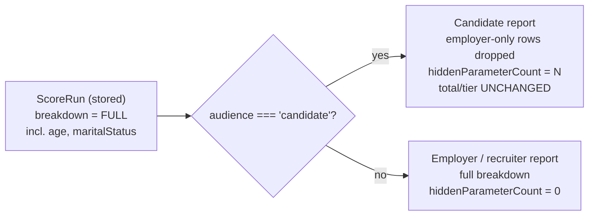
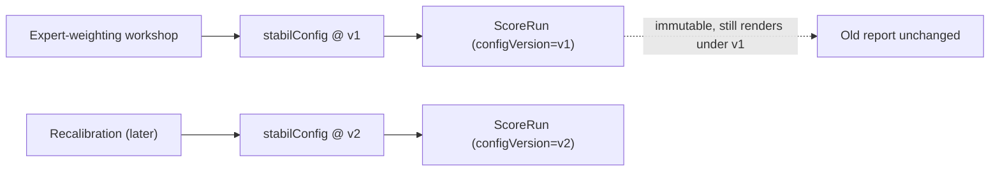

# Scoring Module

> **Status:** Draft v0.1 · **Phase:** 1 · **Owner area:** backend
> **Related:** [architecture/03-scoring-engine.md](../../architecture/03-scoring-engine.md), [architecture/02-data-model.md](../../architecture/02-data-model.md), [architecture/04-api-contracts.md](../../architecture/04-api-contracts.md), [profiles.md](./profiles.md), [reports-pdf.md](./reports-pdf.md)

The NestJS **scoring module** orchestrates a single, deterministic flow: take a `FormSubmission` (raw answers for a profile), run each answer through the **rubric layer** (`packages/core`) to get a normalized `[0,1]` fraction per parameter, hand those fractions to the pure engine `@stabil/scoring` (`computeScore`), and persist the result verbatim as an **immutable** `ScoreRun` snapshot (`total`, `tier`, `byBlock`, `breakdown`, `configVersion`, `createdAt`). It owns nothing about *how* a number becomes a fraction (that's the rubric layer) and nothing about *arithmetic* (that's the engine) — it owns **orchestration + persistence + history**.

---

## Responsibility (one purpose)

**Convert a stored `FormSubmission` into a persisted, immutable `ScoreRun` and serve the resulting history**, by wrapping `@stabil/scoring` (the engine) and `packages/core` (the rubric layer).

The module is the **only** place that:

1. Reads a `FormSubmission` + its `Answer` rows for a profile.
2. Invokes the rubric layer to map each raw answer → fraction in `[0,1]` (assembling a `ParameterValues` map).
3. Calls `computeScore({ mode, values }, stabilConfig)` — the **pure, deterministic** engine.
4. Writes a **new** `ScoreRun` snapshot (never mutating prior runs) and stamps the `configVersion`.
5. Serves runs back (single + history), leaving **audience filtering to read-time** (the reports module), never at storage.

> **Boundary (sacred, from [../../README.md](../../README.md) "Engine boundary").** `@stabil/scoring` consumes **fractions, NOT raw answers**. GPA→fraction, years→fraction, certs→fraction all live in the **rubric layer** (`packages/core`). The engine never sees a GPA; a rubric never sees a `max`/points. This module is the seam that connects them. See [architecture/03-scoring-engine.md §1](../../architecture/03-scoring-engine.md) and §5 there for rubric examples.

### What this module deliberately does NOT do

- **It does not filter by audience at storage time.** A `ScoreRun.breakdown` always stores the **full** list including `employer-only` line-items (`age`, `maritalStatus`). `filterForAudience` is applied only when **reading/serving a report** — see [reports-pdf.md](./reports-pdf.md) and §"Audience filtering" below. (SCOPE §6.3, §12.)
- **It does not compute weights/points itself.** All point math is `Math.round(clamp01(fraction) * max)` inside the engine.
- **It does not parse resumes.** Phase 2 parsing feeds the *same* `FormSubmission`/`Answer` shape; see [parsing.md](./parsing.md) (planned) and §"Phased implementation".
- **It does not mint verification bonus points.** Verification produces a `verifiedDocuments` fraction via the rubric layer; this module just scores it like any other parameter (see [verification.md](./verification.md), planned).

---

## Public API

All endpoints are under `/api/v1` and defined as Zod contracts in `packages/contracts` (see [architecture/04-api-contracts.md §6](../../architecture/04-api-contracts.md)). DTO shapes below mirror that contract and the engine's `ScoreResult` (`packages/scoring/src/domain.ts`).

| Method | Path | Purpose | Idempotent |
|--------|------|---------|------------|
| `POST` | `/scoring/runs` | Run (or re-run) the score for a profile → new `ScoreRun` | **Yes** — `Idempotency-Key` **required** |
| `GET` | `/scoring/runs/:id` | Fetch one run (raw, unfiltered breakdown) | n/a (safe) |
| `GET` | `/scoring/runs?profileId=:id` | History for a profile, newest first | n/a (safe) |

### Response DTO — `ScoreRun`

```ts
// packages/contracts — mirrors ScoreResult + persistence metadata
export type ScoreRun = {
  id: string;                    // UUID v7
  profileId: string;
  submissionId: string;          // FormSubmission scored
  mode: Mode;                    // "fresher" | "professional"
  total: number;                 // 0..1500 (integer points)
  maxTotal: number;              // scaleMax at run time (1500)
  tier: Tier;                    // unstable | developing | somewhat-stable | settled | stable
  byBlock: Record<Block, { awarded: number; max: number }>;
  // FULL breakdown, server-stored, UNFILTERED. Audience filtering happens at /reports.
  breakdown: Array<{
    key: string; label: string; block: Block;
    visibility: Visibility; awarded: number; max: number;
  }>;
  configVersion: string;         // weights/params/tier-bands version (reproducibility)
  createdAt: string;             // ISO-8601; snapshot timestamp (immutable)
};
```

> `byBlock` and `breakdown` are **direct mirrors** of `ScoreResult.byBlock` and `ScoreResult.breakdown` from `packages/scoring/src/domain.ts` — persisted verbatim as JSONB (see [architecture/02-data-model.md §5](../../architecture/02-data-model.md)).

### `POST /scoring/runs` — idempotent

Run (or re-run) the score for a profile.

- **Auth:** required · **Roles:** `candidate` (owner) · `employer`/`recruiter` (their own *unclaimed* claimable profile) · `admin`. · **Rate bucket:** `scoring`
- **Header:** `Idempotency-Key: <uuid>` **required** (a run is expensive and re-scoring must be retry-safe — SCOPE §11 improvement loop).

```ts
export type CreateScoreRunRequest = {
  profileId: string;
  submissionId?: string;   // optional override; defaults to the profile's CURRENT submission
};
// → ScoreRun
```

- **Status:** `201` (new run) · `200` + `Idempotency-Replayed: true` (replay of same key+body) · `400 idempotency-key-required` · `403` · `404` (no submission to score) · `409 idempotency-key-conflict` (same key, different body) · `422` (submission incomplete for the mode) · `429`.

```jsonc
// POST /api/v1/scoring/runs
// Headers: Idempotency-Key: 9f1c...   Authorization: Bearer ...
{ "profileId": "0190b2..." }
```
```jsonc
// 201 Created  (weights below are PLACEHOLDER — calibration, SCOPE §13)
{
  "id": "0190c3...", "profileId": "0190b2...", "submissionId": "0190b9...", "mode": "professional",
  "total": 1180, "maxTotal": 1500, "tier": "settled",
  "byBlock": { "mode": { "awarded": 620, "max": 800 }, "common": { "awarded": 460, "max": 600 }, "verification": { "awarded": 100, "max": 100 } },
  "breakdown": [
    { "key": "totalExperience", "label": "Total experience", "block": "mode", "visibility": "all", "awarded": 240, "max": 300 },
    { "key": "tenure", "label": "Tenure", "block": "mode", "visibility": "all", "awarded": 180, "max": 220 },
    { "key": "age", "label": "Age", "block": "mode", "visibility": "employer-only", "awarded": 60, "max": 80 },
    { "key": "maritalStatus", "label": "Marital status", "block": "mode", "visibility": "employer-only", "awarded": 40, "max": 40 }
  ],
  "configVersion": "stabil-config@v1",
  "createdAt": "2026-06-06T11:00:00.000Z"
}
```

> The returned `breakdown` is the **full, unfiltered** list (note the two `employer-only` rows). `GET /scoring/runs/:id` returns the same raw shape. Employers/recruiters never read this raw run directly — they consume the **audience-filtered** report (see [reports-pdf.md](./reports-pdf.md)).

### `GET /scoring/runs/:id`

Fetch a single run, raw and unfiltered.

- **Auth:** required · **Roles:** `candidate` (owner of the run's profile) · `admin`.
- **Response:** `ScoreRun` · **Status:** `200` · `403` · `404`.

### `GET /scoring/runs?profileId=:id` — history

List runs for a profile, **newest first** (the re-scoring / improvement history).

- **Auth:** required · **Roles:** `candidate` (owner) · `admin`.
- **Query:** `?profileId=<uuid>` (required) `&limit&cursor`
- **Response:** `Paginated<ScoreRun>` · **Status:** `200` · `403` · `404` (unknown profile).

### Internal service surface (consumed by other modules)

```ts
// scoring.service.ts — used by profiles/reports/parsing/verification modules
class ScoringService {
  /** Orchestrate: load submission → rubric → engine → persist immutable ScoreRun. */
  runScore(input: { profileId: string; submissionId?: string; idempotencyKey: string }): Promise<ScoreRun>;

  getRun(id: string): Promise<ScoreRun>;                 // raw/unfiltered
  listRuns(profileId: string, page: PageParams): Promise<Paginated<ScoreRun>>;
  getLatest(profileId: string): Promise<ScoreRun | null>;
}
```

The **reports module** ([reports-pdf.md](./reports-pdf.md)) calls `getRun`/`getLatest`, then applies `filterForAudience(run, audience)` from `@stabil/scoring` at read time. This module never returns a pre-filtered run.

---

## Data model touched

Two Prisma models are read/written here (full schema in [architecture/02-data-model.md §4.4–4.5](../../architecture/02-data-model.md)).

| Model | Access | Role in this module |
|-------|--------|---------------------|
| `FormSubmission` (+ `Answer`) | **read** | The input. Holds `mode`, `source`, `configVersion`, and the `Answer` rows (`parameterKey`, `rawValue`, `normalized`). |
| `ScoreRun` | **write (insert-only)** + read | The immutable output snapshot. |
| `CandidateProfile` | read (+ optional `latestScoreRunId` update) | Owner/identity; drives auth & the "latest run" denormalization. |

```prisma
model FormSubmission {
  id                 String   @id @db.Uuid
  candidateProfileId String   @db.Uuid
  mode          Mode    // snapshot of mode at submission time
  source        String  @default("form") // "form" | "parsed" | "merged"
  configVersion String  // parameter set/version used to build this form
  answers   Answer[]
  scoreRuns ScoreRun[]
  createdAt DateTime @default(now())
  @@index([candidateProfileId, createdAt])
}

model Answer {
  id               String @id @db.Uuid
  formSubmissionId String @db.Uuid
  parameterKey String   // matches ParameterDefinition.key in @stabil/scoring
  rawValue     Json     // raw answer (form/parsed), kept for audit/explainability
  normalized   Float    // [0,1] fraction from the rubric layer — what the engine consumes
  @@unique([formSubmissionId, parameterKey])
  @@index([parameterKey])
}

model ScoreRun {
  id                 String   @id @db.Uuid
  candidateProfileId String   @db.Uuid
  formSubmissionId   String   @db.Uuid
  mode     Mode
  total    Int   // 0..1500 (integer points)
  maxTotal Int   // scaleMax at run time (1500)
  tier     Tier
  byBlock   Json  // mirror of ScoreResult.byBlock: Record<Block,{awarded,max}>
  breakdown Json  // mirror of ScoreResult.breakdown: ParameterScore[] — FULL, incl. employer-only
  configVersion     String
  verificationBonus Int @default(0)  // denormalized for queries
  createdAt DateTime @default(now())
  // IMMUTABLE: no updatedAt, no deletedAt. Purged only via profile cascade.
  @@index([candidateProfileId, createdAt]) // latest-per-profile / history
  @@index([tier])                          // Phase-4 employer search
}
```

**Why store the full breakdown + snapshot (not a redacted variant, not a join to live config):**

- `breakdown` / `byBlock` are **frozen at run time** so an old report renders identically forever even after calibration changes weights — no join against a mutated parameter table. (See [architecture/02-data-model.md §5](../../architecture/02-data-model.md).)
- `configVersion` makes a run **reproducible**: re-running the same engine version against the same `FormSubmission` under that config yields the same numbers (see §"configVersion & reproducibility").
- `ScoreRun` has **no `updatedAt`/`deletedAt`** — it is append-only. Re-scoring writes a **new** row; old rows are never edited.

The `Answer.normalized` column persists the exact rubric output that fed the engine — so a run is auditable end-to-end: `rawValue` → `normalized` (rubric) → `awarded` (engine, in `breakdown`).

---

## Dependencies

| Dependency | Why |
|------------|-----|
| `@stabil/scoring` (`packages/scoring`) | `computeScore`, `mapTier`, `filterForAudience`, `stabilConfig`, all domain types. Pure/deterministic. |
| `packages/core` (rubric layer, **PLANNED** — Phase 1 companion) | Maps each raw `Answer.rawValue` → `[0,1]` fraction per parameter (`RubricRegistry`). See [architecture/03-scoring-engine.md §5](../../architecture/03-scoring-engine.md). |
| `PrismaService` | Reads `FormSubmission`/`Answer`, inserts `ScoreRun`, optional `CandidateProfile.latestScoreRunId` update. |
| Idempotency store (Redis or `IdempotencyKey` table) | Persists `key → (requestHash, responseSnapshot)` for `POST /scoring/runs` replay/conflict. See [api-conventions.md](../api-conventions.md). |
| [profiles.md](./profiles.md) | Owns `CandidateProfile` + `FormSubmission` writes; this module reads the *current* submission. Triggers a run after a submission is saved. |
| `packages/contracts` (Zod) | Request/response validation; single source of truth shared with web/mobile. |

Consumers of this module: [reports-pdf.md](./reports-pdf.md) (audience-filtered reads), [profiles.md](./profiles.md) (re-score on submission save), [notifications.md] ("score ready"), and Phase-4 [employer-search.md] (filters on latest `tier`/`total`).

---

## Key flows

### Submission → rubric → engine → ScoreRun → audience-filtered read

```mermaid
sequenceDiagram
  autonumber
  actor Client as Candidate / Employer client
  participant API as ScoringController (/api/v1)
  participant Idem as Idempotency store
  participant Svc as ScoringService
  participant DB as Prisma (Postgres)
  participant Core as packages/core (rubric layer)
  participant Eng as @stabil/scoring (pure engine)

  Client->>API: POST /scoring/runs { profileId } + Idempotency-Key
  API->>API: Zod-validate body; authorize (owner / org / admin)
  API->>Idem: lookup(key)
  alt key seen, same body
    Idem-->>API: stored ScoreRun
    API-->>Client: 200 + Idempotency-Replayed: true
  else key seen, different body
    Idem-->>API: stored requestHash ≠ new hash
    API-->>Client: 409 idempotency-key-conflict
  else new key
    API->>Svc: runScore({ profileId, submissionId? })
    Svc->>DB: load CURRENT FormSubmission + Answer[] (by profile/mode)
    alt no submission OR incomplete for mode
      DB-->>Svc: (missing / partial)
      Svc-->>API: 404 no-submission / 422 incomplete
      API-->>Client: 404 / 422 problem+json
    else have submission
      DB-->>Svc: FormSubmission{ mode, configVersion }, Answer[]{ parameterKey, rawValue }
      Svc->>Core: map each rawValue → fraction [0,1] (RubricRegistry)
      Core-->>Svc: ParameterValues = Record<key, [0,1]>
      Note over Svc,Eng: Engine consumes FRACTIONS, never raw answers
      Svc->>Eng: computeScore({ mode, values }, stabilConfig)
      Eng-->>Svc: ScoreResult{ total, maxTotal, tier, breakdown(FULL), byBlock }
      Svc->>DB: INSERT ScoreRun (verbatim snapshot + configVersion)
      Note over DB: IMMUTABLE — new row, prior runs untouched
      DB-->>Svc: ScoreRun
      Svc->>DB: (optional) CandidateProfile.latestScoreRunId = run.id
      Svc-->>API: ScoreRun (FULL breakdown)
      API->>Idem: store(key, requestHash, ScoreRun)
      API-->>Client: 201 Created ScoreRun
    end
  end

  Note over Client,Eng: Later — serving a REPORT (reports-pdf.md)
  Client->>API: GET report (via reports module) audience=candidate
  API->>DB: load ScoreRun (FULL breakdown)
  API->>Eng: filterForAudience(run, "candidate")
  Eng-->>API: AudienceScoreResult (employer-only rows DROPPED; total/tier UNCHANGED)
  API-->>Client: candidate-safe view
```

### Why the engine is pure and deterministic

`computeScore` (`packages/scoring/src/score.ts`) is referentially transparent: same `(input, config)` → same `ScoreResult`. No I/O, no `Date.now()`, no randomness. Each parameter award is:

```
awardedₚ = Math.round( clamp01(values[key] ?? 0) × p.max )    clamp01(x) = min(1, max(0, x))
```

Consequences this module relies on:

- **Reproducibility:** persisting `configVersion` + the input fractions (`Answer.normalized`) lets any past run be recomputed and matched exactly.
- **Re-scoring is additive:** running again **creates a new `ScoreRun`**; history is preserved and old runs are immutable. The improvement loop (SCOPE §11) is just "more rows".
- **Audience filtering is presentation, not math:** `filterForAudience` only drops `employer-only` rows from `breakdown` — `total`, `tier`, `byBlock`, `maxTotal` are identical across audiences (asserted in `audience.test.ts`). So we store **once** (full) and filter **on read**.

### Audience filtering happens on READ, not at storage



The reports module ([reports-pdf.md](./reports-pdf.md)) calls `filterForAudience(getRun(id), audience)`. A candidate PDF and an employer PDF are distinct artifacts derived from the **same** immutable `ScoreRun`; the candidate's total equals the employer's total — only line-items differ (SCOPE §6.3, §12).

---

## configVersion & reproducibility

`configVersion` is the linchpin of auditability and safe calibration.

| Concern | How `configVersion` handles it |
|---------|--------------------------------|
| **Reproduce an old run** | The run stores the `configVersion` it was scored under + the literal `breakdown`/`byBlock`. Re-running the same engine + config against the same `FormSubmission.answers` reproduces the numbers. |
| **Calibration without rewriting history** | When the expert-weighting workshop (SCOPE §13.1–§13.2) changes weights or tier bands, the config gets a **new version** (e.g. `stabil-config@v2`). New runs use `v2`; existing runs keep `v1` and render unchanged. |
| **Explain a score later** | `breakdown[].awarded`/`max` are frozen, so "which factors contributed how much" is answerable from the row alone — no join to a mutated parameter table. |



- **Stamping:** on each run the service records `configVersion` for the `stabilConfig` it used (the engine's `ScoringConfig` carries the parameter set + `scaleMax`; the version string identifies the weights + tier bands). The shipped `stabilConfig` (`packages/scoring/src/config.ts`) has **PLACEHOLDER** weights — only the **1500-per-mode invariant** is enforced (see [architecture/03-scoring-engine.md §4.2](../../architecture/03-scoring-engine.md)).
- **Submission also versions input:** `FormSubmission.configVersion` records which *parameter set* the form was built against, so a stale submission can be detected if the parameter set diverges from the scoring config.

> **Calibration notice.** Every numeric weight (`max`) and tier band in the engine is a PLACEHOLDER pending the calibration workshop (SCOPE §13). This module never hard-codes points — it reads `max` from the breakdown the engine returns.

---

## Validation & errors

Errors use **RFC 9457 `application/problem+json`** (see [architecture/04-api-contracts.md §1.5](../../architecture/04-api-contracts.md) and [api-conventions.md](../api-conventions.md)).

| Condition | Status | `type` slug |
|-----------|--------|-------------|
| Body fails Zod validation | `422` | `validation-failed` |
| Missing `Idempotency-Key` on `POST /scoring/runs` | `400` | `idempotency-key-required` |
| Same key, different body | `409` | `idempotency-key-conflict` |
| Not authenticated | `401` | `unauthenticated` |
| Caller may not score / read this profile | `403` | `forbidden` |
| Profile/submission/run not found | `404` | `not-found` |
| Profile has **no submission** to score | `404` | `not-found` (no-submission) |
| Submission **incomplete** for its mode | `422` | `validation-failed` (submission-incomplete) |
| Rate bucket `scoring` exceeded | `429` | `rate-limited` |

**Validation specifics**

- **Engine never throws.** `computeScore` is total: missing keys score 0, out-of-range fractions clamp to `[0,1]`. So "validation" here is about *completeness/authorization*, not engine safety. A half-finished form still yields a valid (lower) score — SCOPE §5 "graceful without docs".
- **`submission-incomplete` (422)** is an **orchestration-level** policy (e.g. required parameters for the mode are absent), not an engine error. Phase 1 may run leniently (score whatever exists); the strictness is a calibration/policy choice surfaced as `422`.
- **Rubric guardrail:** the rubric layer is *expected* to emit `[0,1]`; the engine clamps defensively regardless, so a rubric bug degrades to a clamped score rather than a crash.

---

## Security / permissions

| Action | Allowed roles |
|--------|---------------|
| `POST /scoring/runs` | `candidate` (profile owner) · `employer`/`recruiter` (their own **unclaimed** claimable profile) · `admin` |
| `GET /scoring/runs/:id` | `candidate` (owner of the run's profile) · `admin` |
| `GET /scoring/runs?profileId` | `candidate` (owner) · `admin` |

- **Raw runs are not for employers/recruiters.** They contain the **full** unfiltered breakdown (incl. `age`, `maritalStatus`). Employers/recruiters consume scores **only** through the audience-filtered report ([reports-pdf.md](./reports-pdf.md)) gated by **explicit per-share consent** (`ShareGrant`, SCOPE §6.2) — never via `GET /scoring/runs/:id`.
- **Sensitive line-items** (`employer-only`) are stored but suppressed from the candidate view *at read time* by `filterForAudience`. They still affect `total` (SCOPE §6.3, §12). Storage holds the full record; filtering is the read-time guard.
- **Ownership checks** resolve the run → its `CandidateProfile` → `ownerUserId`/`submittedByUserId` before returning anything.
- **Audit:** each run is itself an audit record (immutable, timestamped, versioned); profile-level access is logged via `AuditLog` (see [architecture/05-security-privacy.md](../../architecture/05-security-privacy.md)).

---

## Phased implementation

The `[0,1] × max` engine model means later phases add *signal sources* and *parameters* without changing engine math (see [architecture/03-scoring-engine.md §8](../../architecture/03-scoring-engine.md)).

| Phase | What ships in this module |
|-------|---------------------------|
| **Phase 1 — Core** | Full orchestration: load current `FormSubmission` → rubric layer → `computeScore` → persist immutable `ScoreRun`. All three endpoints, idempotent `POST`, history, `configVersion` stamping. Fractions come from **form** answers. |
| **Phase 2 — Parsing** | Resume/doc parsing (Ollama + OCR) populates the **same** `Answer.rawValue` (`source: "parsed"`/`"merged"`). Those raw values flow through the **same** rubric functions → same `ParameterValues`. **No engine change, no new `runScore` path** — parsing is upstream of the rubric layer. See [parsing.md](./parsing.md). |
| **Phase 3 — Verification & bonus** | A validated document set produces a `verifiedDocuments` fraction via the rubric layer (`verificationRubric`); the engine scores it like any parameter — the "verification bonus" expressed within `[0,1] × max`, not a special additive case. `ScoreRun.verificationBonus` is denormalized from the `verification` block. Re-scoring after verification creates a **new** run (higher score). See [verification.md](./verification.md). |
| **Phase 4 — Enhancements** | New parameters (skill-test sub-score, richer comms) become new `ParameterDefinition`s in `stabilConfig`, rebalanced to keep the **1500-per-mode invariant**. The rubric is trivial (`testScore/testMax → [0,1]`). **No engine math change** (SCOPE §2 #11 satisfied by construction). `@@index([tier])` powers employer comparison/ranking. |

> **The one rule for any phase that touches weights:** after adding/removing parameters, per-mode applicable `max` values must still sum to `scaleMax` (1500). The invariant test fails loudly otherwise (`config.test.ts`).

---

## Testing

The engine itself is exhaustively unit-tested in `packages/scoring/src/*.test.ts` (Vitest) — see [architecture/03-scoring-engine.md §10](../../architecture/03-scoring-engine.md). This module's tests focus on **orchestration, persistence, immutability, and idempotency**.

### Engine invariants this module relies on (already covered)

| Invariant | Test |
|-----------|------|
| Award = `round(clamp01(fraction) × max)`, summed | `score.test.ts` |
| Mode filtering (only applicable params) | `score.test.ts` |
| `byBlock` grouping | `score.test.ts` |
| Missing → 0, out-of-range clamps to `[0,1]` | `score.test.ts` |
| Per-mode maxes sum to 1500 (cross-mode comparability) | `config.test.ts` |
| Perfect candidate → 1500 / `stable` | `config.test.ts` |
| `age`/`maritalStatus` are `employer-only` | `config.test.ts` |
| Tier bands + out-of-range clamp | `tier.test.ts` |
| Candidate view hides employer-only, **total/tier unchanged** | `audience.test.ts` |
| Employer/recruiter see full breakdown | `audience.test.ts` |

### Module-level tests (this module)

- **Determinism end-to-end:** scoring the same `FormSubmission` twice (same config) produces a deep-equal `ScoreResult`; persisted snapshots match field-for-field.
- **Immutability:** a re-score inserts a **new** `ScoreRun`; the prior row is byte-identical afterward; `ScoreRun` has no update path.
- **History ordering:** `GET ?profileId` returns runs `createdAt DESC`; pagination cursor is stable.
- **Full-breakdown storage:** persisted `ScoreRun.breakdown` includes `employer-only` rows; `GET /scoring/runs/:id` returns them unfiltered.
- **Audience filtering is read-only:** `filterForAudience(storedRun, "candidate")` drops sensitive rows but preserves `total`/`tier`/`byBlock`/`maxTotal` (the stored run is never mutated).
- **Idempotency:** same key+body replays the **same** run (`200` + `Idempotency-Replayed`); same key+different body → `409`; missing key → `400`.
- **Reproducibility:** a stored run + its `configVersion` + `Answer.normalized` recomputes to the same `total`/`tier`.
- **Property-based (recommended, `fast-check`):** `total ∈ [0, maxTotal]` for any fractions; `total === Σ byBlock.awarded`; raising any one fraction never lowers `total` (monotonicity); `filterForAudience` preserves `total`/`tier` for every audience. (See [architecture/03-scoring-engine.md §10.2](../../architecture/03-scoring-engine.md).)

---

## Best practices & gotchas

- **Never filter at storage.** Always persist the full breakdown; apply `filterForAudience` only when serving a report. A redacted-only snapshot is unrecoverable and breaks employer views. (SCOPE §6.3, §12.)
- **Never mutate a `ScoreRun`.** Re-scoring = a new row. There is no `updatedAt`/`deletedAt`; runs die only with their profile (cascade). This preserves the improvement-loop audit trail (SCOPE §11).
- **Keep raw answers out of the engine.** Always route through the rubric layer; the engine is fraction-only. A "quick" inline raw→points hack here would silently couple the engine to the domain and break calibration independence.
- **Read `max` from the breakdown, never hard-code points.** Weights are PLACEHOLDER and change with `configVersion`; phrasing like "+150 points" must come from the live row (relevant to improvement guidance in [reports-pdf.md](./reports-pdf.md)).
- **Stamp `configVersion` on every run.** Without it a run is unreproducible after the next calibration.
- **Idempotency is mandatory on `POST /scoring/runs`** — a missing key is a `400`, not a silent duplicate. Re-scoring must be safe to retry.
- **The engine is total (never throws).** Don't wrap `computeScore` in error handling for "bad input" — clamp/zero behavior is intentional. Surface *orchestration* problems (no submission, incomplete) as `404`/`422` instead.
