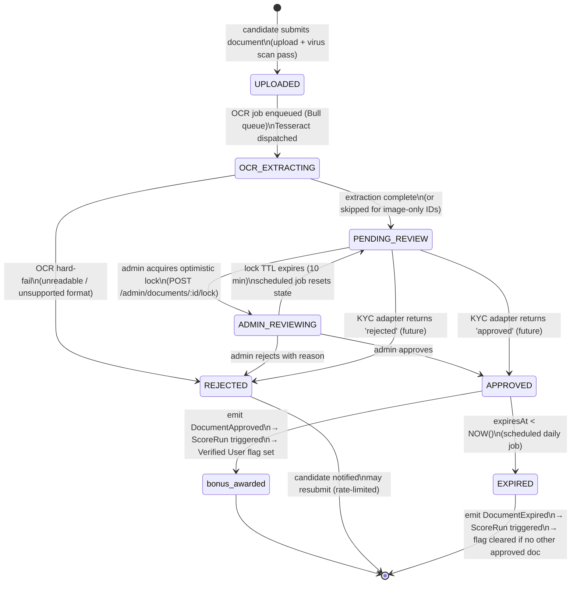
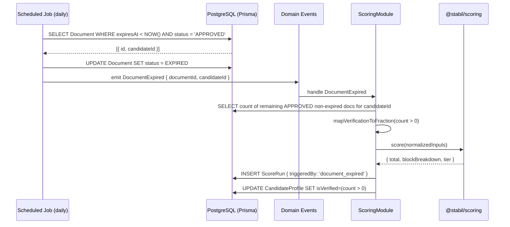
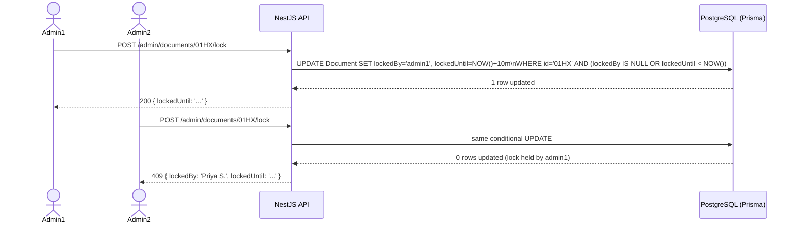

# Verification Module

> **Status:** Draft v0.1 · **Phase:** 3 · **Owner area:** backend
> **Related:** [phases/phase-3-verification.md](../../phases/phase-3-verification.md) · [backend/modules/documents-storage.md](./documents-storage.md) · [backend/modules/scoring.md](./scoring.md) · [architecture/05-security-privacy.md](../../architecture/05-security-privacy.md) · [SCOPE.md](../../SCOPE.md)

The verification module owns the full lifecycle of identity document submissions — from upload through OCR extraction, admin review (or future automated KYC checks), to approval and the downstream side-effects that award the **verification bonus** block and set the **Verified User** flag. It is the sole writer to the `Document`, `DocumentOcrResult`, and `DocumentAccessLog` tables and the sole emitter of the `DocumentApproved` / `DocumentRejected` / `DocumentExpired` domain events. Approval always triggers a new `ScoreRun` via the scoring module; rejection never does. A candidate without any submitted documents remains fully functional — the verification bonus fraction evaluates to `0.0` and they receive their base score unaffected (SCOPE §5: "graceful without docs").

---

## Responsibility

**One purpose:** manage the state machine for identity documents submitted to prove candidate claims, and translate a successful validation into a measurable score improvement (bonus points + `Verified User` flag + re-score).

---

## Verification State Machine

Each `Document` row travels through a fixed set of states. The diagram covers both the **current** OCR + manual-review path and the **future** pluggable KYC adapter path; the branch point is the `KycAdapter` interface (see [KycAdapter interface](#kycadapter-interface)).



### State definitions

| State | Meaning | Set by |
|---|---|---|
| `UPLOADED` | File received, virus-scan passed, stored encrypted in MinIO | System (documents-storage module on upload completion) |
| `OCR_EXTRACTING` | Tesseract OCR job is running; extracted fields being staged | System (async Bull queue worker) |
| `PENDING_REVIEW` | Awaiting admin action (or KYC adapter result in automated phase) | System (on `OcrComplete` event) |
| `ADMIN_REVIEWING` | An admin holds an optimistic lock on this item (10-minute TTL) | Admin (POST `/admin/documents/:id/lock`) |
| `APPROVED` | Document validated; bonus and flag applied | Admin (PATCH `/admin/documents/:id/approve`) or KYC adapter |
| `REJECTED` | Document invalid, fraudulent, or unreadable | Admin (PATCH `/admin/documents/:id/reject`) or KYC adapter |
| `EXPIRED` | Document's validity period has elapsed (`expiresAt` in the past) | Scheduled daily job |

### Side-effect transitions

| Transition | Side-effects |
|---|---|
| `PENDING_REVIEW → APPROVED` | Emit `DocumentApproved` → scoring module creates `ScoreRun` → `CandidateProfile.isVerified = true`, `verifiedAt = NOW()` |
| `APPROVED → EXPIRED` | Emit `DocumentExpired` → scoring module creates `ScoreRun` → re-evaluate `isVerified`; clear flag if no other non-expired approved document remains |
| `* → REJECTED` | Emit `DocumentRejected` → notifications module sends email + in-app alert to candidate; no `ScoreRun` |
| `ADMIN_REVIEWING → PENDING_REVIEW` | Lock TTL elapsed; scheduled job resets state; no event emitted |

---

## Public API

All endpoints are under `/api/v1`. JSON. Errors use RFC 9457 `application/problem+json`. Auth: JWT bearer token (web) / SecureStore JWT (mobile). Role enforcement via NestJS `RolesGuard`.

### Candidate endpoints

| Method | Path | Role | Description |
|---|---|---|---|
| `POST` | `/api/v1/candidates/me/documents` | `candidate` | Submit a document for verification (multipart/form-data). Triggers upload → OCR pipeline. |
| `GET` | `/api/v1/candidates/me/documents` | `candidate` | List own documents with current status. No signed URLs in list payload. |
| `GET` | `/api/v1/candidates/me/documents/:id` | `candidate` | Get a single document's status, rejection reason (if any), and a 15-minute signed preview URL. |
| `DELETE` | `/api/v1/candidates/me/documents/:id` | `candidate` | Withdraw a document. Allowed only when `status ∈ {UPLOADED, PENDING_REVIEW}`. Deletes the MinIO object and the DB row. |

#### `POST /api/v1/candidates/me/documents`

**Request:** `multipart/form-data`

| Field | Type | Required | Notes |
|---|---|---|---|
| `file` | binary | Yes | JPEG, PNG, or PDF. Max 10 MB. |
| `documentType` | `DocumentType` enum string | Yes | e.g. `AADHAAR`, `PASSPORT_INTL` |
| `region` | ISO 3166-1 alpha-2 or `'IN'` | Yes | e.g. `IN`, `GB`, `DE` |

**Response 201:**

```jsonc
{
  "id": "01HX...",
  "documentType": "AADHAAR",
  "region": "IN",
  "status": "UPLOADED",
  "createdAt": "2026-06-06T10:00:00Z"
}
```

**Error responses:** `400` (validation failure) · `413` (file too large) · `415` (unsupported MIME type) · `422` (virus detected) · `429` (resubmission rate limit — max 3 per document type per 30 days).

#### `GET /api/v1/candidates/me/documents`

**Response 200:**

```jsonc
{
  "items": [
    {
      "id": "01HX...",
      "documentType": "AADHAAR",
      "region": "IN",
      "status": "PENDING_REVIEW",
      "rejectionReason": null,
      "expiresAt": null,
      "createdAt": "2026-06-06T10:00:00Z"
    }
  ]
}
```

The `signedUrl` field is **not** included in list responses; retrieve it via the single-document endpoint to limit exposure.

#### `DELETE /api/v1/candidates/me/documents/:id`

**Response 204** (no body) on success.
**Error 409** if `status ∉ {UPLOADED, PENDING_REVIEW}` — document is under review or already decided.

---

### Admin endpoints

All admin endpoints require role `admin`. Non-admin callers receive `403 Forbidden`.

| Method | Path | Role | Description |
|---|---|---|---|
| `GET` | `/api/v1/admin/documents` | `admin` | Paginated review queue. Filterable by `status`, `documentType`, `region`, date range. Default sort: oldest submitted first (FIFO). |
| `GET` | `/api/v1/admin/documents/:id` | `admin` | Document detail + OCR-extracted fields + 15-minute signed URL. Logs access to `DocumentAccessLog`. |
| `POST` | `/api/v1/admin/documents/:id/lock` | `admin` | Acquire optimistic review lock. Returns `409` if already locked by another admin (includes lock holder name and `lockedUntil`). |
| `PATCH` | `/api/v1/admin/documents/:id/approve` | `admin` | Approve document. Validates lock ownership. Transitions state → `APPROVED`. Emits `DocumentApproved`. |
| `PATCH` | `/api/v1/admin/documents/:id/reject` | `admin` | Reject document with reason. Validates lock ownership. Transitions state → `REJECTED`. Emits `DocumentRejected`. |

#### `GET /api/v1/admin/documents` — query parameters

| Param | Type | Default | Notes |
|---|---|---|---|
| `status` | `DocumentStatus` | — | Filter by state |
| `documentType` | `DocumentType` | — | Filter by doc type |
| `region` | string | — | ISO 3166-1 alpha-2 or `'IN'` |
| `submittedBefore` | ISO 8601 date | — | |
| `submittedAfter` | ISO 8601 date | — | |
| `page` | integer | `1` | |
| `limit` | integer | `20` | Max `100` |

**Response 200:**

```jsonc
{
  "items": [
    {
      "id": "01HX...",
      "candidateId": "01HY...",
      "candidateName": "Ravi Kumar",
      "documentType": "PAN",
      "region": "IN",
      "status": "PENDING_REVIEW",
      "submittedAt": "2026-06-05T08:30:00Z",
      "lockedBy": null,
      "lockedUntil": null
    }
  ],
  "total": 42,
  "page": 1,
  "limit": 20
}
```

#### `GET /api/v1/admin/documents/:id` — response

```jsonc
{
  "id": "01HX...",
  "candidateId": "01HY...",
  "candidateName": "Ravi Kumar",
  "documentType": "AADHAAR",
  "region": "IN",
  "status": "PENDING_REVIEW",
  "signedUrl": "https://minio.internal/stabil-documents/verification-docs/...?X-Amz-Expires=900&...",
  "signedUrlExpiresAt": "2026-06-06T10:15:00Z",
  "ocrResult": {
    "fields": {
      "name": "Ravi Kumar",
      "dob": "1995-03-12",
      "uid_last4": "4321",
      "address": "12 MG Road, Bengaluru, Karnataka"
    },
    "confidence": 0.87
  },
  "createdAt": "2026-06-06T10:00:00Z",
  "lockedBy": null,
  "lockedUntil": null,
  "accessLog": [
    { "accessedBy": "admin-user-01", "role": "admin", "reason": "admin_review", "at": "2026-06-06T10:02:00Z" }
  ]
}
```

Note: the full Aadhaar UID is **never** in `fields`; only `uid_last4` is stored and returned.

#### `PATCH /api/v1/admin/documents/:id/reject` — request body

```jsonc
{
  "reason": "Document image is blurry; name is unreadable."
}
```

`reason` is required and must be a non-empty string (max 500 characters).

---

## Data Models (Prisma)

The verification module is the **sole writer** of these models. Other modules read them as needed.

### `Document`

```prisma
model Document {
  id              String            @id @default(cuid())   // UUID v7 in practice
  candidateId     String
  candidate       CandidateProfile  @relation(fields: [candidateId], references: [id])
  documentType    DocumentType
  region          String            // ISO 3166-1 alpha-2 or 'IN'
  status          DocumentStatus    @default(UPLOADED)
  objectKey       String            // MinIO object path — never the raw URL
  fileSizeBytes   Int
  mimeType        String            // 'image/jpeg' | 'image/png' | 'application/pdf'
  fileHash        String?           // SHA-256 of raw bytes — used to detect re-use of identical file
  ocrResult       DocumentOcrResult?
  expiresAt       DateTime?         // from the document's own expiry date, if applicable
  reviewedAt      DateTime?
  reviewedBy      String?           // admin userId
  rejectionReason String?
  lockedBy        String?           // admin userId holding optimistic review lock
  lockedUntil     DateTime?         // lock TTL; NULL when not locked
  fraudHold       Boolean           @default(false) // admin flag — exempt from scheduled purge
  createdAt       DateTime          @default(now())
  updatedAt       DateTime          @updatedAt
  accessLogs      DocumentAccessLog[]

  @@index([candidateId])
  @@index([status])
  @@index([documentType, region])
}
```

### `DocumentOcrResult`

```prisma
model DocumentOcrResult {
  id          String   @id @default(cuid())
  documentId  String   @unique
  document    Document @relation(fields: [documentId], references: [id])
  fields      Json     // structured extracted fields; Aadhaar UID masked to last 4 digits
  rawText     String?  // full Tesseract output kept for admin review; purged post-approval
  confidence  Float?   // Tesseract mean confidence 0–1; < 0.6 flagged for admin attention
  createdAt   DateTime @default(now())
}
```

### `DocumentAccessLog`

```prisma
model DocumentAccessLog {
  id         String   @id @default(cuid())
  documentId String
  document   Document @relation(fields: [documentId], references: [id])
  accessedBy String   // userId
  role       String   // 'admin' | 'candidate'
  reason     String?  // 'admin_review' | 'candidate_self_view' | 'signed_url_generated'
  ip         String?
  createdAt  DateTime @default(now())

  @@index([documentId])
}
```

### `DocumentType` enum

```prisma
enum DocumentType {
  // India
  AADHAAR
  PAN
  PASSPORT_IN
  VOTER_ID
  DRIVING_LICENCE_IN
  // International
  PASSPORT_INTL
  NATIONAL_ID
  RESIDENCE_PERMIT
  DRIVING_LICENCE_INTL
}
```

### `DocumentStatus` enum

```prisma
enum DocumentStatus {
  UPLOADED
  OCR_EXTRACTING
  PENDING_REVIEW
  ADMIN_REVIEWING
  APPROVED
  REJECTED
  EXPIRED
}
```

### `CandidateProfile` additions (Phase 3)

```prisma
// Added to the existing CandidateProfile model
isVerified  Boolean   @default(false)
verifiedAt  DateTime?
```

`isVerified` is **derived** — never set manually outside the verification module. It evaluates as:

```
isVerified = EXISTS (
  SELECT 1 FROM Document
  WHERE candidateId = :id
    AND status = 'APPROVED'
    AND (expiresAt IS NULL OR expiresAt > NOW())
)
```

One non-expired approved document is sufficient.

---

## Per-Region Document Types

The `documentType` enum value is the authoritative identifier. New types are added by a Prisma migration (enum extension), not a code change to business logic.

### India

| Document | `DocumentType` | OCR fields extracted | Notes |
|---|---|---|---|
| Aadhaar Card | `AADHAAR` | `name`, `dob`, `uid_last4`, `address` | Store only last 4 digits of the 12-digit UID — the rest is discarded at extraction time |
| PAN Card | `PAN` | `name`, `dob`, `pan_number` | `pan_number` is flagged `sensitiveField: true`; stripped from non-admin API responses |
| Passport (India) | `PASSPORT_IN` | `name`, `dob`, `passport_number`, `expiry`, `nationality` | Track `expiresAt` |
| Voter ID (EPIC) | `VOTER_ID` | `name`, `dob` (if present), `epic_number` | DOB not always printed on card |
| Driving Licence | `DRIVING_LICENCE_IN` | `name`, `dob`, `licence_number`, `expiry` | Track `expiresAt` |

**Later automated path (India):** DigiLocker XML pull (Aadhaar, Driving Licence); NSDL PAN verification API; Aadhaar OTP-based verification via DigiLocker eSign. The `DigiLockerAdapter` and `PanNsdlAdapter` stubs are defined in Phase 3 but not wired to live APIs.

### International

| Document | `DocumentType` | OCR fields extracted | Notes |
|---|---|---|---|
| Passport | `PASSPORT_INTL` | `name`, `dob`, `nationality`, `passport_number`, `expiry`, `mrz` | Parse MRZ (Machine Readable Zone) as a cross-check; track `expiresAt` |
| National ID card | `NATIONAL_ID` | `name`, `dob`, `id_number`, `country` | `country` stored as ISO 3166-1 alpha-2 |
| Residence permit / visa | `RESIDENCE_PERMIT` | `name`, `permit_type`, `expiry` | Track `expiresAt` |
| Driver's licence | `DRIVING_LICENCE_INTL` | `name`, `dob`, `licence_number`, `expiry`, `country` | Track `expiresAt` |

**Later automated path (international):** commercial ID-verification APIs (e.g. Onfido, Veriff, Persona). The `OnfidoAdapter` stub is defined in Phase 3; the live implementation is post-POC.

---

## KycAdapter Interface

Defined in `packages/core/src/kyc/kyc-adapter.ts`. The verification service selects the adapter for a given `(documentType, region)` pair from a config map (`KYC_STRATEGY` environment config). This keeps the domain logic adapter-agnostic and makes the later automated phase a pure addition — no model or endpoint changes required.

```typescript
// packages/core/src/kyc/kyc-adapter.ts

export type KycStrategy =
  | 'manual'
  | 'digilocker'
  | 'pan_nsdl'
  | 'onfido'
  | (string & {}); // open for extension

export interface KycResult {
  outcome: 'approved' | 'rejected' | 'needs_manual';
  confidence?: number;   // 0–1, optional; surfaced in admin UI if present
  reason?: string;       // human-readable; stored as rejectionReason on rejection
  externalRef?: string;  // external KYC provider reference ID for audit
}

export interface KycAdapter {
  readonly strategy: KycStrategy;
  /**
   * Attempt automated verification. Must resolve — never reject.
   * Return 'needs_manual' to fall back to the admin review queue.
   */
  verify(
    document: DocumentEntity,
    extractedFields: OcrResult,
  ): Promise<KycResult>;
}
```

### Built-in adapter implementations (Phase 3)

| Class | `strategy` | Behaviour |
|---|---|---|
| `ManualKycAdapter` | `'manual'` | Always returns `{ outcome: 'needs_manual' }`. This is the **default** for all document types in Phase 3, routing every submission to the admin queue. |
| `DigiLockerAdapter` (stub) | `'digilocker'` | Throws `NotImplementedException`. Ready for wiring in the automated sub-phase. |
| `PanNsdlAdapter` (stub) | `'pan_nsdl'` | Throws `NotImplementedException`. Ready for wiring in the automated sub-phase. |
| `OnfidoAdapter` (stub) | `'onfido'` | Throws `NotImplementedException`. Ready for wiring in the automated sub-phase. |

### Adapter selection (config map)

```typescript
// backend/src/verification/kyc-strategy.config.ts
const KYC_STRATEGY_MAP: Record<`${DocumentType}_${string}`, KycStrategy> = {
  'AADHAAR_IN':              'manual',      // → 'digilocker' in automated phase
  'PAN_IN':                  'manual',      // → 'pan_nsdl' in automated phase
  'PASSPORT_IN_IN':          'manual',
  'VOTER_ID_IN':             'manual',
  'DRIVING_LICENCE_IN_IN':   'manual',
  'PASSPORT_INTL_*':         'manual',      // → 'onfido' in automated phase
  'NATIONAL_ID_*':           'manual',
  'RESIDENCE_PERMIT_*':      'manual',
  'DRIVING_LICENCE_INTL_*':  'manual',
};
```

---

## How Approval Awards the Verification Bonus

### Score composition (SCOPE §4.1)

```
TOTAL (0–1500) = mode-specific block + common block + verification bonus
```

The `verification bonus` is a block in `@stabil/scoring` driven by a single `verification` parameter. The engine receives a normalized fraction `[0, 1]`:

- `0.0` — no approved, non-expired document.
- `1.0` — at least one approved, non-expired document (binary for POC; can be graduated later — e.g. higher weight for government ID than certificate).

> **Engine boundary:** converting "has approved document?" to a fraction is the **rubric layer** (`packages/core/src/rubrics/verification.rubric.ts`), not inside `@stabil/scoring`. The scoring engine only ever sees fractions.

```typescript
// packages/core/src/rubrics/verification.rubric.ts
export function mapVerificationToFraction(isVerified: boolean): number {
  return isVerified ? 1.0 : 0.0;
}
```

The exact point value for a `1.0` fraction is a **calibration-time constant** (SCOPE §13 — TBD). The engine boundary is clean regardless of what that constant is.

### `Verified User` flag

`CandidateProfile.isVerified` is set by the verification module on every `DocumentApproved` event and re-evaluated on every `DocumentExpired` event. It is also re-evaluated at the start of every `ScoreRun` so that expiry is always reflected correctly even if the expiry job and the score run race.

---

## Key Flows (Mermaid Sequence Diagrams)

### Submit → OCR → Review → Approve → Re-score

```mermaid
sequenceDiagram
    actor Candidate
    participant API as NestJS API<br/>(VerificationController)
    participant Storage as DocumentsStorageService
    participant Queue as Bull OCR Queue
    participant OCR as OcrWorker (Tesseract)
    participant DB as PostgreSQL (Prisma)
    participant Events as Domain Events (EventEmitter2)
    participant Scoring as ScoringModule
    participant Engine as @stabil/scoring
    participant Notify as NotificationsModule

    Candidate->>API: POST /candidates/me/documents (multipart)
    API->>API: Zod validation (mimeType, size, documentType, region)
    API->>Storage: uploadAndScan(file, metadata)
    Storage->>Storage: ClamAV virus scan
    Storage->>Storage: PUT to MinIO (SSE-S3 enabled)
    Storage-->>API: { objectKey, fileSizeBytes, fileHash }
    API->>DB: INSERT Document { status: UPLOADED, objectKey, ... }
    API-->>Candidate: 201 { id, status: UPLOADED }

    API->>Queue: enqueue OcrJob { documentId, objectKey, documentType, region }
    Queue->>OCR: process OcrJob
    OCR->>Storage: getObjectBytes(objectKey) [service-to-service; no signed URL]
    Storage-->>OCR: raw bytes
    OCR->>OCR: Tesseract.recognize(bytes, { lang: 'eng+hin' | 'eng' })
    OCR->>OCR: parse structured fields per documentType
    OCR->>OCR: mask Aadhaar UID → uid_last4 only
    OCR->>DB: INSERT DocumentOcrResult { fields, rawText, confidence }
    OCR->>DB: UPDATE Document SET status = PENDING_REVIEW
    OCR->>Events: emit OcrComplete { documentId }

    Note over Candidate,Notify: --- Admin review phase ---

    actor Admin
    Admin->>API: POST /admin/documents/:id/lock
    API->>DB: UPDATE Document SET status = ADMIN_REVIEWING, lockedBy, lockedUntil = NOW()+10m
    API-->>Admin: 200 { lockedUntil }

    Admin->>API: GET /admin/documents/:id
    API->>Storage: presignedUrl(objectKey, ttl=900)
    Storage->>DB: INSERT DocumentAccessLog { reason: 'admin_review' }
    API-->>Admin: 200 { ..., signedUrl, ocrResult }

    Admin->>API: PATCH /admin/documents/:id/approve
    API->>API: validate lockedBy === req.user.id
    API->>DB: UPDATE Document SET status = APPROVED, reviewedAt, reviewedBy
    API->>Events: emit DocumentApproved { documentId, candidateId }

    Events->>Scoring: handle DocumentApproved
    Scoring->>DB: SELECT CandidateProfile parameters + approved docs
    Scoring->>Scoring: mapVerificationToFraction(true) → 1.0
    Scoring->>Engine: score(normalizedInputs)
    Engine-->>Scoring: { total, blockBreakdown, tier }
    Scoring->>DB: INSERT ScoreRun { total, blockBreakdown, isVerified: true,\ntriggeredBy: 'document_approved' }
    Scoring->>DB: UPDATE CandidateProfile SET isVerified=true, verifiedAt=NOW(),\nlatestScoreRunId=…
    Scoring->>Events: emit ScoreRunCompleted { candidateId, newTotal, delta }
    Events->>Notify: send "Your score improved" to candidate (email + in-app)
```

### Document Expiry → Flag Cleared → Re-score



### Admin Queue — Concurrent Lock Conflict



---

## Validation & Errors

Validation is shared-schema first: Zod schemas live in `packages/core/src/schemas/verification.schema.ts` and are imported by both the NestJS `ValidationPipe` and the front-end form layer.

### Upload validation (`SubmitDocumentSchema`)

```typescript
import { z } from 'zod';

const ALLOWED_MIME_TYPES = ['image/jpeg', 'image/png', 'application/pdf'] as const;
const MAX_FILE_SIZE_BYTES = 10 * 1024 * 1024; // 10 MB

export const SubmitDocumentSchema = z.object({
  documentType: z.nativeEnum(DocumentType),
  region: z.string().regex(/^[A-Z]{2}$|^IN$/, 'Must be ISO 3166-1 alpha-2 or IN'),
  // file metadata validated server-side after multipart parse:
  mimeType: z.enum(ALLOWED_MIME_TYPES),
  fileSizeBytes: z.number().int().positive().max(MAX_FILE_SIZE_BYTES),
});
```

### Rejection body (`RejectDocumentSchema`)

```typescript
export const RejectDocumentSchema = z.object({
  reason: z.string().min(1).max(500),
});
```

### Standard error codes

| HTTP | Code string | Trigger |
|---|---|---|
| `400` | `VALIDATION_ERROR` | Zod schema failure (missing/invalid fields) |
| `403` | `FORBIDDEN` | Caller role is not permitted on this endpoint |
| `404` | `DOCUMENT_NOT_FOUND` | `:id` does not exist or does not belong to the caller |
| `409` | `DOCUMENT_LOCKED` | Another admin holds the review lock |
| `409` | `DOCUMENT_NOT_WITHDRAWABLE` | Candidate attempts DELETE when `status ∉ {UPLOADED, PENDING_REVIEW}` |
| `413` | `FILE_TOO_LARGE` | Upload exceeds 10 MB |
| `415` | `UNSUPPORTED_MEDIA_TYPE` | MIME type not in allowlist |
| `422` | `VIRUS_DETECTED` | ClamAV scan returned positive |
| `422` | `OCR_HARD_FAIL` | Tesseract could not extract any text (document is unreadable) |
| `429` | `RESUBMISSION_RATE_LIMIT` | Candidate has submitted ≥ 3 documents of the same type in 30 days |

All errors follow RFC 9457:

```jsonc
{
  "type": "https://stabil.app/errors/virus-detected",
  "title": "Virus Detected",
  "status": 422,
  "detail": "The uploaded file failed the antivirus scan and was not stored.",
  "instance": "/api/v1/candidates/me/documents"
}
```

---

## Security & Permissions

ID documents are the most sensitive PII the platform handles. Full controls are documented in [architecture/05-security-privacy.md](../../architecture/05-security-privacy.md) §2 and §5; verification-specific requirements are collected here.

### Encryption at rest

- MinIO server-side encryption (SSE-S3 or SSE-KMS) is enabled on the `stabil-documents` bucket for both `resumes/` and `verification-docs/` prefixes. The same SSE configuration is applied in development (local MinIO with a local KMS key) so the code path is identical across environments.
- The `Document.objectKey` column stores only the MinIO object path — never raw bytes, never a URL.
- ID numbers (Aadhaar, PAN, passport numbers) in `DocumentOcrResult.fields` are stored as a `Json` column; Aadhaar UID is masked to `uid_last4` at OCR extraction time and the full UID is **never** written to any table or log.

### Short-lived signed URLs

- Document bytes are **never** served via a permanent URL. Every download call invokes MinIO's `presignedGetObject` with a **15-minute TTL**.
- Signed URL generation is gated by role:
  - `candidate` — may generate a URL for their own document (GET `/candidates/me/documents/:id`).
  - `admin` — may generate a URL for any document (GET `/admin/documents/:id`).
  - All other roles receive `403`.
- Every call to `presignedUrl()` is logged to `DocumentAccessLog`.

### Role permissions matrix

| Action | `candidate` | `employer` | `recruiter` | `admin` |
|---|:---:|:---:|:---:|:---:|
| Upload own document | Own only | — | — | — |
| List own documents | Own only | — | — | — |
| View own document (signed URL) | Own only | — | — | — |
| Withdraw own pending document | Own only | — | — | — |
| List all documents (admin queue) | — | — | — | Yes |
| View any document (signed URL) | — | — | — | Yes |
| Lock document for review | — | — | — | Yes |
| Approve document | — | — | — | Yes |
| Reject document | — | — | — | Yes |
| View OCR extracted fields | Own only (fields only; no rawText) | — | — | Yes (full) |
| View `DocumentAccessLog` | — | — | — | Yes |

Employers and recruiters have **zero access** to document content, status details, or OCR results. The candidate's `isVerified` boolean is visible to consented employers and recruiters as part of the report, but the underlying document details are not.

### Aadhaar UID masking (technical detail)

```typescript
// backend/src/verification/ocr/masking.ts
export function maskAadhaarUid(uid: string): string {
  // Aadhaar UIDs are 12 digits. Store only the last 4.
  if (uid.replace(/\s/g, '').length !== 12) {
    throw new Error('Invalid Aadhaar UID length');
  }
  return uid.replace(/\s/g, '').slice(-4);
}
```

The unmasked UID is consumed in memory only during OCR field parsing. It is never assigned to a variable that persists beyond the masking call.

### Sensitive field flag

PAN numbers and passport numbers extracted into `DocumentOcrResult.fields` carry a `_sensitive: true` marker in the JSON structure. The `VerificationController` serializer strips any key suffixed `_sensitive: true` from all responses where the caller role is `candidate`.

### Retention and purge (SCOPE §11)

| Trigger | Action |
|---|---|
| Candidate deletes account (`AccountDeleted` event) | Delete MinIO objects for all their documents; hard-delete `Document`, `DocumentOcrResult`, and `DocumentAccessLog` rows within the same saga. |
| Document reaches `REJECTED` status + 30 days (configurable: `REJECTED_PURGE_DAYS`) | Scheduled job hard-deletes `Document` + `DocumentOcrResult`; MinIO object deleted. Exempt if `fraudHold = true`. |
| Document reaches `EXPIRED` status + 90 days past `expiresAt` (configurable: `EXPIRED_PURGE_DAYS`) | Same hard-delete as above. Exempt if `fraudHold = true`. |

Purge job runs nightly via NestJS `@Cron`. All purge actions are written to `AuditLog` with event type `account.purged`.

---

## Dependencies

| Dependency | Direction | Notes |
|---|---|---|
| [documents-storage.md](./documents-storage.md) | Consumed | `DocumentsStorageService.upload()`, `.presignedUrl()`, `.deleteObject()`. Storage module handles ClamAV, MinIO SSE, and access logging hooks. |
| [scoring.md](./scoring.md) | Consumed | `ScoringService.triggerScoreRun(candidateId, triggeredBy)` called on `DocumentApproved` and `DocumentExpired` events. |
| `@stabil/scoring` | Indirect | Engine receives the `verification` fraction from the rubric layer. |
| `packages/core` | Consumed | `KycAdapter` interface, `OcrResult` type, `SubmitDocumentSchema`, masking helpers, `mapVerificationToFraction` rubric. |
| `notifications` module | Consumed | `NotificationsService.sendDocumentRejected(candidateId, reason)` and `sendScoreImproved(candidateId, delta)` called via domain events. |
| `auth-accounts` module | Consumed | `RolesGuard`, `JwtAuthGuard`, `req.user` shape. |
| Bull + Redis | Infrastructure | OCR job queue; may reuse a Bull instance already introduced in Phase 2 for resume parsing jobs. |
| Tesseract | Infrastructure | `tesseract.js` npm package or native binary via `child_process` in the API container. Language packs: `eng`, `hin`. |
| ClamAV | Infrastructure | ClamAV daemon sidecar in the deploy environment; `DocumentsStorageService` calls it before MinIO PUT. |
| PostgreSQL + Prisma | Infrastructure | All persistence. |

---

## Phased Implementation

### Phase 3 (current) — OCR + manual admin review

All endpoints, state machine, and models described in this document are built in Phase 3. The `ManualKycAdapter` is the default for every document type. Stub adapters compile and throw `NotImplementedException`.

**Phase 3 milestones (from [phases/phase-3-verification.md](../../phases/phase-3-verification.md)):**

| Milestone | Gate |
|---|---|
| M3.0 — Storage ready | MinIO SSE confirmed; `DocumentsStorageService` unit-tested; ClamAV scan path verified |
| M3.1 — Upload & OCR | Candidate upload → OCR → `PENDING_REVIEW` confirmed by integration test |
| M3.2 — Admin review queue | Lock, approve, reject via API and UI; concurrent-lock test passes |
| M3.3 — Bonus & re-score | `DocumentApproved` → `ScoreRun` pipeline; `isVerified` flip verified |
| M3.4 — Candidate UI | Upload flow + status widget + improvement nudge on web and mobile |
| M3.5 — Security & retention | Presigned URL TTL; role guards; deletion saga; Aadhaar masking |
| M3.6 — KYC adapter interface | Interface + stubs merged; `ManualKycAdapter` unit-tested |

### Post-POC automated phase — KYC adapter implementations

No model or endpoint changes. Implement concrete `KycAdapter` classes:

| Target | Adapter | Documents |
|---|---|---|
| India — Aadhaar | `DigiLockerAdapter` | `AADHAAR` |
| India — PAN | `PanNsdlAdapter` | `PAN` |
| India — Driving Licence | `DigiLockerAdapter` | `DRIVING_LICENCE_IN` |
| International | `OnfidoAdapter` (or equivalent) | `PASSPORT_INTL`, `NATIONAL_ID`, `RESIDENCE_PERMIT`, `DRIVING_LICENCE_INTL` |

Update `KYC_STRATEGY_MAP` in config to replace `'manual'` with the concrete strategy per `(documentType, region)` pair. No domain model changes. Admin queue remains as a fallback for `needs_manual` results.

---

## Testing

### Unit tests (Vitest)

| Test | What it covers |
|---|---|
| `VerificationService.approve()` | State transition `ADMIN_REVIEWING → APPROVED`; `DocumentApproved` event emitted; `ScoringService.triggerScoreRun` called with `triggeredBy: 'document_approved'`; lock ownership validated. Mock event bus and scoring service. |
| `VerificationService.reject()` | State transition `→ REJECTED`; `DocumentRejected` event emitted; `ScoringService` NOT called; `rejectionReason` persisted. |
| `VerificationService.lock()` | First lock succeeds; second lock returns `409`; expired lock can be re-acquired. |
| `OcrWorker` | Mock Tesseract output → assert correct field extraction per document type; assert Aadhaar UID reduced to `uid_last4`; assert confidence below 0.6 is flagged. |
| `maskAadhaarUid()` | Valid 12-digit UID → last 4 digits; invalid length → throws. |
| `mapVerificationToFraction()` | `true → 1.0`; `false → 0.0`. |
| `ManualKycAdapter.verify()` | Returns `{ outcome: 'needs_manual' }` for all inputs. |
| Stub adapters | All throw `NotImplementedException`. |
| Lock expiry scheduled job | Mock DB: documents with `lockedUntil < NOW()` and `status = ADMIN_REVIEWING` → reset to `PENDING_REVIEW`; non-stale locks unchanged. |
| Purge job | Mock DB + MinIO client: `REJECTED` docs older than `REJECTED_PURGE_DAYS` are deleted; `EXPIRED` docs past `EXPIRED_PURGE_DAYS` are deleted; `fraudHold=true` docs are skipped. |

### Integration tests (supertest + test PostgreSQL)

| Scenario | Assertions |
|---|---|
| Full upload → OCR → `PENDING_REVIEW` pipeline | `Document.status = PENDING_REVIEW`; `DocumentOcrResult` created; no Aadhaar full UID in `fields`. |
| `PENDING_REVIEW → APPROVED → ScoreRun` | `ScoreRun` created with `triggeredBy: 'document_approved'`; `CandidateProfile.isVerified = true`. |
| Concurrent lock acquisition | Two simultaneous POST `/lock` → one wins (200), one loses (409). |
| Candidate account deletion | Mock MinIO client: assert `deleteObject` called for all candidate's document keys; `Document` rows gone from DB. |
| Role guard — employer calls admin queue | Receives `403`. |
| Resubmission rate limit | 4th submission of same type within 30 days → `429`. |

### E2E tests (Playwright, web)

| Scenario | Expected outcome |
|---|---|
| Candidate uploads a test document (seeded MinIO stub) | `PENDING_REVIEW` badge visible within 60 s; improvement nudge visible. |
| Admin approves document | Candidate report page shows `Verified User` badge; score increased by verification bonus. |
| Admin rejects document | Candidate sees rejection reason; resubmit CTA is present. |
| Employer accesses admin document queue | Redirected to 403 page. |
| Signed URL used after 15 minutes | MinIO returns `403` / `410`; front end shows expiry error. |

---

## Best Practices & Gotchas

- **Never expose `objectKey` in API responses** — it reveals the MinIO bucket structure and bypasses the signed-URL access control. Always return a `signedUrl` generated server-side or omit the URL entirely from list payloads.
- **Optimistic lock enforcement** — the lock `UPDATE` must use a conditional `WHERE (lockedBy IS NULL OR lockedUntil < NOW())` in a single SQL statement, not a read-then-write, to avoid a TOCTOU race between two concurrent admin requests.
- **OCR language pack discipline** — use `eng+hin` for `region = 'IN'`; use `eng` otherwise. Passing `eng+hin` for an English-only Latin-alphabet passport degrades accuracy.
- **`rawText` purge after approval** — `DocumentOcrResult.rawText` (full Tesseract dump) should be nulled out after admin approval is confirmed, as it may contain unmasked text fragments that were not captured in `fields`. Add this as a step in the `VerificationService.approve()` method.
- **File hash deduplication** — store `SHA-256` of the uploaded file in `Document.fileHash`. On upload, check for an existing `APPROVED` or `PENDING_REVIEW` document with the same `fileHash` for the same candidate — reject with `422` and a hint to avoid re-uploading the same scan twice.
- **MinIO SSE in dev** — ensure the development MinIO instance is also configured with SSE so that engineers never accidentally test against an unencrypted path that would silently pass in staging/production.
- **Bull job idempotency** — OCR jobs must be idempotent: if a job is retried after a crash mid-way, it must not create a duplicate `DocumentOcrResult`. Use `upsert` on `documentId` (which has a `@unique` constraint).
- **Fraud hold flag** — when an admin suspects a document is fraudulent, they can set `Document.fraudHold = true` via the admin detail view. This exempts the document from automated purge even after the retention window expires. The hold must be explicitly released by an admin.
- **Compliance pre-production** — before handling real Aadhaar data, obtain legal sign-off confirming compliance with UIDAI guidelines and India DPDP Act §§8–12. See [architecture/05-security-privacy.md](../../architecture/05-security-privacy.md) §11.
