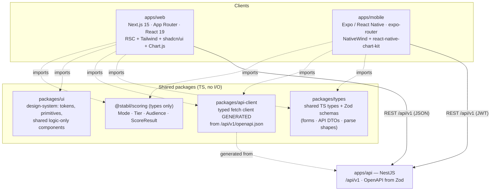
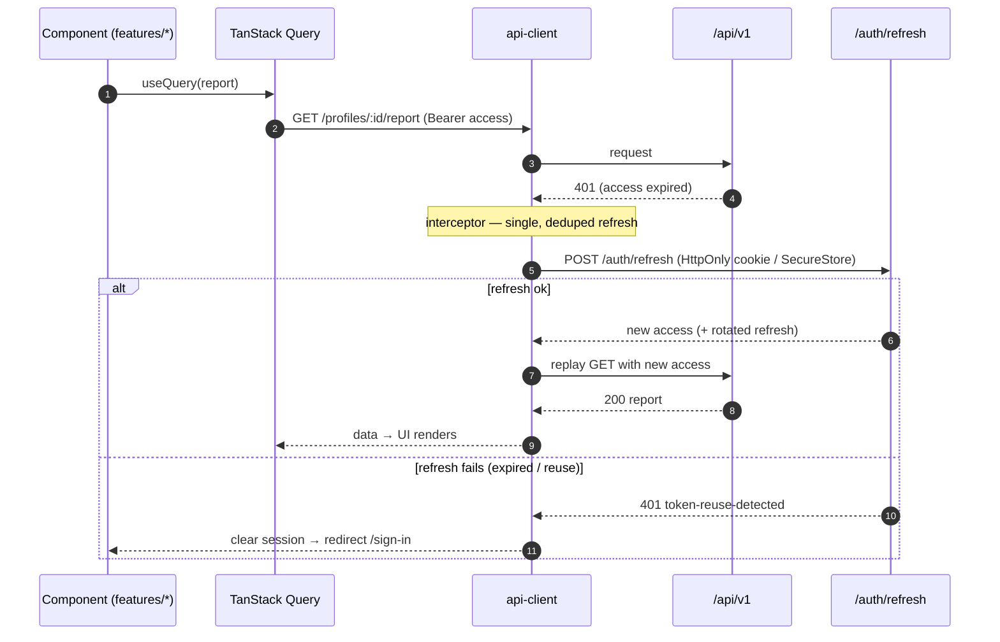

# Frontend Architecture & Conventions

> **Status:** Draft v0.1 · **Phase:** cross-cutting · **Owner area:** frontend
> **Related:** [design-system.md](./design-system.md), [charts.md](./charts.md), [state-and-forms.md](./state-and-forms.md), [mobile.md](./mobile.md), [best-practices.md](./best-practices.md), [pages/README.md](./pages/README.md), [../architecture/01-overview.md](../architecture/01-overview.md), [../architecture/04-api-contracts.md](../architecture/04-api-contracts.md), [../architecture/05-security-privacy.md](../architecture/05-security-privacy.md), [../SCOPE.md](../SCOPE.md), [../README.md](../README.md)

This is the canonical guide for Stabil's two clients — **`apps/web`** (Next.js 15, App Router, React 19) and **`apps/mobile`** (Expo / React Native + NativeWind) — and everything they share. It covers folder structure, routing, the data layer (TanStack Query + a typed API client generated from the backend OpenAPI/Zod), auth (JWT access+refresh with route guards and role gating), styling, forms, charts, **audience-aware rendering**, i18n, error/loading UX, testing, and performance. It stays 100% consistent with [SCOPE.md](../SCOPE.md) and the canonical-facts table in [README.md](../README.md). Where this doc and `SCOPE.md` ever disagree, **`SCOPE.md` wins** — open a PR to fix the drift.

The single most important frontend rule, stated up front because everything else defends it:

> **The client is thin and never re-implements scoring or visibility logic.** It imports the **same shared types + Zod schemas** the API uses, calls `/api/v1`, and renders whatever the server returns. The **candidate bundle must NEVER receive employer-only fields** (age, marital status — SCOPE §6.3 / §9). Audience filtering is enforced **server-side** ([04-api-contracts.md §1.9 / §13](../architecture/04-api-contracts.md)); the client simply requests **audience-scoped data** and renders it. There is no client-side flag that can unhide a suppressed line-item — see [§8](#8-audience-aware-rendering-the-load-bearing-rule).

---

## 1. The two clients & what they share

Both clients live in a Turborepo + pnpm workspace (SCOPE §10, [README tech-stack](../README.md)). One language (TypeScript) end-to-end means form logic, validation, domain types, and the API client are written once and consumed by web, mobile, and the API.



| Shared package | Purpose | Consumed by | Notes |
|---|---|---|---|
| **`packages/types`** | Single source of truth for shapes crossing process boundaries — form payloads, API DTOs, Phase-2 parse outputs — defined as **Zod** schemas with `z.infer` TS types. | web, mobile, API | A form validated in the browser is validated **identically** on the server (SCOPE §10 "Validation: Zod"). See [state-and-forms.md](./state-and-forms.md). |
| **`packages/api-client`** | A **typed fetch client generated from `GET /api/v1/openapi.json`** (which is itself generated from the Zod contracts — [04-api-contracts.md §1.2](../architecture/04-api-contracts.md)). One auth/refresh/error layer; per-endpoint typed methods. | web, mobile | The OpenAPI spec is a build artifact, never hand-edited. See [§4](#4-data-layer). |
| **`packages/ui`** | The **design system**: design tokens, Tailwind preset, and the **logic-only / cross-platform** primitives (variants, a11y behaviour). Web renders these with shadcn/ui + Radix; mobile maps the same tokens through NativeWind. | web (fully), mobile (tokens + logic) | shadcn/ui components are DOM-based, so RN consumes **tokens + behaviour contracts**, not the DOM markup. See [design-system.md](./design-system.md) and [mobile.md](./mobile.md). |
| **`@stabil/scoring`** | Re-exported **domain types only** (`Mode`, `Tier`, `Audience`, `Block`, `Visibility`, `ScoreResult`) so a score is typed identically wherever it is displayed. Clients import **types**, never call `computeScore` (scoring is server-side). | web, mobile | Engine boundary from [README](../README.md): clients never score. |

> **Why a shared UI package and not just per-app components?** The candidate, employer, recruiter, and admin areas all render the same score primitives (tier badge, score gauge, breakdown row). Centralising tokens + variants in `packages/ui` keeps web and mobile visually consistent and lets a token change (e.g. a tier colour) propagate everywhere. Detailed in [design-system.md](./design-system.md).

---

## 2. `apps/web` folder structure

Next.js 15 App Router with **route groups** that separate the public marketing/auth surface from the authenticated app, and isolate each role's area (candidate / employer / recruiter / admin). React 19 Server Components are the default; client components are opt-in (`"use client"`).

```
apps/web/
├── app/                              # App Router (RSC by default)
│   ├── layout.tsx                    # root layout: <html lang>, providers, fonts
│   ├── providers.tsx                 # "use client": QueryClientProvider, ThemeProvider, AuthProvider, Toaster
│   ├── globals.css                   # Tailwind base + design-token CSS variables
│   ├── error.tsx                     # root error boundary
│   ├── not-found.tsx                 # 404
│   │
│   ├── (public)/                     # ── PUBLIC group (no auth) ──
│   │   ├── layout.tsx                #   marketing chrome (header/footer)
│   │   ├── page.tsx                  #   "/" landing
│   │   ├── pricing/page.tsx
│   │   ├── legal/[doc]/page.tsx      #   privacy / terms / DPDP notice
│   │   └── share/[token]/page.tsx    #   public-ish report view via accepted share link
│   │
│   ├── (auth)/                       # ── AUTH group (unauthenticated flows) ──
│   │   ├── layout.tsx                #   centered card layout
│   │   ├── sign-in/page.tsx
│   │   ├── sign-up/page.tsx          #   role selection (candidate/employer/recruiter)
│   │   ├── forgot-password/page.tsx
│   │   ├── reset-password/page.tsx
│   │   └── claim/[claimToken]/page.tsx  # claim an employer-submitted profile (SCOPE §6.1/§16)
│   │
│   ├── (app)/                        # ── AUTHED shell (middleware-guarded) ──
│   │   ├── layout.tsx                #   app shell: sidebar/topbar, role-aware nav, notification bell
│   │   ├── loading.tsx               #   suspense fallback for the shell
│   │   │
│   │   ├── (candidate)/              #   ── CANDIDATE area (role: candidate) ──
│   │   │   ├── layout.tsx            #     <RoleGate role="candidate">
│   │   │   ├── dashboard/page.tsx
│   │   │   ├── onboarding/
│   │   │   │   ├── mode/page.tsx     #     Fresher vs Working Professional self-select (SCOPE §3)
│   │   │   │   └── form/[mode]/page.tsx  # multi-step wizard (fresher|professional)
│   │   │   ├── documents/page.tsx    #     uploads + verification status
│   │   │   ├── report/page.tsx       #     CANDIDATE report — sensitive line-items SUPPRESSED
│   │   │   ├── improve/page.tsx      #     "how to improve your score" (SCOPE §8)
│   │   │   ├── history/page.tsx      #     re-scoring / improvement loop (SCOPE §11)
│   │   │   ├── consent/page.tsx      #     manage per-share consent grants (SCOPE §6.2)
│   │   │   └── settings/page.tsx     #     account + data deletion (SCOPE §11)
│   │   │
│   │   ├── (employer)/               #   ── EMPLOYER area (role: employer) ──
│   │   │   ├── layout.tsx            #     <RoleGate role="employer">
│   │   │   ├── dashboard/page.tsx
│   │   │   ├── candidates/
│   │   │   │   ├── page.tsx          #     shared-with-me list
│   │   │   │   ├── submit/page.tsx   #     employer-driven submit → claimable profile (SCOPE §6.1)
│   │   │   │   └── [profileId]/report/page.tsx  # FULL report incl. sensitive items (after consent)
│   │   │   ├── compare/page.tsx      #     comparison/ranking (Phase 4, SCOPE §9)
│   │   │   └── settings/page.tsx
│   │   │
│   │   ├── (recruiter)/              #   ── RECRUITER area (role: recruiter) ──
│   │   │   ├── layout.tsx            #     <RoleGate role="recruiter">
│   │   │   ├── dashboard/page.tsx
│   │   │   ├── candidates/page.tsx
│   │   │   ├── shortlists/page.tsx   #     shortlist CRUD (Phase 4)
│   │   │   ├── search/page.tsx       #     candidate search (Phase 4)
│   │   │   └── settings/page.tsx
│   │   │
│   │   └── (admin)/                  #   ── ADMIN area (role: admin) ──
│   │       ├── layout.tsx            #     <RoleGate role="admin">
│   │       ├── dashboard/page.tsx
│   │       └── verification/page.tsx #     manual document review queue (SCOPE §5, Phase 3)
│   │
│   └── api/                          # Next route handlers (BFF helpers only — see §4.4)
│       └── auth/refresh/route.ts     #   reads HttpOnly refresh cookie, proxies to /api/v1/auth/refresh
│
├── components/                       # presentational, app-agnostic (no data fetching)
│   ├── ui/                           #   shadcn/ui generated primitives (Button, Dialog, …)
│   ├── layout/                       #   AppShell, Sidebar, RoleNav, NotificationBell
│   ├── score/                        #   ScoreGauge, TierBadge, BreakdownRow, BlockBar
│   └── feedback/                     #   EmptyState, ErrorState, Skeletons, ConsentBanner
│
├── features/                         # vertical slices: data + UI for one domain area
│   ├── auth/                         #   useSignIn, useSignUp, AuthProvider, session helpers
│   ├── onboarding/                   #   mode-select + form wizard machine + step schemas
│   ├── report/                       #   useReport(audience), ReportView, ImprovementGuidance
│   ├── documents/                    #   upload hook (presigned PUT → confirm), status views
│   ├── consent/                      #   useShareGrants, ShareDialog, RevokeButton
│   ├── verification/                 #   submit + status; admin review (admin area)
│   └── employer/                     #   search, compare, shortlists (Phase 4)
│
├── lib/                              # framework glue, no React
│   ├── api.ts                        #   configured @stabil/api-client instance (base URL, auth)
│   ├── auth.ts                       #   token store (in-memory access), refresh orchestration
│   ├── query-client.ts               #   TanStack Query defaults (staleTime, retry, error policy)
│   ├── i18n.ts                       #   next-intl config (locales, formatters)
│   └── env.ts                        #   typed runtime env (Zod-validated NEXT_PUBLIC_*)
│
├── hooks/                            # cross-feature reusable hooks
│   ├── use-session.ts                #   current user + role (from /account)
│   ├── use-role-gate.ts             #   client-side role assertion (defence in depth)
│   └── use-debounced-value.ts
│
├── messages/                         # i18n catalogs: en.json, en-IN.json, hi.json, …
├── middleware.ts                     # edge middleware: auth + role routing guards (see §4.5)
├── tailwind.config.ts                # consumes packages/ui Tailwind preset + tokens
├── next.config.ts
├── playwright.config.ts              # e2e config (see §10)
└── tsconfig.json
```

### 2.1 Three layers, three jobs

| Layer | Holds | May fetch data? | Rule |
|---|---|---|---|
| **`app/`** | Routes, layouts, route groups, loading/error boundaries. | Yes (RSC) | Thin — composes `features/` + `components/`. No business logic. |
| **`features/`** | A vertical slice for one domain (its hooks/queries + the components that use them). | **Yes** — this is the only place that calls TanStack Query/mutations. | Owns "how onboarding works", "how the report is fetched". |
| **`components/`** | Presentational primitives. Pure props in, JSX out. | **No** | Reusable across features and roles; never imports a query hook. |

This keeps data access concentrated in `features/`, so an audience-scoping bug (e.g. fetching the wrong report variant) has exactly one place to live and be tested — see [§8](#8-audience-aware-rendering-the-load-bearing-rule).

### 2.2 `apps/mobile` structure (summary)

Mobile mirrors the same feature slices but uses **expo-router** (file-based, like App Router) and **NativeWind** for styling. It shares `packages/types`, `packages/api-client`, and the `packages/ui` tokens + logic — only the rendering primitives differ (RN `View`/`Text` vs DOM). Token storage uses **SecureStore** instead of cookies/in-memory. Charts use a RN-native lib rather than Chart.js. Full parity matrix, navigation, and platform specifics are in **[mobile.md](./mobile.md)**.

---

## 3. Route / sitemap diagram

Route groups in parentheses (`(public)`, `(auth)`, `(app)`, `(candidate)`, …) are **organizational only** — they do not appear in the URL. Authenticated routes sit under the middleware-guarded `(app)` shell and are further gated by role (SCOPE §6 audiences; Role enum from [README](../README.md): `candidate | employer | recruiter | admin`).

```mermaid
graph TD
    ROOT["/"]

    subgraph PUBLIC["(public) — no auth"]
        LAND["/  landing"]
        PRICE["/pricing"]
        LEGAL["/legal/:doc<br/>privacy · terms · DPDP"]
        SHARE["/share/:token<br/>shared report (accepted share)"]
    end

    subgraph AUTHFLOW["(auth) — unauthenticated"]
        SIGNIN["/sign-in"]
        SIGNUP["/sign-up<br/>role select"]
        FORGOT["/forgot-password"]
        RESET["/reset-password"]
        CLAIM["/claim/:claimToken<br/>claim employer-submitted profile"]
    end

    subgraph APP["(app) — middleware-guarded (authenticated)"]
        direction TB
        subgraph CAND["(candidate) role=candidate"]
            CDASH["/dashboard"]
            CMODE["/onboarding/mode"]
            CFORM["/onboarding/form/:mode"]
            CDOCS["/documents"]
            CREP["/report  (sensitive items SUPPRESSED)"]
            CIMP["/improve"]
            CHIST["/history"]
            CCON["/consent"]
            CSET["/settings"]
        end
        subgraph EMP["(employer) role=employer"]
            EDASH["/dashboard"]
            ECAND["/candidates"]
            ESUB["/candidates/submit → claimable"]
            EREP["/candidates/:profileId/report  (FULL, post-consent)"]
            ECMP["/compare  (Phase 4)"]
        end
        subgraph REC["(recruiter) role=recruiter"]
            RDASH["/dashboard"]
            RCAND["/candidates"]
            RSHORT["/shortlists  (Phase 4)"]
            RSEARCH["/search  (Phase 4)"]
        end
        subgraph ADM["(admin) role=admin"]
            ADASH["/dashboard"]
            AVER["/verification  (manual review)"]
        end
    end

    ROOT --> LAND
    LAND --> SIGNIN & SIGNUP
    SIGNUP --> CDASH & EDASH & RDASH
    SIGNIN --> CDASH & EDASH & RDASH & ADASH
    CLAIM --> CDASH
    SHARE --> EREP

    CMODE --> CFORM --> CREP
    CREP --> CIMP & CCON
    ESUB --> EREP
    RCAND --> RSHORT
```



A page-by-page inventory (purpose, audience, route, phase, components, data needs, states, charts, a11y, acceptance criteria) lives in **[pages/README.md](./pages/README.md)** and the per-page docs:

- [pages/onboarding-auth.md](./pages/onboarding-auth.md) — sign-up/in, role selection, claim-profile flow
- [pages/mode-selection-and-forms.md](./pages/mode-selection-and-forms.md) — mode select + fresher & professional multi-step forms
- [pages/documents-and-verification.md](./pages/documents-and-verification.md) — uploads, ID capture, verification status
- [pages/candidate-report.md](./pages/candidate-report.md) — candidate report dashboard (charts, improvement guidance)
- [pages/employer-recruiter.md](./pages/employer-recruiter.md) — employer report view + comparison/ranking dashboard
- [pages/account-consent-settings.md](./pages/account-consent-settings.md) — profile, consent management, data deletion

---

## 4. Data layer

The client talks to exactly one backend: the NestJS API at `/api/v1` ([04-api-contracts.md](../architecture/04-api-contracts.md)). Nothing else (DB, MinIO, Ollama) is reachable from the browser. Two libraries do the heavy lifting: a **typed API client** (transport + contracts) and **TanStack Query** (server-state cache).

### 4.1 The typed API client (`packages/api-client`)

The OpenAPI spec at `GET /api/v1/openapi.json` is **generated from the Zod contracts** in `packages/types` ([04-api-contracts.md §1.2](../architecture/04-api-contracts.md)). We generate a typed client from that spec at build time so request/response shapes are always exactly the server's:

```jsonc
// packages/api-client/package.json (scripts)
{
  "scripts": {
    // openapi-typescript turns /api/v1/openapi.json into typed paths;
    // openapi-fetch gives a tiny typed fetch wrapper over those paths.
    "generate": "openapi-typescript $API_URL/api/v1/openapi.json -o ./src/schema.gen.ts"
  },
  "dependencies": {
    "openapi-fetch": "^0.13.0",
    "@tanstack/react-query": "^5.62.0"
  },
  "devDependencies": {
    "openapi-typescript": "^7.4.0"
  }
}
```

| Library | Version (indicative) | Role |
|---|---|---|
| **openapi-typescript** | `^7` | Generates `schema.gen.ts` (path/operation types) from the OpenAPI doc. Run in CI; never hand-edit the output. |
| **openapi-fetch** | `^0.13` | ~6 kB typed `fetch` wrapper; `client.GET("/profiles/{id}/report", …)` is fully typed from the spec. |
| **@tanstack/react-query** | `^5` | Caching, dedup, retries, mutations, invalidation. |

```ts
// packages/api-client/src/client.ts
import createClient, { type Middleware } from "openapi-fetch";
import type { paths } from "./schema.gen";

export function makeApiClient(opts: {
  baseUrl: string;
  getAccessToken: () => string | undefined;     // in-memory (web) / SecureStore (mobile)
  onUnauthorized: () => Promise<string | null>;  // refresh orchestrator → new access token or null
}) {
  const client = createClient<paths>({ baseUrl: opts.baseUrl });

  const authMiddleware: Middleware = {
    async onRequest({ request }) {
      const token = opts.getAccessToken();
      if (token) request.headers.set("Authorization", `Bearer ${token}`);
      request.headers.set("X-Request-Id", crypto.randomUUID());
      return request;
    },
    async onResponse({ request, response }) {
      if (response.status !== 401) return response;
      // 401 → try a single refresh, then replay the original request once.
      const fresh = await opts.onUnauthorized();
      if (!fresh) return response; // refresh failed → bubble 401 (router redirects to /sign-in)
      const retry = request.clone();
      retry.headers.set("Authorization", `Bearer ${fresh}`);
      return fetch(retry);
    },
  };

  client.use(authMiddleware);
  return client;
}
```

All errors are RFC 9457 `application/problem+json` ([04-api-contracts.md §1.5](../architecture/04-api-contracts.md)). The client normalizes them into a typed `ProblemDetails` so UI can branch on `problem.type` (e.g. `consent-required` → show the consent banner; `validation-failed` → map `errors[]` onto form fields). See [state-and-forms.md](./state-and-forms.md) for the form-error mapping.

### 4.2 TanStack Query conventions

Server state lives **only** in TanStack Query; component state holds UI-only concerns. Defaults are centralized:

```ts
// apps/web/lib/query-client.ts
import { QueryClient } from "@tanstack/react-query";

export const queryClient = new QueryClient({
  defaultOptions: {
    queries: {
      staleTime: 30_000,        // most reads tolerate 30s staleness
      gcTime: 5 * 60_000,
      retry: (count, err) => isRetriable(err) && count < 2, // never retry 4xx
      refetchOnWindowFocus: false,
    },
    mutations: { retry: 0 },    // mutations are explicit; POST /scoring/runs is idempotent (Idempotency-Key)
  },
});
```

Query keys are **typed and hierarchical** so invalidation is precise (and audience is part of the key — see [§8](#8-audience-aware-rendering-the-load-bearing-rule)):

```ts
// apps/web/features/report/keys.ts
export const reportKeys = {
  all: ["report"] as const,
  detail: (profileId: string, audience: Audience) =>
    [...reportKeys.all, profileId, audience] as const,
};
```

| Concern | Convention |
|---|---|
| **Reads** | `useQuery` in `features/*`; never in `components/*`. |
| **Writes** | `useMutation`; on success `invalidateQueries` the affected keys (e.g. score run → invalidate report + history). |
| **Score run** | `POST /scoring/runs` always sends an `Idempotency-Key` header (UUID) so a retried mutation never double-scores ([04-api-contracts.md §1.6](../architecture/04-api-contracts.md)). |
| **Uploads** | Document upload is a 3-step flow (presigned URL → `PUT` bytes **direct to MinIO** → confirm). Bytes never go through our API ([04-api-contracts.md §9](../architecture/04-api-contracts.md)). |
| **RSC + Query** | Server Components may prefetch with `queryClient.prefetchQuery` and hydrate via `HydrationBoundary` for instant first paint; client components then take over. |
| **Pagination** | List endpoints are opaque-cursor paginated → `useInfiniteQuery` with `page.nextCursor` ([04-api-contracts.md §1.8](../architecture/04-api-contracts.md)). |

Deeper treatment of query/mutation patterns, optimistic updates, and the multi-step wizard cache is in **[state-and-forms.md](./state-and-forms.md)**.

### 4.3 Auth: JWT access + refresh

Auth matches the backend contract ([04-api-contracts.md §1.3](../architecture/04-api-contracts.md)) and the storage policy in [05-security-privacy.md §7.2](../architecture/05-security-privacy.md):

| Token | TTL | Web storage | Mobile storage |
|---|---|---|---|
| **Access** | 15 min | **In memory only** (never `localStorage`) | **SecureStore** |
| **Refresh** | 30 days, rotating | **HttpOnly, Secure, SameSite=Strict cookie** (JS cannot read it) | **SecureStore** |

- **Access token in memory:** keeping the access token out of `localStorage` removes the most common XSS exfiltration path. On a hard reload the in-memory token is gone, so the app silently calls refresh on boot.
- **Refresh interceptor:** the `onUnauthorized` callback wired into the client ([§4.1](#41-the-typed-api-client-packagesapi-client)) performs a **single** refresh on a `401`, **deduplicated** so concurrent 401s share one in-flight refresh, then replays the original request once. If refresh fails (expired/`token-reuse-detected`), the app clears session and redirects to `/sign-in`.
- **Reuse detection:** replaying a consumed refresh token revokes the whole token family server-side (`401 token-reuse-detected`) — the client treats it as a forced logout everywhere ([05-security-privacy.md §7.2](../architecture/05-security-privacy.md)).



### 4.4 Web BFF helper for the refresh cookie

Because the web refresh token is an **HttpOnly cookie**, JS cannot read it to put in a request body. So the browser hits a tiny Next **route handler** (`app/api/auth/refresh/route.ts`) that reads the cookie server-side and forwards it to `POST /api/v1/auth/refresh`, returning the new access token and re-setting the rotated cookie. This is the only "backend" code in `apps/web`; all real logic stays in NestJS. Mobile has no cookie, so it calls `/api/v1/auth/refresh` directly with the SecureStore token in the body.

### 4.5 Route guards & role-based gating

Defence in depth — three layers, all backstopped by the server (the API enforces RBAC and consent regardless of what the client does, [04-api-contracts.md §1.3](../architecture/04-api-contracts.md)):

1. **Edge middleware (`middleware.ts`)** — the first gate. Unauthenticated requests to `(app)/*` are redirected to `/sign-in?next=…`. The middleware reads the presence of the refresh cookie (not its contents) and a non-sensitive role hint to route to the correct role area; it never trusts the role hint for authorization, only for routing.

```ts
// apps/web/middleware.ts
import { NextResponse, type NextRequest } from "next/server";

const ROLE_HOME = {
  candidate: "/dashboard",
  employer: "/dashboard",
  recruiter: "/dashboard",
  admin: "/dashboard",
} as const;

export function middleware(req: NextRequest) {
  const { pathname } = req.nextUrl;
  const hasSession = req.cookies.has("stabil_rt"); // refresh cookie presence only

  if (pathname.startsWith("/app") || isAuthedGroup(pathname)) {
    if (!hasSession) {
      const url = req.nextUrl.clone();
      url.pathname = "/sign-in";
      url.searchParams.set("next", pathname);
      return NextResponse.redirect(url);
    }
  }
  return NextResponse.next();
}

export const config = {
  matcher: ["/((?!_next|api/auth|.*\\..*).*)"], // run on app routes, skip assets & auth proxy
};
```

2. **Role layouts (`<RoleGate>`)** — each role group's `layout.tsx` asserts the authenticated user's role from `useSession()` (sourced from `GET /account`). A `candidate` who navigates to `/compare` is redirected to their dashboard. This is **UX** (don't show a screen that will only 403), not the security boundary.
3. **Server enforcement** — the real boundary. Every API call is role- and consent-checked server-side; an employer without an **accepted** share gets `403 consent-required` no matter what the UI rendered ([04-api-contracts.md §11/§13](../architecture/04-api-contracts.md)).

---

## 5. Styling

Tailwind CSS + **shadcn/ui** (Radix primitives) on web, driven by **design tokens** shared from `packages/ui`. NativeWind maps the same tokens to React Native on mobile.

- **Tokens are the source of truth.** Colours, spacing, radii, typography, and the **tier colour scale** (`unstable → developing → somewhat-stable → settled → stable`) are defined once as CSS variables / a Tailwind preset in `packages/ui` and consumed by both apps. A tier-colour change updates web and mobile at once.
- **shadcn/ui** components are generated into `components/ui/` and themed via tokens (not ad-hoc classes). Dark mode via `next-themes` + a `class` strategy.
- **No magic values** in feature code — always Tailwind utilities bound to tokens (`bg-tier-settled`, `text-muted-foreground`), so the design system stays enforceable.

Full token catalog, theming strategy, shadcn/ui usage, and accessibility (contrast, focus rings) are in **[design-system.md](./design-system.md)**.

---

## 6. Forms

All forms use **react-hook-form** with **Zod** resolvers (`@hookform/resolvers/zod`), and the Zod schemas come from **`packages/types`** — the *same* schemas the API validates with. A field that's valid in the browser is valid on the server, and a server `422` maps its `errors[].path` straight back onto the form field.

- **Multi-step wizards** (mode-specific Fresher / Working Professional forms, SCOPE §3/§4.3–§4.5) are split into per-step Zod schemas with a single source-of-truth form state; the final submit replaces the whole answer set for that mode (`PUT /profiles/:id/submissions/:mode`, [04-api-contracts.md §5](../architecture/04-api-contracts.md)).
- **Sensitive inputs** (age, marital status — professional mode) are collected because the score needs them, but the **candidate's own report never itemizes them back** ([§8](#8-audience-aware-rendering-the-load-bearing-rule), SCOPE §6.3). The collection form clearly discloses why they're asked and that they're employer-only.

Wizard state machine, step validation, autosave/draft handling, optimistic mutations, and server-error mapping are detailed in **[state-and-forms.md](./state-and-forms.md)**.

---

## 7. Charts

The report dashboards visualize the score breakdown (per-block bars, per-parameter contributions, tier gauge, and improvement deltas across re-scoring runs). Web uses **Chart.js via react-chartjs-2** ([README tech-stack](../README.md)); mobile uses a RN-native chart lib (see [mobile.md](./mobile.md)).

Every chart consumes the **audience-filtered** report payload — so a candidate's breakdown chart simply has no `employer-only` data points to plot, because the API never sent them ([§8](#8-audience-aware-rendering-the-load-bearing-rule)). Chart-per-metric mapping, the exact Chart.js components to register, accessibility (text alternatives, not colour alone), and mobile chart parity are in **[charts.md](./charts.md)**.

---

## 8. Audience-aware rendering (the load-bearing rule)

This is the most important correctness property of the frontend and a direct SCOPE requirement (SCOPE §6.3, §9; [04-api-contracts.md §1.9 / §13](../architecture/04-api-contracts.md)):

> **The candidate bundle must NEVER receive employer-only fields (age, marital status).** Filtering is enforced **server-side** from each parameter's `Visibility`. The client always **fetches audience-scoped data** and renders whatever it gets — it never receives, then hides, sensitive fields.

How the frontend upholds it:

1. **One report endpoint, audience determined server-side.** The client calls `GET /profiles/:profileId/report`; the server returns a **discriminated union** keyed on `audience` ([04-api-contracts.md §13](../architecture/04-api-contracts.md)):
   - **Candidate** (their own profile) → `audience: "candidate"`, `breakdown` contains **only** `visibility: "all"` items, plus `hiddenLineItemCount` and `improvementGuidance`. The age/marital rows **are not in the JSON at all** — there is nothing in the candidate bundle to leak.
   - **Employer/recruiter** (accepted share) → `audience: "employer" | "recruiter"`, **full** breakdown including `employer-only` items.
   - **`total` and `tier` are identical across audiences** — only `breakdown` differs.

2. **The TS type makes misuse a compile error.** Feature code narrows on the discriminant before touching audience-specific fields:

```ts
// apps/web/features/report/ReportView.tsx
import type { Report } from "@stabil/types"; // CandidateReport | EmployerReport (discriminated union)

export function ReportView({ report }: { report: Report }) {
  // total & tier are on the shared base — always safe.
  if (report.audience === "candidate") {
    // ✅ only visibility:"all" items exist here; improvementGuidance present.
    return <CandidateReportView report={report} />;
    // report.breakdown has NO age/maritalStatus rows — not hidden, simply absent.
  }
  // employer | recruiter — full breakdown incl. sensitive items (post-consent).
  return <EmployerReportView report={report} />;
}
```

3. **Audience is part of the query key.** `reportKeys.detail(profileId, audience)` ([§4.2](#42-tanstack-query-conventions)) ensures a candidate-view payload can never be cached and served into an employer view (or vice-versa). Caches are per-audience by construction.

4. **No client-side "show hidden" switch exists.** There is no query param or feature flag that returns suppressed items to a candidate ([04-api-contracts.md §13](../architecture/04-api-contracts.md): "The client cannot request hidden items"). The candidate report renders `hiddenLineItemCount` as a neutral "N factors are employer-only" note, never the values.

5. **Consent gating is separate from visibility.** Whether an employer can see *any* report is an **access** decision (`403 consent-required` until an accepted share); *which line-items* they see is a **visibility** decision. The client handles `consent-required` by routing to the share/consent UI, and trusts the server for visibility. (Architecture mirrors this separation — [01-overview.md §7](../architecture/01-overview.md).)

**Acceptance criteria for this rule** are echoed in [§11](#11-acceptance-criteria) and tested in Playwright ([§10](#10-testing--performance)).

---

## 9. i18n, error boundaries, suspense/loading

### 9.1 Internationalization (India + international — SCOPE §14 geo scope)

- **Library:** **next-intl** on web (App-Router-native, RSC-compatible); message catalogs in `apps/web/messages/*.json`. Mobile uses `i18next` with the same catalog shape ([mobile.md](./mobile.md)).
- **Locales:** ship `en` and `en-IN` first (Indian English + INR/`Asia/Kolkata` formatting), with the catalog structure ready for `hi` and other markets — all user-facing strings come from catalogs, never hard-coded.
- **Locale-aware formatting:** dates, numbers, and the **score itself** (`1180 / 1500`) format through `Intl` so separators/timezones match the user's locale. Document types are locale-aware too (Aadhaar/PAN copy for India vs passport/national-ID copy internationally — SCOPE §5).

### 9.2 Error boundaries

- **Route-level `error.tsx`** at the root and per role group catches render/runtime errors and shows a recoverable `ErrorState` with a retry; it never exposes a stack trace or PII.
- **Query errors** surface through TanStack Query's error state into the feature component, which branches on the typed `ProblemDetails.type` (`consent-required`, `share-expired`, `not-found`, `rate-limited`, …) to render the right UX (banner, redirect, "try again later").
- **`global-error.tsx`** is the last-resort boundary for the root layout itself.

### 9.3 Suspense & loading

- **`loading.tsx`** per route segment provides instant skeletons during RSC streaming.
- **Skeletons over spinners** for the score gauge, breakdown, and charts so layout doesn't shift.
- **Empty / loading / error / success** are explicit, first-class states for every data view (the four states are required in each [pages/*](./pages/README.md) doc).

---

## 10. Testing & performance

### 10.1 Testing

| Level | Tool | What it covers |
|---|---|---|
| **Component / unit** | **Vitest** + React Testing Library (web), `@testing-library/react-native` (mobile) | Presentational components, form validation against shared Zod schemas, hooks, the api-client error normalizer. |
| **E2E** | **Playwright** (web) ([README](../README.md)) | Critical flows: sign-up → mode select → form → score → report; consent grant → employer view; claim flow. |
| **Contract** | type-check against generated `schema.gen.ts` | A backend contract change that breaks the client fails CI's `tsc`. |

The **non-negotiable Playwright assertion** (mirrors SCOPE §6.3 and [04-api-contracts.md §18](../architecture/04-api-contracts.md)): for the same profile/score run, the **candidate** report network response contains **no** `age`/`maritalStatus` line-items and the rendered DOM never shows them, while the **employer** report (post-consent) does — and `total`/`tier` are byte-identical across both. This is asserted at both the **network** layer (intercept the JSON) and the **DOM** layer.

More on test strategy, fixtures, a11y testing, and CI is in **[best-practices.md](./best-practices.md)**.

### 10.2 Performance

| Technique | How |
|---|---|
| **React Server Components** | Default. Data-heavy, non-interactive views (report shell, lists) render on the server; only interactive islands ship JS. |
| **Code-splitting** | Route-group boundaries split bundles by area; heavy client-only deps (Chart.js, the PDF trigger) are `dynamic()`-imported so the candidate landing bundle stays small. |
| **Streaming + Suspense** | `loading.tsx` + streamed RSC for fast first paint; charts hydrate after content. |
| **Query hygiene** | Sensible `staleTime`, no `refetchOnWindowFocus`, prefetch-on-server + hydrate to avoid client waterfalls. |
| **Audience bundle hygiene** | The candidate area never imports employer-only components, and the candidate payload never contains employer-only data ([§8](#8-audience-aware-rendering-the-load-bearing-rule)) — so there is nothing sensitive in the candidate bundle to begin with. |
| **Images/fonts** | `next/image` + `next/font` (self-hosted, no layout shift). |

Full performance and a11y checklist: **[best-practices.md](./best-practices.md)**.

---

## 11. Acceptance criteria

- [ ] Web and mobile both consume **`packages/types`** (shared Zod) and **`packages/api-client`** (generated from `/api/v1/openapi.json`); no client hand-writes API request/response shapes.
- [ ] Access token is held **in memory** (web) / **SecureStore** (mobile) and is **never** in `localStorage`; the refresh token is an **HttpOnly, Secure, SameSite=Strict cookie** (web) / SecureStore (mobile).
- [ ] A single, **deduplicated refresh interceptor** handles `401`, replays the original request once, and forces logout on `token-reuse-detected`.
- [ ] `(app)/*` routes are unreachable unauthenticated (middleware redirect to `/sign-in?next=…`); role areas are gated by `<RoleGate>`; the server still enforces RBAC/consent regardless.
- [ ] **The candidate report payload contains no `age`/`maritalStatus` line-items** (verified at the network layer), and `total`/`tier` are identical to the employer view — enforced by a Playwright test.
- [ ] Forms use react-hook-form + the shared Zod schema; server `422 errors[]` map onto the correct fields.
- [ ] All four data states (loading/empty/error/success) are implemented for each data view; errors branch on typed `ProblemDetails.type`.
- [ ] All user-facing strings come from i18n catalogs; score/date/number formatting is locale-aware (India + international).
- [ ] `POST /scoring/runs` always sends an `Idempotency-Key`; document bytes upload **directly to MinIO**, never through our API.

---

## 12. Where to go next

- **Tokens, theming, shadcn/ui, a11y** → [design-system.md](./design-system.md)
- **TanStack Query, react-hook-form + Zod, multi-step wizards** → [state-and-forms.md](./state-and-forms.md)
- **Chart.js / react-chartjs-2, chart-per-metric, mobile charts** → [charts.md](./charts.md)
- **Expo / RN specifics, navigation, web↔mobile parity** → [mobile.md](./mobile.md)
- **Performance, a11y, testing, error UX** → [best-practices.md](./best-practices.md)
- **Page inventory + routing/phase map** → [pages/README.md](./pages/README.md)
- **System architecture & data flow** → [../architecture/01-overview.md](../architecture/01-overview.md)
- **REST contracts, auth, audience-aware report** → [../architecture/04-api-contracts.md](../architecture/04-api-contracts.md)
- **PII, consent, token storage, sensitive-attr handling** → [../architecture/05-security-privacy.md](../architecture/05-security-privacy.md)
- **Authoritative scope & canonical facts** → [../SCOPE.md](../SCOPE.md), [../README.md](../README.md)
