# Frontend Pages — Inventory & Routing Map

> **Status:** Draft v0.1 · **Phase:** cross-cutting (pages span Phases 0–4) · **Owner area:** frontend
> **Related:** [../README.md (FE architecture)](../README.md), [../state-and-forms.md](../state-and-forms.md), [../charts.md](../charts.md), [../../architecture/04-api-contracts.md](../../architecture/04-api-contracts.md), [../../phases/README.md](../../phases/README.md), [../../SCOPE.md](../../SCOPE.md)

This document is the **single source of truth for every route in the Stabil web application** (`apps/web` — Next.js 15 App Router). It provides:

- (a) a comprehensive page/route table — columns: route path, area, audience, phase, purpose, key components, primary API endpoints, and charts used;
- (b) a Mermaid sitemap grouped by area;
- (c) navigation and route-guarding rules (public vs. authed vs. role-gated; employer report access requires a consent share grant);
- (d) a phase mapping showing which pages land in which delivery stage.

All routing conventions, component names, and endpoint references stay 100% consistent with [SCOPE.md](../../SCOPE.md) and the canonical facts in [../../README.md](../../README.md). If this document ever conflicts with `SCOPE.md`, `SCOPE.md` wins.

---

## 1. Route table

Every page is listed with its **Next.js App Router path** inside `apps/web/src/app/`. Route groups (parenthetical segments) are layout-only and do not appear in the URL.

### 1.1 Notation

| Column | Meaning |
|--------|---------|
| **Route path** | URL visible in the browser, e.g. `/report/[runId]`. Bracketed segments are dynamic params. |
| **File path** | Next.js App Router file relative to `apps/web/src/app/`. |
| **Area** | Logical section: `public`, `candidate`, `employer-recruiter`, `admin`. |
| **Audience(s)** | Who can access the page: `anon`, `candidate`, `employer`, `recruiter`, `admin`. |
| **Phase** | Earliest phase in which this page exists and is functional (0–4). |
| **Charts** | `react-chartjs-2` chart types rendered on that page. |

---

### 1.2 Public area

Pages reachable without a JWT. Rate-limited per IP at the API (auth bucket: 10/min).

| Route path | File path | Area | Audience(s) | Phase | Purpose | Key components | Primary API endpoints | Charts |
|-----------|-----------|------|-------------|-------|---------|----------------|-----------------------|--------|
| `/` | `(public)/page.tsx` | public | anon | 0 | Marketing landing / "coming soon" stub; links to `/register` and `/login`. Phase 1: replaced with a real landing page describing the product. | `HeroSection`, `CTAButton` | — | — |
| `/login` | `(auth)/login/page.tsx` | public | anon | 0 | Sign-in form. On success stores `HttpOnly` cookie (access + refresh) and redirects to the post-login landing for the user's role. | `LoginForm` (react-hook-form + Zod `LoginDto`), `FormField`, `Button` | `POST /api/v1/auth/login` | — |
| `/register` | `(auth)/register/page.tsx` | public | anon | 0 | Registration form. Role selector (`candidate` / `employer` / `recruiter`); `organizationName` shown conditionally for employer/recruiter. On success issues tokens and redirects per role. | `RegisterForm`, `RoleSelector`, `FormField`, `Button` | `POST /api/v1/auth/register` | — |
| `/claim/[token]` | `(auth)/claim/[token]/page.tsx` | public | anon (or authed candidate) | 1 | Employer-submitted claimable-profile landing. Validates the claim token, shows the profile summary, then renders a registration or login form pre-filled with `claimEmail`. On accept, the profile is claimed and the candidate is signed in. | `ClaimProfileCard`, `RegisterForm` (pre-filled) or `LoginForm`, `ClaimToken` | `GET /api/v1/profiles/claim/:token` → `POST /api/v1/profiles/:id/claim` | — |

---

### 1.3 Candidate area

All routes under `/(candidate)/` require a valid JWT with `role = candidate` (enforced by middleware). Employer/recruiter users are redirected to their own area.

| Route path | File path | Area | Audience(s) | Phase | Purpose | Key components | Primary API endpoints | Charts |
|-----------|-----------|------|-------------|-------|---------|----------------|-----------------------|--------|
| `/mode` | `(candidate)/mode/page.tsx` | candidate | candidate | 1 | Mode selection screen. Two card tiles (Fresher / Working Professional). If the profile already has a `ScoreRun`, shows a "Change mode?" confirmation dialog (changing mode resets answers). Writes the selected mode to wizard state. | `ModeCard` ×2, `ConfirmModeChangeDialog`, `Button` | `GET /api/v1/profiles/mine` | — |
| `/onboard/fresher` | `(candidate)/onboard/fresher/page.tsx` | candidate | candidate | 1 | Multi-step fresher wizard. Seven steps covering all Fresher-mode parameters (SCOPE §4.3 + common block §4.5). Draft-saves on each step advance. Final step submits to the API and redirects to `/report/[runId]`. | `FresherWizard`, `WizardProgressBar`, steps: `AcademicsStep`, `ProjectsStep`, `CourseCertsStep`, `TechnicalSkillsStep`, `PersonalFactorsStep`, `CommonBlockStep`, `ReviewSubmitStep` | `PUT /api/v1/profiles/:id/submissions/fresher` → `POST /api/v1/scoring/runs` | — |
| `/onboard/professional` | `(candidate)/onboard/professional/page.tsx` | candidate | candidate | 1 | Multi-step professional wizard. Six steps covering all Working Professional parameters (SCOPE §4.4 + common block). Step 4 shows a sensitive-data disclosure banner that must be acknowledged before age/marital fields are enabled. | `ProfessionalWizard`, `WizardProgressBar`, steps: `ExperienceStep`, `TenureStep`, `LanguagesStep`, `SensitiveStep` (disclosure-gated), `CommonBlockStep`, `ReviewSubmitStep` | `PUT /api/v1/profiles/:id/submissions/professional` → `POST /api/v1/scoring/runs` | — |
| `/report/[runId]` | `(candidate)/report/[runId]/page.tsx` | candidate | candidate | 1 | Candidate report dashboard. Displays the audience-filtered `CandidateReport` — total, tier, block summary, per-parameter breakdown (no `employer-only` line-items), `hiddenLineItemCount` notice, improvement guidance, score history, and PDF download trigger. "Re-score" button navigates back to `/mode`. | `ScoreHero`, `TierBadge`, `BlockSummaryCards`, `ParameterBreakdownChart`, `ParameterRadarChart`, `HiddenParamsNotice`, `ImprovementGuidancePanel`, `ScoreHistoryList`, `PdfDownloadButton` | `GET /api/v1/profiles/:profileId/report` · `POST /api/v1/profiles/:profileId/report/pdf` · `GET /api/v1/scoring/runs?profileId=:id` | Horizontal `Bar` (per-parameter breakdown, Chart.js); `Radar` (normalized parameter overview, Chart.js) |
| `/report/[runId]/history` | `(candidate)/report/[runId]/history/page.tsx` | candidate | candidate | 1 | Full score history for the candidate's profile — paginated list of all `ScoreRun`s, each showing date, total, tier, and a sparkline of total over time. Clicking a row navigates to that run's `/report/[runId]`. | `ScoreRunTable`, `ScoreTrendChart`, `TierBadge` | `GET /api/v1/scoring/runs?profileId=:id` | Line/sparkline chart (score over time, Chart.js) |
| `/documents` | `(candidate)/documents/page.tsx` | candidate | candidate | 2 | Resume and document upload hub (Phase 2: resume upload; Phase 3: identity documents). Lists existing uploads with status badges (`uploading`, `scanning`, `ready`, `rejected`). Upload button opens the uploader flow. Phase 3 adds a "Submit for verification" action per document. | `DocumentList`, `DocumentStatusBadge`, `UploadDocumentButton`, `UploaderModal`, `VerifyDocumentButton` (Phase 3) | `GET /api/v1/documents?profileId=:id` · `POST /api/v1/documents/upload-url` · `POST /api/v1/documents/:id/confirm` · `DELETE /api/v1/documents/:id` · `POST /api/v1/verification` (Phase 3) | — |
| `/documents/[docId]/verification-status` | `(candidate)/documents/[docId]/verification-status/page.tsx` | candidate | candidate | 3 | Per-document verification status detail. Shows the state machine state (`submitted` → `in-review` → `approved`/`rejected`), decision reason if rejected, and bonus points awarded if approved. Approved state shows the Verified User badge and prompts re-scoring. | `VerificationStatusCard`, `VerifiedUserBadge`, `ReScorePrompt` | `GET /api/v1/verification?profileId=:id` | — |
| `/settings` | `(candidate)/settings/page.tsx` | candidate | candidate | 1 | Account settings hub — display name, email, account creation date, link to sub-pages (Consent, Data deletion). | `AccountInfoCard`, `SettingsNavLinks` | `PATCH /api/v1/account` | — |
| `/settings/consent` | `(candidate)/settings/consent/page.tsx` | candidate | candidate | 1 | Consent management. Lists all active and revoked `ShareGrant`s. Each row shows: grantedTo email, score run date, scope, status, expiry. "Share report" button opens `ShareReportModal`. "Revoke" button triggers immediate revocation. | `ShareGrantsTable`, `ShareGrantRow`, `ShareReportModal`, `RevokeGrantButton` | `GET /api/v1/consent/shares` · `POST /api/v1/consent/shares` · `DELETE /api/v1/consent/shares/:id` | — |
| `/settings/delete-account` | `(candidate)/settings/delete-account/page.tsx` | candidate | candidate | 1 | Data deletion request. Shows a destruction summary (what will be deleted), requires the user to type `DELETE` to confirm, then calls the deletion endpoint. Displays the scheduled purge date and logs out the user. | `DeletionConfirmForm`, `DeletionWarning`, `ScheduledPurgeNotice` | `POST /api/v1/account/request-data-deletion` | — |
| `/notifications` | `(candidate)/notifications/page.tsx` | candidate | candidate | 1 | In-app notification inbox. Paginated list of notifications (`claim-invite`, `score-ready`, `consent-request`, `verification-decided`). "Mark all read" button. Each notification links to the relevant resource. | `NotificationList`, `NotificationItem`, `MarkAllReadButton` | `GET /api/v1/notifications` · `POST /api/v1/notifications/:id/read` · `POST /api/v1/notifications/read-all` | — |
| `/onboard/skill-test/[testId]` | `(candidate)/onboard/skill-test/[testId]/page.tsx` | candidate | candidate | 4 | In-platform skill test delivery (Phase 4). Timed MCQ or coding challenge. Submits test result → rubric maps raw score → fraction → scoring engine. | `SkillTestRunner`, `QuestionCard`, `TimerBar`, `SubmitTestButton` | Phase 4 — test delivery endpoints (TBD) | — |
| `/onboard/communication-sample` | `(candidate)/onboard/communication-sample/page.tsx` | candidate | candidate | 4 | AI-scored communication sample submission (Phase 4). Candidate submits a written sample or audio upload. Inference is performed via the configured LLM adapter (default: OpenRouter); result feeds the `communication` parameter. | `CommSampleForm`, `AudioUploader`, `AIFeedbackPanel` | Phase 4 — communication assessment endpoints (TBD) | — |

---

### 1.4 Employer / recruiter area

Routes under `/(employer)/` require a JWT with `role = employer` or `role = recruiter`. Candidates are redirected to their own area.

| Route path | File path | Area | Audience(s) | Phase | Purpose | Key components | Primary API endpoints | Charts |
|-----------|-----------|------|-------------|-------|---------|----------------|-----------------------|--------|
| `/employer/dashboard` | `(employer)/employer/dashboard/page.tsx` | employer-recruiter | employer, recruiter | 1 | Post-login landing for employers and recruiters. Shows quick-access links (Submit candidate, Active shares, Shortlists). Phase 4: links to the comparison/ranking dashboard. | `DashboardWelcome`, `QuickActionCards`, `ActiveSharesSummary` | `GET /api/v1/consent/shares` | — |
| `/employer/submit` | `(employer)/employer/submit/page.tsx` | employer-recruiter | employer, recruiter | 1 | Employer-driven candidate submission form. Fields: candidate full name, email (required for claim invite), mode, and initial answers. On submit creates a claimable profile and sends the candidate a claim invite email. | `EmployerSubmitForm`, `ModeSelector`, `InitialAnswersSection`, `SubmissionSuccessCard` | `POST /api/v1/profiles/employer-submit` | — |
| `/employer/reports/[grantId]` | `(employer)/employer/reports/[grantId]/page.tsx` | employer-recruiter | employer, recruiter | 1 | Employer-facing report view for a specific consent share grant. Displays the full `EmployerReport` — total, tier, all parameters including `employer-only` line-items (age, marital status). A collapsible "Employer-only fields" panel lists the sensitive parameters with a compliance notice. No improvement guidance is shown. PDF download button generates an employer-audience PDF. | `ScoreHero`, `TierBadge`, `BlockSummaryCards`, `FullParameterBreakdownChart`, `EmployerOnlyPanel`, `ComplianceNotice`, `PdfDownloadButton` | `GET /api/v1/profiles/:profileId/report` · `POST /api/v1/profiles/:profileId/report/pdf` · `POST /api/v1/consent/shares/:id/accept` | Horizontal `Bar` (full parameter breakdown including employer-only rows, Chart.js) |
| `/employer/shortlists` | `(employer)/employer/shortlists/page.tsx` | employer-recruiter | employer, recruiter | 4 | Shortlist management index. Lists all named shortlists owned by the user. "Create shortlist" button opens a creation dialog. | `ShortlistTable`, `CreateShortlistButton`, `CreateShortlistDialog` | `GET /api/v1/employer/shortlists` · `POST /api/v1/employer/shortlists` | — |
| `/employer/shortlists/[shortlistId]` | `(employer)/employer/shortlists/[shortlistId]/page.tsx` | employer-recruiter | employer, recruiter | 4 | Shortlist detail view. Table of candidates in the shortlist with their score, tier, and Verified User status. "Remove from shortlist" per row. "Compare selected" button opens the comparison panel for up to 10 candidates. | `ShortlistCandidateTable`, `TierBadge`, `VerifiedUserBadge`, `CompareButton`, `RemoveFromShortlistButton` | `GET /api/v1/employer/shortlists/:id` · `PATCH /api/v1/employer/shortlists/:id` · `DELETE /api/v1/employer/shortlists/:id` | — |
| `/employer/search` | `(employer)/employer/search/page.tsx` | employer-recruiter | employer, recruiter | 4 | Candidate search and filter across all consented candidates. Filter by tier, mode, minimum total, location. Results are paginated. Each result links to the candidate's report via the relevant grant. | `CandidateSearchBar`, `TierFilter`, `ModeFilter`, `ScoreRangeFilter`, `CandidateSearchResultsTable`, `AddToShortlistButton` | `GET /api/v1/employer/search` | — |
| `/employer/compare` | `(employer)/employer/compare/page.tsx` | employer-recruiter | employer, recruiter | 4 | Multi-candidate side-by-side comparison dashboard (Phase 4). Displays up to 10 employer reports side by side — score, tier, block breakdown, and full parameter table. Consent must be accepted for each profile. | `ComparisonPanel`, `CandidateReportColumn` ×N, `BlockComparisonChart`, `EmployerOnlyPanel` | `POST /api/v1/employer/compare` | Grouped `Bar` chart (block totals per candidate, Chart.js) |

---

### 1.5 Admin area

Routes under `/(admin)/` require `role = admin`. Admin accounts are provisioned out-of-band (no self-service admin registration — see SCOPE §10 "Auth"). All admin endpoints require the `admin` role guard on the API side.

| Route path | File path | Area | Audience(s) | Phase | Purpose | Key components | Primary API endpoints | Charts |
|-----------|-----------|------|-------------|-------|---------|----------------|-----------------------|--------|
| `/admin/verification` | `(admin)/admin/verification/page.tsx` | admin | admin | 3 | Verification review queue. Paginated list of `VerificationRequest`s with status `submitted` or `in-review`. Each row shows candidate name, document kind, claim type, submitted date, and OCR-extracted preview. "Approve" and "Reject" actions open confirmation dialogs. Filtering by status. | `VerificationQueueTable`, `VerificationQueueRow`, `DocumentPreviewPanel`, `ApproveDialog` (bonus points input + note), `RejectDialog` (reason input), `StatusFilterTabs` | `GET /api/v1/verification?status=submitted` · `POST /api/v1/verification/:id/approve` · `POST /api/v1/verification/:id/reject` | — |
| `/admin/verification/[requestId]` | `(admin)/admin/verification/[requestId]/page.tsx` | admin | admin | 3 | Individual verification request detail. Full-size document preview (served via short-lived presigned MinIO URL). OCR-extracted fields alongside the submitted values. Approve / Reject form. Audit trail of prior decisions if any. | `DocumentFullPreview`, `OcrFieldsTable`, `ApproveForm`, `RejectForm`, `AuditTrail` | `GET /api/v1/verification?profileId=:id` · `POST /api/v1/verification/:id/approve` · `POST /api/v1/verification/:id/reject` | — |

---

## 2. Mermaid sitemap

The sitemap below groups all routes by area. Anonymous and shared routes (public) are shown first; authenticated areas are grouped by role.

```mermaid
graph TD
    ROOT["/"]

    %% ─── Public ──────────────────────────────────
    subgraph PUBLIC["Public (no auth required)"]
        ROOT --> LOGIN["/login"]
        ROOT --> REGISTER["/register"]
        ROOT --> CLAIM["/claim/[token]"]
    end

    %% ─── Candidate ────────────────────────────────
    subgraph CANDIDATE["Candidate area (role = candidate)"]
        ROOT --> MODE["/mode\n(Mode selection)"]
        MODE --> FRESHER["/onboard/fresher\n(Fresher wizard — 7 steps)"]
        MODE --> PROFESSIONAL["/onboard/professional\n(Professional wizard — 6 steps)"]
        FRESHER --> REPORT
        PROFESSIONAL --> REPORT
        REPORT["/report/[runId]\n(Candidate dashboard)"] --> HISTORY["/report/[runId]/history\n(Score history)"]
        REPORT --> RESCORE["→ /mode (re-score)"]

        ROOT --> DOCS["/documents\n(Upload hub)"]
        DOCS --> DOC_STATUS["/documents/[docId]/verification-status"]

        ROOT --> SETTINGS["/settings\n(Account hub)"]
        SETTINGS --> CONSENT["/settings/consent\n(Consent management)"]
        SETTINGS --> DELETE["/settings/delete-account"]

        ROOT --> NOTIFS["/notifications"]

        %% Phase 4
        MODE --> SKILL_TEST["/onboard/skill-test/[testId]\n(Phase 4)"]
        MODE --> COMM_SAMPLE["/onboard/communication-sample\n(Phase 4)"]
    end

    %% ─── Employer / Recruiter ─────────────────────
    subgraph EMPLOYER["Employer & Recruiter area (role = employer | recruiter)"]
        ROOT --> EMP_DASH["/employer/dashboard"]
        EMP_DASH --> EMP_SUBMIT["/employer/submit\n(Submit candidate)"]
        EMP_DASH --> EMP_REPORT["/employer/reports/[grantId]\n(Report view, consent-gated)"]

        %% Phase 4
        EMP_DASH --> EMP_SEARCH["/employer/search\n(Phase 4)"]
        EMP_DASH --> EMP_COMPARE["/employer/compare\n(Phase 4)"]
        EMP_DASH --> SHORTLISTS["/employer/shortlists\n(Phase 4)"]
        SHORTLISTS --> SHORTLIST_DETAIL["/employer/shortlists/[shortlistId]\n(Phase 4)"]
    end

    %% ─── Admin ────────────────────────────────────
    subgraph ADMIN["Admin area (role = admin)"]
        ROOT --> ADMIN_QUEUE["/admin/verification\n(Review queue)"]
        ADMIN_QUEUE --> ADMIN_DETAIL["/admin/verification/[requestId]\n(Request detail)"]
    end
```



---

## 3. Navigation and route-guarding rules

### 3.1 Middleware

Next.js `middleware.ts` at the `apps/web` root applies to all routes under `/(candidate)/`, `/(employer)/`, and `/(admin)/`. Logic on every request:

1. **No token present** → redirect to `/login?returnTo=<current path>`. On successful login, the app redirects back to `returnTo`.
2. **Token present, role does not match the area** → redirect to the appropriate post-login landing for that role:
   - `candidate` landing: `/mode` (if no active profile) or `/report/<latestRunId>` (if a score run exists).
   - `employer`/`recruiter` landing: `/employer/dashboard`.
   - `admin` landing: `/admin/verification`.
3. **Token expired** → the API returns `401 unauthenticated`; an Axios/fetch interceptor in the `AuthProvider` attempts a silent refresh via `POST /api/v1/auth/refresh`. On success the original request is retried. On failure the user is redirected to `/login`.
4. **Admin route, non-admin role** → `403` page (not a redirect to `/login`).

### 3.2 Route-guard summary table

| Route prefix | Roles allowed | Unauthenticated | Wrong role |
|--------------|---------------|-----------------|------------|
| `/` (landing), `/login`, `/register` | any (public) | ✓ accessible | ✓ accessible |
| `/claim/[token]` | any (public or authed candidate) | ✓ accessible | Authed non-candidate: show login prompt to switch account |
| `/(candidate)/*` | `candidate` | → `/login` | → role's landing |
| `/(employer)/*` | `employer`, `recruiter` | → `/login` | → role's landing |
| `/(admin)/*` | `admin` | → `/login` | `403` page |

### 3.3 Employer report access — consent share grant gate

Access to `/employer/reports/[grantId]` requires **two layers** of enforcement (defense in depth):

1. **Client-side guard:** the `grantId` param must correspond to a `ShareGrant` owned by the current user and with status `accepted`. If the grant is `pending`, `revoked`, or `expired`, the page renders an appropriate state (pending: instruct the candidate to approve; revoked/expired: show an explanatory message with no report data).
2. **Server-side gate (API):** `GET /api/v1/profiles/:profileId/report` returns `403 consent-required` if no accepted grant exists for the requesting user. `410 share-expired` if the grant has elapsed. The client never renders report data from its own cache after a revocation — it always fetches fresh.

When a candidate revokes a grant, the employer's next page load returns `403` immediately (no caching grace period — revocation is immediate per acceptance criterion in Phase 1).

### 3.4 Sensitive field visibility

The candidate-facing report (`/report/[runId]`) and candidate PDF **never** receive or render `employer-only` parameters. This is enforced server-side: `GET /api/v1/profiles/:profileId/report` returns a `CandidateReport` with `employer-only` line-items removed from `breakdown`. The total and tier are identical across all audiences. The `hiddenLineItemCount` is shown as a neutral informational notice only — the names of the suppressed parameters (age, marital status) are never disclosed to the candidate, in the UI or the PDF (SCOPE §6.3, §9).

### 3.5 Mode-selection guard

On `/mode`: if the profile already has at least one `ScoreRun` with a different mode than the one being selected, the wizard shows a confirmation dialog: *"Changing mode will reset your previous answers. Your score history will be preserved but this new submission will use a fresh set of parameters."* Existing `ScoreRun`s are never deleted; the new run is appended to history (SCOPE §17: re-scoring over time).

---

## 4. Phase mapping

Which pages land in each phase of delivery. Pages not yet built in earlier phases redirect to a "coming soon" placeholder or are simply absent from navigation.

### Phase 0 — Foundations

Minimal running app; no product pages. Goal: the stack is wired and CI is green.

| Page | Notes |
|------|-------|
| `/` | Static "coming soon" stub |
| `/login` | Functional (proves auth end-to-end) |
| `/register` | Functional (proves auth end-to-end) |

### Phase 1 — Core Scoring & Report

The full candidate and employer flows are live using form-based input only (no resume parsing, no document verification). This is the POC milestone.

| Page | Notes |
|------|-------|
| `/claim/[token]` | Claim-profile flow for employer-submitted candidates |
| `/mode` | Mode selection |
| `/onboard/fresher` | Fresher multi-step wizard (all 7 steps) |
| `/onboard/professional` | Professional multi-step wizard (all 6 steps, with sensitive-data disclosure gate) |
| `/report/[runId]` | Candidate report dashboard (charts, improvement guidance, PDF download) |
| `/report/[runId]/history` | Score history list |
| `/settings` | Account settings |
| `/settings/consent` | Consent management (create, view, revoke share grants) |
| `/settings/delete-account` | Data deletion request |
| `/notifications` | Notification inbox |
| `/employer/dashboard` | Employer post-login landing |
| `/employer/submit` | Employer-driven candidate submission |
| `/employer/reports/[grantId]` | Employer report view (full breakdown, employer-only panel) |

### Phase 2 — Resume & Document Parsing

Adds the document upload hub. Resume parsing auto-fills wizard answers; candidates review and confirm before scoring.

| Page | Notes |
|------|-------|
| `/documents` | Upload hub — resume and supporting documents (functional) |

### Phase 3 — Verification & Bonus

Document verification flows for candidates and the admin review queue.

| Page | Notes |
|------|-------|
| `/documents` | Extended with "Submit for verification" action per document |
| `/documents/[docId]/verification-status` | Per-document verification status and bonus points detail |
| `/admin/verification` | Admin verification review queue |
| `/admin/verification/[requestId]` | Admin verification request detail with full document preview |

### Phase 4 — Enhancements

Post-POC additions: skill tests, AI communication assessment, and the multi-candidate employer dashboard.

| Page | Notes |
|------|-------|
| `/onboard/skill-test/[testId]` | In-platform skill test delivery (Phase 4) |
| `/onboard/communication-sample` | AI-scored communication sample submission (Phase 4) |
| `/employer/search` | Candidate search across consented profiles |
| `/employer/compare` | Side-by-side multi-candidate comparison |
| `/employer/shortlists` | Shortlist index |
| `/employer/shortlists/[shortlistId]` | Shortlist detail and batch compare trigger |

---

## 5. Page doc cross-links

Each sibling doc covers a cluster of related pages in depth, including wireframes, sub-step flows, component trees, Zod schemas, Chart.js configuration, and acceptance criteria.

| Sibling doc | Pages covered |
|-------------|--------------|
| [onboarding-auth.md](./onboarding-auth.md) | `/login`, `/register`, `/claim/[token]` |
| [mode-selection-and-forms.md](./mode-selection-and-forms.md) | `/mode`, `/onboard/fresher`, `/onboard/professional` |
| [documents-and-verification.md](./documents-and-verification.md) | `/documents`, `/documents/[docId]/verification-status` |
| [candidate-report.md](./candidate-report.md) | `/report/[runId]`, `/report/[runId]/history` |
| [employer-recruiter.md](./employer-recruiter.md) | `/employer/dashboard`, `/employer/submit`, `/employer/reports/[grantId]`, `/employer/search`, `/employer/compare`, `/employer/shortlists`, `/employer/shortlists/[shortlistId]` |
| [account-consent-settings.md](./account-consent-settings.md) | `/settings`, `/settings/consent`, `/settings/delete-account`, `/notifications` |

The admin verification pages (`/admin/verification`, `/admin/verification/[requestId]`) are covered inline above; a dedicated `admin-verification.md` is planned for Phase 3.

---

## 6. App Router layout tree

The route-group nesting below maps to `apps/web/src/app/`. Layout files (`layout.tsx`) wrap their group's pages.

```
apps/web/src/app/
├── layout.tsx                          # root layout: Inter font, Tailwind base, AuthProvider, TanStack Query client
├── globals.css
├── page.tsx                            # / — landing stub (Phase 0) → marketing landing (Phase 1)
│
├── (auth)/                             # no persistent nav; centered card layout
│   ├── login/
│   │   └── page.tsx                    # /login
│   ├── register/
│   │   └── page.tsx                    # /register
│   └── claim/
│       └── [token]/
│           └── page.tsx                # /claim/[token]
│
├── (candidate)/                        # candidate sidebar nav; requires role = candidate
│   ├── layout.tsx
│   ├── mode/
│   │   └── page.tsx                    # /mode
│   ├── onboard/
│   │   ├── fresher/
│   │   │   └── page.tsx               # /onboard/fresher
│   │   ├── professional/
│   │   │   └── page.tsx               # /onboard/professional
│   │   ├── skill-test/
│   │   │   └── [testId]/
│   │   │       └── page.tsx           # /onboard/skill-test/[testId]  (Phase 4)
│   │   └── communication-sample/
│   │       └── page.tsx               # /onboard/communication-sample  (Phase 4)
│   ├── report/
│   │   └── [runId]/
│   │       ├── page.tsx               # /report/[runId]
│   │       └── history/
│   │           └── page.tsx           # /report/[runId]/history
│   ├── documents/
│   │   ├── page.tsx                   # /documents  (Phase 2+)
│   │   └── [docId]/
│   │       └── verification-status/
│   │           └── page.tsx           # /documents/[docId]/verification-status  (Phase 3)
│   ├── settings/
│   │   ├── page.tsx                   # /settings
│   │   ├── consent/
│   │   │   └── page.tsx               # /settings/consent
│   │   └── delete-account/
│   │       └── page.tsx               # /settings/delete-account
│   └── notifications/
│       └── page.tsx                   # /notifications
│
├── (employer)/                         # employer/recruiter nav; requires role = employer | recruiter
│   ├── layout.tsx
│   └── employer/
│       ├── dashboard/
│       │   └── page.tsx               # /employer/dashboard
│       ├── submit/
│       │   └── page.tsx               # /employer/submit
│       ├── reports/
│       │   └── [grantId]/
│       │       └── page.tsx           # /employer/reports/[grantId]
│       ├── search/
│       │   └── page.tsx               # /employer/search  (Phase 4)
│       ├── compare/
│       │   └── page.tsx               # /employer/compare  (Phase 4)
│       └── shortlists/
│           ├── page.tsx               # /employer/shortlists  (Phase 4)
│           └── [shortlistId]/
│               └── page.tsx           # /employer/shortlists/[shortlistId]  (Phase 4)
│
└── (admin)/                            # admin-only; requires role = admin
    ├── layout.tsx
    └── admin/
        └── verification/
            ├── page.tsx               # /admin/verification
            └── [requestId]/
                └── page.tsx           # /admin/verification/[requestId]
```

---

## 7. Key shared conventions

These apply to every page in this inventory. For full detail see [../state-and-forms.md](../state-and-forms.md), [../design-system.md](../design-system.md), [../charts.md](../charts.md), and [../best-practices.md](../best-practices.md).

| Convention | Rule |
|------------|------|
| **Data fetching** | TanStack Query (`useQuery` / `useMutation`) for all server state. Pages use Next.js RSC for initial load where SSR is beneficial (report page); interactive pages use client components with TanStack Query. |
| **Forms** | `react-hook-form` + `@hookform/resolvers/zod`. Zod schemas are imported from `@stabil/types` (shared with the API). Validation runs client-side on each field blur and again on submit; the API validates independently. |
| **Charts** | `react-chartjs-2` wrapping Chart.js 4.x. All chart configs are co-located with the component. Accessible: `aria-label` on every `<canvas>`, keyboard-navigable data tables as fallbacks. See [../charts.md](../charts.md) for the per-metric chart config reference. |
| **PDF** | Triggered by a `POST` to the API; the API renders via `@react-pdf/renderer` server-side and returns a presigned MinIO download URL. The candidate's PDF omits all `employer-only` content server-side — the browser never receives those fields. |
| **Error states** | Each data-fetching page implements loading, empty, error, and success states. API errors (RFC 9457 `application/problem+json`) are mapped to user-facing messages via a `ProblemDetail` parser. `403 consent-required` → "You need a consent grant from the candidate." `410 share-expired` → "This share link has expired." |
| **Audience enforcement** | Visibility filtering is **always server-side**. The candidate report page never receives `employer-only` parameters; there is no client-side filter to bypass. |
| **IDs** | UUID v7 strings in all URL params (time-sortable; see [../../README.md](../../README.md)). |
| **Points** | Displayed as integers. `Math.round` applied server-side before the API response. |
| **Enums** | `Mode`, `Tier`, `Block`, `Visibility`, `Audience`, `Role` are imported from `@stabil/types` / `@stabil/scoring`. Never redeclared inline in a component. |
