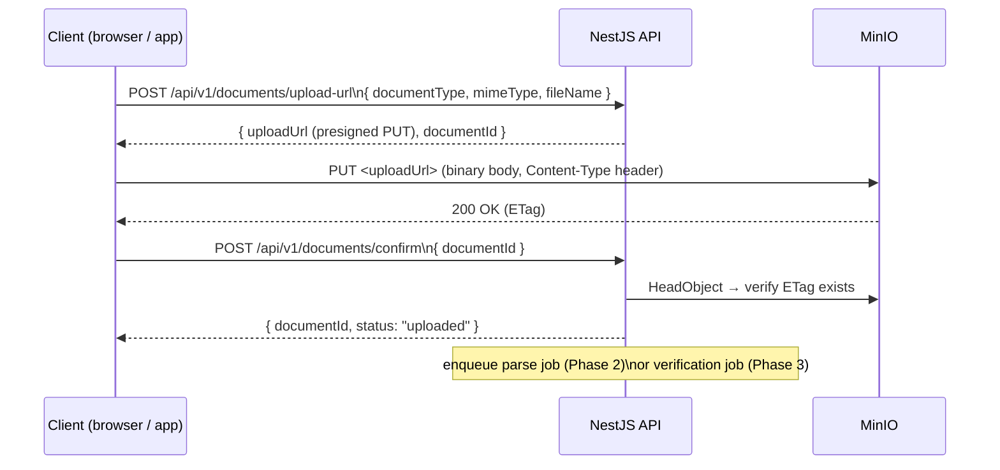

# Documents & Verification Page

> **Status:** Draft v0.1 · **Phase:** 2 (resume upload) + 3 (identity verification) · **Owner area:** frontend
> **Related:**
> - Backend: [documents-storage.md](../../backend/modules/documents-storage.md) · [verification.md](../../backend/modules/verification.md) · [parsing.md](../../backend/modules/parsing.md)
> - Phases: [phase-2-parsing.md](../../phases/phase-2-parsing.md) · [phase-3-verification.md](../../phases/phase-3-verification.md)
> - Sibling pages: [mode-selection-and-forms.md](./mode-selection-and-forms.md) · [candidate-report.md](./candidate-report.md) · [account-consent-settings.md](./account-consent-settings.md)

This page covers two distinct but related document flows. First, **resume/document upload** (Phase 2), where a candidate supplies a resume or supporting document that the parsing pipeline extracts structured data from; this feeds directly into the scoring wizard's "review extracted data" confirmation step. Second, **identity/credential upload for verification** (Phase 3), where a candidate submits a government-issued ID or credential to earn bonus points and the **Verified User** badge. Both flows share the same upload widget infrastructure and MinIO presigned-URL pipeline, but differ in purpose, routing, and downstream processing.

---

## 1. Purpose & Audiences

| Flow | Purpose | Audience |
|------|---------|----------|
| **Resume / document upload** | Feed the AI parsing pipeline (OpenRouter LLM + Tesseract OCR) so structured data (experience, education, skills, projects) can auto-fill wizard form fields and enrich scoring parameters. | Candidate (primary); employer-submitted candidate profile (via employer-driven onboarding — creates a claimable profile). |
| **Verification upload** | Prove identity and claims with government-issued ID. Approved documents earn **bonus points** (verification block, SCOPE §5) and flip the candidate's `Verified User` status, which is then displayed on the report. | Candidate (self-initiated); also surfaces as a nudge on the candidate report and the account settings page. |

The **admin review queue** for pending verification submissions is a separate screen (`/admin/verification-queue`) not documented here; see [verification.md](../../backend/modules/verification.md) for its backend implementation.

---

## 2. Routes

| Route | Description | Phase introduced |
|-------|-------------|-----------------|
| `/onboarding/upload` | Resume upload step embedded inside the Phase 2 onboarding wizard (multi-step; this is the first step before form auto-fill review). | Phase 2 |
| `/dashboard/documents` | Standalone document management hub — lists uploaded documents, shows verification statuses, lets candidate add/replace documents outside the wizard. | Phase 2 |
| `/dashboard/documents/verify` | Dedicated verification upload sub-page; reachable from the document hub, the candidate report nudge, and account settings. | Phase 3 |
| `/onboarding/upload` (mobile deep-link) | Same route served as a deep-linked modal in the Expo app for camera-capture flow. | Phase 2 |

All routes are **auth-guarded** (candidate role; employer-submitted claimable profiles redirect to the claim flow first).

---

## 3. Phase Mapping

```
Phase 1 ──── Core scoring forms (no document upload yet)
Phase 2 ──── Resume Upload (/onboarding/upload)
              │
              └─► Parsing pipeline (OpenRouter LLM + OCR)
                    │
                    └─► "Review extracted data" confirmation step in wizard
                          (user corrects any mis-parses before fields are applied)

Phase 3 ──── Verification Upload (/dashboard/documents/verify)
              │
              └─► Admin manual review queue
                    │
                    └─► approved → re-score triggered → Verified User badge + bonus points
                    └─► rejected → candidate notified, can re-upload
```

Resume upload is **Phase 2 only**. Verification upload is **Phase 3 only**. The document management hub (`/dashboard/documents`) launches in Phase 2 and gains the verification tab in Phase 3.

---

## 4. Layout & Wireframe

### 4.1 Resume Upload Step (within wizard — `/onboarding/upload`)

```
┌─────────────────────────────────────────────────────────────────┐
│  STABIL                                          [Step 1 of 5]  │
│─────────────────────────────────────────────────────────────────│
│                                                                 │
│  Upload your resume                                             │
│  We'll extract your experience, education, and skills           │
│  automatically. You'll review everything before it's saved.     │
│                                                                 │
│  ┌─────────────────────────────────────────────────────────┐   │
│  │                                                         │   │
│  │           📄  Drag & drop your resume here              │   │
│  │                                                         │   │
│  │           Supports PDF, DOCX, DOC, TXT (max 10 MB)     │   │
│  │                                                         │   │
│  │           ─────────── or ───────────                    │   │
│  │                                                         │   │
│  │         [ Browse files ]   [ Take a photo (mobile) ]   │   │
│  │                                                         │   │
│  └─────────────────────────────────────────────────────────┘   │
│                                                                 │
│  🔒 Your documents are stored securely. Parsing uses             │
│     OpenRouter (a hosted LLM gateway). Choose a model with      │
│     a no-training / zero-retention policy.                      │
│                                                                 │
│                          [ Skip for now ]   [ Next → ]         │
└─────────────────────────────────────────────────────────────────┘
```

### 4.2 Document Hub (`/dashboard/documents`)

```
┌─────────────────────────────────────────────────────────────────┐
│  STABIL · My Documents                                          │
│─────────────────────────────────────────────────────────────────│
│  [ Resume ]  [ Verification ]                        ← tabs     │
│─────────────────────────────────────────────────────────────────│
│                                                                 │
│  RESUME                                                         │
│  ┌─────────────────────────────────────────────┐               │
│  │ resume_john_doe.pdf          Uploaded 3d ago │               │
│  │ ─────────────────────────────────────────── │               │
│  │ [ Re-upload ]   [ Re-parse ]   [ Remove ]   │               │
│  └─────────────────────────────────────────────┘               │
│                                                                 │
│  VERIFICATION DOCUMENTS                             Phase 3 ──► │
│  ┌─────────────────────────────────────────────┐               │
│  │  ✅ Aadhaar Card                            │               │
│  │     Status: APPROVED · Verified 2026-05-10  │               │
│  │     +75 bonus points earned                 │               │
│  └─────────────────────────────────────────────┘               │
│                                                                 │
│  ┌─── Improve your score ──────────────────────┐               │
│  │  Add a PAN card to earn up to +50 pts       │               │
│  │  [ Verify another document → ]              │               │
│  └─────────────────────────────────────────────┘               │
│                                                                 │
└─────────────────────────────────────────────────────────────────┘
```

### 4.3 Verification Upload Sub-page (`/dashboard/documents/verify`)

```
┌─────────────────────────────────────────────────────────────────┐
│  ← Back to Documents          Verify Your Identity              │
│─────────────────────────────────────────────────────────────────│
│                                                                 │
│  Select your region                                             │
│  ┌───────────────────┐                                          │
│  │ 🌐 India      ▾  │  ← region selector (India | International)│
│  └───────────────────┘                                          │
│                                                                 │
│  Select document type                                           │
│  ○ Aadhaar Card          ○ PAN Card    [India only]             │
│  ○ Passport              ○ National ID [International]          │
│                                                                 │
│  Upload document                                                │
│  ┌─────────────────────────────────────────────────────────┐   │
│  │   Front side                  Back side (if required)   │   │
│  │  ┌───────────────┐           ┌───────────────┐          │   │
│  │  │  Drop / Browse│           │  Drop / Browse│          │   │
│  │  │  or 📷 Camera │           │  or 📷 Camera │          │   │
│  │  └───────────────┘           └───────────────┘          │   │
│  └─────────────────────────────────────────────────────────┘   │
│                                                                 │
│  🔒 Your ID is stored encrypted and processed entirely          │
│     in-house. It is never shared without your consent and       │
│     is deleted when you close your account.                     │
│                                                                 │
│  By submitting you agree to the Stabil Verification Terms.      │
│                                                                 │
│                               [ Cancel ]  [ Submit for review ] │
└─────────────────────────────────────────────────────────────────┘
```

---

## 5. Sub-stages

### 5.1 Resume Upload Flow (Phase 2)

| # | Stage | Description |
|---|-------|-------------|
| 1 | **Select file** | Drag-drop, file-picker, or camera capture (mobile). Client validates MIME type and file size before upload starts. |
| 2 | **Presigned upload** | Client requests a presigned MinIO PUT URL from `POST /api/v1/documents/upload-url`. Uploads directly from the browser/app to MinIO without the API server acting as a proxy. |
| 3 | **Confirm upload** | Client calls `POST /api/v1/documents/confirm` with the document ID. API sets `status = uploaded` and enqueues a parsing job. |
| 4 | **Parsing** | Backend (OpenRouter LLM + Tesseract OCR) extracts structured fields asynchronously. Client polls `GET /api/v1/documents/:id/status` or receives a WebSocket/SSE event when parsing is complete (`status = parsed`). |
| 5 | **Review extracted data** | Candidate sees a pre-filled diff view of parsed fields (see `mode-selection-and-forms.md` for the wizard review step). Candidate corrects any errors before fields are applied to their profile. |
| 6 | **Apply to profile** | On confirmation, parsed + corrected values are merged into the candidate's profile and trigger a scoring run. |

### 5.2 Verification Upload Flow (Phase 3)

| # | Stage | Description |
|---|-------|-------------|
| 1 | **Region selection** | Candidate picks India or International. Controls which document types are shown. |
| 2 | **Document type selection** | India: Aadhaar, PAN. International: Passport, National ID. Selection determines whether one or two sides are required and which OCR field hints to use. |
| 3 | **Upload sides** | Same presigned MinIO flow as resume upload; one or two uploads per document type. |
| 4 | **Submission** | `POST /api/v1/verification/submit` creates a `VerificationRequest` record with `status = pending`. Candidate sees "Under review" state immediately. |
| 5 | **Admin review** | Admin reviews extracted OCR fields vs. uploaded image in the admin queue (`/admin/verification-queue`). Approves or rejects with an optional note. |
| 6 | **Status update** | `status` transitions to `approved` or `rejected`. A notification (email/push) is sent to the candidate. |
| 7 | **Re-score on approval** | Approval triggers an automatic score recalculation that adds the verification bonus points for this document type. The candidate's `verifiedUser` flag is set to `true`. |
| 8 | **Expired** | Documents can have an `expiresAt` date (e.g. passport). When the expiry date passes, `status` transitions to `expired` and the bonus is revoked on the next score run; candidate is nudged to re-upload. |

---

## 6. Upload UX — Drag-Drop / File Picker / Camera Capture

### Web
- Drop target is a full-width `<div>` with `role="region"` and `aria-label="Resume upload area"`.
- On drag-over: border changes to primary colour, background lightens, an icon animates.
- On drop / file-picker select: file is immediately validated (MIME + size). Invalid files show an inline error (`FileError` state) without clearing the drop zone.
- Progress: a linear `<progress>` element (also reflected in `aria-valuenow`) shows bytes uploaded to MinIO.

### Mobile (Expo / React Native + NativeWind)
- `expo-document-picker` for file-picker flow (PDF, DOCX).
- `expo-image-picker` with `mediaTypes: ImagePicker.MediaTypeOptions.Images` and `allowsEditing: true` for camera capture of physical documents.
- Camera capture is the **primary** mobile affordance for ID documents (verification flow). The UI shows a document-shaped overlay guide to help the user frame the ID correctly.
- On Android: the camera overlay uses `CameraView` from `expo-camera` with a card-aspect guide layer.
- File size and MIME are validated before any network request.

### Common upload states

```
idle       → file selected → validating → uploading (progress%) → upload-complete
                 ↓ (invalid)
             file-error (show message, reset)
```

---

## 7. Presigned MinIO Upload Flow



- Presigned URLs are **single-use**, **time-limited** (e.g. 15 minutes).
- The API stores the MinIO object key mapped to the `Document` record; clients never hold the raw object key.
- For verification documents, the object is stored in a **separate, access-controlled MinIO bucket** (`stabil-verification-docs`), distinct from resume storage (`stabil-resumes`). See [documents-storage.md](../../backend/modules/documents-storage.md).

---

## 8. Document Type & Region Selection

### Region selector component (`RegionSelector`)

```tsx
type Region = 'india' | 'international';

const DOCUMENT_TYPES: Record<Region, DocumentType[]> = {
  india: [
    { id: 'aadhaar', label: 'Aadhaar Card',  sides: 2, bonusPoints: 75 },
    { id: 'pan',     label: 'PAN Card',       sides: 1, bonusPoints: 50 },
  ],
  international: [
    { id: 'passport',    label: 'Passport',    sides: 1, bonusPoints: 75 },
    { id: 'national_id', label: 'National ID', sides: 2, bonusPoints: 60 },
  ],
};
```

- `bonusPoints` values are **placeholders** — exact calibration is a design-time item (SCOPE §13).
- The region defaults to `india` if the candidate's profile `location` field resolves to India; otherwise defaults to `international`. The candidate can always override manually.
- The selector is a `<select>` / `RadioGroup` (shadcn/ui) with an accessible label and keyboard navigation.

---

## 9. Verification Status Display

Each verification request has a status that the candidate can always see in the document hub and on their report.

### Status values

| Status | Meaning | UI treatment |
|--------|---------|-------------|
| `pending` | Submitted; awaiting admin review | Amber badge, spinner icon, "Under review — we'll notify you" |
| `approved` | Document validated; bonus applied | Green badge, checkmark, "+ N pts earned", "Verified User" label |
| `rejected` | Document could not be validated | Red badge, "×", rejection reason (if provided), "Re-upload" CTA |
| `expired` | Document's validity date has passed | Orange badge, "Expired — please re-upload to keep your bonus" |

### `VerificationStatusBadge` component

```tsx
type VerificationStatus = 'pending' | 'approved' | 'rejected' | 'expired';

interface VerificationStatusBadgeProps {
  status: VerificationStatus;
  documentLabel: string;   // e.g. "Aadhaar Card"
  bonusPoints?: number;    // shown only when status === 'approved'
  rejectionNote?: string;  // shown only when status === 'rejected'
  expiresAt?: string;      // ISO date shown for 'approved' docs with expiry
}
```

### Approval triggers a re-score

When an admin approves a verification request:
1. The backend calls the scoring engine with the updated `verificationBonus` block.
2. The new total is persisted as a `ScoreRun` record.
3. The candidate's `verifiedUser` flag is set to `true`.
4. On next page load / query invalidation, the candidate sees the updated score, the **Verified User** badge on their report, and the bonus points reflected in the score breakdown.

The client uses TanStack Query with `queryClient.invalidateQueries(['profile', candidateId])` on WebSocket/SSE notification receipt to refresh without a full page reload.

---

## 10. "Improve Your Score by Verifying" Nudges

Nudges are shown to candidates who have not yet submitted a verification document, or who have submitted one but not yet maximized available bonus points.

### Nudge placement

| Location | Trigger condition | Nudge text |
|----------|------------------|-----------|
| Candidate report page (score breakdown section) | `verifiedUser === false` | "Verify your identity to earn up to +N bonus points and the Verified User badge." |
| Candidate report page (improvement guidance list) | `verifiedUser === false` | Bullet: "Upload a government-issued ID — fastest path to bonus points." |
| Document hub (`/dashboard/documents`) | Any document `status !== 'approved'` | Inline banner: "Add a verified ID to improve your score." |
| Account settings page | `verifiedUser === false` | Subtle CTA card linking to `/dashboard/documents/verify`. |
| Post-parsing confirmation step (wizard) | Phase 3 enabled + `verifiedUser === false` | "Your resume is saved. Want to verify your identity for bonus points?" with a skip/verify choice. |

Nudge components use `role="region"` with `aria-label="Score improvement tip"` so they are announced distinctly by screen readers without interrupting the main content flow.

---

## 11. Components

| Component | Description | Used in |
|-----------|-------------|---------|
| `DocumentDropZone` | Drag-drop / file-picker area; emits `onFileSelected(file: File)` | Resume upload, verification upload |
| `CameraCapture` | Mobile-only; wraps `expo-camera` with a card-frame overlay guide | Verification upload (mobile) |
| `UploadProgressBar` | Accessible `<progress>` tracking MinIO PUT bytes; `aria-valuenow` / `aria-valuemax` | Both upload flows |
| `RegionSelector` | `RadioGroup` (shadcn/ui) switching between `india` and `international` document type lists | Verification upload |
| `DocumentTypeSelector` | Renders document type options for the selected region; updates required-sides count | Verification upload |
| `DocumentSideUpload` | Single drop zone labeled "Front" or "Back"; composes `DocumentDropZone` | Verification upload |
| `VerificationStatusBadge` | Renders status pill + contextual detail (see §9) | Document hub, report page |
| `ParsedDataReviewTable` | Diff view of extracted vs. existing profile fields; candidate can accept/edit each field | Wizard review step (Phase 2) |
| `VerifyNudgeBanner` | Dismissible improvement nudge (see §10); accepts `bonusPotential: number` prop | Report, hub, settings |
| `DocumentCard` | Summarizes a single uploaded document: name, upload date, status badge, action buttons | Document hub list |
| `PrivacyReassurance` | Static callout block with lock icon; text varies by context (resume vs. ID) | Both upload pages |

All components use **shadcn/ui** primitives (Button, Badge, RadioGroup, Progress, Alert) and are styled with **Tailwind**. NativeWind equivalents used on mobile.

---

## 12. Data Needs (Queries & Mutations → API Endpoints)

### Queries

| Query key | Endpoint | Used for |
|-----------|----------|---------|
| `['documents', profileId]` | `GET /api/v1/documents?profileId=:id` | Listing all documents in the document hub |
| `['document', documentId, 'status']` | `GET /api/v1/documents/:id/status` | Polling parse status after resume upload |
| `['verification-requests', profileId]` | `GET /api/v1/verification?profileId=:id` | Listing all verification submissions + statuses |
| `['profile', candidateId]` | `GET /api/v1/profiles/:id` | Reading `verifiedUser` flag and latest score |

### Mutations

| Mutation | Endpoint | Payload | Effect |
|----------|----------|---------|--------|
| `requestUploadUrl` | `POST /api/v1/documents/upload-url` | `{ documentType, mimeType, fileName }` | Returns presigned URL + `documentId` |
| `confirmUpload` | `POST /api/v1/documents/confirm` | `{ documentId }` | Marks uploaded; enqueues parse or verification job |
| `submitVerification` | `POST /api/v1/verification/submit` | `{ documentId, documentType, region }` | Creates `VerificationRequest` with `status: pending` |
| `applyParsedFields` | `POST /api/v1/profiles/:id/apply-parsed` | `{ documentId, acceptedFields: Record<string, unknown> }` | Merges reviewed parsed fields into profile; triggers score run |
| `deleteDocument` | `DELETE /api/v1/documents/:id` | — | Removes document record + MinIO object |

All mutations use TanStack Query's `useMutation`. On success, invalidate the relevant query keys to keep UI fresh.

---

## 13. Forms & Validation (Zod)

### Resume upload form

```ts
import { z } from 'zod';

const ACCEPTED_RESUME_TYPES = [
  'application/pdf',
  'application/msword',
  'application/vnd.openxmlformats-officedocument.wordprocessingml.document',
  'text/plain',
];
const MAX_RESUME_SIZE_BYTES = 10 * 1024 * 1024; // 10 MB

export const resumeUploadSchema = z.object({
  file: z
    .instanceof(File)
    .refine(f => ACCEPTED_RESUME_TYPES.includes(f.type), {
      message: 'Only PDF, DOCX, DOC, or TXT files are accepted.',
    })
    .refine(f => f.size <= MAX_RESUME_SIZE_BYTES, {
      message: 'File must be 10 MB or smaller.',
    }),
});
```

### Verification upload form

```ts
const ACCEPTED_ID_TYPES = ['image/jpeg', 'image/png', 'application/pdf'];
const MAX_ID_SIZE_BYTES = 5 * 1024 * 1024; // 5 MB

export const verificationUploadSchema = z.object({
  region: z.enum(['india', 'international']),
  documentType: z.enum(['aadhaar', 'pan', 'passport', 'national_id']),
  frontFile: z
    .instanceof(File)
    .refine(f => ACCEPTED_ID_TYPES.includes(f.type), {
      message: 'Only JPEG, PNG, or PDF accepted.',
    })
    .refine(f => f.size <= MAX_ID_SIZE_BYTES, {
      message: 'File must be 5 MB or smaller.',
    }),
  backFile: z
    .instanceof(File)
    .optional()
    .refine(f => !f || ACCEPTED_ID_TYPES.includes(f.type), {
      message: 'Only JPEG, PNG, or PDF accepted.',
    })
    .refine(f => !f || f.size <= MAX_ID_SIZE_BYTES, {
      message: 'File must be 5 MB or smaller.',
    }),
});

// backFile is required when documentType has sides === 2 (Aadhaar, National ID)
// enforced via .superRefine() after the base schema.
```

Validation runs **client-side** before the presigned URL is requested, so the server never receives invalid requests. Server-side validation in the NestJS controller uses the same Zod schemas (shared via `packages/core`).

---

## 14. States

### Upload drop zone

| State | Visual |
|-------|--------|
| `idle` | Dashed border, ghost text, browse/camera buttons |
| `drag-over` | Primary colour border, lightened background, "Drop to upload" text |
| `validating` | Spinner replaces icon, "Checking file…" text |
| `uploading` | Progress bar visible, percentage text, cancel button |
| `upload-complete` | Green checkmark, file name, "Parsing…" status (resume flow) or "Submitted for review" (verification flow) |
| `file-error` | Red border, error message inline, file cleared, retry affordance |
| `upload-error` | Inline alert: "Upload failed — please try again." Retry button visible. |

### Parsing status (resume flow)

| State | Display |
|-------|---------|
| `parsing` | Animated shimmer on the "Review extracted data" step; "Extracting your details…" |
| `parsed` | Review table populated; "Review and confirm" CTA active |
| `parse-failed` | Alert: "We couldn't read this file automatically. You can continue filling in details manually." Skip CTA; file remains stored. |

### Verification request status

| State | Display |
|-------|---------|
| `pending` | Amber badge + "Under review"; no re-upload until resolved |
| `approved` | Green badge + bonus points earned; re-upload allowed (replacement) |
| `rejected` | Red badge + rejection note + "Re-upload" CTA |
| `expired` | Orange badge + expiry date + "Re-upload to keep your bonus" CTA |

---

## 15. Accessibility

- **Drop zones** have `role="region"`, `aria-label`, and `aria-describedby` pointing to the format/size hint text.
- **Progress bar** uses the native `<progress>` element with `aria-label="Upload progress"`.
- **Camera button** (mobile) has a descriptive `accessibilityLabel` and `accessibilityHint`.
- **Region selector** and **document type selector** are `RadioGroup` with a visible `<legend>` equivalent (`role="group"` + `aria-labelledby`).
- **Status badges** use both colour and an icon+text combination — not colour alone — so they remain meaningful in high-contrast mode and for colour-blind users. The icon SVGs have `aria-hidden="true"`; the badge text is always visible.
- **Error messages** are associated with their triggering input via `aria-describedby` and use `role="alert"` on the container so they are announced immediately by screen readers.
- **Nudge banners** use `role="region"` with `aria-label="Score improvement tip"` and are dismissible via keyboard (`Esc` or an explicit "Dismiss" button).
- **File inputs** keep a visually-hidden but accessible `<input type="file">` behind the styled drop zone so keyboard users can activate it directly with `Enter`/`Space`.
- All interactive elements meet a minimum touch target of 44×44 px on mobile.

---

## 16. Privacy Reassurance

Privacy messaging appears inline on both upload surfaces. It is not a modal or a blocker — it is a persistent static callout (`PrivacyReassurance` component) near the upload control.

**Resume upload text:**
> "Your resume is stored securely. Structured parsing is performed via OpenRouter, a hosted LLM gateway — we use models with no-training and zero-retention policies. You can delete your resume at any time from your account."

**Verification upload text:**
> "Your ID document is encrypted at rest and processed entirely within our infrastructure. It is never shared with employers or third parties without your explicit consent, and is permanently deleted when you close your account."

These statements must stay consistent with the data handling described in [documents-storage.md](../../backend/modules/documents-storage.md) and [architecture/05-security-privacy.md](../../architecture/05-security-privacy.md) (SCOPE §11, India DPDP Act compliance obligations).

The admin review queue is the only internal access path to verification documents; that access is logged. This detail is disclosed to candidates in the full privacy policy (linked from the verification page), not in the inline callout.

---

## 17. Admin Review Queue (brief note)

The admin-facing verification review screen lives at `/admin/verification-queue` and is **not** part of this candidate-facing page. It surfaces:
- A list of `VerificationRequest` records with `status = pending`, ordered by submission time.
- OCR-extracted field values side-by-side with the uploaded document image.
- Approve / Reject controls with an optional rejection note field.

Full specification belongs in the admin frontend docs and in [verification.md](../../backend/modules/verification.md).

---

## 18. Charts

This page does not contain data-visualisation charts. Score impact of the verification bonus is visualised on the **candidate report** page (see [candidate-report.md](./candidate-report.md)), not here. The document hub does show a simple numeric "+N pts earned" alongside each approved document — this is plain text, not a chart component.

---

## 19. Acceptance Criteria

### Phase 2 — Resume upload

- [ ] A candidate can drag-drop or browse to select a PDF, DOCX, DOC, or TXT file (≤ 10 MB) on web.
- [ ] On mobile, the candidate can pick from the device file system or capture a photo of a physical document.
- [ ] An invalid MIME type or oversized file shows an inline error and does not trigger a presigned URL request.
- [ ] A valid file is uploaded directly to MinIO via a presigned PUT URL returned by the API.
- [ ] After upload confirmation, the parsing pipeline is enqueued; the candidate sees "Extracting your details…" while parsing runs.
- [ ] When parsing completes, the wizard advances to the "Review extracted data" step pre-filled with parsed fields; the candidate can edit any field before applying.
- [ ] When parsing fails, the candidate is informed gracefully and can continue the wizard manually without their data being lost.
- [ ] Re-uploading a resume replaces the previous file in MinIO and enqueues a fresh parse.

### Phase 3 — Verification upload

- [ ] A candidate can select a region (India / International) and a document type, and upload the required sides (1 or 2).
- [ ] Submitting a verification document immediately sets `status = pending` and displays an amber "Under review" badge to the candidate.
- [ ] An admin approving the document flips `status` to `approved`, triggers a score recalculation adding the verification bonus, and sets `verifiedUser = true` on the candidate's profile.
- [ ] On the next page load (or on WebSocket notification), the candidate sees the updated score, the Verified User badge, and the bonus points in the score breakdown.
- [ ] An admin rejecting the document flips `status` to `rejected`, notifies the candidate (email/push), and makes a "Re-upload" CTA available.
- [ ] A document past its `expiresAt` date transitions to `expired`; the bonus is removed on the next score run; the candidate sees an "Expired — re-upload" nudge.
- [ ] A candidate with `verifiedUser === false` sees improvement nudges on the report page, the document hub, and account settings.
- [ ] The privacy reassurance copy is visible on both the resume upload and verification upload surfaces without requiring any user action.
- [ ] All upload interactions are operable via keyboard alone (web) and via assistive technology (screen reader announces status changes).
- [ ] Document deletion removes both the database record and the MinIO object; the verification bonus is revoked on the next score run if the deleted document was the basis for an approved bonus.
