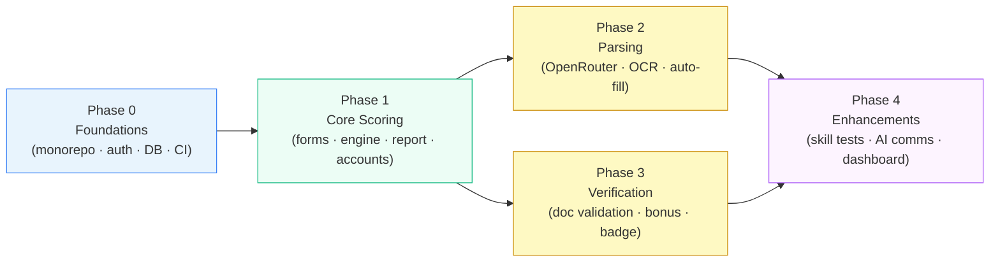

# Stabil — Phase Roadmap

> **Status:** Draft v0.1 · **Phase:** cross-cutting · **Owner area:** all
> **Related:** [SCOPE.md](../SCOPE.md) · [Architecture overview](../architecture/01-overview.md) · [Frontend README](../frontend/README.md) · [Backend README](../backend/README.md)

This document is the **single coordination point** for delivery sequencing. It maps
the five phases to their themes, outcomes, exit criteria, workstream splits, owning
docs, milestones, and internal slicing guidance. Read it alongside `SCOPE.md §9`
(authoritative phase definitions) before planning any sprint.

---

## 1. Phase overview table

| Phase | Theme | Primary outcome | Exit criteria |
|-------|-------|-----------------|---------------|
| **0 — Foundations** | Infrastructure, tooling, shared packages | A running, CI-green monorepo with auth shell, DB, and a verified scoring package | Turborepo builds all apps; CI passes; auth (register/login, 4 roles) works end-to-end; `@stabil/scoring` has ≥ 90 % unit-test coverage; Prisma migrations applied to a dev DB; MinIO reachable |
| **1 — Core Scoring** | Forms, both modes, full score lifecycle, report views | End-to-end stability score and report for both modes (Fresher + Professional), with accounts and re-scoring | Both mode forms submit and score deterministically; 5-tier mapping is correct; candidate-view hides sensitive attrs; employer-view shows full breakdown; PDF export works; explicit per-share consent gate enforced; re-scoring updates history |
| **2 — Parsing** | Automated resume + document extraction | Parameters auto-filled from uploaded resumes/documents via OpenRouter LLM + OCR | OpenRouter adapter extracts structured fields from a PDF resume and populates form values; OCR extracts text from scanned images; extracted values are editable before scoring; parsing failures fall back gracefully with a user-facing message |
| **3 — Verification** | Document validation and Verified User flag | Bonus points awarded for validated identity documents; Verified User badge displayed | At least one India document type (Aadhaar or PAN) and one international type (passport) accepted; OCR + manual-review queue operational; bonus points update the score and reflect in the report; verified badge shown on candidate and employer views |
| **4 — Enhancements** | Skill tests, richer communication analysis, comparison dashboard | Post-POC features that extend the platform without changing the core scoring contract | Skill-test sub-score slots into `@stabil/scoring` without breaking existing scores; AI communication analysis replaces self-rating on an opt-in flag; employer multi-candidate comparison and ranking dashboard is usable |

---

## 2. Dependency graph

The graph below shows which capabilities each phase unlocks. Phases 2 and 3 can
be developed in parallel once Phase 1 is complete; both feed Phase 4.

**Key constraints:**
- Phase 1 is strictly blocked by Phase 0 (no auth shell → no accounts → no scoring flow).
- Phases 2 and 3 are independent of each other but both require the Phase 1 scoring
  engine to be stable (they add inputs and bonuses; they do not change the engine contract).
- Phase 4 requires both 2 and 3: skill-test sub-scores rely on a stable engine contract,
  and the richer communication analysis extends the parsing infrastructure from Phase 2.

---

## 3. Per-phase workstream split

### Phase 0 — Foundations

| Workstream | Work |
|------------|------|
| **Frontend** | Monorepo scaffold (Turborepo + pnpm), Next.js app shell, Expo app shell, Tailwind + shadcn/ui setup, routing skeleton, login/register UI |
| **Backend** | NestJS app scaffold, `AuthModule` (register / login / JWT / roles), `ProfileModule` stub, global exception filter, health endpoint |
| **Data** | PostgreSQL provisioned, Prisma schema baseline (User, Role), first migration, seed script for roles |
| **Infra** | CI pipeline (lint + type-check + test + build), MinIO provisioned (local + dev), env-var management, `@stabil/scoring` package published into workspace, `@stabil/types` and `@stabil/zod-schemas` packages scaffolded |

### Phase 1 — Core Scoring

| Workstream | Work |
|------------|------|
| **Frontend** | Mode-selection page, Fresher multi-step form, Professional multi-step form, candidate report dashboard (score gauge, per-parameter breakdown, improvement guide, PDF download), employer/recruiter report view (full breakdown incl. sensitive attrs), consent management UI, account/settings page |
| **Backend** | `ScoringModule` (invokes `@stabil/scoring`, stores `ScoreRun`), `ProfileModule` complete (claimable profiles, re-scoring), `ReportsModule` (report assembly, audience filtering, PDF generation), `ConsentSharingModule` (share links, explicit consent gate), `NotificationsModule` (score-ready email stub) |
| **Data** | Prisma models: `ScoreRun`, `Parameter`, `ParameterValue`, `Report`, `ShareLink`, `ConsentRecord`; migrations; audit log basics |
| **Infra** | Vercel preview deploys wired, Expo EAS dev build, database migrations in CI, `@react-pdf/renderer` integrated |

### Phase 2 — Parsing

| Workstream | Work |
|------------|------|
| **Frontend** | Resume upload step added to Fresher and Professional forms, parsing progress indicator, extracted-values review/edit UI, document upload page (parsing tab) |
| **Backend** | `ParsingModule` — OpenRouter adapter, Tesseract OCR adapter, extraction orchestrator, provider-agnostic interface, fallback handling, retry/error reporting |
| **Data** | `ParsedDocument`, `ExtractionResult` models; link extracted values to `ParameterValue`; migration |
| **Infra** | OpenRouter API key configured in API env (`OPENROUTER_API_KEY`, `OPENROUTER_MODEL`, `OPENROUTER_BASE_URL`); MinIO lifecycle rules for raw uploads; Tesseract binary in API container image |

### Phase 3 — Verification

| Workstream | Work |
|------------|------|
| **Frontend** | Documents & verification page (upload ID, status tracker, Verified User badge display), verification-status component on candidate report and employer view |
| **Backend** | `VerificationModule` — document intake, OCR extraction of ID fields, manual-review queue (admin dashboard or internal tool), approval webhook, bonus-points application, `VerifiedUser` flag toggle, `NotificationsModule` extension (verification result email) |
| **Data** | `Document`, `VerificationRequest`, `VerificationResult`, `BonusPoint` models; link to `ScoreRun` for re-scoring on approval; migration |
| **Infra** | Secure MinIO bucket policy for ID documents (no public access, short-lived presigned URLs); future KYC-API adapter interface defined but not wired |

### Phase 4 — Enhancements

| Workstream | Work |
|------------|------|
| **Frontend** | Skill-test UI (in-platform assessment flow), AI communication analysis opt-in prompt, employer comparison/ranking dashboard (table + sort + charts), multi-candidate selection and side-by-side view |
| **Backend** | `ScoringModule` extension: `testSubScore` slot in engine contract; `ParsingModule` extension: AI communication analysis pipeline; `EmployerSearchModule` — search, filter, rank, paginate candidates |
| **Data** | `SkillTestResult`, `CommunicationAnalysis` models; `ScoreRun` schema extended for sub-scores; migration |
| **Infra** | Skill-test delivery infrastructure (static-assessment runner or third-party embed); AI communication analysis model configuration in the LLM adapter (OpenRouter by default) |

---

## 4. Phase → docs mapping

This table shows exactly which frontend page docs and backend module docs are in
scope for each phase. A doc marked **primary** means its core content ships in that
phase; **extended** means the phase adds a meaningful section to an already-existing doc.

### Phase 0 — Foundations

| Area | Doc | Role |
|------|-----|------|
| Frontend | [`frontend/README.md`](../frontend/README.md) | primary — monorepo FE structure, routing, conventions |
| Frontend | [`frontend/design-system.md`](../frontend/design-system.md) | primary — tokens, shadcn/ui setup |
| Frontend | [`frontend/pages/onboarding-auth.md`](../frontend/pages/onboarding-auth.md) | primary — sign-up/in pages (auth shell) |
| Backend | [`backend/README.md`](../backend/README.md) | primary — NestJS module map, conventions |
| Backend | [`backend/database-and-prisma.md`](../backend/database-and-prisma.md) | primary — schema baseline, migrations, seeding |
| Backend | [`backend/api-conventions.md`](../backend/api-conventions.md) | primary — REST contract, versioning, error model |
| Backend | [`backend/testing.md`](../backend/testing.md) | primary — unit/integration/e2e setup, fixtures |
| Backend | [`backend/modules/auth-accounts.md`](../backend/modules/auth-accounts.md) | primary — users, roles, sessions, JWT |
| Phase | [`phases/phase-0-foundations.md`](phase-0-foundations.md) | primary |

### Phase 1 — Core Scoring

| Area | Doc | Role |
|------|-----|------|
| Frontend | [`frontend/state-and-forms.md`](../frontend/state-and-forms.md) | primary — TanStack Query, react-hook-form + Zod, multi-step wizards |
| Frontend | [`frontend/charts.md`](../frontend/charts.md) | primary — Chart.js/react-chartjs-2, score gauge, breakdown charts |
| Frontend | [`frontend/best-practices.md`](../frontend/best-practices.md) | primary — performance, a11y, error UX |
| Frontend | [`frontend/pages/mode-selection-and-forms.md`](../frontend/pages/mode-selection-and-forms.md) | primary — mode select + Fresher & Professional forms |
| Frontend | [`frontend/pages/candidate-report.md`](../frontend/pages/candidate-report.md) | primary — candidate report dashboard |
| Frontend | [`frontend/pages/employer-recruiter.md`](../frontend/pages/employer-recruiter.md) | primary — employer report view (single-candidate) |
| Frontend | [`frontend/pages/account-consent-settings.md`](../frontend/pages/account-consent-settings.md) | primary — profile, consent management, data deletion |
| Backend | [`backend/modules/profiles.md`](../backend/modules/profiles.md) | primary — candidate profiles, claimable profiles, re-scoring |
| Backend | [`backend/modules/scoring.md`](../backend/modules/scoring.md) | primary — wraps @stabil/scoring, score runs, history |
| Backend | [`backend/modules/reports-pdf.md`](../backend/modules/reports-pdf.md) | primary — report assembly, audience filtering, PDF |
| Backend | [`backend/modules/consent-sharing.md`](../backend/modules/consent-sharing.md) | primary — per-share consent, share links, audience views |
| Backend | [`backend/modules/notifications.md`](../backend/modules/notifications.md) | primary (stub) — score-ready email |
| Phase | [`phases/phase-1-core-scoring.md`](phase-1-core-scoring.md) | primary |

### Phase 2 — Parsing

| Area | Doc | Role |
|------|-----|------|
| Frontend | [`frontend/pages/mode-selection-and-forms.md`](../frontend/pages/mode-selection-and-forms.md) | extended — resume upload step, extracted-value review UI |
| Frontend | [`frontend/pages/documents-and-verification.md`](../frontend/pages/documents-and-verification.md) | primary (parsing tab) — upload flow, parsing progress |
| Backend | [`backend/modules/parsing.md`](../backend/modules/parsing.md) | primary — OpenRouter adapter, OCR, orchestrator, fallbacks |
| Backend | [`backend/modules/documents-storage.md`](../backend/modules/documents-storage.md) | primary — uploads, MinIO/S3, lifecycle |
| Phase | [`phases/phase-2-parsing.md`](phase-2-parsing.md) | primary |

### Phase 3 — Verification

| Area | Doc | Role |
|------|-----|------|
| Frontend | [`frontend/pages/documents-and-verification.md`](../frontend/pages/documents-and-verification.md) | extended — ID capture, verification status tracker, badge |
| Frontend | [`frontend/pages/candidate-report.md`](../frontend/pages/candidate-report.md) | extended — Verified User badge in report |
| Frontend | [`frontend/pages/employer-recruiter.md`](../frontend/pages/employer-recruiter.md) | extended — verification flag on employer view |
| Backend | [`backend/modules/verification.md`](../backend/modules/verification.md) | primary — doc validation, manual-review queue, bonus points |
| Backend | [`backend/modules/documents-storage.md`](../backend/modules/documents-storage.md) | extended — secure bucket policy for ID docs |
| Backend | [`backend/modules/notifications.md`](../backend/modules/notifications.md) | extended — verification result email |
| Phase | [`phases/phase-3-verification.md`](phase-3-verification.md) | primary |

### Phase 4 — Enhancements

| Area | Doc | Role |
|------|-----|------|
| Frontend | [`frontend/pages/employer-recruiter.md`](../frontend/pages/employer-recruiter.md) | extended — comparison/ranking dashboard, multi-candidate view |
| Frontend | [`frontend/pages/mode-selection-and-forms.md`](../frontend/pages/mode-selection-and-forms.md) | extended — skill-test UI, AI comms opt-in |
| Frontend | [`frontend/mobile.md`](../frontend/mobile.md) | extended — mobile parity for enhancements |
| Backend | [`backend/modules/scoring.md`](../backend/modules/scoring.md) | extended — testSubScore slot, sub-score history |
| Backend | [`backend/modules/parsing.md`](../backend/modules/parsing.md) | extended — AI communication analysis pipeline |
| Backend | [`backend/modules/employer-search.md`](../backend/modules/employer-search.md) | primary — search, filter, rank, paginate candidates |
| Phase | [`phases/phase-4-enhancements.md`](phase-4-enhancements.md) | primary |

---

## 5. Global Definition of Done

Every task or story in any phase is **Done** only when **all** of the following hold.
Teams must not ship a phase until every item in this list is satisfied for that phase's
scope.

### Code quality
- [ ] TypeScript: zero `tsc --noEmit` errors across all apps and packages.
- [ ] ESLint: no new warnings promoted to errors in the workspace lint config.
- [ ] No `any` escapes added without a `// eslint-disable` comment explaining why.

### Testing
- [ ] `@stabil/scoring`: unit-test coverage ≥ 90 % (Vitest). Any change to weights or
      rubrics requires a test that encodes the expected output.
- [ ] New API endpoints: at minimum happy-path + 401/403 integration tests (supertest).
- [ ] New pages: at minimum one Playwright smoke test covering the critical user action
      (submit form, view report, download PDF, etc.).
- [ ] Regression: all existing tests still green.

### Security & privacy
- [ ] Sensitive attribute (`age`, `marital_status`) values are never returned in a
      candidate-audience API response. Confirmed by an integration test.
- [ ] Explicit per-share consent is enforced: the API returns 403 if a share link is
      accessed before consent is recorded. Confirmed by an integration test.
- [ ] No PII written to application logs (stdout/stderr).
- [ ] ID-document files stored in a private MinIO bucket; only short-lived presigned
      URLs (< 15 min) are returned to clients.

### Data integrity
- [ ] Every Prisma schema change has a migration file committed. Migration applied
      successfully in the CI ephemeral database.
- [ ] `ScoreRun` history is append-only: no update or delete of historical score rows.

### Observability
- [ ] Structured JSON log emitted for every score run (mode, total, tier, duration ms).
      No PII in the log line.
- [ ] Health endpoint (`GET /api/v1/health`) returns `200` in CI smoke test.

### Documentation
- [ ] The relevant phase doc (`phases/phase-N-*.md`) section for this story is marked
      complete in its checklist.
- [ ] Any calibration placeholder (weights, tier bands) changed during implementation
      is updated in `architecture/03-scoring-engine.md`.

---

## 6. Milestone and versioning scheme

Milestones follow a `v<major>.<minor>` scheme where each minor version marks a
meaningful, demoable delivery point. The major version increments when the scoring
contract itself changes in a breaking way (e.g. the 0–1500 scale is redefined).

| Version | Description | Phase complete |
|---------|-------------|----------------|
| **v0.0** | Monorepo scaffolded; CI green; auth shell; `@stabil/scoring` unit-tested | Phase 0 |
| **v0.1** | End-to-end POC — both modes scored from forms; report viewable; PDF export; per-share consent; accounts | Phase 1 |
| **v0.2** | Parsing enabled — resumes and documents auto-fill form parameters via OpenRouter + OCR | Phase 2 |
| **v0.3** | Verification live — Aadhaar/PAN + international ID validated; Verified User flag and bonus points awarded | Phase 3 |
| **v1.0** | Full platform — skill tests, AI communication analysis, employer comparison dashboard | Phase 4 |

**Pre-release tags within a phase** (optional convention for teams):
- `v0.1-alpha` — feature-complete but not yet end-to-end tested.
- `v0.1-rc` — all DoD items satisfied; awaiting final sign-off.
- `v0.1` — DoD signed off; deployed to staging.

> The scoring contract (parameter list, block structure, `0–1500` scale, `Mode` and
> `Tier` enums) is frozen at `v0.1`. Any change to that contract is a **breaking change**
> and requires a major version bump and a migration plan for stored `ScoreRun` rows.

---

## 7. Slicing within a phase

Phases are large enough to span multiple sprints. Use **vertical slices** — end-to-end
increments that are independently demoable — rather than horizontal layers (e.g.
"do all DB work first").

### Slicing principles

1. **Pick one user-facing flow per increment.** A vertical slice has a UI entry point,
   an API call, and a DB write. For example, in Phase 1:
   - Increment 1a: Fresher form → score → display raw number (no styling, no PDF).
   - Increment 1b: Tier mapping + styled score gauge on candidate dashboard.
   - Increment 1c: Professional mode form → score (reuses engine, adds mode branch).
   - Increment 1d: Employer view with full breakdown and sensitive-attr visibility.
   - Increment 1e: Per-share consent gate + share-link flow.
   - Increment 1f: PDF export.
   - Increment 1g: Re-scoring (save new run, display history).

2. **Demo criterion.** Each increment must be demonstrable to a non-engineer in under
   5 minutes on a shared staging environment.

3. **Score contract first.** In Phase 1, finalize the `@stabil/scoring` API surface
   (input shape, output shape, enum values) before building any UI that depends on it.
   This prevents churn.

4. **Stub then deepen.** It is acceptable to stub a dependency within a phase:
   - Phase 1 can hardcode a single parameter weight during Increment 1a and fill in
     the full parameter table by Increment 1c.
   - Phase 2 can return a hardcoded parsed result from the LLM adapter during
     Increment 2a while the real prompt engineering is refined.

5. **Never relax the DoD.** Stubs must be tracked as follow-up tasks within the same
   phase, not deferred to the next phase.

6. **Calibration is part of Phase 1.** The exact parameter weights and tier-band
   thresholds (all marked TBD in SCOPE §13) must be decided and committed to
   `architecture/03-scoring-engine.md` before Phase 1 exits. They are not optional.

---

## 8. Phase doc index

| Phase | Doc |
|-------|-----|
| Phase 0 | [phase-0-foundations.md](phase-0-foundations.md) |
| Phase 1 | [phase-1-core-scoring.md](phase-1-core-scoring.md) |
| Phase 2 | [phase-2-parsing.md](phase-2-parsing.md) |
| Phase 3 | [phase-3-verification.md](phase-3-verification.md) |
| Phase 4 | [phase-4-enhancements.md](phase-4-enhancements.md) |

Cross-cutting architecture that underpins all phases lives in
[`architecture/`](../architecture/) — start with
[`01-overview.md`](../architecture/01-overview.md) for system context and
[`03-scoring-engine.md`](../architecture/03-scoring-engine.md) for the scoring
contract that phases 1–4 all depend on.
