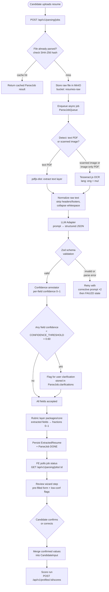
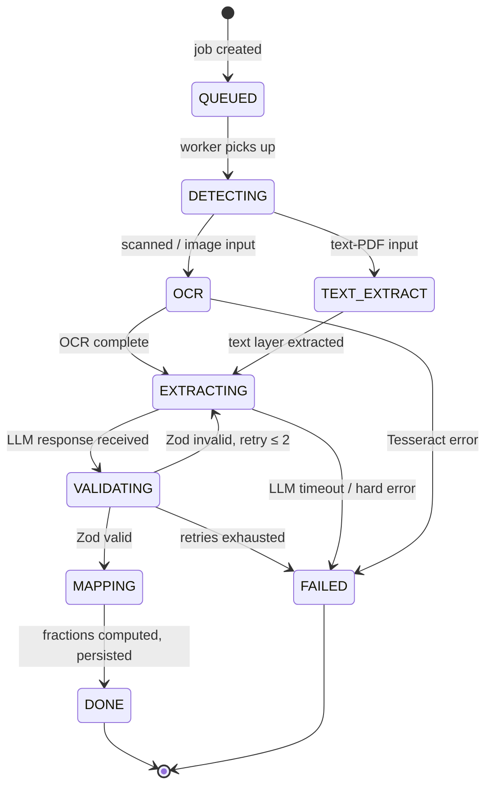

# Phase 2 — Resume & Document Parsing

> **Status:** Draft v0.1 · **Phase:** 2 · **Owner area:** backend + frontend
> **Related:** [SCOPE.md](../SCOPE.md) · [phases/README.md](README.md) · [backend/modules/parsing.md](../backend/modules/parsing.md) · [backend/modules/documents-storage.md](../backend/modules/documents-storage.md) · [frontend/pages/documents-and-verification.md](../frontend/pages/documents-and-verification.md) · [frontend/pages/mode-selection-and-forms.md](../frontend/pages/mode-selection-and-forms.md) · [architecture/03-scoring-engine.md](../architecture/03-scoring-engine.md) · [architecture/05-security-privacy.md](../architecture/05-security-privacy.md)

Phase 2 delivers automated resume and document parsing that auto-fills the scoring wizard and enriches parameter fractions with extracted evidence. Candidates upload a resume (PDF or image), the system detects whether it is text-selectable or scanned, applies Tesseract OCR when needed, sends the raw text to the local Ollama LLM for structured extraction validated against a Zod schema, maps extracted fields to normalized fractions via the `packages/core` rubric layer, and pre-fills the wizard. A **human-in-the-loop confirmation step** lets candidates review, correct, and approve before the score runs. All processing is in-house — PII never leaves the infrastructure (SCOPE §2 decision 20, §10).

---

## Goal & outcomes

| # | Outcome |
|---|---------|
| 1 | Upload-to-pre-fill in ≤ 60 s for a text PDF; ≤ 120 s for a scanned image (p95 on local hardware) |
| 2 | Candidates can review and correct every extracted field before it feeds the scoring engine |
| 3 | Extraction accuracy ≥ 85 % on the golden-fixture suite for tier-1 fields (experience, tenure, skills) |
| 4 | Low-confidence extractions surface a targeted clarification prompt rather than silently defaulting |
| 5 | The LLM adapter is pluggable — swapping Ollama for a managed provider changes only the adapter implementation, not the pipeline |
| 6 | PII stays in-house; the Ollama process is local; no extracted text is sent to a third-party API |
| 7 | Idempotent job processing — re-uploading the same file skips re-parse and returns the cached result |

---

## In scope

- PDF and image (JPG, PNG, WEBP) resume uploads
- Text-PDF detection vs. scanned-image detection
- Tesseract OCR for scanned documents
- Provider-agnostic LLM adapter with Ollama as the default implementation
- Structured extraction validated by a Zod schema
- Confidence scoring per extracted field
- Mapping extracted fields → normalized fractions `[0,1]` via `packages/core` rubric layer
- Pre-filling the multi-step wizard (`mode-selection-and-forms` page) with extracted data
- "Review extracted data" wizard step (human-in-the-loop confirmation)
- Async job queue with status polling
- Idempotency by file hash
- Accuracy / eval harness with golden-resume fixtures (CI)
- Fresher parameter extraction: academics/GPA, projects, skills, programming languages, certifications
- Professional parameter extraction: total experience, tenure per role, spoken languages, location
- Common parameter extraction: location, communication certs

## Out of scope (Phase 2)

- Document verification / KYC (Phase 3)
- Bonus-point award for verified documents (Phase 3)
- Extraction from supporting verification IDs (Aadhaar, PAN — Phase 3)
- In-platform skill tests (Phase 4)
- AI-based communication assessment from written text (Phase 4)
- Employer multi-candidate bulk parsing (Phase 4)
- Third-party OCR or managed LLM APIs (these are a swap, not a Phase 2 task)

---

## Parsing pipeline

### End-to-end flow



### Job status state machine



---

## Workstreams

### BACKEND — parsing module + documents-storage

Deep spec: [backend/modules/parsing.md](../backend/modules/parsing.md) and [backend/modules/documents-storage.md](../backend/modules/documents-storage.md).

### FRONTEND — upload UI + review wizard step

Deep spec: [frontend/pages/documents-and-verification.md](../frontend/pages/documents-and-verification.md) and [frontend/pages/mode-selection-and-forms.md](../frontend/pages/mode-selection-and-forms.md).

---

## AI adapter interface

The adapter contract lives in `packages/types/src/parsing/llm-adapter.ts` and is imported by `apps/api`. The concrete Ollama implementation (`OllamaAdapter`) lives in `apps/api/src/parsing/adapters/ollama.adapter.ts`. A future managed-LLM adapter (e.g. `OpenAiAdapter`) must satisfy the same interface — no pipeline code changes.

```typescript
// packages/types/src/parsing/llm-adapter.ts

export interface LlmExtractionRequest {
  /** Plain text of the resume (post-OCR or post-PDF-extract). */
  text: string;
  /** Prompt template key to use (e.g. "resume-extraction-v1"). */
  promptKey: string;
  /** Maximum tokens the model should emit. */
  maxTokens?: number;
}

export interface LlmExtractionResponse {
  /** Raw JSON string returned by the model before Zod parse. */
  rawJson: string;
  /** Model identifier actually used (e.g. "llama3.2:8b"). */
  model: string;
  /** Wall-clock latency in milliseconds. */
  latencyMs: number;
  /** Optional per-token usage for observability. */
  usage?: { promptTokens: number; completionTokens: number };
}

/** One adapter implementation per LLM provider. */
export interface LlmAdapter {
  /** Unique name for observability / logging. */
  readonly name: string;
  /** Send a prompt, return the model's JSON response. */
  extract(request: LlmExtractionRequest): Promise<LlmExtractionResponse>;
  /** Optional health check (used in /api/v1/health). */
  healthCheck?(): Promise<boolean>;
}
```

**Ollama adapter** connects to the local Ollama REST API at `http://localhost:11434` (or `OLLAMA_BASE_URL` env var). It uses the `/api/generate` endpoint with `format: "json"` and a system prompt that instructs the model to emit only valid JSON matching the extraction schema. Default model: `llama3.2:8b` (overridable via `OLLAMA_MODEL`).

**Swapping the provider:** set `LLM_ADAPTER=openai` (or whichever adapter name) in the API env, and inject a different `LlmAdapter` implementation via NestJS's DI token `LLM_ADAPTER`. No pipeline code changes required.

---

## Extraction target schema (Zod + TS types)

Defined in `packages/types/src/parsing/extracted-resume.ts`. This is the **single source of truth** that the Zod parser validates against, the DB stores, and the rubric layer consumes.

```typescript
// packages/types/src/parsing/extracted-resume.ts
import { z } from "zod";

// ---------------------------------------------------------------------------
// Sub-schemas
// ---------------------------------------------------------------------------

export const ExperienceEntrySchema = z.object({
  /** Company or organisation name. */
  company: z.string().min(1),
  /** Job title / designation. */
  title: z.string().min(1),
  /** Start date — ISO 8601 partial date, e.g. "2021-03". */
  startDate: z.string().regex(/^\d{4}(-\d{2})?$/),
  /** End date or null if current role. */
  endDate: z.string().regex(/^\d{4}(-\d{2})?$/).nullable(),
  /** Computed tenure in **full months** (null if dates unavailable). */
  tenureMonths: z.number().int().nonnegative().nullable(),
  /** Detected domain / industry (best-effort). */
  domain: z.string().optional(),
  /** Confidence score for this entry: 0.0–1.0. */
  confidence: z.number().min(0).max(1),
});
export type ExperienceEntry = z.infer<typeof ExperienceEntrySchema>;

export const EducationEntrySchema = z.object({
  institution: z.string().min(1),
  degree: z.string().min(1),
  field: z.string().optional(),
  /** Graduation year (4-digit). */
  graduationYear: z.number().int().min(1950).max(2100).nullable(),
  /**
   * GPA / CGPA as a raw value on whatever scale the resume shows.
   * Store raw; rubric layer normalises to 0–1 using `gpaScale`.
   */
  gpa: z.number().nonnegative().nullable(),
  /** Denominator of the GPA scale (e.g. 4.0, 10.0). */
  gpaScale: z.number().positive().nullable(),
  confidence: z.number().min(0).max(1),
});
export type EducationEntry = z.infer<typeof EducationEntrySchema>;

export const ProjectEntrySchema = z.object({
  name: z.string().min(1),
  description: z.string().optional(),
  /** Technologies / tools mentioned in the project. */
  technologies: z.array(z.string()),
  /** Link to repo or demo, if present. */
  url: z.string().url().optional(),
  confidence: z.number().min(0).max(1),
});
export type ProjectEntry = z.infer<typeof ProjectEntrySchema>;

export const CertificationEntrySchema = z.object({
  name: z.string().min(1),
  issuer: z.string().optional(),
  /** ISO 8601 partial date, e.g. "2023-07". */
  issuedDate: z.string().regex(/^\d{4}(-\d{2})?$/).optional(),
  confidence: z.number().min(0).max(1),
});
export type CertificationEntry = z.infer<typeof CertificationEntrySchema>;

// ---------------------------------------------------------------------------
// Root extraction schema
// ---------------------------------------------------------------------------

export const ExtractedResumeSchema = z.object({
  // ── Experience (Working Professional primary source) ─────────────────────
  /** Ordered list of roles, newest first. */
  experienceEntries: z.array(ExperienceEntrySchema),
  /**
   * Total months of professional experience derived from all entries.
   * The rubric layer converts this to a fraction for the `totalExperience` parameter.
   */
  totalExperienceMonths: z.number().int().nonnegative().nullable(),
  /**
   * Average tenure per role in months across all entries.
   * Key signal for the `tenure` parameter (SCOPE §4.4).
   */
  averageTenureMonths: z.number().nonneg().nullable(),

  // ── Education / Academics (Fresher primary source) ───────────────────────
  educationEntries: z.array(EducationEntrySchema),

  // ── Projects (Fresher primary source) ────────────────────────────────────
  projectEntries: z.array(ProjectEntrySchema),

  // ── Certifications (both modes) ──────────────────────────────────────────
  certifications: z.array(CertificationEntrySchema),

  // ── Skills ───────────────────────────────────────────────────────────────
  /**
   * Flat list of skills extracted from skills sections and experience bullets.
   * Deduplicated, lowercased.
   */
  skills: z.array(z.string()),

  // ── Programming languages (Fresher, SCOPE §4.3) ──────────────────────────
  /**
   * Programming languages detected (e.g. ["python", "java", "typescript"]).
   * Subset of `skills`; stored separately for direct parameter mapping.
   */
  programmingLanguages: z.array(z.string()),

  // ── Spoken / natural languages (Professional, SCOPE §4.4) ────────────────
  /**
   * Natural languages the candidate speaks (e.g. ["english", "hindi", "french"]).
   * Extracted from a "Languages" section or self-descriptions.
   */
  spokenLanguages: z.array(z.string()),

  // ── Location (common block, SCOPE §4.5) ──────────────────────────────────
  /**
   * Current or most-recent location string as written on the resume
   * (e.g. "Bangalore, India", "New York, USA").
   * Rubric layer resolves to country/region for scoring.
   */
  location: z.string().nullable(),

  // ── Cloud / AI familiarity keywords (Fresher) ────────────────────────────
  /**
   * Cloud platforms detected (e.g. ["aws", "azure", "gcp"]).
   * Used to populate the `cloudExposure` parameter.
   */
  cloudPlatforms: z.array(z.string()),

  /**
   * AI tools and frameworks detected (e.g. ["langchain", "huggingface"]).
   * Used as evidence for the `aiFamiliarity` parameter.
   */
  aiTools: z.array(z.string()),

  // ── Overall extraction metadata ───────────────────────────────────────────
  /**
   * Overall confidence for the whole extraction: 0.0–1.0.
   * Computed as the mean of all per-field confidences.
   */
  overallConfidence: z.number().min(0).max(1),

  /**
   * Fields with confidence below CONFIDENCE_THRESHOLD (0.60).
   * Each entry references the field path and a human-readable hint for the
   * clarification prompt shown to the candidate.
   */
  lowConfidenceFields: z.array(
    z.object({
      field: z.string(),         // e.g. "totalExperienceMonths"
      confidence: z.number().min(0).max(1),
      hint: z.string(),          // e.g. "Could not determine end date for role at Acme Corp"
    })
  ),
});

export type ExtractedResume = z.infer<typeof ExtractedResumeSchema>;
```

### Mapping extracted fields to parameter fractions (rubric layer)

The rubric layer in `packages/core/src/rubrics/resume.ts` consumes an `ExtractedResume` and produces a `Partial<ParameterValues>` (a `Record<string, number>` where each value is `[0,1]`). The engine never sees raw months or GPA values — it only sees fractions.

| Extracted field | Parameter key | Rubric logic (placeholder — calibrated in SCOPE §13) |
|---|---|---|
| `totalExperienceMonths` | `totalExperience` | Linear band: 0 → 0, 24 months → 0.4, 60 → 0.75, 120+ → 1.0 |
| `averageTenureMonths` | `tenure` | Inverted short-hop penalty: < 6 months avg → 0.1; 24+ months avg → 1.0 |
| `educationEntries[0].gpa / gpaScale` | `academics` | Normalised GPA (÷ scale), then tier bands (institution tier TBD) |
| `projectEntries.length` + tech breadth | `projects` | Count × tech-diversity factor; exact rubric TBD in calibration |
| `certifications.length` | `courseCertifications` | Count capped at saturation; issuer prestige TBD |
| `programmingLanguages.length` | `programmingLanguages` | Count-based; cap at saturation (e.g. 5+ → 1.0) |
| `spokenLanguages.length` | `spokenLanguages` | Count-based; cap at saturation |
| `cloudPlatforms.length` | `cloudExposure` | Boolean presence → fraction; multi-cloud > single |
| `aiTools.length` | `aiFamiliarity` | Boolean presence → fraction; depth TBD |
| `location` | `location` | Country/region lookup for relocation-readiness signal |

Fractions from parsing are **pre-fills, not overrides**. If the candidate edits a field in the confirmation step, the confirmed value re-runs through the rubric; the parsed value is discarded for that field.

---

## Confidence handling and low-confidence clarification

Each field in `ExtractedResume` carries a `confidence: number` in `[0,1]`. The global threshold is `CONFIDENCE_THRESHOLD = 0.60` (env-configurable, default in `apps/api/src/parsing/constants.ts`).

### Decision matrix

| Confidence | Action |
|---|---|
| ≥ 0.90 | Auto-fill; field rendered in wizard as confirmed (green badge) |
| 0.60–0.89 | Auto-fill; field rendered with a caution indicator ("we estimated this") |
| < 0.60 | Field left blank or shown with extracted value struck through; targeted clarification question shown inline (e.g. "We couldn't confidently read your tenure at Acme Corp — how many months did you work there?") |
| Field absent from response | Field left blank; generic empty-state hint |

### Clarification prompt mechanics

`ParseJob.clarifications` stores an ordered list of `{ field, hint }` tuples for all low-confidence fields. The "Review extracted data" wizard step renders these as inline contextual inputs **immediately below the affected field**, not as a separate modal. The candidate can dismiss or answer each one. Dismissed clarifications result in a `null` fraction for that parameter (scores 0 — acceptable; the candidate chose not to provide the data).

---

## Async job queue + API contract

### Endpoints

| Method | Path | Description |
|---|---|---|
| `POST` | `/api/v1/parsing/jobs` | Enqueue a parse job; idempotent by SHA-256 file hash |
| `GET` | `/api/v1/parsing/jobs/:jobId` | Poll job status + result once DONE |
| `GET` | `/api/v1/parsing/jobs/:jobId/extracted` | Retrieve the full `ExtractedResume` (only when DONE) |
| `POST` | `/api/v1/parsing/jobs/:jobId/confirm` | Candidate submits confirmed/corrected field values |

### Request — POST /api/v1/parsing/jobs

```jsonc
// multipart/form-data
{
  "file": "<binary>",          // PDF or image
  "profileId": "01hx…",        // UUID v7
  "mode": "fresher"            // or "professional" — scopes extraction hints
}
```

### Response — GET /api/v1/parsing/jobs/:jobId

```jsonc
{
  "jobId": "01hy…",
  "status": "DONE",            // QUEUED | DETECTING | OCR | TEXT_EXTRACT | EXTRACTING | VALIDATING | MAPPING | DONE | FAILED
  "fileHash": "sha256:abc…",
  "createdAt": "2026-06-06T10:00:00Z",
  "updatedAt": "2026-06-06T10:01:02Z",
  "extracted": { /* ExtractedResume */ },     // present only when DONE
  "error": null                                // RFC 9457 problem object when FAILED
}
```

### Idempotency

Before enqueueing, the API computes `SHA-256(file bytes)`. If a `ParseJob` with the same `fileHash` and `profileId` already exists and has status `DONE`, the existing result is returned immediately (`202 Accepted` with `jobId`). This prevents redundant re-parses when the user refreshes the upload page.

### Queue implementation

`ParseJobQueue` is a **BullMQ** queue backed by a **Redis** sidecar (added in Phase 2 infra). Workers run in the same NestJS process for the POC (concurrency = 1 per worker process; scale out later). Job timeout: 180 s. Max retries: 2 (for LLM validation failures only — OCR and file errors fail immediately).

### Prisma models (additions in Phase 2)

```typescript
// Additions to apps/api/prisma/schema.prisma

model ParseJob {
  id           String   @id @default(uuid()) // UUID v7 in application layer
  profileId    String
  profile      Profile  @relation(fields: [profileId], references: [id])
  fileKey      String   // MinIO object key (bucket: resumes-raw)
  fileHash     String   // SHA-256 hex for idempotency
  status       ParseJobStatus @default(QUEUED)
  inputType    ParseInputType? // TEXT_PDF | SCANNED_IMAGE
  extractedResume Json?  // ExtractedResume JSON when DONE
  clarifications  Json?  // [{field, hint}] for low-confidence fields
  confirmedValues Json?  // candidate-confirmed field overrides
  errorDetail  String?
  createdAt    DateTime @default(now())
  updatedAt    DateTime @updatedAt

  @@index([profileId])
  @@index([fileHash, profileId])
}

enum ParseJobStatus {
  QUEUED
  DETECTING
  OCR
  TEXT_EXTRACT
  EXTRACTING
  VALIDATING
  MAPPING
  DONE
  FAILED
}

enum ParseInputType {
  TEXT_PDF
  SCANNED_IMAGE
}
```

---

## Accuracy / eval harness (golden-resume fixtures)

### Location

```
apps/api/src/parsing/eval/
├── fixtures/
│   ├── fresher-text.pdf              # text-layer PDF, fresher
│   ├── fresher-scanned.png           # scanned image, fresher
│   ├── professional-text.pdf         # text-layer PDF, professional
│   ├── professional-scanned.jpg      # scanned image, professional
│   ├── fresher-text.expected.json    # expected ExtractedResume (subset of tier-1 fields)
│   ├── fresher-scanned.expected.json
│   ├── professional-text.expected.json
│   └── professional-scanned.expected.json
└── eval.test.ts                      # Vitest eval suite
```

### Accuracy metric

For each fixture, the harness compares extracted values to the expected JSON using field-level exact match (strings) or within-tolerance comparison (numbers: ± 1 month for tenure/experience, ± 0.05 for GPA). The pass criterion for CI is **≥ 85 % field accuracy** on tier-1 fields across all fixtures. Tier-1 fields are:

- `totalExperienceMonths`, `averageTenureMonths` (professional)
- `educationEntries[0].gpa`, `educationEntries[0].gpaScale` (fresher)
- `skills` (set overlap ≥ 80 %)
- `programmingLanguages` (set overlap ≥ 80 %)
- `projectEntries.length` (exact)

### Running the eval

```bash
# Against live local Ollama (requires Ollama running)
OLLAMA_BASE_URL=http://localhost:11434 pnpm --filter @stabil/api eval:parse

# In CI — use a deterministic stub adapter instead of real Ollama
LLM_ADAPTER=stub pnpm --filter @stabil/api test
```

The `StubLlmAdapter` returns fixture-keyed pre-recorded responses, enabling CI to validate the full pipeline (schema, confidence logic, rubric mapping) without a live LLM. Accuracy tests against real Ollama are run in a separate nightly job.

---

## PII safety

All PII processing is in-house. These constraints are non-negotiable (SCOPE §2 decision 20, §11).

| Constraint | Implementation |
|---|---|
| Raw resume files stored only in MinIO (self-hosted) | Files never touch external object storage in Phase 2 |
| Ollama runs locally | `OLLAMA_BASE_URL` must be a loopback or private network address; startup guard rejects public URLs |
| Extracted JSON stored in Postgres (self-hosted) | `extractedResume` column — encrypted at rest via Postgres + host-level encryption |
| Adapter swap safeguard | If `LLM_ADAPTER != ollama`, API logs a `warn`-level PII notice and requires an explicit env var `ALLOW_EXTERNAL_LLM=true` to proceed |
| No logging of raw resume text | The pipeline logs job IDs and status transitions only; raw text is never written to logs |
| Access control | Only the `parsing` NestJS module and the authenticated candidate (by `profileId`) may read a `ParseJob`; admin role may read for support |
| Retention | `ParseJob` rows and MinIO objects follow the same retention policy as the profile: retained while the account is active, deleted on request (SCOPE §11) |

---

## Detailed task breakdown

### BACKEND

#### B1 — Infrastructure additions

- [ ] Add Redis sidecar to dev docker-compose (`redis:7-alpine`)
- [ ] Add BullMQ to `apps/api` dependencies
- [ ] Add `REDIS_URL`, `OLLAMA_BASE_URL`, `OLLAMA_MODEL`, `CONFIDENCE_THRESHOLD`, `LLM_ADAPTER`, `ALLOW_EXTERNAL_LLM` to env schema (`packages/types/src/env.ts`)
- [ ] Configure BullMQ `ParseJobQueue` in NestJS `ParsingModule`

#### B2 — Documents storage (`documents-storage` module)

- [ ] Implement MinIO client wrapper (`MinioStorageService`) — see [backend/modules/documents-storage.md](../backend/modules/documents-storage.md)
- [ ] `upload(file, bucket, key): Promise<string>` — returns MinIO object key
- [ ] `getSignedUrl(key, ttlSeconds): Promise<string>` — for secure download in review step
- [ ] File-type validation (allow: `application/pdf`, `image/jpeg`, `image/png`, `image/webp`; max: 10 MB)
- [ ] Virus scan hook (ClamAV or skip-and-log in POC; mark as **placeholder**)

#### B3 — LLM adapter layer

- [ ] Define `LlmAdapter` interface in `packages/types/src/parsing/llm-adapter.ts`
- [ ] Implement `OllamaAdapter` in `apps/api/src/parsing/adapters/ollama.adapter.ts`
  - [ ] POST to `OLLAMA_BASE_URL/api/generate` with `format: "json"`
  - [ ] System prompt template `prompts/resume-extraction-v1.txt` (version-stamped)
  - [ ] 60 s request timeout; throw typed `LlmTimeoutError`
- [ ] Implement `StubLlmAdapter` for tests (returns fixture-keyed JSON)
- [ ] NestJS DI token `LLM_ADAPTER`; factory selects implementation from env

#### B4 — Parsing pipeline (orchestration)

- [ ] `DetectionService`: identify `TEXT_PDF` vs `SCANNED_IMAGE` using pdfjs-dist's text-layer heuristic (< 20 chars on first page → treat as scanned)
- [ ] `OcrService`: wrap `tesseract.js` (lang: `eng+hin` default, configurable via `TESSERACT_LANGS`); return plain text
- [ ] `PdfTextService`: extract text layer via `pdfjs-dist` (`getTextContent`)
- [ ] `ExtractionService`: call `LlmAdapter.extract()`, parse response with `ExtractedResumeSchema`, retry ≤ 2× on Zod failure with a corrective prompt
- [ ] `ConfidenceService`: annotate per-field confidence; compute `overallConfidence` (mean); populate `lowConfidenceFields`
- [ ] `RubricMappingService` (thin adapter to `packages/core`): map `ExtractedResume` → `Partial<ParameterValues>`
- [ ] `ParseJobWorker`: BullMQ processor — orchestrates steps above, updates `ParseJob.status` at each transition, persists result
- [ ] Idempotency check in `POST /api/v1/parsing/jobs` before enqueueing

#### B5 — REST endpoints

- [ ] `POST /api/v1/parsing/jobs` — multipart; authenticate; validate file type/size; compute hash; idempotency check; store in MinIO; enqueue
- [ ] `GET /api/v1/parsing/jobs/:jobId` — poll; owner-only guard
- [ ] `GET /api/v1/parsing/jobs/:jobId/extracted` — return `ExtractedResume`; owner-only
- [ ] `POST /api/v1/parsing/jobs/:jobId/confirm` — persist `confirmedValues`; re-run rubric mapping; update `CandidateInput` for the profile

#### B6 — Rubric layer additions (`packages/core`)

- [ ] `mapExtractedResumeToFractions(extracted: ExtractedResume, mode: Mode): Partial<ParameterValues>` — implement per the mapping table in §extraction-schema
- [ ] Unit tests for each mapping function (edge cases: 0 months, null GPA, 10+ programming languages)

#### B7 — Eval harness

- [ ] Add 4 golden-resume fixtures (see §eval-harness)
- [ ] Implement `eval.test.ts` with Vitest; fail CI if field accuracy < 85 % on tier-1 fields
- [ ] `StubLlmAdapter` returns fixture-keyed JSON (deterministic CI)
- [ ] Nightly CI job with real Ollama (`llama3.2:8b`)

### FRONTEND

#### F1 — Upload UI (`documents-and-verification` page)

- [ ] Drag-and-drop + browse file picker (shadcn/ui `DropZone` pattern); accept PDF/JPG/PNG/WEBP; 10 MB limit
- [ ] Client-side file-type guard + size guard before upload
- [ ] `POST /api/v1/parsing/jobs` via TanStack Mutation; show upload progress
- [ ] Poll `GET /api/v1/parsing/jobs/:jobId` every 3 s; render status stepper (Queued → Detecting → Processing → Done / Failed)
- [ ] On DONE: navigate to "review extracted data" wizard step
- [ ] On FAILED: surface error + retry affordance
- [ ] See [frontend/pages/documents-and-verification.md](../frontend/pages/documents-and-verification.md) for full wireframe spec

#### F2 — "Review extracted data" wizard step (`mode-selection-and-forms` page)

- [ ] New wizard step inserted **after** mode selection and **before** parameter form sections
- [ ] Pre-fills form fields using `ExtractedResume` → form field mapping
- [ ] High-confidence fields (≥ 0.90): rendered with a "auto-filled" green indicator; editable
- [ ] Medium-confidence fields (0.60–0.89): rendered with a caution indicator ("estimated")
- [ ] Low-confidence fields (< 0.60): field left empty or shown struck-through; inline clarification question rendered below the field
- [ ] "Accept all" button: accepts high+medium confidence fields; scrolls to first low-confidence clarification
- [ ] Per-field "edit" affordance: clicking reverts to empty input for manual entry
- [ ] On submit: `POST /api/v1/parsing/jobs/:jobId/confirm` with corrected values; then continue wizard
- [ ] Mobile parity: same step exists in Expo app using NativeWind equivalent
- [ ] See [frontend/pages/mode-selection-and-forms.md](../frontend/pages/mode-selection-and-forms.md) for full wizard step spec

---

## Deliverables

| # | Deliverable | Location |
|---|---|---|
| 1 | `LlmAdapter` interface + `OllamaAdapter` + `StubLlmAdapter` | `apps/api/src/parsing/adapters/` |
| 2 | `ExtractedResumeSchema` (Zod) + inferred types | `packages/types/src/parsing/extracted-resume.ts` |
| 3 | Full async parsing pipeline (detection → OCR/text → LLM → validation → confidence → rubric) | `apps/api/src/parsing/` |
| 4 | `ParseJob` Prisma model + migration | `apps/api/prisma/` |
| 5 | 4 REST endpoints for parsing jobs | `apps/api/src/parsing/parsing.controller.ts` |
| 6 | `mapExtractedResumeToFractions` rubric function + unit tests | `packages/core/src/rubrics/resume.ts` |
| 7 | Upload UI with status polling | `apps/web/src/app/(candidate)/documents/` |
| 8 | "Review extracted data" wizard step | `apps/web/src/app/(candidate)/score/wizard/review-extracted/` |
| 9 | Golden-fixture eval harness | `apps/api/src/parsing/eval/` |
| 10 | System prompt template `resume-extraction-v1.txt` (versioned) | `apps/api/src/parsing/prompts/` |

---

## Acceptance criteria (Definition of Done)

### Functional

- [ ] Uploading a text-PDF resume with a text layer produces a pre-filled wizard within 60 s (p95, local dev machine with Ollama running `llama3.2:8b`)
- [ ] Uploading a scanned-image resume (JPEG, ≥ 300 DPI) produces a pre-filled wizard within 120 s (p95)
- [ ] Re-uploading the same file byte-for-byte returns the cached result instantly (idempotency by SHA-256)
- [ ] Each of the 4 golden fixtures achieves ≥ 85 % field accuracy on tier-1 fields in the eval harness
- [ ] Low-confidence fields (< 0.60) are visually distinguished and their clarification prompts are shown inline
- [ ] Candidate can edit any pre-filled field; edited values override extracted values in the score run
- [ ] Confirming or correcting extracted data and proceeding through the wizard produces a score run using the confirmed values
- [ ] A `FAILED` parse job surfaces a user-readable error and a retry option; no unhandled 500 errors reach the client

### PII / security

- [ ] `OLLAMA_BASE_URL` must be non-public (guard on startup); setting a public URL without `ALLOW_EXTERNAL_LLM=true` throws a startup error
- [ ] Raw resume text never appears in application logs (verified by log inspection in integration tests)
- [ ] `ParseJob` rows are accessible only to the owning candidate and admin role (verified by auth integration tests)
- [ ] File upload rejects non-PDF/image MIME types with `400 Bad Request` and rejects files > 10 MB

### Quality

- [ ] `pnpm typecheck` passes with zero errors in `apps/api`, `packages/types`, `packages/core`
- [ ] `pnpm --filter @stabil/api test` passes including the eval harness with `StubLlmAdapter`
- [ ] BullMQ job does not block the NestJS event loop; p99 request latency for non-parsing endpoints is unaffected during an active parse job
- [ ] No field named in `ExtractedResumeSchema` can silently become `undefined` at runtime without triggering the Zod validation error path

---

## Test strategy

| Layer | Tool | What is tested |
|---|---|---|
| Unit — Zod schema | Vitest | `ExtractedResumeSchema.parse()` accepts valid fixtures; rejects missing required fields; rejects out-of-range confidence values |
| Unit — rubric mapping | Vitest | `mapExtractedResumeToFractions` edge cases: 0 months, null GPA, empty arrays, max values |
| Unit — confidence service | Vitest | Mean computation; low-confidence field list; threshold boundary (exactly 0.60 is medium, not low) |
| Unit — detection service | Vitest | Text-PDF heuristic (mock pdfjs response); scanned-image detection |
| Integration — pipeline | Vitest + `StubLlmAdapter` | Full `ParseJobWorker` run from enqueue to DONE; state machine transitions; idempotency check |
| Integration — endpoints | Supertest | Auth guards (401 for missing token, 403 for wrong owner); file-type rejection; size rejection; 202 on enqueue; correct status in poll response |
| Eval — golden fixtures | Vitest (`eval.test.ts`) | Field accuracy ≥ 85 % on tier-1 fields with `StubLlmAdapter`; nightly with real Ollama |
| E2E — upload + confirm | Playwright | Upload a PDF fixture, wait for status DONE, advance to review step, accept auto-filled fields, submit, verify score run is triggered |
| Security | Supertest | `ParseJob` row isolation by `profileId`; raw text not present in log output during integration run |

---

## Dependencies

| Dependency | Type | Detail |
|---|---|---|
| **Phase 1 complete** | Hard | Profiles, scoring engine, and multi-step wizard exist and function end-to-end |
| **MinIO running** | Hard (dev) | `documents-storage` module uses MinIO; dev docker-compose must include it |
| **Ollama running locally** | Soft (dev) | Required for real extraction; `StubLlmAdapter` covers CI and unit tests |
| **Redis** | Hard (Phase 2 addition) | BullMQ job queue; added to dev docker-compose in Phase 2 |
| `pdfjs-dist` | npm | Text-layer extraction from text PDFs |
| `tesseract.js` | npm | OCR for scanned images; runs in Node worker threads |
| `bullmq` | npm | Async job queue |
| `ioredis` | npm | BullMQ Redis client |
| **`packages/core` rubric layer** | Hard | Must have the `mapExtractedResumeToFractions` function; Phase 1 may stub this as a pass-through |
| **`packages/types` Zod schemas** | Hard | `ExtractedResumeSchema` must be defined before both the API parser and rubric mapping can be written |

---

## Risks & mitigations

| Risk | Likelihood | Impact | Mitigation |
|---|---|---|---|
| **Extraction accuracy below 85 % on tier-1 fields** (Ollama model struggles with dense or unusual resume formats) | Medium | High | Golden-fixture eval in CI catches regressions early; prompt engineering iteration; fall back to user manual entry for all fields (pre-fill is a courtesy, not a requirement for scoring) |
| **OCR quality on low-DPI scans** (< 150 DPI photos of printed resumes) | Medium | Medium | Tesseract minimum DPI check; reject with user-facing guidance ("please upload a higher-quality scan"); add image pre-processing (deskew, binarize) as a fast-follow if needed |
| **LLM hallucination** (model invents plausible-sounding fields) | Low–Medium | High | Zod schema validation is the first line of defence (out-of-schema fields are stripped); confidence scores flag uncertain outputs; human-in-the-loop confirmation step is mandatory — candidate must approve before score runs |
| **LLM response not valid JSON** (model wraps output in prose) | Medium | Low | Ollama `format: "json"` mode strongly constrains output; up to 2 retries with a corrective prompt; if still invalid → `FAILED` state with user-facing error |
| **Performance** — Tesseract OCR can take 30–90 s on a large scanned PDF | Medium | Medium | Run OCR in Node worker threads (not the event loop); BullMQ job timeout at 180 s; user sees a live status stepper, not a blank wait |
| **Scope creep** — users expect parsing to cover verification documents (Aadhaar, PAN) | Low | Medium | Phase 2 parses **resumes only**; verification documents are Phase 3. Upload UI must clearly label the distinction |
| **Rubric calibration** — `mapExtractedResumeToFractions` bands are placeholders | High (certainty) | Medium | Mark rubric constants as `/* TODO: calibrate in SCOPE §13 */`; the harness detects regressions if constants are changed; calibration is a Phase 1→2 handoff task |

---

## Milestones

| # | Milestone | Dependencies complete |
|---|---|---|
| M2-1 | `ExtractedResumeSchema` and `LlmAdapter` interface merged to `packages/types` | — |
| M2-2 | `OllamaAdapter` + `StubLlmAdapter` implemented; manual smoke-test passing | M2-1 |
| M2-3 | Full async pipeline (detection → OCR/text → LLM → validation → confidence → mapping) running end-to-end on golden fixtures | M2-2, Redis in dev-compose |
| M2-4 | REST endpoints implemented; integration tests green | M2-3 |
| M2-5 | Upload UI with status polling deployed to staging | M2-4, Phase 1 web app |
| M2-6 | "Review extracted data" wizard step implemented; E2E Playwright test green | M2-5 |
| M2-7 | Eval harness ≥ 85 % accuracy; CI nightly Ollama job set up; Phase 2 closed | M2-6 |
