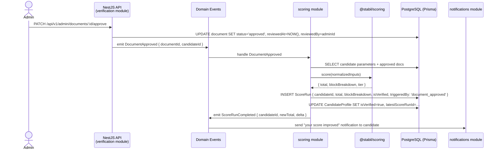

# Phase 3 — Verification & Bonus (Verified User)

> **Status:** Draft v0.1 · **Phase:** 3 · **Owner area:** backend / frontend
> **Related:** [Phase 1 — Core Scoring](phase-1-core-scoring.md) · [Phase 2 — Resume & Document Parsing](phase-2-parsing.md) · [backend/modules/verification.md](../backend/modules/verification.md) · [backend/modules/documents-storage.md](../backend/modules/documents-storage.md) · [frontend/pages/documents-and-verification.md](../frontend/pages/documents-and-verification.md) · [architecture/05-security-privacy.md](../architecture/05-security-privacy.md) · [SCOPE.md](../SCOPE.md)

Phase 3 operationalises the **verification bonus** described in SCOPE §5. Users submit identity documents; admins (and eventually automated KYC APIs) validate them; approved submissions award bonus points and set the `Verified User` trust flag; the next score run picks up the bonus automatically. The phase is fully backward-compatible — a user without any documents still receives a valid base score (SCOPE §5: "graceful without docs").

---

## Goal & outcomes

- Candidates can upload supported identity documents from within the platform.
- Each submission enters an admin review queue; an admin can approve or reject it.
- An **approved** submission triggers a re-score (`ScoreRun`) that adds the **verification bonus** to the candidate's total and marks them as `Verified User`.
- A candidate who has not verified sees a personalised prompt ("Verify your ID to earn up to +X points") in their report improvement-guidance panel.
- The system is designed so that OCR + manual review can be replaced — or supplemented — by pluggable third-party KYC or government APIs without restructuring the domain model.
- ID documents are stored encrypted at rest, served only via short-lived signed URLs, and purged when the account is deleted (SCOPE §11 / [architecture/05-security-privacy.md](../architecture/05-security-privacy.md)).

---

## In scope

- Document upload flow (web + mobile).
- Per-document state machine: `pending → approved | rejected | expired`.
- Admin review queue: list, preview, approve, reject with reason.
- Bonus-point award and `Verified User` flag on approval.
- Triggered re-score (`ScoreRun`) upon approval.
- Candidate-facing verification status widget and improvement-guidance nudge.
- Per-region document type table (India + international).
- Encrypted storage lifecycle: upload → encrypt → scan → review → purge on deletion.
- Pluggable KYC/government API adapter interface (implementation deferred to post-POC automated phase).
- Retention and deletion hooks in line with SCOPE §11.

## Out of scope (this phase)

- Live automated KYC/government API calls (DigiLocker, Aadhaar OTP, PAN verification, passport services) — adapter interface is defined here; calls happen in the later automated sub-phase.
- Employer-initiated document requests.
- Bulk/batch admin review tooling beyond the basic queue.
- Employer multi-candidate comparison enhancements (Phase 4).
- Skill-test sub-scores (Phase 4).

---

## Verification flow — state machine

The diagram below covers both the current **OCR + manual review** path and the later **pluggable KYC API** path. The branch point is the `VerificationStrategy` adapter (see Workstreams — Backend).

```mermaid
stateDiagram-v2
    [*] --> uploaded : candidate submits document

    uploaded --> ocr_extracting : OCR job enqueued (Tesseract)
    ocr_extracting --> pending_review : extraction complete (or skipped for image-only IDs)
    ocr_extracting --> rejected : OCR hard-fail (unreadable / unsupported format)

    pending_review --> admin_reviewing : admin opens queue item
    admin_reviewing --> approved : admin approves
    admin_reviewing --> rejected : admin rejects (with reason)

    %% Later automated path — same states, different actor
    pending_review --> kyc_checking : KYC adapter triggered (future)
    kyc_checking --> approved : API returns valid
    kyc_checking --> rejected : API returns invalid / mismatch

    approved --> bonus_awarded : ScoreRun triggered → bonus + Verified User flag set
    bonus_awarded --> [*]

    rejected --> [*] : candidate notified; may resubmit

    %% Expiry
    approved --> expired : document TTL elapsed (e.g. passport expiry date reached)
    expired --> [*] : Verified User flag cleared on next ScoreRun
```



### State definitions

| State | Meaning | Who sets it |
|---|---|---|
| `uploaded` | File received, virus-scan passed, stored encrypted | System (documents-storage module) |
| `ocr_extracting` | Tesseract OCR job running; extracted fields staged for review | System (async job) |
| `pending_review` | Awaiting admin action (or KYC API result in automated phase) | System |
| `admin_reviewing` | An admin has locked the item for review (optimistic lock, 10 min TTL) | Admin |
| `approved` | Document validated; bonus and flag applied | Admin / KYC adapter |
| `rejected` | Document invalid, fraudulent, or unreadable | Admin / KYC adapter |
| `expired` | Document's validity period has passed (tracked by `expiresAt`) | Scheduled job |

**Transitions that trigger side-effects:**

- `pending_review → approved` → emits `DocumentApproved` domain event → `ScoreRun` created → bonus points added → `Verified User` flag set on `CandidateProfile`.
- `approved → expired` → emits `DocumentExpired` domain event → `ScoreRun` created → bonus points removed → `Verified User` flag cleared if no other approved document remains.
- `* → rejected` → notification sent to candidate (email / in-app).

---

## Per-region document types

The `documentType` field is a string enum. The table below defines the accepted values. Additional types can be added by inserting rows into the `DocumentType` reference table without a code change.

### India

| Document type | `documentType` enum value | Fields extracted by OCR | Notes |
|---|---|---|---|
| Aadhaar Card | `aadhaar` | Name, DOB, UID (last 4 shown), address | Mask full UID at rest; display only last 4 digits |
| PAN Card | `pan` | Name, DOB, PAN number | Required for age/identity confirmation |
| Passport (India) | `passport_in` | Name, DOB, passport number, expiry | Track `expiresAt` |
| Voter ID (EPIC) | `voter_id` | Name, DOB (if present), EPIC number | DOB not always printed |
| Driving Licence | `driving_licence_in` | Name, DOB, licence number, expiry | Track `expiresAt` |

**Later automated path — India:** DigiLocker XML pull (Aadhaar, PAN, Driving Licence); NSDL PAN verification API; DigiLocker eSign for Aadhaar OTP-based verification.

### International

| Document type | `documentType` enum value | Fields extracted by OCR | Notes |
|---|---|---|---|
| Passport (international) | `passport_intl` | Name, DOB, nationality, passport number, expiry, MRZ | Track `expiresAt` |
| National ID card | `national_id` | Name, DOB, ID number, country | Country stored as ISO 3166-1 alpha-2 |
| Residence permit / visa | `residence_permit` | Name, permit type, expiry | Track `expiresAt` |
| Driver's licence (international) | `driving_licence_intl` | Name, DOB, licence number, expiry, country | Track `expiresAt` |

**Later automated path — international:** Commercial ID-verification APIs (e.g. Onfido, Veriff, Persona, or similar GDPR/CCPA-compliant service). Adapter interface is defined in Phase 3; the concrete call implementation is post-POC.

---

## How approval flows into scoring

### Bonus-point model

The verification bonus is the third block in the score composition formula (SCOPE §4.1):

```
TOTAL (0–1500) = mode-specific block + common block + verification bonus
```

The `verification bonus` block is computed from the `VerificationBonus` parameter inside `@stabil/scoring`. Its weight (exact point value) is a **calibration-time constant** (see SCOPE §13 — TBD). The engine receives a normalized fraction `[0, 1]` for this parameter:

- `0.0` — no approved document.
- `1.0` — at least one approved document (binary for POC; can be graduated later, e.g. more points for government ID than certificate).

> **Engine boundary:** mapping "has approved document? → fraction" happens in the **rubric layer** (`packages/core`), not inside `@stabil/scoring`. This keeps the boundary crisp (README authoring contract).

### `Verified User` flag

The `CandidateProfile` entity carries a boolean `isVerified`. It is derived — never set manually — by the following rule evaluated during each `ScoreRun`:

```
isVerified = (count of documents in state 'approved' with expiresAt IS NULL OR expiresAt > NOW()) >= 1
```

A single approved, non-expired document is sufficient to earn the flag.

### Re-score flow on approval



---

## Security for ID documents

ID documents are among the most sensitive PII the platform handles. Full details live in [architecture/05-security-privacy.md](../architecture/05-security-privacy.md); this section records the verification-specific requirements.

### Encryption at rest

- Documents are **never stored as plaintext** on disk or in the object store.
- MinIO server-side encryption (SSE-S3 or SSE-KMS) is enabled for the `stabil-documents` bucket. When the stack moves to a managed S3-compatible store, the same SSE configuration applies.
- In development (local MinIO / local disk), encryption is still applied via a local KMS key so the code path is identical.
- The `Document` DB record stores only the **object key** (path in MinIO), never the raw bytes.

### Short-lived signed URLs

- Direct download links are **never embedded** in API responses as permanent URLs.
- Every request to fetch a document (admin review or candidate self-view) calls MinIO's `presignedGetObject` with a **15-minute TTL**. After expiry the URL is useless even if leaked.
- Signed URL generation is gated behind role checks: only `admin` and the owning `candidate` (for their own document) may generate a URL.

### Restricted access

| Role | Can upload | Can view own docs (signed URL) | Can view any doc | Can approve/reject |
|---|---|---|---|---|
| `candidate` | Yes (own only) | Yes | No | No |
| `employer` | No | No | No | No |
| `recruiter` | No | No | No | No |
| `admin` | No | No | Yes (signed URL) | Yes |

- Admin review screen fetches a 15-minute signed URL per document on open, not on queue list load.
- All document access is logged to an audit trail (`DocumentAccessLog`).

### Sensitive field masking

- Aadhaar UID: only the **last 4 digits** are stored in the extracted-fields JSON; the full number is never persisted.
- PAN number: stored as extracted but flagged `sensitiveField: true` in the schema; excluded from any API response that goes to non-admin roles.

### Retention and purge (SCOPE §11)

- When a candidate **deletes their account** (or makes a deletion request), the system:
  1. Deletes the MinIO objects for all their documents.
  2. Removes `Document` rows (or hard-deletes, not soft-deletes).
  3. Removes extracted OCR fields from `DocumentOcrResult`.
  4. Removes any `DocumentAccessLog` entries beyond the minimum legally required audit window.
- Documents with an `expiresAt` in the past and status `expired` are purged by a scheduled job after a configurable grace period (default: 90 days post-expiry).
- Rejected documents are purged after a configurable hold period (default: 30 days) unless under active fraud investigation (admin-flagged).

Full compliance requirements (India DPDP Act, GDPR equivalents) are documented in [architecture/05-security-privacy.md](../architecture/05-security-privacy.md).

---

## Workstreams

### Backend

**Primary modules:** [backend/modules/verification.md](../backend/modules/verification.md) · [backend/modules/documents-storage.md](../backend/modules/documents-storage.md)

#### verification module

Responsibilities: document lifecycle state machine, OCR job dispatch, KYC adapter interface, admin review endpoints, domain event emission, bonus-point trigger.

Key endpoints:

| Method | Path | Role | Purpose |
|---|---|---|---|
| `POST` | `/api/v1/candidates/me/documents` | `candidate` | Upload document (multipart) |
| `GET` | `/api/v1/candidates/me/documents` | `candidate` | List own documents + status |
| `DELETE` | `/api/v1/candidates/me/documents/:id` | `candidate` | Withdraw pending document |
| `GET` | `/api/v1/admin/documents` | `admin` | Review queue (paginated, filterable by status/type/region) |
| `GET` | `/api/v1/admin/documents/:id` | `admin` | Document detail + signed URL + OCR extract |
| `PATCH` | `/api/v1/admin/documents/:id/approve` | `admin` | Approve; triggers re-score |
| `PATCH` | `/api/v1/admin/documents/:id/reject` | `admin` | Reject with `reason` string |
| `POST` | `/api/v1/admin/documents/:id/lock` | `admin` | Optimistic lock (prevents concurrent reviews) |

**KYC adapter interface** (TypeScript, defined in `packages/core`):

```typescript
interface KycAdapter {
  readonly strategy: 'manual' | 'digilocker' | 'pan_nsdl' | 'onfido' | string;
  verify(document: DocumentEntity, extractedFields: OcrResult): Promise<KycResult>;
}

interface KycResult {
  outcome: 'approved' | 'rejected' | 'needs_manual';
  confidence?: number; // 0–1, optional
  reason?: string;
}
```

The manual-review path is itself a `KycAdapter` implementation (`strategy: 'manual'`) that returns `needs_manual`, causing the document to sit in `pending_review`. Future automated adapters implement the same interface; the verification module selects the adapter via a config flag per document type per region.

**OCR job** (Tesseract, async via NestJS Bull queue):

- Receives `{ documentId, objectKey, documentType }`.
- Downloads bytes from MinIO via internal service (no signed URL needed — service-to-service).
- Runs Tesseract with language hints (`eng+hin` for Indian documents).
- Stores structured `OcrResult` in `DocumentOcrResult` table.
- Emits `OcrComplete` event → verification module advances state to `pending_review`.

#### documents-storage module

See [backend/modules/documents-storage.md](../backend/modules/documents-storage.md) for full details. Phase-3-specific responsibilities:

- Validate file type (JPEG, PNG, PDF only; max 10 MB).
- Run ClamAV virus scan before storing.
- Upload to MinIO `stabil-documents` bucket with SSE enabled.
- Generate presigned GET URLs on demand (15-minute TTL).
- Implement `deleteObject` called by account-deletion and retention-purge flows.

#### Prisma schema additions (Phase 3)

```prisma
model Document {
  id              String         @id @default(cuid()) // UUID v7 in practice
  candidateId     String
  candidate       CandidateProfile @relation(fields: [candidateId], references: [id])
  documentType    DocumentType
  region          String         // ISO 3166-1 alpha-2 or 'IN'
  status          DocumentStatus @default(UPLOADED)
  objectKey       String         // MinIO object path — never the URL
  fileSizeBytes   Int
  mimeType        String
  ocrResult       DocumentOcrResult?
  expiresAt       DateTime?      // from document's own expiry date if applicable
  reviewedAt      DateTime?
  reviewedBy      String?        // admin userId
  rejectionReason String?
  lockedBy        String?        // admin userId holding optimistic lock
  lockedUntil     DateTime?
  createdAt       DateTime       @default(now())
  updatedAt       DateTime       @updatedAt
  accessLogs      DocumentAccessLog[]
}

model DocumentOcrResult {
  id          String   @id @default(cuid())
  documentId  String   @unique
  document    Document @relation(fields: [documentId], references: [id])
  fields      Json     // structured extracted fields; Aadhaar UID masked to last 4
  rawText     String?  // full OCR output for admin review; purged post-approval
  createdAt   DateTime @default(now())
}

model DocumentAccessLog {
  id         String   @id @default(cuid())
  documentId String
  document   Document @relation(fields: [documentId], references: [id])
  accessedBy String   // userId
  role       String
  reason     String?  // 'admin_review' | 'candidate_self_view' | 'signed_url_generated'
  ip         String?
  createdAt  DateTime @default(now())
}

enum DocumentType {
  AADHAAR
  PAN
  PASSPORT_IN
  VOTER_ID
  DRIVING_LICENCE_IN
  PASSPORT_INTL
  NATIONAL_ID
  RESIDENCE_PERMIT
  DRIVING_LICENCE_INTL
}

enum DocumentStatus {
  UPLOADED
  OCR_EXTRACTING
  PENDING_REVIEW
  ADMIN_REVIEWING
  APPROVED
  REJECTED
  EXPIRED
}
```

`CandidateProfile` gains:

```prisma
isVerified      Boolean  @default(false)
verifiedAt      DateTime?
```

### Frontend

**Primary page docs:** [frontend/pages/documents-and-verification.md](../frontend/pages/documents-and-verification.md) · candidate report improvement panel (within [frontend/pages/candidate-report.md](../frontend/pages/candidate-report.md)).

#### Candidate-facing screens

**1. Upload flow** (`/profile/documents/upload`)

- Region selector → document type picker (filtered by region) → file picker (camera or gallery on mobile) → upload with progress indicator.
- After upload: show `pending_review` status badge immediately (optimistic UI, confirmed by WebSocket or polling).
- Validation: file type (JPEG/PNG/PDF), max size 10 MB enforced client-side before upload (Zod + react-hook-form).

**2. Verification status widget** (`/profile/documents`)

- Lists all submitted documents with status badges (`Pending Review`, `Approved`, `Rejected`, `Expired`).
- `Approved` items show a green `Verified User` badge if `isVerified === true`.
- `Rejected` items show the rejection reason and a **Resubmit** CTA.
- `Expired` items show an expiry notice and a **Submit updated document** CTA.

**3. "Improve your score" nudge** (within candidate report dashboard)

If `isVerified === false` and no document is in `pending_review` or `admin_reviewing`:
```
You could earn up to +[X] points by verifying your identity.
→ [Verify now]
```
The `+[X]` figure is the configured max verification bonus (fetched from `/api/v1/config/score-parameters` — a read-only endpoint returning parameter weights visible to the candidate). Candidates in `pending_review` see: "Your document is under review — we'll notify you when it's approved."

#### Admin review queue screen

Route: `/admin/documents` (admin-role guard).

**Queue list view:**

- Paginated table: candidate name / ID · document type · region · submitted date · status (`pending_review`, `admin_reviewing`).
- Filters: status · document type · region · date range.
- Sort: submitted date (default: oldest first, to encourage FIFO).
- Clicking a row locks the document (POST `/admin/documents/:id/lock`) and opens the detail view.

**Document detail / review view:**

- Renders the document via a 15-minute signed URL in an `<iframe>` or `` (PDF rendered via browser native; images displayed directly). URL is fetched on open, not embedded in the list payload.
- Side panel: OCR-extracted fields highlighted (name, DOB, document number, expiry). Fields the admin should cross-check are visually emphasised.
- **Approve** button (green): `PATCH /admin/documents/:id/approve` → optimistic state update → re-score triggered server-side.
- **Reject** button (red): opens a rejection reason modal → `PATCH /admin/documents/:id/reject`.
- **Release lock** link: if admin navigates away without deciding, the lock TTL (10 min) releases it automatically; a manual "Release" link is provided.
- Audit trail: shows previous review actions and access log entries for this document.

---

## Detailed task checklist

### Backend

#### documents-storage module

- [ ] Create MinIO bucket `stabil-documents` with SSE-S3 enabled (IaC / setup script).
- [ ] Implement `DocumentsStorageService` with `upload(file, metadata)`, `presignedUrl(objectKey, ttlSeconds)`, `deleteObject(objectKey)`.
- [ ] Wire ClamAV scan before `upload` commits object; reject on virus detection.
- [ ] Add file-type and size validation (Zod schema: `mimeType ∈ {image/jpeg, image/png, application/pdf}`, `size ≤ 10_485_760`).
- [ ] Log every `presignedUrl` call to `DocumentAccessLog`.

#### verification module — data layer

- [ ] Write Prisma migration: `Document`, `DocumentOcrResult`, `DocumentAccessLog`, `DocumentType` enum, `DocumentStatus` enum.
- [ ] Add `isVerified`, `verifiedAt` to `CandidateProfile` migration.
- [ ] Seed `DocumentType` reference data.

#### verification module — candidate endpoints

- [ ] `POST /api/v1/candidates/me/documents` — multipart upload handler; calls `DocumentsStorageService.upload`; creates `Document` record in `UPLOADED`; enqueues OCR job.
- [ ] `GET /api/v1/candidates/me/documents` — returns list with status, type, `createdAt`, `rejectionReason` (no signed URLs in list).
- [ ] `DELETE /api/v1/candidates/me/documents/:id` — only allowed when `status = PENDING_REVIEW | UPLOADED`; deletes MinIO object and DB record.

#### verification module — OCR job

- [ ] Implement Bull queue worker `ocr-queue`.
- [ ] Download object from MinIO (service-to-service, no presigned URL).
- [ ] Run Tesseract (`tesseract.js` or native binary via `child_process`); language pack: `eng+hin` for IN region, `eng` for INTL.
- [ ] Parse output into structured `OcrResult` per document type (field extraction heuristics — placeholder rules for POC, replaced by KYC API in automated phase).
- [ ] Mask Aadhaar UID to last 4 digits before persisting.
- [ ] Insert `DocumentOcrResult`; update `Document.status = PENDING_REVIEW`.
- [ ] Emit `OcrComplete` domain event.

#### verification module — admin endpoints

- [ ] `GET /api/v1/admin/documents` — paginated queue; filter/sort as specified; guard: `admin` role only.
- [ ] `GET /api/v1/admin/documents/:id` — detail; generate presigned URL (15 min); log access.
- [ ] `POST /api/v1/admin/documents/:id/lock` — set `lockedBy`, `lockedUntil = NOW() + 10min`; update `status = ADMIN_REVIEWING`; prevent concurrent lock.
- [ ] `PATCH /api/v1/admin/documents/:id/approve` — validate lock ownership; update `status = APPROVED`, `reviewedAt`, `reviewedBy`; emit `DocumentApproved`.
- [ ] `PATCH /api/v1/admin/documents/:id/reject` — validate lock ownership; update `status = REJECTED`, `rejectionReason`; emit `DocumentRejected`.
- [ ] Lock TTL release: scheduled job every 5 min resets `ADMIN_REVIEWING → PENDING_REVIEW` for stale locks.

#### verification module — domain events & re-score

- [ ] Handle `DocumentApproved` event: call scoring module to create `ScoreRun` with `triggeredBy: 'document_approved'`; update `CandidateProfile.isVerified = true`, `verifiedAt`.
- [ ] Handle `DocumentRejected` event: send notification to candidate.
- [ ] Handle `DocumentExpired` event (from scheduled job): create `ScoreRun`; re-evaluate `isVerified`; update flag.
- [ ] Scheduled job: daily scan for `Document` rows where `expiresAt < NOW()` and `status = APPROVED`; set `status = EXPIRED`; emit `DocumentExpired`.

#### verification module — retention / purge

- [ ] On `AccountDeleted` event: delete all candidate's MinIO objects; hard-delete `Document` rows and related `DocumentOcrResult` rows.
- [ ] Scheduled purge job: delete `REJECTED` documents older than 30 days (configurable); delete `EXPIRED` documents older than 90 days past `expiresAt` (configurable); exempt any admin-flagged fraud-investigation documents.

#### KYC adapter interface

- [ ] Define `KycAdapter` interface + `KycResult` type in `packages/core/src/kyc/`.
- [ ] Implement `ManualKycAdapter` (always returns `needs_manual`).
- [ ] Wire adapter selection in `VerificationService` via `KYC_STRATEGY` config map (document type + region → adapter).
- [ ] Export stub adapters (`DigiLockerAdapter`, `PanNsdlAdapter`, `OnfidoAdapter`) with `NOT_IMPLEMENTED` errors — ready for future implementation.

#### scoring module — verification bonus integration

- [ ] Rubric layer (`packages/core`): implement `mapVerificationToFraction(isVerified: boolean): number` → returns `1.0` if `true`, `0.0` if `false`.
- [ ] Ensure `ScoreRun` builder passes this fraction to `@stabil/scoring` as the `verification` parameter.
- [ ] `ScoreRun` records `isVerified` snapshot at time of scoring.

### Frontend

#### Candidate

- [ ] Document upload page: region selector, document type dropdown (filtered by region), file input, progress bar, error states.
- [ ] Document list page: status badges, rejection reason display, resubmit / submit-updated CTAs.
- [ ] Verification status summary card (reusable component, used in profile and report pages).
- [ ] "Improve your score — verify your identity" nudge in candidate report improvement panel: conditional on `isVerified === false` and no in-flight submission.
- [ ] Real-time status update: poll `GET /candidates/me/documents` every 30 s while any document is `PENDING_REVIEW` or `OCR_EXTRACTING` (or use server-sent events if available).

#### Admin

- [ ] Admin document queue page (`/admin/documents`): table with filters, sort, pagination.
- [ ] Admin document review page: document renderer (PDF/image), OCR fields panel, Approve/Reject actions, lock indicator, audit trail.
- [ ] Lock acquisition on page open; release on navigation away (beforeunload / router event).
- [ ] Rejection reason modal with required text input.
- [ ] Toast notifications for approve/reject success and lock-conflict errors.

---

## Deliverables

1. **`Document` entity and state machine** fully implemented in the NestJS `VerificationModule`.
2. **OCR pipeline** (Bull queue + Tesseract) extracting fields from all supported document types.
3. **Admin review queue** REST endpoints + admin UI page.
4. **`DocumentApproved` → `ScoreRun`** pipeline: approved document reliably triggers a new score run that reflects the verification bonus and sets `isVerified`.
5. **Candidate upload + status UI** (web and mobile parity).
6. **"Improve your score" verification nudge** in the candidate report dashboard.
7. **`KycAdapter` interface** and stub implementations for DigiLocker, PAN NSDL, and an international provider — ready for future wiring.
8. **Encrypted storage** configuration (MinIO SSE) and presigned-URL access pattern.
9. **Retention/purge jobs** aligned with SCOPE §11 and [architecture/05-security-privacy.md](../architecture/05-security-privacy.md).
10. **Prisma migrations** covering all new tables and columns, with rollback plan.

---

## Acceptance criteria (Definition of Done)

| # | Criterion |
|---|---|
| AC-1 | A candidate uploads a valid Aadhaar image; within 60 s it reaches `PENDING_REVIEW` and appears in the admin queue. |
| AC-2 | An admin approves the document; the next `ScoreRun` for that candidate includes the full verification bonus and `isVerified = true`. |
| AC-3 | `CandidateProfile.isVerified` flips to `true` only after an `APPROVED` document exists; it flips back to `false` when all approved documents expire or are deleted. |
| AC-4 | An admin rejects a document with a reason; the candidate sees the rejection reason and a resubmit CTA; `isVerified` is not set. |
| AC-5 | A candidate deletes their account; all their MinIO document objects and DB document rows are hard-deleted within the same transaction/saga; no orphaned objects remain in the bucket. |
| AC-6 | A signed URL for a document expires after ≤ 15 minutes; attempting to use it after expiry returns HTTP 403/410 from MinIO. |
| AC-7 | An employer or recruiter calling `GET /api/v1/admin/documents` (or any document endpoint) receives HTTP 403. |
| AC-8 | Two admins attempting to review the same document concurrently: the second admin receives an HTTP 409 (lock conflict) and must wait for the lock to expire. |
| AC-9 | A candidate with no submitted documents still receives a valid score (verification bonus fraction = 0.0); no errors. |
| AC-10 | An uploaded document containing EICAR test virus string is rejected at upload time with HTTP 422; no object is stored in MinIO. |
| AC-11 | Aadhaar UID in `DocumentOcrResult.fields` stores only the last 4 digits; full UID never appears in any DB record or API response. |
| AC-12 | A document with `expiresAt` in the past transitions to `EXPIRED` within 24 hours; the candidate's next `ScoreRun` removes the bonus if no other approved document exists. |
| AC-13 | The candidate-facing "Improve your score — verify your identity" nudge disappears once `isVerified = true`. |
| AC-14 | The `KycAdapter` interface compiles with no errors; `ManualKycAdapter` passes its unit tests; stub adapters throw `NotImplementedException` and are covered by tests confirming this. |

---

## Test strategy

### Unit tests (Vitest)

- `VerificationService.approve()`: verify state transition, event emission, and ScoreRun trigger (mock event bus and scoring service).
- `VerificationService.reject()`: verify state transition, notification trigger, no ScoreRun.
- `OcrWorker`: mock Tesseract output → verify correct field extraction per document type; verify Aadhaar UID masking.
- `ManualKycAdapter`: returns `needs_manual` for all inputs.
- Rubric layer `mapVerificationToFraction`: `true → 1.0`, `false → 0.0`.
- Lock expiry logic: stale lock detection.
- Purge job: mock DB queries → verify correct deletion of REJECTED/EXPIRED documents past grace period.

### Integration tests (supertest + test DB)

- Full upload → OCR → `PENDING_REVIEW` pipeline with real Prisma against a test PostgreSQL instance.
- Approve flow: document → `APPROVED` → `ScoreRun` created → `isVerified = true` on profile.
- Concurrent lock acquisition: two simultaneous `POST /lock` requests → one wins, one gets 409.
- Candidate account deletion: assert MinIO objects deleted (mock MinIO client), assert DB rows gone.

### E2E tests (Playwright, web)

- Candidate uploads a test document (seeded MinIO stub); waits for `PENDING_REVIEW` badge.
- Admin logs in, opens queue, approves; candidate's report page now shows `Verified User` badge and increased score.
- Admin rejects; candidate sees rejection reason; resubmit CTA is present.
- Employer attempts to access admin document queue → redirected to 403 page.

---

## Dependencies

- **Depends on Phase 1** (core scoring engine, accounts, `CandidateProfile`, `ScoreRun` table, role-based auth). The `ScoreRun` trigger mechanism must already exist; Phase 3 adds a new `triggeredBy` variant.
- **Complements Phase 2** (resume parsing): Phase 2 populates profile parameters from resume; Phase 3 validates those claims (and additional identity claims) via documents. The two phases are independent — either can be deployed first, but both are richer together.
- **MinIO** must be configured and accessible in all environments (dev, staging, prod) before any Phase 3 backend work can be integration-tested.
- **ClamAV** daemon (or equivalent) must be available in the deploy environment.
- **Tesseract** language packs (`eng`, `hin`) must be installed in the API container image.
- **`@stabil/scoring`** must expose a `verification` parameter slot (can be a no-op with weight 0 until calibrated — engine boundary is clean).
- **Bull / Redis** queue infrastructure must be set up (may have been introduced in Phase 2 for parsing jobs; reuse here).

---

## Risks & mitigations

| Risk | Likelihood | Impact | Mitigation |
|---|---|---|---|
| **Fraudulent documents** — fake IDs submitted to gain bonus points | Medium | High | Manual admin review is the first gate; OCR field cross-check; rate-limit resubmissions (max 3 per document type per 30 days); flag suspicious patterns for fraud investigation hold. Automated KYC APIs in later phase add a second validation layer. |
| **Compliance / legal** — storing Aadhaar/PAN may trigger India DPDP Act obligations; GDPR equivalents for EU nationals | High | High | Mask Aadhaar UID at extraction; store minimum necessary fields; implement deletion on request; retain a legal review of DPDP §§8–12 obligations before production launch. Document all data flows in [architecture/05-security-privacy.md](../architecture/05-security-privacy.md). |
| **Manual-review scale** — admin queue grows faster than review capacity | Medium | Medium | FIFO queue with age visibility; target SLA: 48-hour review. Escalation path: increase admin headcount or prioritise KYC API integration for high-volume document types (PAN, Aadhaar). Queue depth alert when backlog > 100 items. |
| **OCR accuracy** — Tesseract misreads fields; wrong fields extracted → admin approves incorrectly extracted data | Medium | Medium | Admin review screen highlights OCR fields and instructs admins to cross-check against the rendered document. Low-confidence OCR results (Tesseract confidence < 60%) are flagged in the UI. Future KYC API replaces OCR for authoritative validation. |
| **Signed URL leakage** — a URL shared accidentally remains valid | Low | High | 15-minute TTL limits exposure window; all URL generation is access-logged; admin audit trail allows incident investigation. |
| **Lock contention** — admin queue has concurrent reviewers causing UX friction | Low | Low | 10-minute optimistic locks with clear UI indicators; second admin sees "Locked by [name]" and estimated unlock time. |
| **Storage cost growth** — large document files accumulate | Low | Low | Max 10 MB per file enforced; purge jobs remove rejected/expired documents on schedule; MinIO lifecycle policy as a secondary safeguard. |
| **Tesseract container size** — including language packs bloats the API container image | Low | Low | Use a multi-stage Dockerfile; copy only required language packs (`eng`, `hin`); consider a sidecar OCR service if image size becomes a constraint. |

---

## Milestones

| Milestone | Description | Gate |
|---|---|---|
| **M3.0 — Storage ready** | MinIO bucket with SSE enabled; `DocumentsStorageService` unit-tested; ClamAV scan path verified | MinIO SSE confirmed in test env; AC-10 passes |
| **M3.1 — Upload & OCR** | Candidate can upload a document; OCR job runs; `DocumentOcrResult` populated; status reaches `PENDING_REVIEW` | AC-1 passes in integration test |
| **M3.2 — Admin review queue** | Admin can list, lock, approve, and reject documents via API and UI | AC-2, AC-4, AC-8 pass |
| **M3.3 — Bonus & re-score** | Approval triggers ScoreRun; verification fraction and `isVerified` flag correctly updated | AC-2, AC-3, AC-9 pass; unit test for `mapVerificationToFraction` green |
| **M3.4 — Candidate UI** | Upload flow + status widget + improvement nudge live on web; mobile parity | AC-13 passes; Playwright e2e green |
| **M3.5 — Security & retention** | Presigned URL TTL enforced; role guards enforced; deletion flow purges MinIO + DB; Aadhaar masking verified | AC-5, AC-6, AC-7, AC-11 pass |
| **M3.6 — KYC adapter interface** | `KycAdapter` interface + stubs merged; `ManualKycAdapter` unit-tested | AC-14 passes; interface reviewed for extensibility |
| **M3.7 — Phase 3 complete** | All acceptance criteria green; e2e suite green; security review signed off | All AC-1 through AC-14 pass; no P0/P1 security findings open |
